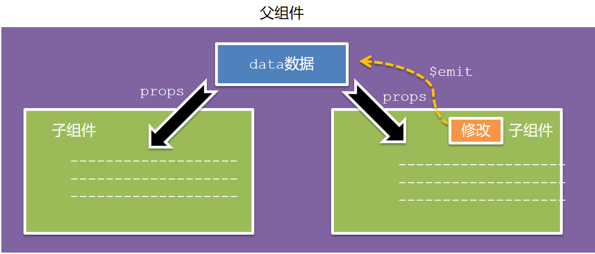
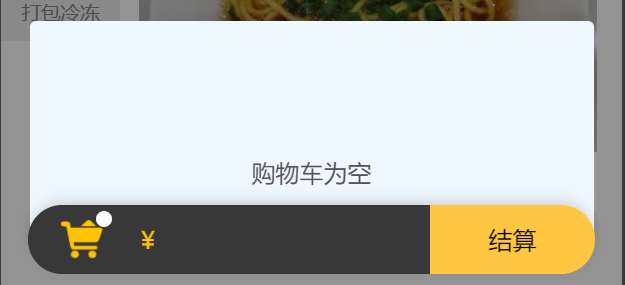

# 任务四  实现点餐功能

## 4.1 任务描述

​		本任务将实现玉米客项目的用户点餐功能。用户可以通过应用选择菜单上的菜品，并进行下单。该功能将包括菜品展示、菜品详情查看、购物车添加、订单确认与支付等环节。通过此任务，用户将能够便捷地在玉米客应用中完成点餐，实现高效的在线订餐体验。

## 4.2 任务效果

> 如图所示：


## 4.3 学习目标

### 4.3.1 知识目标

- [ ] 了解uni-app 常用组件
- [ ] 掌握计算属性的使用
- [ ] 掌握组件之间通信方法的使用

### 4.3.2 能力目标

- [ ] 能够独立使用计算属性，实现数据计算和响应式更新
- [ ] 能够组件通信方法，实现高效的数据共享和协作

## 4.4 知识储备

### 4.4.1 **计算属性（computed）**

#### 定义

​		计算属性（Computed Properties）是Vue.js中的一个核心概念，允许开发者定义计算后的数据，这些数据是基于其他数据源的计算结果。计算属性是基于依赖进行缓存的。这意味着只要依赖的数据没有变化，计算属性就不会重新计算，值会在数据变化时自动更新。

#### 原理

**依赖追踪**：

- 当创建一个计算属性时，Vue.js会监视它所依赖的数据属性。
- 依赖追踪是通过Vue的观察者机制实现的，这意味着Vue会自动追踪数据的变更，并在数据变化时通知相关的计算属性。

**缓存机制**：

- 计算属性是基于它们的依赖进行缓存的。这意味着只要依赖的数据没有变化，计算属性的值就不会重新计算。
- 缓存机制有助于提高性能，因为不需要在每次数据变化时都重新计算属性。

**计算属性更新**：

- 当依赖的数据发生变化时，计算属性会重新计算，并返回新的值。
- 计算属性的值会在模板中自动更新，因为Vue会自动追踪依赖并更新DOM。

**复杂逻辑**：

- 计算属性可以包含任何复杂的逻辑，包括数据转换、过滤、排序等。
- 这些复杂的逻辑可以被组织在一起，并且可以在模板中直接使用，而不必在methods中重复编写。

**方法调用**：

- 虽然计算属性是基于它们的依赖进行缓存的，但methods每次被调用时都会重新执行函数。
- 如果需要执行一些复杂但不需要缓存的逻辑，可以使用methods。

**异步操作**：

- 计算属性也可以包含异步操作，如Ajax请求。
- 尽管如此，由于计算属性的缓存机制，异步操作只有在依赖的数据发生变化时才会执行。

**副作用处理**：

- 计算属性不应该包含副作用，如网络请求或文件操作。
- 如果有副作用需要执行，应该使用methods。

### 4.4.2 **组件通信**

#### 定义

​		组件通信是指组件之间进行数据传递的过程。由于组件的数据是独立的，无法直接访问其他组件的数据，因此需要通过特定的方法来实现组件间的数据交互。


#### 组件关系分类

组件之间的关系可以分为以下两种：

- 父子关系：组件之间存在直接的父子关系。
- 非父子关系：组件之间没有直接的父子关系。


#### 通信解决方案

- 父子关系：使用`props`和`$emit`进行通信。
- 非父子关系：可以使用`provide`和`inject`或者`eventbus`进行通信。
- 通用方案：对于更复杂的应用场景，可以使用`vuex`进行状态管理。


#### 父子通信流程

​		父组件通过`props`将数据传递给子组件，子组件利用`$emit`通知父组件修改更新。如图所示：



#### 父组件传值子组件示例

​		父组件`App.vue`通过属性传值给子组件，子组件`Son.vue`内部通过`props`接收，在子组件的模板中直接使用`props`接收的值。代码如下：

父组件App.vue

```vue
<template>
  <div class="app" style="border: 3px solid #000; margin: 10px">
    我是APP组件
    <!-- 1.给组件标签，添加属性方式 赋值 -->
    <Son :title="myTitle"></Son>
  </div>
</template>

<script>
import Son from './components/Son.vue'
export default {
  name: 'App',
  data() {
    return {
      myTitle: '我是父组件传进来的值',
    }
  },
  components: {
    Son,
  },
}
</script>

<style>
</style>


```

子组件Son.vue


```vue
<template>
  <div class="son" style="border:3px solid #000;margin:10px">
    <!-- 3.直接使用props的值 -->
    我是Son组件--{{title}}
  </div>
</template>

<script>
export default {
  name: 'Son-Child',
  // 2.通过props来接受
  props:['title']
}
</script>

<style>

</style>

```

#### 子组件通知父组件更新示例

​		子组件通过`$emit`触发事件，向父组件发送消息通知，父组件监听`$emit`触发的事件，父组件提供处理函数来响应子组件的通知。代码如下：

父组件App.vue

```vue
template>
  <div class="app" style="border: 3px solid #000; margin: 10px">
    我是APP组件
    <!-- 2.父组件对子组件的消息进行监听 -->
    <Son :title="myTitle" @changTitle="handleChange"></Son>
  </div>
</template>

<script>
import Son from './components/Son.vue'
export default {
  name: 'App',
  data() {
    return {
      myTitle: '我是父组件传进来的值',
    }
  },
  components: {
    Son,
  },
  methods: {
    // 3.提供处理函数，提供逻辑
    handleChange(newTitle) {
      this.myTitle = newTitle
    },
  },
}
</script>

<style>
  </style>
```

子组件Son.vue

```vue
<template>
  <div class="son" style="border: 3px solid #000; margin: 10px">
    我是Son组件 {{ title }}
    <button @click="changeFn">修改title</button>
  </div>
</template>

<script>
export default {
  name: 'Son-Child',
  props: ['title'],
  methods: {
    changeFn() {
      // 通过this.$emit() 向父组件发送通知
      this.$emit('changTitle','子组件通知父组件更新')
    },
  },
}
</script>

<style>
</style>
```

#### props详解

​		在Vue.js中，`props`（Properties）是指向父组件传递给子组件的数据。子组件可以通过`props`接收这些数据，并在组件内部使用。`props`可以是任何类型的数据，包括字符串、数字、对象、数组等。

**作用**：

- 数据传递：`props`允许父组件向子组件传递数据。这是Vue.js组件化开发中实现数据传递的重要机制。

- 组件交互：通过`props`，父组件可以影响子组件的行为，而子组件也可以通过事件触发等方式与父组件进行交互。

- 封装与复用：`props`有助于将组件的输入参数封装起来，使得组件更加可复用和可维护。

- 状态共享：在大型项目中，`props`可以用于在不同组件之间共享状态，实现状态管理。

**特点：**

- 单向数据流：`props`遵循单向数据流的原则，即数据只能从父组件流向子组件，而子组件不能直接修改传递给它的props。

- 类型检查：在定义`props`时，可以指定props的类型，如字符串、数字、对象、数组等。如果父组件传递的props类型与子组件定义的类型不匹配，Vue.js会发出警告。

- 默认值：如果父组件没有传递某个props，子组件可以为其设置一个默认值。这样，即使父组件没有传递该props，子组件也能正常工作。

- 限制props：可以通过`props`选项中的`required`属性来限制props是否必须传递。如果父组件没有传递必须的props，Vue.js会发出警告。

- 自定义类型：除了预定义的类型（如String、Number、Object、Array、Boolean），还可以定义自定义类型。这有助于确保传递的数据符合预期，提高代码的健壮性。

- 缓存性：当`props`的数据发生变化时，子组件会重新计算。但在大多数情况下，`props`的值是缓存的，只有当依赖的数据发生变化时，才会重新计算。

**示例：**

父组件（App.vue）：

```
<template>
  <div id="app">
    <ChildComponent :message="parentMessage" :number="parentNumber"></ChildComponent>
  </div>
</template>

<script>
import ChildComponent from './ChildComponent.vue';

export default {
  components: {
    ChildComponent
  },
  data() {
    return {
      parentMessage: 'Hello from Parent',
      parentNumber: 42
    };
  }
};
</script>
```

子组件（ChildComponent.vue）：

```
<template>
  <div>
    <p>{{ message }}</p>
    <p>{{ number }}</p>
  </div>
</template>

<script>
export default {
  props: {
    message: String,
    number: Number
  }
};
</script>
```

​		在这个示例中，父组件`App.vue`通过`props`向子组件`ChildComponent.vue`传递了两个数据：一个字符串`parentMessage`和一个数字`parentNumber`。子组件通过`props`接收这些数据，并在模板中显示。

​		当父组件的数据发生变化时，子组件会自动更新，因为`props`是基于依赖进行缓存的。这个示例展示了`props`在Vue.js组件间数据传递的基本用法。


#### 非父子通信

​		在Vue.js中，组件之间的非父子通信通常指的是那些没有直接父子关系的组件之间的通信。这种情况下，可以使用事件总线（Event Bus）、Vuex状态管理或Pub/Sub模式来实现组件之间的通信。

**常用的非父子组件通信的方法：**

- **事件总线（Event Bus）：**

  ​	创建一个全局的Event Bus对象，使用Event Bus来发送和接收事件。事件总线是一个中央事件传递机制，可以被多个组件共享。

示例代码：

```js
// 创建Event Bus对象
const eventBus = new Vue();

// 子组件发送事件
eventBus.$emit('some-event', 'Hello, world!');

// 另一个组件监听事件
eventBus.$on('some-event', (data) => {
  console.log(data);
});
```

- **Vuex状态管理**：

  ​	如果项目中有多个组件需要共享状态，可以使用Vuex来管理全局状态，组件可以通过mutations来更改状态，通过actions来响应状态的变化。

示例代码：

```
// store.js
import Vue from 'vue';
import Vuex from 'vuex';

Vue.use(Vuex);

export default new Vuex.Store({
  state: {
    count: 0
  },
  mutations: {
    increment(state) {
      state.count++;
    }
  },
  actions: {
    increment({ commit }) {
      commit('increment');
    }
  }
});

// 组件A
<template>
  <button @click="increment">Increment</button>
</template>

<script>
import store from './store';

export default {
  computed: {
    count() {
      return store.state.count;
    }
  }
};
</script>

// 组件B
<template>
  <p>{{ count }}</p>
</template>

<script>
import store from './store';

export default {
  computed: {
    count() {
      return store.state.count;
    }
  }
};
</script>
```

- **Pub/Sub模式**：

​		使用第三方库，如PubSubJS，来实现组件之间的通信，组件可以发布（publish）事件，也可以订阅（subscribe）事件。

示例代码（使用PubSubJS）：

```js
// 安装PubSubJS
npm install pubsub-js

// 子组件发布事件
const pubsub = new PubSub();
pubsub.publish('some-event', 'Hello, world!');

// 另一个组件订阅事件
pubsub.subscribe('some-event', (message) => {
  console.log(message);
});
```

​		这些方法可以根据项目的需求和规模来选择合适的通信机制。在小型项目中，事件总线可能足够满足需求；在中大型项目中，Vuex可能是一个更好的选择，因为提供了更复杂的状态管理和组件间通信的解决方案。

## 4.5 任务实施

### 子任务4-1 制作点餐页面

​		本子任务将制作玉米客应用中的点餐页面，使用户能够在浏览菜品图片、名称、价格和详细描述的基础上，通过点击“添加到购物车”按钮将心仪菜品加入购物车，并根据需要修改菜品数量或删除已选菜品。此外，用户还能在购物车页面查看菜品的汇总信息，包括菜品名称、数量和总价等，以便于进行核对和一键结算。

#### 步骤一 **设计图分析**

​		根据设计图区域可分为为八个区域，分别是标题区域、轮播区域、搜索区域、商品展示区域、购物车区域、商品规格选择区域和点餐详情区域。如图所示：


#### 步骤二 **代码实现**

​		在制作整体信息展示区域时，可以使用`<view>`标签来划分区域，并在CSS中定义样式来实现设计图的效果。代码如下：

> 文件路径：/pages/List/List.vue
>
> Template 部分

```html
<template>
	<view class="u-wrap">
		<!-- 顶部导航栏 -->
		<view class="top_area">
		</view>
		<!-- 轮播图 -->
		<view class="swiper">
		</view>
		<!-- 商户信息 -->
		<view class="corn">
		</view>
		<!-- 搜索 -->
		<view class="u-search-box">
		</view>
		<!-- 商品列表 -->
		<view class="u-menu-wrap">

		</view>
		<!-- 底部购物车 -->
		<view class="foot">

		</view>

	</view>
</template>
```

> CSS 部分

```html
<style lang="scss">
	.u-wrap {
		height: calc(100vh - var(--window-top));
		background-color: #F5F5F6;
		display: flex;
		flex-direction: column;
		height: 100vh;
		box-sizing: border-box;

		.top_area {
			height: 280rpx;
			background-image: url('@/static/List/TopBg.png');
			background-repeat: no-repeat;
			background-size: cover;
			border-radius: 0 0 10% 10%;
			padding: 20rpx 0 0 45%;
			box-sizing: border-box;
			margin-bottom: -150rpx;
		}

		.swiper {
			width: 686rpx;
			height: 220rpx;
			border-radius: 16rpx;
			margin: 0 auto;
			z-index: 1;
			margin-bottom: 24rpx;
			margin-top: 40rpx;

		}

		.corn {
			width: 686rpx;
			height: 140rpx;
			border-radius: 16px;
			background: rgba(255, 255, 255, 1);
			margin: 0 auto;
			display: flex;
			justify-content: space-between;
			align-items: center;
			padding: 0 26rpx;
			box-sizing: border-box;
			margin-bottom: 24rpx;

		}


		.u-search-box {
			padding: 18rpx 30rpx;
			width: 686rpx;
			height: 60rpx;
			margin: 0 auto;
			box-sizing: border-box;
			border-radius: 12px;
			background: rgba(255, 255, 255, 1);
			margin-bottom: 24rpx;
			display: flex;
			align-items: center;
		}

		.u-menu-wrap {
			flex: 1;
			display: flex;
			overflow: hidden;

			}

			
						
		.foot {
			position: fixed;
			left: 0;
			right: 0;
			bottom: 0;
			z-index: 1;
			margin: 24rpx auto;
			box-shadow: 0 -4px 10px -3px rgba(0, 0, 0, 0.2);
			border-radius: 318px;
			width: 686rpx;
			height: 84rpx;
			display: flex;
			align-items: center;
			justify-content: space-between;
			z-index: 9999;

			
			}


		.btn {
			bottom: calc(var(--status-bar-height) + 32px);
		}
    }
</style>

```

### 子任务4-2 制作标题区域

​		本子任务将实现点餐详情页面的标题区域。标题区域位于页面的顶部，并且应该包含清晰、醒目的标题文本，以便用户一眼就能识别出当前页面的主题。

#### 步骤一 **设计图分析** 

​		根据设计图可知，标题区域只包含“点餐”文字，并且背景色设计为渐变绿色。


#### 步骤二 **代码实现**

​		使用`<view>`标签用来包裹顶部导航栏，`:style`绑定一个内联样式，设置`padding-top`属性，其值是`headerArea.status_height`加上’px’。`headerArea.status_height`是计算属性`headerArea`中的一个属性，表示状态栏的高度。这样做的目的是为了在内容区与状态栏之间留出适当的空间，避免内容被状态栏遮挡。另一个`<view>`标签用于显示标题栏，有一个`nav`类，同样使用`:style`绑定一个内联样式，设置`height`属性，其值是`headerArea.title_height`加上’px’。`headerArea.title_height`是计算属性`headerArea`中的另一个属性，表示标题栏的高度。这个高度包括状态栏高度和导航栏高度，确保标题栏能够占据正确的空间。代码如下：

> 文件路径：/pages/List/List.vue
>
> Template 部分

```html
<template>
	<view class="u-wrap">
			<!-- 顶部导航栏 -->
		<view class="top_area">
			<!-- 状态栏高度 -->
			<view :style="{paddingTop:headerArea.status_height+'px'}"></view>
			<!-- 标题栏高度 -->
			<view class='nav' :style="{height: headerArea.title_height + 'px'}">
				<uni-icons type="" class="back"></uni-icons>
				<text>点餐</text>
			</view>
		</view>
		<!-- 轮播图 -->
			<view class="swiper" >
		</view>
		<!-- 商户信息 -->
		<view class="corn">
		</view>
		<!-- 搜索 -->
		<view class="u-search-box">
		</view>
		<!-- 商品列表 -->
		<view class="u-menu-wrap">
			
		</view>
		<!-- 底部购物车 -->
		<view class="foot">
			
		</view>
	</view>
</template>
```

​		因手机的尺寸不同，可以使用计算属性来动态设置元素的高度和位置，以适应不同手机尺寸的屏幕。代码如下:

> ​	JavaScript 部分

```js
<script>
	
	export default {
	
		data() {
			return {
            
            }
		},
			computed: {
                // 计算头部区域的函数
				headerArea() {
                    let area = uni.getSystemInfoSync();
                    let menu = uni.getMenuButtonBoundingClientRect();
                    return {
                        status_height: area.statusBarHeight,
                        title_height: menu.height + (menu.top - area.statusBarHeight) * 2,
                        menuLeft: menu.left
                    };
                    return {
                        status_height: area.statusBarHeight,
                        title_height: uni.upx2px(80),
                        menuLeft: 0
                    };
                },
                },
		methods: {
				
		
		}
	}
</script>
```

> css 部分

```html
<style lang="scss">
	.u-wrap {
		height: calc(100vh - var(--window-top));
		background-color: #F5F5F6;
		display: flex;
		flex-direction: column;
		height: 100vh;
		box-sizing: border-box;

		.top_area {
			height: 280rpx;
			background-image: url('@/static/List/TopBg.png');
			background-repeat: no-repeat;
			background-size: cover;
			border-radius: 0 0 10% 10%;
			padding: 20rpx 0 0 45%;
			box-sizing: border-box;
			margin-bottom: -150rpx;
            
			.nav {
				width: 100%;
				font-size: 34rpx;
				margin-bottom: -30rpx;
				position: fixed;
				left: 44rpx;

				.back {
					padding-right: 300rpx;
				}
			}
		}

		.swiper {
			width: 686rpx;
			height: 220rpx;
			border-radius: 16rpx;
			margin: 0 auto;
			z-index: 1;
			margin-bottom: 24rpx;
			margin-top: 40rpx;

		}

		.corn {
			width: 686rpx;
			height: 140rpx;
			border-radius: 16px;
			background: rgba(255, 255, 255, 1);
			margin: 0 auto;
			display: flex;
			justify-content: space-between;
			align-items: center;
			padding: 0 26rpx;
			box-sizing: border-box;
			margin-bottom: 24rpx;

		}


		.u-search-box {
			padding: 18rpx 30rpx;
			width: 686rpx;
			height: 60rpx;
			margin: 0 auto;
			box-sizing: border-box;
			border-radius: 12px;
			background: rgba(255, 255, 255, 1);
			margin-bottom: 24rpx;
			display: flex;
			align-items: center;
		}

		.u-menu-wrap {
			flex: 1;
			display: flex;
			overflow: hidden;

			}

			
						
		.foot {
			position: fixed;
			left: 0;
			right: 0;
			bottom: 0;
			z-index: 1;
			margin: 24rpx auto;
			box-shadow: 0 -4px 10px -3px rgba(0, 0, 0, 0.2);
			border-radius: 318px;
			width: 686rpx;
			height: 84rpx;
			display: flex;
			align-items: center;
			justify-content: space-between;
			z-index: 9999;

			
			}


		.btn {
			bottom: calc(var(--status-bar-height) + 32px);
		}
    }
</style>

```

### 子任务4-3 实现轮播图功能

​		在点餐详情页面中，轮播图是一个重要的功能区域，用于展示菜品的图片或餐厅的促销信息。在本子任务中，将实现一个轮播图功能，使其能够自动播放并允许用户手动切换查看不同的图片。	

#### 步骤一 **设计图分析**

根据设计图可知，轮播图区域具有以下功能：

- 轮播图显示在一个矩形区域内。
- 底部配有四个轮播点，用于指示当前显示的轮播项。
- 轮播图可以自动播放，也可以通过用户交互手动切换。


#### 步骤二 **代码实现**

​		在微信小程序中，可以使用官方提供的`<swiper>`组件来实现轮播图功能。`<swiper>`标签具有两个属性`indicator-dots`和`autoplay`，分别设置为`true`，表示显示轮播指示点（小圆点）和自动播放轮播。使用`v-for`指令循环`swiperList`数组，为每个元素创建一个`<swiper-item>`组件。`v-for`指令接收两个参数`(item, index)`，其中`item`是数组中的当前元素，`index`是当前元素的索引。`:key="index"`为每个`<swiper-item>`提供了一个唯一的键值，通常用于Vue的虚拟DOM算法，以便跟踪每个节点的身份，从而重用和重新排序现有元素。在每个`<swiper-item>`内部，有一个`<image>`标签，用于显示轮播的图片。`:src="item"`绑定将`image`的`src`属性绑定到`swiperList`数组中当前元素的值，`mode="aspectFill"`表示图片应该按宽高比填充容器，但不保证图片的完整性，`class="swiper-img"`定义了图片的样式类。代码如下：

> 文件路径：/pages/List/List.vue
>
> Template 部分

```html
<template>
	<view class="u-wrap">
			<!-- 顶部导航栏 -->
		<view class="top_area">
				<!-- 省略以上代码 -->
		</view>
		<!-- 轮播图 -->
			<view class="swiper" >
			<swiper :indicator-dots="true" :autoplay="true">
				<!-- 轮播项内容 -->
				<swiper-item v-for="(item, index) in swiperList" :key="index">
					<!-- 轮播项内容 -->
					<image :src="item" mode="aspectFill" class="swiper-img" />
				</swiper-item>
			</swiper>
		</view>
		<!-- 商户信息 -->
		<view class="corn">
		</view>
		<!-- 搜索 -->
		<view class="u-search-box">
		</view>
		<!-- 商品列表 -->
		<view class="u-menu-wrap">
			
		</view>
		<!-- 底部购物车 -->
		<view class="foot">
			
		</view>
	</view>
</template>
```

> CSS 部分

```html
<style lang="scss">
	.u-wrap {
		height: calc(100vh - var(--window-top));
		background-color: #F5F5F6;
		display: flex;
		flex-direction: column;
		height: 100vh;
		box-sizing: border-box;
        
       		<!-- 省略以上代码 -->
           
		.swiper {
			width: 686rpx;
			height: 220rpx;
			border-radius: 16rpx;
			margin: 0 auto;
			z-index: 1;
			margin-bottom: 24rpx;
			margin-top: 40rpx;
            	swiper {
				width: 686rpx;
				height: 220rpx;
				border-radius: 16rpx;
			}

			swiper-item {
				border-radius: 16rpx;

				.swiper-img {
					width: 100%;
					height: 220rpx;
					border-radius: 16rpx;
					z-index: 1;
				}
			}

		}

		.corn {
			width: 686rpx;
			height: 140rpx;
			border-radius: 16px;
			background: rgba(255, 255, 255, 1);
			margin: 0 auto;
			display: flex;
			justify-content: space-between;
			align-items: center;
			padding: 0 26rpx;
			box-sizing: border-box;
			margin-bottom: 24rpx;
		}
		.u-search-box {
			padding: 18rpx 30rpx;
			width: 686rpx;
			height: 60rpx;
			margin: 0 auto;
			box-sizing: border-box;
			border-radius: 12px;
			background: rgba(255, 255, 255, 1);
			margin-bottom: 24rpx;
			display: flex;
			align-items: center;
		}

		.u-menu-wrap {
			flex: 1;
			display: flex;
			overflow: hidden;

			}					
		.foot {
			position: fixed;
			left: 0;
			right: 0;
			bottom: 0;
			z-index: 1;
			margin: 24rpx auto;
			box-shadow: 0 -4px 10px -3px rgba(0, 0, 0, 0.2);
			border-radius: 318px;
			width: 686rpx;
			height: 84rpx;
			display: flex;
			align-items: center;
			justify-content: space-between;
			z-index: 9999;

			
			}


		.btn {
			bottom: calc(var(--status-bar-height) + 32px);
		}
    }
</style>

```

​		注：本项目轮播图数据为静态数据，直接在Js代码中定义，不需要从后端数据库获取，因此不需要调用后端接口。

​		在`data`节点，声明一些轮播图数据，这些数据代表实际的轮播图内容。通过 `uni.getSystemInfoSync()` 获取系统信息，包括状态栏的高度（`statusBarHeight`）。接着，通过 `uni.getMenuButtonBoundingClientRect()` 获取菜单按钮的位置和大小信息。代码如下：

> JavaScript 部分

```javascript
<script>
	export default {

		data() {
			return {
				//轮播图数据
				swiperList: [
					'https://img.js.design/assets/img/6558778e723adfea2d64070a.png#bd0e27a7fb83d54e7a5cf9b8963a28d6',
					'https://img.js.design/assets/img/6558778e723adfea2d64070a.png#bd0e27a7fb83d54e7a5cf9b8963a28d6',
					'https://img.js.design/assets/img/6558778e723adfea2d64070a.png#bd0e27a7fb83d54e7a5cf9b8963a28d6',
				],
			}
		},
	}
</script>
```

### 子任务4-4 实现商家信息功能

​		本子任务将实现一个商家信息功能，该功能将展示在点餐详情页面中，为用户提供所选餐厅的详细基本信息。该功能将包括餐厅的名称、一段简短的餐厅简介，用以描述餐厅的特色和风格；餐厅的详细地址，方便用户进行导航；餐厅的联系方式，如电话号码或在线客服，以便用户能够直接联系餐厅；以及餐厅的LOGO，用以增强餐厅的品牌形象。

#### 步骤一设计图分析

​       根据设计图可知，左侧以商家信息显示，右侧为商品LOGO显示。如图所示：


#### 步骤二 **代码实现**

​		可以使用组件来创建商家信息区域，并通过CSS来设置样式 。外部容器是一个带有 `corn` 类的 `view`，这个容器包含整体的样式设置。内部有两个子 `view`，分别带有 `left` 和 `right` 类，用于区分左右两个区域。这两个 `view` 分别使用 Vue 的插值表达式 `{{ }}` 来显示商户的昵称 (`nikeName`) 和地址 (`address`)。代码如下：

> 文件路径：/pages/List/List.vue
>
> Template 部分

```html
<template>
	<view class="u-wrap">
			<!-- 顶部导航栏 -->	
		<!-- 轮播图 -->
        	<!-- 省略以上代码 -->
		<!-- 商户信息 -->
			<view class="corn">
			<view class="left">
				<view class="text1">{{businessInfo.nikeName}}</view>
				<view class="text2">{{businessInfo.address}}</view>
			</view>
			<view class="right">
				<image :src="businessInfo.avatar?businessInfo.avatar:'/static/List/Logo.png'" class="logo"> </image>
			</view>
		</view>
		<!-- 搜索 -->
		<view class="u-search-box">
		</view>
		<!-- 商品列表 -->
		<view class="u-menu-wrap">
			
		</view>
		<!-- 底部购物车 -->
		<view class="foot" >
			
		</view>
	
	</view>
</template>
```

> CSS 部分

```html
<style lang="scss">
	.u-wrap {
		height: calc(100vh - var(--window-top));
		background-color: #F5F5F6;
		display: flex;
		flex-direction: column;
		height: 100vh;
		box-sizing: border-box;

		<!-- 省略以上代码 -->

		.corn {
			width: 686rpx;
			height: 140rpx;
			border-radius: 16px;
			background: rgba(255, 255, 255, 1);
			margin: 0 auto;
			display: flex;
			justify-content: space-between;
			align-items: center;
			padding: 0 26rpx;
			box-sizing: border-box;
			margin-bottom: 24rpx;
            .left {
				display: flex;
				flex-direction: column;

				.text1 {
					font-size: 26rpx;
					font-weight: bold;
				}

				.text2 {
					font-size: 26rpx
				}
			}

			.right {
				width: 120rpx;
				height: 120rpx;
				padding-top: 13rpx;
				image {

					width: 100%;
					height: 100%;

				}
			}

		}


		.u-search-box {
			padding: 18rpx 30rpx;
			width: 686rpx;
			height: 60rpx;
			margin: 0 auto;
			box-sizing: border-box;
			border-radius: 12px;
			background: rgba(255, 255, 255, 1);
			margin-bottom: 24rpx;
			display: flex;
			align-items: center;
		}

		.u-menu-wrap {
			flex: 1;
			display: flex;
			overflow: hidden;

			}

			
						
		.foot {
			position: fixed;
			left: 0;
			right: 0;
			bottom: 0;
			margin: 24rpx auto;
			box-shadow: 0 -4px 10px -3px rgba(0, 0, 0, 0.2);
			border-radius: 318px;
			width: 686rpx;
			height: 84rpx;
			display: flex;
			align-items: center;
			justify-content: space-between;
			z-index: 9999;

			}


		.btn {
			bottom: calc(var(--status-bar-height) + 32px);
		}
    }
</style>

```

​		在文件中的`data`节点声明商家信息`businessInfo`数据用于占位。代码如下。

> JavaScript 部分

```javascript
<script>
	export default {

		data() {
			return 
            	//商家信息
				businessInfo: {
					nikeName: "玉米客总店",
					avatar: "",
					address: "河北高碑店市",
				},
				//省略其他代码
			}
		},
		//省略其他代码
	}
</script>
```

**接口分析：**

 实现显示商家信息,需要使用后端提供的商家信息接口。详情如下：

- API地址：{{API_HOST}}/front/business/getBusinessAddAndNameVo
- API请求方式：GET
- API请求参数：见下表

| 参数字段名 |       参数值        | 数据类型 |  说明  |
| :--------: | :-----------------: | :------: | :----: |
|     id     | 1747434203482492929 |  String  | 商家id |

　　API 返回的响应数据示例如下：

```json
{
"success": true,
"code": 200,
"message": "操作成功",
"entity": {
"nikeName": "NikeName123", //商家昵称
"address": "Address123" //商家地址
	}
}
```

**代码实现：**

　在任务一中，已经封装了网络请求在api/request.js中 ，下面将引用request.js 文件，编写获取商家信息接口的方法，代码如下：

> 文件路径：api/client.js

```shell
import http, {
	BASEURL
} from '@/api/request.js'
 
/**
 * 获取商家信息
 */
export function getBusinessAddAndNameVo(data) {
	return http.http('/front/business/getBusinessAddAndNameVo', data, false, 'GET')
}


```

​		当页面显示时，`onShow` 方法会被调用。首先从本地存储中获取 `businessId` 和 `tableNumber`，并将分别赋值给 `this.options.businessId` 和 `this.options.tableNumber`。然后，调用 `this.handleInit()` 方法来处理初始化逻辑。在`mothods`节点中定义`handleInit()` 方法，首先，检查 `this.options.businessId` 是否存在。如果`businessId`不存在，会显示一个 Toast 消息，提示用户“请先扫描二维码点餐”。使用 `setTimeout` 在 2 秒后跳转到首页（`/pages/index/index`）。使用 `return` 语句退出函数，防止后续代码的执行。如果 `businessId` 存在，会调用 `this.handleGetBusinessAddAndNameVo()` 方法来获取商家信息。`handleGetBusinessAddAndNameVo()` 异步方法，调用 `getBusinessAddAndNameVo` 函数来获取商家信息。将 `this.options.businessId` 作为参数传递给 `getBusinessAddAndNameVo` 函数。当获取到商家信息的响应后（保存在 `res` 变量中），检查 `res.success` 是否为 `true`。如果 `res.success` 为 `true`，将响应中的商家信息（`res.entity`）赋值给 `this.businessInfo`。最后，返回 `res`。代码如下：

>JavaScript

```javascript
<script>
	// 导入getBusinessAddAndNameVo函数，用于获取商家信息和地址
    import { getBusinessAddAndNameVo } from "@/api/client.js";

    export default {

      data() {
        return {
         // 此处代码省略
          options: {}, // 存储配置选项，如businessId和tableNumber
        };
      },
      // 定义方法
      methods: {
        // 初始化方法，在页面显示时被调用
        handleInit() {
          if (!this.options.businessId) {
            uni.showToast({
              title: '请先扫描二维码点餐',
              duration: 1800,
              icon: "none"
            });
            setTimeout(() => {
              uni.switchTab({
                url: '/pages/index/index'
              })
            }, 2000)
            return; // 结束handleInit方法
          }
          this.handleGetBusinessAddAndNameVo();
        },
        // 获取商家信息的异步方法
        async handleGetBusinessAddAndNameVo() {
          let res = await getBusinessAddAndNameVo({
            id: this.options.businessId 
          });
          if (res.success) {
            this.businessInfo = res.entity;
          }
          return res;
        },
      },
      // 生命周期钩子，在页面显示时调用handleInit方法
      onShow() {
        this.options.businessId = uni.getStorageSync('businessId');
        this.options.tableNumber = uni.getStorageSync('tableNumber');
        this.handleInit();
      },
    };

</script>
```

### 子任务4-5 制作搜索与商品信息区域

​		在点餐详情页面中，搜索区域和商品信息区域是用户查找和选择菜品的重要部分。搜索区域通常包括一个输入框，允许用户输入关键词来搜索特定的菜品。商品信息区域则展示菜品的详细信息，包括菜品的名称、描述、价格和图片等。在本子任务中，将实现搜索和商品信息区域，以便用户能够轻松地找到感兴趣的菜品。 

#### 步骤一 **设计图分析**

根据提供的设计图，搜索区域和商品信息区域具有以下特点：

- 搜索区域左侧为静态图片显示，中间有一个分割线，右侧为输入框。
- 商品信息区域分为两部分，左侧为商品种类，右侧为商品信息详情区域。


#### 步骤二 代码实现

​			在微信小程序中，可以使用`image`标签来展示静态图片，`input`标签来实现输入框，以及`scroll-view`组件来展示商品信息的左右两侧。搜索框的输入内容通过 `v-model="search"` 绑定到 Vue 实例的 `search` 数据属性上。当用户在搜索框中点击确认按钮时，会触发 `@confirm="handleListInfo"` 事件，调用 `handleListInfo` 方法来处理搜索请求或更新商品列表。左侧有一个垂直滚动的列表，显示不同的商品类型（`goodsTypes`）。列表项通过 `v-for="(item,index) in goodsTypes"` 指令循环渲染，每个列表项都绑定一个点击事件 `@tap.stop="handleSelectGoodType(item.id)"`，用于在用户点击时选择某个商品类型。当前选中的商品类型通过 `currentGoodsTypeId` 数据属性来跟踪，并通过 `:class="[currentGoodsTypeId == item.id ? 'u-tab-item-active' : '']"` 来给当前选中的列表项添加特定的样式类。右侧是另一个垂直滚动的列表，根据左侧选择的商品类型显示相应的商品（`goodsComputed`）。商品列表也是通过 `v-for="(item , index) in goodsComputed"` 指令循环渲染的，每个商品项都有一个唯一的 `id` 属性，用于滚动定位。商品项内部还包含一个图片展示区域和一个描述区域，描述区域显示商品的名称、材料和价格。商品项内部还有一个 "选规格" 的文本，用户点击时会触发 `@click="handleOpenSelectSpecifications(good)"` 事件，调用 `handleOpenSelectSpecifications` 方法来处理规格选择逻辑。右侧的滚动列表通过 `@scroll="handleScroll"` 指令监听滚动事件，当用户滚动列表时，会触发 `handleScroll` 方法来处理滚动逻辑，比如更新滚动位置等。滚动定位：左侧的分类列表和右侧的商品列表都使用 `scroll-into-view` 属性来实现滚动定位，该属性通过 `itemId` 或 `scrollTop` 数据属性来控制滚动到哪个元素或位置。图片加载：商品项中的图片通过 `v-if="good.image !== '' " :src="good.image" lazy-load` 指令来加载，如果 `good.image` 为空，则不显示图片并显示 "加载失败" 的文本。代码如下

> 文件路径：/pages/List/List.vue
>
> Template 部分

```html
<template>
	<view class="u-wrap">
			<!-- 顶部导航栏 -->
		<!-- 轮播图 -->	
		<!-- 商户信息 -->
        	<!-- 省略以上代码 -->
		<!-- 搜索 -->
		<view class="u-search-box">
					<image src="@/static/List/Search.png"></image>
					<view class="search">
						<input type="text" placeholder="搜索..." v-model="search" @confirm="handleListInfo" />
					</view>
				</view>
		<!-- 商品列表 -->
	<view class="u-menu-wrap">
		<!-- 左侧 -->
		<scroll-view scroll-y scroll-with-animation class="u-tab-view menu-scroll-view" :scroll-top="scrollTop"
			:scroll-into-view="itemId">
			<view v-for="(item,index) in goodsTypes" :key="item.id" class="u-tab-item"
				:class="[currentGoodsTypeId == item.id ? 'u-tab-item-active' : '']"
				@tap.stop="handleSelectGoodType(item.id)">
				<text class="u-line-1">{{item.goodsType}}</text>
			</view>
		</scroll-view>
		<!-- 右侧 -->
		<scroll-view :scroll-top="scrollRightTop" scroll-y scroll-with-animation class="right-box"
			@scroll="handleScroll">
			<view class="page-view">
				<view class="class-item" :id="item.id" v-for="(item , index) in goodsComputed" :key="item.id">
					<!-- 类型标题 -->
					<view class="item-title">
						<view class="line">
						</view>
						<text class="title">{{item.goodsType}}</text>
					</view>
					<!-- 商品内容 -->
					<view class="item-container">
						<view class="good-box" v-for="(good, index1) in item.list" :key="index1">
							<view class="image">
								<image mode="aspectFill" v-if="good.image !== '' " :src="good.image" lazy-load>
								</image>
								<view v-else>
									<text>加载失败</text>
								</view>
							</view>
							<view class="desc">
								<view class="info">
									<view class="name">{{good.name}}</view>
									<view class="made">{{good.material}}</view>
									<view class="price">￥<text
											class="price-1">{{good.price?good.price:'-'}}</text>/份</view>
								</view>
								<view class="select-spec" @click="handleOpenSelectSpecifications(good)">
									<text>选规格</text>
								</view>
							</view>
						</view>
					</view>
				</view>
			</view>
	
		</scroll-view>
	</view>
	
		<!-- 底部购物车 -->
		<view class="foot">
	
		</view>
	</view>
</template>
```

> CSS 部分

```css
<style lang="scss">
	.u-wrap {
		height: calc(100vh - var(--window-top));
		background-color: #F5F5F6;
		display: flex;
		flex-direction: column;
		height: 100vh;
		box-sizing: border-box;

			<!-- 省略以上代码 -->
      

		.u-search-box {
			padding: 18rpx 30rpx;
			width: 686rpx;
			height: 60rpx;
			margin: 0 auto;
			box-sizing: border-box;
			border-radius: 12px;
			background: rgba(255, 255, 255, 1);
			margin-bottom: 24rpx;
			display: flex;
			align-items: center;
			image {
				width: 32rpx;
				height: 32rpx;
				padding-right: 26rpx;
			}

			.search {
				border-left: 2px solid #E5fE5E5;
				padding-left: 26rpx;
			}
		}

		
		.u-search-box {
			padding: 18rpx 30rpx;
			width: 686rpx;
			height: 60rpx;
			margin: 0 auto;
			box-sizing: border-box;
			border-radius: 12px;
			background: rgba(255, 255, 255, 1);
			margin-bottom: 24rpx;
			display: flex;
			align-items: center;

			image {
				width: 32rpx;
				height: 32rpx;
				padding-right: 26rpx;
			}

			.search {
				border-left: 2px solid #E5fE5E5;
				padding-left: 26rpx;
			}
		}

		.u-menu-wrap {
			flex: 1;
			display: flex;
			overflow: hidden;

			.u-tab-view {
				width: 144rpx;

				padding-bottom: 100rpx;

				.u-tab-item {
					height: 72rpx;
					background: #E5E5E5;
					box-sizing: border-box;
					display: flex;
					align-items: center;
					justify-content: center;
					font-size: 24rpx;
					font-weight: 500;
					letter-spacing: 0px;
					line-height: 28.12rpx;
					color: rgba(128, 128, 128, 1);


				}

				.u-tab-item-active {
					// position: relative;
					color: #000000;
					font-size: 24rpx;
					font-weight: 500;
					background: #F5F5F6;
					border-left: 7rpx solid #FFC300;
				}

			}

			.right-box {
				width: calc(100% - 144rpx);
				background: #F5F5F6;
				box-sizing: border-box;
				padding-bottom: 100rpx;

				.page-view {
					padding-left: 24rpx;
					padding-right: 32rpx;
					box-sizing: border-box;

					.class-item {
						box-sizing: border-box;

						.item-title {
							display: flex;
							align-items: center;
							padding: 24rpx 0;

							.line {
								width: 6rpx;
								height: 32rpx;
								border-radius: 80rpx;
								background: #FFC300;
							}

							.title {
								font-size: 24rpx;
								line-height: 32rpx;
								font-weight: bold;
								padding-left: 16rpx;
							}
						}

						.item-container {
							display: flex;
							flex-direction: column;

							.good-box {
								width: 100%;
								display: flex;
								align-items: center;
								justify-content: space-between;
								flex-direction: column;
								margin-top: 10rpx;
								background-color: #fff;
								margin-bottom: 24rpx;
								border-radius: 16rpx;
								overflow: hidden;

								.image {
									width: 100%;
									height: 330rpx;

									image {
										width: 100%;
										height: 100%;
									}

									view {
										background-color: #ccc;
										color: #d0d0d0;
										font-size: 24rpx;
									}
								}


								.desc {
									width: 100%;
									display: flex;
									justify-content: space-between;
									align-items: flex-end;
									padding: 16rpx 20rpx 10rpx 20rpx;
									box-sizing: border-box;

									.info {
										.name {
											width: 270rpx;
											font-size: 24rpx;
											line-height: 30rpx;
											font-weight: 500;
										}

										.made {
											width: 270rpx;
											overflow: hidden;
											white-space: nowrap;
											text-overflow: ellipsis;
											linet-height: 20rpx;
											font-size: 16rpx;
											font-weight: 500;
											color: #808080;
										}

										.price {
											color: #D43030;
											font-size: 16rpx;
											font-weight: 500;
											line-height: 20px;

											.price-1 {
												font-size: 24rpx;
											}
										}


									}

									.num-select {
										display: flex;
										align-items: center;
										justify-content: center;
										margin-bottom: 6rpx;

										.minus-btn {
											width: 32rpx;
											height: 32rpx;
											border: 2px solid #FFC300;
											box-sizing: border-box;
											display: flex;
											align-items: center;
											justify-content: center;
											border-radius: 50%;
											color: #383838;


											text {
												font-size: 24rpx;
												line-height: 32rpx;
												margin-top: -4rpx;
											}

										}

										.num-box {
											width: 48rpx;
											text-align: center;
											color: #383838;

											text {
												font-size: 24rpx;
												line-height: 32rpx;
											}
										}

										.add-btn {
											width: 32rpx;
											height: 32rpx;
											background-color: #FFC300;
											display: flex;
											align-items: center;
											justify-content: center;
											border-radius: 50%;
											box-sizing: border-box;
											color: #383838;


											text {
												font-size: 24rpx;
												line-height: 32rpx;
												margin-top: -4rpx;
											}
										}
									}

									.select-spec {
										width: 84rpx;
										height: 32rpx;
										border-radius: 414rpx;
										background: #FFC300;
										color: #fff;
										display: flex;
										align-items: center;
										justify-content: center;

										margin-bottom: 6rpx;

										text {
											font-size: 20rpx;
											line-height: 24rpx;
											font-weight: 500;
										}
									}

								}
							}


						}
					}
				}
			}
		}
						
		.foot {
			position: fixed;
			left: 0;
			right: 0;
			bottom: 0;
			margin: 24rpx auto;
			box-shadow: 0 -4px 10px -3px rgba(0, 0, 0, 0.2);
			border-radius: 318px;
			width: 686rpx;
			height: 84rpx;
			display: flex;
			align-items: center;
			justify-content: space-between;
			z-index: 9999;

			}


		.btn {
			bottom: calc(var(--status-bar-height) + 32px);
		}
    }
</style>

```

​		在 `computed` 中，定义计算属性：`goodsComputed` 。`goodsComputed`这个计算属性对 `data` 中的 `goodsComputed` 数组进行处理。遍历数组中的每一个商品对象，并尝试将 `specs` 字段转换为真正的JavaScript对象。这个转换是通过 `JSON.parse()` 方法实现的。代码如下:

> JavaScript 部分

```javascript
<script>
	export default {
		data() {
			return {
				    goodsTypes: [
				        {
				          id: "1",
				          goodsType: "金水饺",
				        },
				        {
				          id: "2",
				          goodsType: "凉菜",
				        },
				        {
				          id: "3",
				          goodsType: "推荐特色产品",
				        },
				        {
				          id: "4",
				          goodsType: "打包冷冻",
				        },
				      ],
				      goodsComputed: [
				        {
				          id: 60, //商品id
				          goodsId: 60,
				          name: "金丝麻酱拌面（凉拌面）", //商品名字
				          typeId: 28, //商品类型id
				          goodsType: "金面条", //分类名
				          price: 15, //价格
				          specs:
				            '[{"id":1,"list":[{"id":1,"price":0,"content":"100%玉米面"},{"id":2,"price":0,"content":"超劲道款"}],"name":"请选择"},{"id":2,"list":[{"id":1,"price":0,"content":"正常"},{"id":2,"price":3,"content":"加量（大份）"}],"name":"份额"}]',
				          material: "玉米面", //原材料
				          image:
				            "https://yumimian.vip-yych.com/res/9811b66d-b0cc-4356-b04c-3718f0fc308d.png", //图片
				          state: "1", //状态
				        },
				        {
				          id: 59, //商品id
				          goodsId: 59,
				          name: "金丝爽口面（酸甜口凉面）", //商品名字
				          typeId: 28, //商品类型id
				          goodsType: "金面条", //分类名
				          price: 16, //价格
				          specs:
				            '[{"id":1,"list":[{"id":1,"price":0,"content":"100%玉米面"},{"id":2,"price":0,"content":"超劲道款"}],"name":"请选择"},{"id":2,"list":[{"id":1,"price":0,"content":"正常"},{"id":2,"price":3,"content":"加量（大份）"}],"name":"份额"}]',
				          material: "玉米面", //原材料
				          image: "/res/b9402876-943b-4d1c-9bec-f2a8955ea126.png", //图片
				          state: "1", //状态
				        },
				        {
				          id: 58, //商品id
				          goodsId: 58,
				          name: "金丝牛肉面（汤面）", //商品名字
				          typeId: 28, //商品类型id
				          goodsType: "金面条", //分类名
				          price: 18, //价格
				          specs:
				            '[{"id":1,"list":[{"id":1,"price":0,"content":"100%玉米面"},{"id":2,"price":0,"content":"超劲道款"}],"name":"请选择"},{"id":2,"list":[{"id":1,"price":0,"content":"正常"},{"id":2,"price":3,"content":"加量（大份）"}],"name":"份额"}]',
				          material: "玉米面", //原材料
				          image:
				            "https://yumimian.vip-yych.com/res/2eac6b57-3ff4-4d0d-adb7-018e95a55178.png", //图片
				          state: "1", //状态
				        },
				      ],
			}
		},

		methods: {
			handleInit() {
				//此处代码省略
			},
			/**
			 * 获取商家信息
			 */
			async handleGetBusinessAddAndNameVo() {
				//此处代码省略
			},
		},
		onShow() {
			//此处代码省略
		},
	}
</script>
```

**2.接口分析**

实现显示商品规格详情功能,需要使用后端提供的商品详情接口。详情如下：

- API地址：{{API_HOST}}/front/goodsType/getByUserId
- API请求方式：GET
- API请求参数：见下表

| 参数字段名 | 参数值 | 数据类型 | 是否必填 |
| :--------: | :----: | :------: | :------: |
| businessId |   1    |  String  |    是    |

　　API 返回的响应数据示例如下。

```json
{
"success": true,
"code": 200,
"message": "操作成功",
"entityList": [
{
"id": 1, //商家id
"userId": 1, //商品类型id
"goodsType": "饺子", //商品类型昵称
"createTime": "2024-01-17 10:17:21", //创建时间
"updateTime": "2024-01-24 18:08:19", //修改时间
"state": "1" //状态 1正常(默认) 2 已下架
}
]
}
```

实现显示获取商品列表功能,需要使用后端提供的获取商品列表接口。详情如下：

- API地址：{{API_HOST}}/front/goods/searchGoodsProducts/front/goods/searchGoodsProducts
- API请求方式：GET
- API请求参数：见下表

| 参数名      | 参数值 | 是否必填 | 参数类型 | 描述说明   |
| ----------- | ------ | -------- | -------- | ---------- |
| goodsTypeId |        | 否       | Integer  | 商品类型id |
| name        |        | 否       | String   | 查询条件   |
| businessId  | 3      | 是       | String   |            |

　API 返回的响应数据示例如下。

```json
{
"success": true,
"code": 200,
"message": "操作成功",
"pageInfo": {
"total": 4,
"list": [
{
"id": 112, //商品id
"userId": 3, //商家id
"typeId": 1, //商品类型
"name": "饺子3", //商品名称
"price": 45, //商品价格
"material": "测试", //商品原材料
"inventory": 12, //商品库存
"specs": "测试", //商品规格  使用json对象存储与解析 groupId实现分组 示例json[{"id":"1","content":"小份","groupId":"d2iassd8"},{"id":"2","content":"大份","groupId":"d2iassd8"}]'
"createTime": "2024-02-20 11:42:38", //创建时间
"updateTime": "2024-01-20 11:42:43", //修改时间
"state": "1", //状态 1正常(默认) 2 已下架
"isDefault": "2" //是否是默认展示商品 1 不是(默认) 2是
}
],
"pageNum": 1, //当前页码
"pageSize": 10, //每页显示的记录数
"size": 4, //当前页实际的记录数
"startRow": 1, //当前页的起始行号
"endRow": 4, //当前页的结束行号
"pages": 1, //总页数
"prePage": 0, //上一页页码
"nextPage": 0, //下一页页码
"isFirstPage": true, //是否为第一页
"isLastPage": true, //是否为最后一页
"hasPreviousPage": false, //是否有上一页
"hasNextPage": false, //是否有下一页
"navigatePages": 8, //导航页码数
"navigatepageNums": [
1
], //导航页码数组
"navigateFirstPage": 1, //导航第一页页码
"navigateLastPage": 1 //导航最后一页页码
}
}
```

代码实现

​    　引用request.js 文件，编写根据商家id查询商品类型接口和获取商品列表接口的方法，代码如下：

> 文件路径：api/client.js

```shell
import http, {
	BASEURL
} from '@/api/request.js'
/**
 * 获取商家信息
 */
.....省略
}
/**
 * 根据商家id查询商品类型
 */
export function getByUserId(data) {
	return http.http('/front/goodsType/getByUserId', data, false, 'GET')
}


/**
 * 获取商品列表
 */
export function searchGoods(data) {
	return http.http('/front/goods/searchGoods', data, false, 'GET')
}


```

​		调用 `getByUserId` 方法以获取与商家ID (`this.options.businessId`) 相关的商品分类。如果请求成功 (`res.success` 为 `true`)，则更新 `goodsTypes` 数组。对于每个商品分类，都添加一个 `load` 属性并设置为 `false`。如果获取到了商品分类 (`goodsTypes.length > 0`)，则默认选择第一个商品分类 (`this.handleSelectGoodType(this.goodsTypes[0].id);`)。清空当前商品列表 (`this.goods = []`)。调用 `searchGoods` 方法以根据搜索词 (`this.search`) 和商家ID (`this.options.businessId`) 获取商品列表。如果请求成功 (`res.success` 为 `true`)，则处理获取到的商品列表 (`res.entityList`)。如果商品有封面图片 (`item.image` 存在)，则拼接完整的图片URL。处理商品规格 (`specs`)。在 `carData` 对象中为该商品创建一个条目，包括商品详情、规格、选中项、价格、数量等信息。将处理后的商品添加到 `goods` 数组中。使用 `this.$nextTick()` 确保DOM更新后再执行后续操作。调用 `getMenuItemTop` 方法。代码如下：

>文件路径：/pages/List/List.vue
>
>JavaScript部分

```JavaScript
<script>
	import {
		BASEURL
	} from "@/api/request.js"
	import {
		getBusinessAddAndNameVo,
		getByUserId,
		searchGoods,
	} from "@/api/client.js"

	export default {
		data() {
			return {
                //省略以上代码
				confirmlist: [],
				BASEURL,
				// 商品
				goodsTypes: [],
				// 当前选择的商品分类id
				currentGoodsTypeId: "",
				// 商品列表
				goods: [],
				// right元素距离顶部的高度数组
				rightItemOffsetTopArr: [],
				// 左边菜单的高度
				menuHeight: 0,
				selectedGoodId: "",
				selectedGoods: {

				},
				SpecPopupRef: null,
				// 购物车 
				carData: {},
				// -------------------------------------------------
				
				search: '', // 搜索字段
				
				scrollTop: 0, //tab标题的滚动条位置
				oldScrollTop: 0, // tab标题的滚动条旧位置
				menuItemHeight: 0, // 左边菜单item的高度
				itemId: '', // 栏目右边scroll-view用于滚动的id
				showCart: false, // 控制购物车弹窗显示
				scrollRightTop: 0, // 右边栏目scroll-view的滚动条高度
				timer: null ,// 定时器
			}
		},
		computed: {
            //省略以上代码
			   /**
			     * 商品计算属性 带有分类列表
			     */
			    goodsComputed() {
			      return this.goodsTypes.map((typeItem) => {
			        typeItem.list = this.goods.filter((item) => {
			        	return typeItem.id == item.typeId;
			        })
			        return typeItem;
			      });
			    },
	
		},
		methods: {
            // 获取商家信息的异步方法
			async handleGetBusinessAddAndNameVo() {
       //省略以上代码 
		},
 
			handleInit() {
				if (!this.options.businessId) {
					uni.showToast({
						title: '请先扫描二维码点餐',
						duration: 1800,
						icon: "none"
					});
					setTimeout(() => {
						uni.switchTab({
							url: '/pages/index/index'
						})
					}, 2000)
					return;
				}
				// 客户
				this.handleGetBusinessAddAndNameVo();
				this.handleGetGoodsTypes();
				this.handleGetGoodList();
			},
			// 页面刷新
			async handleListInfo() {
				this.goods = []
				// this.pageInfo.currentPage = 1
				await this.handleGetGoodList()
			},
			/**
			 * 获取商家商品分类
			 * @param {Object} option
			 */
			async handleGetGoodsTypes() {
				let res = await getByUserId({
					businessId: this.options.businessId
				})
				if (res.success) {
					this.goodsTypes = res.entityList.map((item) => {
						item.load = false;
						return item;
					});
					if (this.goodsTypes.length > 0) {
						this.handleSelectGoodType(this.goodsTypes[0].id);
					}
				}
				return res;
			},
			/**
			 * 加载商品列表
			 */
			async handleGetGoodList() {
				this.goods = []
				let res = await searchGoods({
					// typeId: typeId,
					name: this.search,
					businessId: this.options.businessId
				})
				if (res.success) {
					let goods = res.entityList.map((item, index) => {
						// 显示封面
						item.image = item.image ? BASEURL + item.image : false;
						// let specs = item.specs && index != 0 ? item.specs : false;
						let specs = item.specs ? item.specs : false;
			
						this.$set(this.carData, item.id, {
							good: item,
							// TODO 当前测试 index == 0 后面去除
							specs: specs,
							selected: [],
							price: specs ? 0 : item.price,
							num: 0
						})
						return item
					});
					this.goods.push(...goods)
			
				}
				await this.$nextTick();
				await this.getMenuItemTop();
			
				return res;
			},
			/**
			 * 获取右边菜单每个item到顶部的距离
			 * 储存到 arr 数组里面用于后面滚动判断
			 */
			getMenuItemTop() {
				new Promise(resolve => {
					let selectorQuery = uni.createSelectorQuery();
					selectorQuery.selectAll('.class-item').boundingClientRect((rects) => {
						// 如果节点尚未生成，rects值为[](因为用selectAll，所以返回的是数组)，循环调用执行
						if (!rects.length) {
							setTimeout(() => {
								this.getMenuItemTop();
							}, 10);
							return;
						}
						this.rightItemOffsetTopArr = [];
						rects.forEach((rect) => {
							// 视情况而定，这里减去rects[0].top，是因为第一项顶部可能不是贴到导航栏(比如有个搜索框的情况)
							this.rightItemOffsetTopArr.push(rect.top - rects[0].top);
							resolve();
						})
					}).exec()
				})
			},
            /**
			 * 设置左边菜单的滚动状态
			 */
			async leftMenuStatus(index) {
				this.currentGoodsTypeId = this.goodsTypes[index].id;
				// 如果为0，意味着尚未初始化
				if (this.menuHeight == 0 || this.menuItemHeight == 0) {
					await this.getElRect('menu-scroll-view', 'menuHeight');
					await this.getElRect('u-tab-item', 'menuItemHeight');
				}
				// 将菜单活动item垂直居中
				this.scrollTop = index * this.menuItemHeight + this.menuItemHeight / 2 - this.menuHeight / 2;
			},
			/**
			 * 获取一个目标元素的高度
			 * elClass 元素的类名
			 * dataVal 储存高度的对象
			 */
			getElRect(elClass, dataVal) {
				new Promise((resolve, reject) => {
					const query = uni.createSelectorQuery().in(this);
					// 操作将仅在当前组件内部生效
					query.select('.' + elClass).fields({
						size: true
					}, res => {
						// 如果节点尚未生成，res值为null，循环调用执行
						if (!res) {
							setTimeout(() => {
								this.getElRect(elClass);
							}, 10);
							return;
						}
						this[dataVal] = res.height;
						resolve();
					}).exec();
				})
			},
            /**
			 * 监听滚动
			 */
			async handleScroll(e) {
				this.oldScrollTop = e.detail.scrollTop;
				// 假如高度数组未加载 更新数组
				if (this.rightItemOffsetTopArr.length == 0) {
					await this.getMenuItemTop();
				}
				if (this.timer) return;
				if (!this.menuHeight) {
					await this.getElRect('menu-scroll-view', 'menuHeight');
				}
				setTimeout(() => { // 节流
					this.timer = null;
					// scrollHeight为右边菜单头部位置
					let scrollHeight = e.detail.scrollTop;
					for (let i = 0; i < this.rightItemOffsetTopArr.length; i++) {
						let height1 = this.rightItemOffsetTopArr[i];
						let height2 = this.rightItemOffsetTopArr[i + 1];
						if (!height2 || scrollHeight >= height1 && scrollHeight < height2) {
							this.leftMenuStatus(i);
							return;
						}
					}
				}, 10)
			},
			/**
			 * 选择指定商品类型
			 * @param {Object} id
			 */
			async handleSelectGoodType(id) {
				if (this.rightItemOffsetTopArr.length == 0) {
					await this.getMenuItemTop();
				}
				this.scrollRightTop = this.oldScrollTop;
				this.$nextTick(() => {
					// 查询类型在类型数组中的排序
					let index = this.goodsTypes.findIndex((item) => {
						return item.id == this.currentGoodsTypeId;
					})
					this.scrollRightTop = this.rightItemOffsetTopArr[index];
				})
			
				this.currentGoodsTypeId = id;
			},
			
		},
		onShow() {
			this.options.businessId = uni.getStorageSync('businessId')
			this.options.tableNumber = uni.getStorageSync('tableNumber')
			this.handleInit();
		},
	}
</script>

```

### 子任务4-6 实现购物车功能

​		在点餐详情页面中，购物车是用户管理已选菜品和进行结算的关键部分。购物车通常包括一个显示已选菜品和数量的区域，以及一个显示总价和结算按钮的区域。本子任务将实现购物车功能，以便用户能够轻松地查看订单并完成支付。

#### 步骤一 **设计图分析**

根据提供的设计图，购物车区域具有以下功能：

- 左侧为购物车的静态图片。
- 中间显示金额数据。
- 右侧为确定按钮，用于提交订单。



#### 步骤二 **代码实现**

​		使用 `v-if="!isMerchantOrClient"` 指令来根据 `isMerchantOrClient` 的值来决定是否显示底部购物车区域。当 `isMerchantOrClient` 为 `false` 时，该区域显示。购物车图标旁边有一个显示购物车商品数量的 `{{totalNum}}`。购物车下方有一个显示购物车商品总价的 `{{totalPrice}}`。购物车区域右侧有一个结算按钮，点击时会触发 `handleSettlement` 方法。使用 `uni-popup` 组件来创建一个弹出式的购物车弹窗。弹窗内部有一个购物车内容区域，其内容根据 `confirmlist` 数组的长度来显示。如果confirmlist数组有内容（即购物车中有商品），则使用v-for指令遍历confirmlist数组，为每个商品生成一个条目。每个条目包括商品图片、商品名称、商品规格信息、商品价格以及数量增减按钮。商品图片根据 `item.selected[0].specsImg` 或 `item.good.image` 来决定。商品数量增减按钮分别绑定 `handleAdd` 方法，并传入商品项和加减标志作为参数。如果 `confirmlist` 数组为空（即购物车为空），则显示一个购物车为空的提示信息和图片。底部购物车区域还有一个 `v-else` 分支，当 `isMerchantOrClient` 为 `true` 时，显示一个“确认添加产品”的按钮（或信息）。代码如下：

​		首先，先下载官方组件`uni-popup` 用于实现弹出层功能。如图所示：

[uni-popup 弹出层 - DCloud 插件市场](https://ext.dcloud.net.cn/plugin?name=uni-popup)


>  文件路径：/pages/List/List.vue
>
> Template 部分

```html
<template>
	<view class="u-wrap">
		<!-- 省略以上代码 -->
        <!-- 底部购物车 -->
、		<view class="foot" v-if="!isMerchantOrClient">
			<view class="inner">
				<view class="icon_box" @click="handleOpenCart()">
					<image src="../../static/List/购物车.png" style="width: 51.3rpx; height: 48.91rpx;"></image>
					<view class="small">
						{{totalNum}}
					</view>
				</view>
				<view class="total-price">￥{{totalPrice}}</view>
			</view>
			<view class="right-button">
				<!-- pages/Order/confirmation -->
				<text @click="handleSettlement">结算</text>
			</view>
		</view>
		<view class="btn" v-else>
			确认添加产品
		</view>
		<!-- 购物车弹窗 -->
		<uni-popup ref="catpopupRef">
			<view class="cart-modal" style="">
				<view class="cart-content" v-if="confirmlist&&confirmlist.length>0">

					<view v-for="(item, index) in confirmlist" :key="index" class="carDataListVlue">
						<view class="card-img">
							<image
								:src="item.selected[0].specsImg?'https://yumimian.vip-yych.com'+item.selected[0].specsImg :item.good.image"
								mode=""></image>
						</view>
						<view class="card-name-price">
							<view class="card-name">
								<text>{{item.good.name}}</text>
							</view>
							<view class="card-info">
								<text v-for="(items,indexs) in item.selected" :key="indexs">[{{items.content}}]</text>
							</view>
							<view class="card-price">
								<text>￥{{item.price.toFixed(2)}}</text>
							</view>
						</view>
						<view class="num-box">
							<view class="minus" @click="handleAdd(item,false)">
								<text>-</text>
							</view>
							<view class="num">
								<text>{{item.num}}</text>
							</view>
							<view class="add" @click="handleAdd(item,true)">
								<text>+</text>
							</view>
						</view>
					</view>
				</view>

				<view class="cart-content shopEmpty" v-else>
					<image src="../../static/empty.png" mode="" class="shopEmpty-img"></image>
					购物车为空
				</view>
			</view>
		</uni-popup>
	</view>
</template>
```

> CSS 部分

```css
<style lang="scss">
	.u-wrap {
		height: calc(100vh - var(--window-top));
		background-color: #F5F5F6;
		display: flex;
		flex-direction: column;
		height: 100vh;
		box-sizing: border-box;
    .......省略以上代码
	 
	.foot {
			position: fixed;
			left: 0;
			right: 0;
			bottom: 0;
			z-index: 1;
			margin: 24rpx auto;
			box-shadow: 0 -4px 10px -3px rgba(0, 0, 0, 0.2);
			border-radius: 318px;
			width: 686rpx;
			height: 84rpx;
			display: flex;
			align-items: center;
			justify-content: space-between;
			z-index: 9999;

			.inner {
				background-color: #383838;
				border-radius: 318px 0 0 318px;
				width: 486rpx;
				height: 100%;

				box-sizing: border-box;
				display: flex;
				align-items: center;
				color: #FFC300;

				.icon_box {
					position: relative;
					width: 51.3rpx;
					height: 48.91rpx;
					padding: 20rpx 40rpx 20rpx 40rpx;

					.small {
						position: absolute;
						width: 20rpx;
						height: 20rpx;
						background-color: #fff;
						border-radius: 50%;
						top: 10rpx;
						right: 30rpx;
						display: flex;
						align-items: center;
						justify-content: center;
						font-size: 16rpx;
						font-weight: 500;
						color: #FFC300;
					}
				}
			}

			.right-button {
				width: 200rpx;
				background-color: #ffc641;
				height: 100%;
				border-radius: 0 318rpx 318rpx 0;
				display: flex;
				align-items: center;
				justify-content: center;
			}

		}

		.btn {
			bottom: calc(var(--status-bar-height) + 32px);
		}

		// 购物车弹窗
		.cart-modal {
			.shopEmpty {
				display: flex;
				flex-direction: column;
				align-items: center;
				justify-content: center;
				color: #545454;

				.shopEmpty-img {
					width: 150rpx;
					height: 150rpx;
				}
			}

			.cart-content {
				border-radius: 8rpx;
				padding: 18rpx;
				background-color: aliceblue;
				width: 650rpx;
				min-height: 170rpx;
				margin: 0 auto;
				margin-bottom: 65rpx;
				padding-bottom: 65rpx;
				max-height: 1000rpx;
				overflow-y: auto;

				.carDataListVlue {
					height: 100%;
					display: flex;
					align-items: center;
					margin-bottom: 20rpx;

					.card-img {
						width: 148rpx;
						height: 148rpx;

						image {
							width: 100%;
							height: 100%;
							border-radius: 8rpx;
						}
					}

					.card-name-price {
						height: 100%;
						display: flex;
						flex-direction: column;
						margin-left: 25rpx;
						font-size: 32rpx;
						color: rgba(0, 0, 0, 1);
						flex: 9;

						.card-name {
							margin-bottom: 10rpx;
						}

						.card-info {
							font-size: 20rpx;
							color: rgba(159, 159, 159, 1.0);
						}

						.card-price {
							color: rgba(212, 48, 48, 1);
						}
					}


					.card-num {
						height: 100%;
					}

					// 增加/删除数量
					.num-box {
						display: flex;
						align-items: center;

						.minus,
						.add {
							width: 32rpx;
							height: 32rpx;
							box-sizing: border-box;
							display: flex;
							align-items: center;
							justify-content: center;
							border-radius: 50%;


							text {
								font-size: 20rpx;
								color: #383838;
								margin-top: -4rpx;
							}
						}

						.minus {
							border: 2px solid #FFC300;
						}

						.add {
							background: #FFC300;
						}

						.num {
							box-sizing: border-box;
							display: flex;
							align-items: center;
							justify-content: center;
							width: 48rpx;

							text {
								font-size: 24rpx;
								color: #383838;
							}
						}

					}

				}
			}
		}
	}
</style>

```

​		定义`goodsComputed`计算属性，将商品按分类整理，返回一个包含分类列表的商品数组。`headerArea`计算头部区域信息，包括状态栏高度、标题高度和菜单左侧位置。`handleInit`方法用于初始化处理，包括获取客户相关信息、商品分类和商品列表。`handleListInfo`方法用于刷新商品列表。`handleOpenCart`方法用于打开购物车。`getMenuItemTop`方法用于获取右边菜单每个item到顶部的距离，并存储到`rightItemOffsetTopArr`数组中。`onShow`生命周期钩子在页面显示时调用，用于初始化、刷新商品列表、获取商品分类、加载商品列表、选择商品类型及获取商家信息等操作。代码如下：

> JavaScript 部分

```javascript
<script>
    //省略以上代码
    computed: {
        //省略以上代码
			// 增加商品数量
			totalNum() {
				let totalNum = 0;
				Object.values(this.confirmlist).forEach(item => {
					totalNum += item.num;
				});
				return totalNum;
			},
			//跟随商品数量增加而叠加金钱
			totalPrice() {
				let totalPrice = 0;
				Object.values(this.confirmlist).forEach(item => {
					// TODO 计算价格使用 后面累加上规格的价格
					totalPrice += (item.price).toFixed(2) * item.num;
				});
				return totalPrice;
			},
    }
methods: {
    //省略以上代码
    /**
			 * 修改数量
			 */
			handleAdd(goodList, bool = false) {
				let idOrSpecsId = goodList.good.idOrSpecsId
				if (!bool) {
					if (goodList.num - 1 <= 0) {
						let _confirmlist = this.confirmlist.filter(item => {
							return idOrSpecsId != item.good.idOrSpecsId
						})
						this.confirmlist = _confirmlist
						return;
					}
					goodList.num--;
				} else {
					goodList.num++;
				}
			},

}
    </script>
```

### 子任务4-7 制作点单规格区域

​		点单规格区域是用户在点餐过程中选择菜品的关键部分。在这个区域中，用户可以看到菜品的图片、名称、制作材料、规格选择、个数选择、金额显示，以及加入购物车的按钮。本子任务将实现点单详情区域，以便用户能够方便地选择想要的菜品。

#### 步骤一 设计图分析

据提供的设计图，点单规格区域具有以下特点：

- 包含商品图片、名字、制作材料、规格选择、个数选择、金额显示。
- 右侧有一个加入购物车的按钮。


#### 步骤二 **代码实现**

​		为了提高代码的复用性和性能优化，可以将商品规格区域封装为一个子组件，然后在`List.vue`父组件中调用该子组件。首先，在`pages/List`文件夹下新建一个名为`components`的文件夹，并在其中创建一个名为`spec-popup.vue`的文件。如图所示：


代码如下：

> 文件路径：/pages/components/spec-popup.vue
>
> Template 部分

```html
<template>
	<!-- 规格选择弹窗 -->
	<uni-popup ref="popup" :is-mask-click="false">
		<view class="spec-popup-container" v-if="data">
			<view class="close-btn" @click="$refs.popup.close()">
				<image src='/static/List/close.png'></image>
			</view>
			<view class="good-info">
				<view class="cover-and-title">
					<image class="cover" :src="specsImg?specsImg:data&&data.info.image" mode="aspectFill"></image>
					<view class="title">{{data.info&&data.info.name}}</view>
				</view>
				<view class="material">
					<text>{{data.info&&data.info.material}}</text>
				</view>
			</view>
			<view class="spec-info" v-for="option in data.specs" :key="option.id">
				<text class="title">{{option.name}}123</text>
				<view class="spec-container">
					<view class="spec-options">
						<!-- {{JSON.stringify(selectedIds)}} -->
						<view class="spec-option" v-for="item,index in option.list" :key="index"
							:class="{ 'spec-option-active': selectedIds[option.id]&&selectedIds[option.id].indexOf(item.id)>-1 }"
							@click="handleSelectSpecs(option,item)">
							{{ item.content }}
						</view>
					</view>
				</view>

			</view>
			<!-- 	<view class="spec-info">
				<text class="title">规格:</text>
				<view class="spec-container">
					<view class="spec-options" v-for="option in data.specs" :key="option.id">
						<view class="spec-option" v-for="item,index in option.list" :key="index"
							:class="{ 'spec-option-active': selectedIds[option.id]&&selectedIds[option.id].indexOf(item.id)>-1 }"
							@click="handleSelectSpecs(option,item)">
							{{ item.content }}
						</view>
					</view>
				</view>

			</view> -->
			<view class="operate-container">
				<view class="operate-info">
					<view class="left">
						<view class="price">￥{{price}}</view>
						<view class="selected">
							已选 :{{selectedTitle}}
						</view>
					</view>
					<view class="right">
						<view class="abtn minus-btn" @click="handleAdd(false)">
							<text>-</text>
						</view>
						<view class="num">
							<text>{{num}}</text>
						</view>
						<view class="abtn add-btn" @click="handleAdd(true)">
							<text>+</text>
						</view>
					</view>

				</view>
				<view @click="handleAddDataToCar" class="operate-btn" :class="{'operate-dis-btn':num==0}">
					<text v-if="!isMerchantOrClient">
						加入购物车
					</text>
					<text v-else>
						确定
					</text>
				</view>
			</view>
		</view>
	</uni-popup>

</template>
```

> CSS 部分

```css
<style lang="scss" scoped>
	// 规格选择弹窗
	.spec-popup-container {
		width: 686rpx;
		background-color: #fff;
		border-radius: 16rpx;
		position: relative;

		.close-btn {
			width: 72rpx;
			height: 72rpx;
			position: absolute;
			right: 24rpx;
			top: -24rpx;
			transform: translateY(-100%);

			image {
				width: 100%;
				height: 100%;
			}
		}

		.good-info {
			width: 100%;
			padding: 30rpx 26rpx 20rpx 26rpx;
			box-sizing: border-box;

			.cover-and-title {
				display: flex;

				.cover {
					border-radius: 16rpx;
					width: 160rpx;
					height: 160rpx;
					background-color: #ccc;
				}

				.title {
					padding-left: 30rpx;
					padding-top: 12rpx;
					font-size: 40rpx;
					line-height: 58rpx;
					font-weight: bold;
				}
			}

			.material {
				padding-top: 24rpx;
				font-size: 24rpx;
				line-height: 36rpx;
			}
		}

		.spec-info {
			width: 100%;
			padding: 20rpx 26rpx 16rpx;
			box-sizing: border-box;

			.title {
				font-size: 24rpx;
				line-height: 36rpx;
			}

			.spec-container {
				padding-top: 16rpx;

				.spec-options {
					display: flex;
					width: 100%;
					flex-wrap: wrap;

					.spec-option {
						min-width: 160rpx;
						height: 58rpx;
						text-align: center;
						line-height: 58rpx;
						border-radius: 4px;
						box-sizing: border-box;
						font-size: 24rpx;
						color: rgba(128, 128, 128, 1);
						border: 1px solid rgba(128, 128, 128, 1);
						margin-right: 24rpx;
						margin-bottom: 24rpx;
					}

					.spec-option-active {
						background: rgba(255, 195, 0, 1);
						border: 1px solid rgba(255, 195, 0, 1);
						color: #fff;
					}
				}
			}
		}

		.operate-container {
			width: 100%;
			padding: 12rpx 26rpx 22rpx 26rpx;
			box-sizing: border-box;
			box-shadow: 0px -2px 4px rgba(0, 0, 0, 0.15);

			.operate-info {
				width: 100%;
				display: flex;
				justify-content: space-between;
				align-items: center;

				.left {
					.price {
						color: rgba(212, 48, 48, 1);
						font-size: 40rpx;
						line-height: 58rpx;
					}

					.selectedIds {
						font-size: 24rpx;
						line-height: 36rpx;
						color: rgba(128, 128, 128, 1);

					}
				}

				.right {
					display: flex;
					align-items: center;

					.num {
						width: 48rpx;
						text-align: center;
						font-size: 24rpx;
						flex-shrink: 0;
					}

					.abtn {
						width: 32rpx;
						height: 32rpx;
						border-radius: 50%;
						display: flex;
						align-items: center;
						justify-content: center;
						box-sizing: border-box;
					}

					.minus-btn {
						border: 1px solid rgba(255, 195, 0, 1);
						margin-top: -4rpx;
					}

					.add-btn {
						background: rgba(255, 195, 0, 1);
						margin-top: -4rpx;
					}
				}
			}

			.operate-btn {
				width: 100%;
				height: 80rpx;
				display: flex;
				justify-content: center;
				align-items: center;
				color: #fff;
				font-size: 32rpx;

				border-radius: 8rpx;
				background: rgba(255, 195, 0, 1);

				margin-top: 20rpx;


			}

			// 不能点击
			.operate-dis-btn {
				background: #F5F5F6;
			}

		}
	}
</style>
```

​		在`computed`计算属性定义`price`和`selectedTitle`,`price` 计算选中规格后的总价格，首先解析商品的规格数据，通过已选规格ID找到对应的价格，并累加得到最终价格。`selectedTitle` 返回已选规格的名称，通过遍历规格数据和已选ID来匹配并返回规格名称。`methods` 包含多个方法，用于打开规格选择弹窗、选择规格、修改数量以及将商品添加到购物车等。`handleOpen` 方法用于初始化规格选择，解析商品的规格，并设置默认选中第一个规格。`handleSelectSpecs` 方法处理规格的选择，更新`selectedIds`对象。`handleAdd` 方法用于修改购买数量。`handleAddDataToCar` 方法用于将选中的商品和规格添加到购物车，计算商品的小计价格。`onLoad` 和 `mounted` 是生命周期钩子，用于初始化数据。`onLoad` 钩子用于初始化用户权限和用户类型。`mounted` 钩子用于初始化是否为商户或客户端的标识。代码如下：

> JavaScript 部分

```javascript
<script>
	import {
		BASEURL
	} from "@/api/request.js"
	import {
		userInfo
	} from 'os';
	export default {
		data() {
			return {
				BASEURL,
				popup: null,
				data: {

				},
				selectedIds: {},
				num: 1,
				addPrice: 0, // 累加的钱数
				authority: null, //角色
				isMerchantOrClient: null, // 是客户端还是商户（vip）
				specsImg: '',
			}

		},
       // price计算属性计算选中规格后的总价格，selectedTitle计算属性返回已选规格的名称。
		computed: {
			price() {
				if (!this.data) {
					return 0
				}
				if (!this.data.info) {
					return 0
				}

				//  已选的规格数据
				let selected = [];
				let ids = this.selectedIds;
				let Price = 0;
				this.data.specs.forEach((item) => {
					// 对应规格下的选择
					let arr = ids[item.id];
					let id = arr[0];
					let find = item.list.find((item2) => item2.id == id)
					if (find) {
						selected.push(find);
					}
					if (selected.length > 0) {
						Price = selected.reduce((accumulator, item) => {
							return accumulator + Number(item.price)
						}, 0)
					}

				})
				console.log(selected, 'selected', Price, this.num);
				console.log(this.data, 'this.data---------');
				console.log(this.data.info.price, 'this.data.info.price');

				return (this.data.info.price + (Price * this.num)).toFixed(2);
			},
			// 已选
			selectedTitle() {
				console.log(this.data, 'data');
				if (!this.data) {
					return ""
				}
				if (!this.data.specsMeta) {
					return ""
				}
				let arr1 = Object.values(this.selectedIds);
				let arr = [];
				this.data.specsMeta.forEach((item) => {
					item.list.forEach((item2) => {
						if (this.selectedIds[item.id].indexOf(item2.id) != -1) {
							arr.push(item2)
						}
					})
				})
				return arr.map(item => item.content).join('、');
			}
		},
        //打开规格选择弹窗、选择规格、修改数量以及将商品添加到购物车等。
		methods: {
			handleOpen(good) {
				this.specsImg = ''
				this.selectedIds = {};
				this.data = {};
				this.num = 1;
				let specs = [];
				let _specs = [];
				try {
					specs = JSON.parse(good.specs);
					let obj = {}
					for (let i = 0; i < specs.length; i++) {
						let _item = specs[i];
						console.log(_item, '_item');
						if (!obj[_item.id]) {
							this.$set(this.selectedIds, _item.id, [])
						}
					}
					_specs = specs;
				} catch (e) {
					console.error(e);
					//TODO handle the exception
					specs = [];
				}

				this.$set(this, 'data', {
					info: good,
					specs: specs,
					specsMeta: _specs
				})
				let arr = specs.forEach((item) => {
					this.$set(this.selectedIds, item.id, [item.list[0].id]);
				})
				this.$refs.popup.open("center")
			},
			/**
			 * 选择
			 */
			handleSelectSpecs(option, item) {
				this.specsImg = ''
				let arr = JSON.parse(JSON.stringify(this.selectedIds[option.id]));
				this.$set(this.selectedIds, option.id, []);
				this.$set(this.selectedIds, option.id, [item.id]);
				console.log('******************');
				console.log(this.selectedIds)

				if (item.specsImg) {
					this.specsImg = BASEURL + item.specsImg
				}
			},
			/**
			 * 修改数量
			 */
			handleAdd(bool = false) {

				if (!bool) {
					if (this.num - 1 < 0) {
						return;
					}
					this.num--;
				} else {
					this.num++;
				}
			},
			handleAddDataToCar() {
				if (this.num == 0) {
					return;
				}
				//  已选的规格数据
				let selected = [];
				let ids = this.selectedIds;

				let idOrSpecsId

				this.data.specs.forEach((item) => {
					// 对应规格下的选择
					let arr = ids[item.id];
					let id = arr[0];
					let find = item.list.find((item2) => item2.id == id)
					if (find) {
						selected.push(find);
					}
					if (selected.length > 0) {
						this.addPrice = selected.reduce((accumulator, item) => {
							return accumulator + parseFloat(item.price)
						}, 0)
					}
				})
				// 获取选中规则的id 和id结合一起方便后续使用查找
				idOrSpecsId = selected.map(item => item.id).join('')
				console.log(this.data.info, 'this.data');
				let good = {
					...this.data.info,
					idOrSpecsId: `${this.data.info.id}${idOrSpecsId}`
				}
				let carData = {
					good: good,
					specs: this.data.specs,
					selectedIds: this.selectedIds,
					selected: selected,
					// TODO 单价 当前默认为商品价格 后期为累加规格后的价格
					price: this.data.info.price + this.addPrice,
					num: this.num,
					// idOrSpecsId:`${this.data.info.id}${idOrSpecsId}`
				}
				this.$emit('addDataToCar', carData);
				this.$refs.popup.close("center");
			}
		},
		//onLoad和mounted生命周期钩子用于初始化用户权限和用户类型。
		onLoad() {
			console.log(this.data, 'data')
			let userInfo = uni.getStorageSync('userInfo')
			this.authority = userInfo.authority
		},
		mounted() {
			this.isMerchantOrClient = uni.getStorageSync('isMerchantOrClient')
		}
	}
</script>
```

​		定义好组件后在父组件中使用。代码如下：

>文件路径：/pages/List/**List.vue**

```vue
<template>
	<view class="u-wrap">
		<!-- 顶部导航栏 -->
		<view class="top_area">
		</view>
		<!-- 轮播图 -->
		<view class="swiper">
		</view>
		<!-- 商户信息 -->
		<view class="corn">
		</view>
		<!-- 搜索 -->
		<view class="u-search-box">
		</view>
		<!-- 商品列表 -->
		<view class="u-menu-wrap">

		</view>
        <SpecPopup ref="SpecPopupRef" @addDataToCar="handleAddDataToCar" />
		<!-- 底部购物车 -->
		<view class="foot">

		</view>

	</view>
</template>
```

​		从`"./components/"`目录中导入了一个名为`SpecPopup`的组件，显示商品规格选择的弹框组件。在`components`对象中注册`SpecPopup`组件，这样就可以在父组件的模板中被使用。`handleAddDataToCar`方法用来处理将商品添加到购物车的逻辑。这个方法接收一个参数`carDatas`，包含了要添加的商品的信息，如商品ID、数量等。方法内部首先获取要添加商品的`idOrSpecsId`，这是一个唯一标识，可能是商品ID或者规格ID。然后定义一个变量`idExists`，用来标记这个ID是否已经存在于购物车列表中。通过遍历`this.confirmlist`，检查每个元素的`idOrSpecsId`是否与要添加的商品的`idOrSpecsId`相同。如果相同，说明商品已经存在于购物车中，则增加该商品的数量（`item.num += carDatas.num`），并将`idExists`设置为`true`。如果`idExists`仍然是`false`，说明商品不在购物车中，那么就将`carDatas`（要添加的商品数据） push 到`this.confirmlist`中，从而添加新商品。代码如下：

>JavaScript  

```javascript
<script>
	//弹框							
	import SpecPopup from "./components/spec-popup.vue"
	export default {
		// 组件
		components: {
			SpecPopup
		},
		methods:{
            /**
			 * 打开选择规格
			 * @param {Object} good
			 */
			handleOpenSelectSpecifications(good) {
				this.$refs.SpecPopupRef.handleOpen(good)
			},
            /**
			 * 有商品添加到购物车
			 */
		handleAddDataToCar(carDatas) {
				// 每次选中的id
				let idOrSpecsId = carDatas.good.idOrSpecsId;
				// 判读是否添加对象
				let idExists = false;

				this.confirmlist.forEach(item => {
					if (item.good.idOrSpecsId == idOrSpecsId) {
						item.num += carDatas.num
						idExists = true;
						return;
					}
				});
				if (!idExists) {
					this.confirmlist.push(carDatas);
				}
			},
        }
	}
</script>
```

### 子任务4-8 制作点单详情区域

​		本子任务将实现点餐详情区域，让用户能够详细查看菜单中的各个菜品，包括菜名、价格、配料等信息。用户还可以在点餐时添加备注，以便厨师和送餐人员能够更好地理解用户的需求，例如特殊烹饪方式或者对食材的偏好等。在确认菜品无误后，用户可以通过点击确认下单按钮来完成点餐流程。

#### **步骤一 设计图分析** 

​		根据设计图分析,页面主要有点餐详情,备注和确认下单按钮。如图所示：


#### 步骤二 **代码实现**

​		为了降低复杂度，提高性能优化、代码的复用性，可以将点单详情区域，封装为子组件，在`List.vue`父组件中调用.。在`pages/Order`文件下，新建`confirmation.vue`文件 。如图所示：


在pages.json 中，设置导航栏标题文本为“确认下单”。代码如下：

```json
{
	"pages": [ //pages数组中第一项表示应用启动页，参考：https://uniapp.dcloud.io/collocation/pages
		......................
			{
		"path" : "pages/Order/confirmation",
		"style" : 
		{
			"navigationBarTitleText" : "确认下单",
			"enablePullDownRefresh" : false
		}
	},
	],
	"globalStyle": {
		"navigationBarTextStyle": "black",
		"navigationBarTitleText": "uni-app",
		"navigationBarBackgroundColor": "#F8F8F8",
		"backgroundColor": "#F8F8F8"
	},
	"uniIdRouter": {},
	"tabBar": {
			.......
		}
}

```

**接口分析**

想要实现上传商品规格详情功能,需要使用后端提供的确认下单接口。详情如下：

- API地址：{{API_HOST}}/front/order/confirmTheOrder

- API请求方式：post

- API请求参数：见下表

  | 参数名 | 参数值                           | 是否必填 | 参数类型 | 描述说明 |
  | ------ | -------------------------------- | -------- | -------- | -------- |
  | token  | 2a2d6fca28745de6d46e68431dc58b32 | 是       | String   |          |

　　API 返回的响应数据示例如下：

```json
{
"items": [
{
"goodsId": 1, //商品id
"number": 1, //下单数量
"specs": [
{
"id": 1, 
"name": "口味", 
"list": [
{
"id": 1, 
"price": 1, 
"content": "酸甜" 
}
] 
},
{
"id": 2, 
"list": [
{
"id": 1, 
"price": 2, 
"content": "大份" 
}
], 
"name": "份额" 
}
] //商品规格  多个使用英文逗号分割
}
], //商品下单数据
"notes": "备注", //下单备注
"businessId": 1, 
"tableNumber": 1 
}
```

3.代码实现

​    　引用request.js 文件，编写确认下单接口的方法，代码如下：

> 文件路径：api/client.js

```
import http, {
    BASEURL
} from '@/api/request.js'
<!-- 省略其他代码 -->
/**
 * 确认下单
 */
export function confirmTheOrder(data) {
    return http.http('/front/order/confirmTheOrder', data, false, 'POST')
}

```

​		模板中添加`@click="handleOpenCart()"` 事件，点击这个图标会触发 `handleOpenCart()` 方法，用来打开购物车页面。`<view class="small">{{totalNum}}</view>` 显示购物车中的商品数量，这个数量是由 `totalNum` 变量控制的。`<view class="total-price">￥{{totalPrice}}</view>` 显示购物车中商品的总价，价格是由 `totalPrice` 变量控制的，并且以人民币符号 `￥` 开头。`<text @click="handleSettlement">结算</text>` 是结算按钮，点击后会触发 `handleSettlement()` 方法，是用来处理用户下单的操作。代码如下：

> 文件路径：/pages/List/List.vue
>
> template部分

```html
<template>
        <!-- 底部购物车 -->
        <view class="foot" v-if="!isMerchantOrClient">
            <view class="inner">
                <view class="icon_box" @click="handleOpenCart()">
                    <image src="../../static/List/购物车.png" style="width: 51.3rpx; height: 48.91rpx;"></image>
                    <view class="small">
                        {{totalNum}}
                    </view>
                </view>
                <view class="total-price">￥{{totalPrice}}</view>
            </view>
            <view class="right-button">
                <!-- pages/Order/confirmation -->
                <text @click="handleSettlement">结算</text>
            </view>
</template>
```

​		`methods`节点中定义`handleSettlement()` 方法处理用户结算订单的逻辑。首先，方法检查 `confirmlist` 数组的长度是否小于或等于0。如果是，说明用户没有选择任何商品，方法会显示一个错误提示框，提示用户“请选择下单商品”，并且结束执行。如果用户已经选择了商品，方法会执行下一步。`let goodsTypes = JSON.parse(JSON.stringify(this.goodsTypes));` 这行代码将 `this.goodsTypes` 数组转换为一个新的数组 `goodsTypes`，这样做是为了避免直接修改原始数据。接下来，方法使用 `map()` 函数遍历 `goodsTypes` 数组，删除每个元素的 `list` 属性。这样做的目的是为了减少传输到下一个页面的数据量，只传输必要的商品类型信息。`uni.setStorage({...})` 方法将处理后的订单数据存储到本地存储中，以便在下一个页面（“/pages/Order/confirmation”）中使用。存储的键是 `"CURRENT_ORDER_DATA"`，数据包括 `carData`（购物车数据）和 `goodsTypes`（商品类型数据）。最后，`uni.navigateTo({...})` 方法用于跳转到指定的页面（“/pages/Order/confirmation”），用于显示订单确认信息的页面。代码如下：

>JavaScript 部分

```js
   <script>
   //..............省略
   	methods: {
		
				/**
				 * 结算
				 */
				handleSettlement() {
					if (this.confirmlist.length <= 0) {
						uni.showToast({
							title: '请选择下单商品',
							duration: 1000,
							icon: "error"
						});
						return;
					}
				
					let goodsTypes = JSON.parse(JSON.stringify(this.goodsTypes));
					// 出去不必要字段
					goodsTypes = goodsTypes.map((item) => {
						delete item.list;
						return item;
					})
				
					uni.setStorage({
						key: "CURRENT_ORDER_DATA",
						data: {
							// 购物车
							carData: this.confirmlist,
							// 商品类型
							goodsTypes: goodsTypes
				
						}
					})
					uni.navigateTo({
						url: "/pages/Order/confirmation"
					})
				},
				
	
			}
		}
	</script>

```

​		组件使用 `v-for` 指令遍历 `dataList` 数组，为每个商品类型创建一个标题和商品项。每个商品项 `good-item` 又使用 `v-for` 指令遍历商品的规格，显示商品的图片、名称、规格内容和价格。`<textarea v-model="notes" placeholder="如果您有什么其他需求请留言，我们会尽力满足~" auto-height />` 用于输入备注信息，`v-model` 绑定 `notes` 数据属性，实现双向数据绑定。点击 `submit-btn` 按钮会触发 `handleSubmitOrder` 方法。这个方法会包含提交订单的逻辑，例如检查用户是否选择了商品、处理订单数据、显示提示信息等。组件通过 CSS 类和 UniIcons 组件实现了基本的界面样式和交互效果，如提示框、分割线、按钮样式等。使用 `@click` 指令绑定事件处理函数，如 `handleSubmitOrder`，用于处理用户的操作。代码如下：

> 文件路径：/pages/Order/confirmation.vue
>
> Template 部分

```html
<template>
  <!-- 点餐单容器 -->
  <view class="place-an-order-container">
    <!-- 主要内容容器 -->
    <view class="main-container">
      <!-- 头部 -->
      <view class="head">
        <!-- 左侧标题 -->
        <view class="left">
          点餐单
        </view>
        <!-- 右侧操作按钮（可选） -->
        <view class="right" v-if="false">
          <uni-icons type="trash" color="#ffc300" size="32rpx"></uni-icons>
          <view>清空</view>
        </view>
      </view>
      <!-- 分割线 -->
      <view class="line">
        <view></view>
      </view>
      <!-- 商品列表 -->
      <view class="goods-list" v-for="item in dataList" :key="item.id">
        <!-- 商品类型标题 -->
        <view class="type-title">
          <text>-{{item.goodsType}}-</text>
        </view>
        <!-- 商品项 -->
        <view class="good-item" v-for="good in item.goods" :key="good.good.id">
          <!-- 商品图片 -->
          <image :src="good.good.image" mode="" class="image"></image>
          <!-- 商品描述 -->
          <view class="desc">
            <view class="title-and-spec">
              <!-- 商品标题和规格 -->
              <view class="title">{{good.good.name}}</view>
              <view class="spec-box">
                <!-- 商品规格列表 -->
                <view class="spec-item" v-for="spec in good.selected" :key="spec.id">
                  <text>{{spec.content}}</text>
                </view>
              </view>
            </view>
            <!-- 价格和数量 -->
            <view class="price-and-num">
              <view class="price">￥{{(good.price * good.num).toFixed(2)}}</view>
            </view>
          </view>
        </view>
      </view>
    </view>
    <!-- 备注容器 -->
    <view class="notes-container">
      <!-- 备注标题 -->
      <view class="title">
        备注
      </view>
      <!-- 文本域 -->
      <view class="uni-textarea">
        <textarea v-model="notes" placeholder="如果您有什么其他需求请留言,我们会尽力满足~" auto-height></textarea>
      </view>
    </view>
    <!-- 确认下单按钮 -->
    <view class="place-an-order">
      <view class="submit-btn" @click="handleSubmitOrder">
        <text>确认下单</text>
      </view>
    </view>
  </view>
</template>
```

> css 部分

```css
<style lang="scss">
	.place-an-order-container {
		padding-top: 32rpx;
		padding-left: 32rpx;
		padding-right: 32rpx;
		padding-bottom: 80rpx;
		box-sizing: border-box;
		background-color: #F5F5F6;
		min-height: 100vh;

		.main-container {
			background: rgba(255, 255, 255, 1);
			border-radius: 16rpx;

			.head {
				display: flex;
				justify-content: space-between;

				padding: 24rpx 26rpx 20rpx 26rpx;

				.left {
					font-size: 32rpx;
					line-height: 48rpx;
					color: rgba(0, 0, 0, 1);
					font-weight: bold;
				}

				.right {
					display: flex;
					align-items: center;
					height: 100%;

					view {
						font-size: 20rpx;
						font-weight: 500;
						color: rgba(255, 195, 0, 1);
						padding-left: 12rpx;
					}
				}
			}

			.line {
				padding: 0 26rpx;

				>view {
					background-color: #E5E5E5;
					height: 2rpx;
				}
			}

			.goods-list {
				box-sizing: border-box;
				padding: 0 26rpx;

				.type-title {
					font-size: 24rpx;
					font-weight: bold;
					color: rgba(0, 0, 0, 1);
					display: flex;
					justify-content: center;
					padding: 24rpx 0;
					box-sizing: border-box;
				}

				.good-item {
					display: flex;
					align-items: center;
					padding-bottom: 26rpx;

					.image {
						width: 144rpx;
						height: 144rpx;
						border-radius: 12rpx;
					}

					.desc {
						padding-left: 24rpx;
						width: calc(100% - 144rpx);
						box-sizing: border-box;

						.title-and-spec {
							.title {
								font-size: 32rpx;
								font-weight: bold;
								line-height: 48rpx;
							}

							.spec-box {
								padding-top: 4rpx;
								display: flex;

								.spec-item {
									background: #FFC300;
									padding: 4rpx 16rpx;
									display: flex;
									align-items: center;
									justify-content: center;
									margin-right: 16rpx;
									border-radius: 4rpx;

									text {
										font-size: 20rpx;
										color: #fff;
									}
								}
							}
						}

						.price-and-num {
							position: relative;
							padding-top: 14rpx;
							display: flex;
							justify-content: space-between;
							align-items: center;

							.price {
								font-size: 28rpx;
								line-height: 42rpx;
								color: #D43030;
								font-weight: bold;
							}

							.num-box {
								display: flex;
								align-items: center;

								.minus,
								.add {
									width: 32rpx;
									height: 32rpx;
									box-sizing: border-box;
									display: flex;
									align-items: center;
									justify-content: center;
									border-radius: 50%;


									text {
										font-size: 20rpx;
										color: #383838;
										margin-top: -4rpx;
									}
								}

								.minus {
									border: 2px solid #FFC300;
								}

								.add {
									background: #FFC300;
								}

								.num {
									box-sizing: border-box;
									display: flex;
									align-items: center;
									justify-content: center;
									width: 48rpx;

									text {
										font-size: 24rpx;
										color: #383838;
									}
								}

							}

							.Cancel {
								position: absolute;
								bottom: 0;
								font-size: 24rpx;
								color: #D43030;
							}
						}
					}
				}


			}


		}

		.notes-container {
			background: #fff;
			padding-top: 24rpx;
			padding-left: 26rpx;
			padding-bottom: 16rpx;
			box-sizing: border-box;
			margin-top: 24rpx;
			border-radius: 16rpx;

			.title {
				font-size: 32rpx;
				line-height: 48rpx;
				font-weight: bold;
				color: #000;
				padding-bottom: 12rpx;

			}

			.uni-textarea {
				font-size: 24rpx;
				line-height: 36rpx;
			}
		}

		.place-an-order {
			width: 100%;
			height: 80rpx;
			left: 0;
			bottom: 32rpx;
			position: fixed;
			padding: 0 32rpx;
			box-sizing: border-box;

			.submit-btn {
				width: 100%;
				height: 100%;
				border-radius: 8rpx;
				background-color: #FFC300;
				display: flex;
				align-items: center;
				justify-content: center;

				text {
					color: #ffffff;
					font-size: 32rpx;
				}
			}
		}

	}
</style>
```

​		定义三个数据属性：`loading`（用于控制加载状态）、`dataList`（用于存储商品列表）、`notes`（用于存储用户输入的备注信息）。`handleInit()` 方法获取本地存储中的订单数据。使用 `map()` 和 `filter()` 方法处理商品类型和商品数据，确保只有选择了规格的商品才会显示在列表中。`handleAdd(temp, bool = false)` 方法用于修改商品的数量。如果 `bool` 参数为 `false`，则减少商品数量；如果为 `true`，则增加商品数量。当商品数量减少到0时，会弹出一个提示框，要求用户重新选择商品。如果在修改数量后需要返回上一页，会使用 `setTimeout()` 在800毫秒后执行 `uni.navigateBack()`。`handleSubmitOrder()` 方法用于提交订单。遍历 `dataList` 中的每个商品项，收集选中的规格信息。获取商家ID、桌号等信息。构造订单数据对象。调用 `confirmTheOrder` API 接口确认订单。如果订单确认成功，会跳转到订单页面；如果失败，会显示错误提示。`confirmTheOrder` 方法这是一个从 `@/api/client.js` 导入的 API，用于确认订单。是一个异步操作，返回一个 `Promise`。代码如下：

> JavaScript 部分

```javascript
<script>
	import {
		confirmTheOrder,
	} from "@/api/client.js"
	export default {
		data() {
			return {
				loading: false,
				dataList: [],
				notes: ""
			}
		},
		onShow() {
			this.handleInit();
		},
		methods: {
			handleInit() {
				uni.getStorage({
					key: "CURRENT_ORDER_DATA",
					success: (e) => {
						let data = e.data;
						this.dataList = data.goodsTypes.map((item) => {
							item.goods = data.carData.filter((item2) => {
								return item2.good.typeId == item.id
							})
							return item
						}).filter((item) => {
							return item.goods.length > 0
						})
					}
				})
			},
			/**
			 * 修改数量
			 */
			handleAdd(temp, bool = false) {
				if (!bool) {
					if (temp.num - 1 <= 0) {
						let id = temp.good.idOrSpecsId
						// 重新存储数据
						// this.handleReStore(id)
						let _dataList = this.dataList.map(item => {
							return {
								...item,
								goods: item.goods.filter(item2 => {
									return id !== item2.good.idOrSpecsId
								})
							}
						})
						let pages = getCurrentPages() // 获取当前页面栈的实例，以数组形式按栈的顺序给出，第一个元素为首页，最后一个元素为当前页面。
						let prevPage = pages[pages.length - 2] //上一页页面实例
						this.dataList = _dataList
						uni.showToast({
							title: '请重新选择商品',
							duration: 800,
							icon: "error"
						});
						setTimeout(() => {
							uni.navigateBack({
								delta: 1,
								success() {
									prevPage.$vm.handleOtherFun(id) // 给上一页绑定方法handleOtherFun,传参地址id
								}
							});
						}, 800)
						return;
					}
					temp.num--;
				} else {
					temp.num++;
				}
			},
			
			/**
			 * 确定下单
			 */
			async handleSubmitOrder() {
				let items = [];
				let businessId = '';
				let tableNumber = '';
				let list = []
				this.dataList.map((item) => {
					item.goods.forEach((item2) => {
						let list = []; // 清空list数组
						item2.selected.forEach((selectedItem, index) => {
							let {
								id,
								name
							} = item2.specs;
							list.push({
								id: item2.specs[index].id,
								name: item2.specs[index].name,
								list: [{
									id: selectedItem.id,
									price: selectedItem.price,
									content: selectedItem.content,
								}]
							});
						});
						items.push({
							goodsId: item2.good.id,
							number: item2.num,
							specs: list
						});
					});
				});
				businessId = uni.getStorageSync('businessId')
				tableNumber = uni.getStorageSync('tableNumber')
				let data = {
					items: items,
					notes: this.notes,
					businessId: businessId,
					tableNumber,
				};
				let res = await confirmTheOrder(data);
				if (res.success) {
					uni.switchTab({
						url: "/pages/Order/Order"
					})
				} else {
					uni.showToast({
						title: res.message,
						icon: 'none',
						duration: 2000
					});
				}
			},
		}
	}
</script>

```


