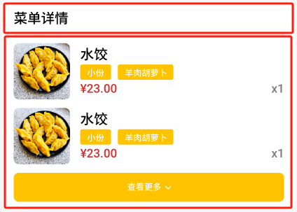

# 任务11 实现订单功能

## 11.1 任务描述

​	本任务将实现订单管理相关功能。包括根据用户点击展示不同状态的订单详情、快速重新下单、通过订单ID或订单号取消订单、精确查询订单详情、分页浏览用户所有订单、取消未支付订单、便捷添加商品到购物车以及根据订单号进行支付确认。这些功能确保了用户能够轻松地管理自己的订单。

## 11.2 任务效果

>如图所示：


## 11.3 学习目标

### 11.3.1 知识目标 

- [ ] 了解组件化编程的基本原理和优势，如提高代码复用性、增强项目灵活性和可维护性等
- [ ] 掌握uni-app调用后端API获取和发送数据的方法，包括处理异步请求、处理API响应以及错误处理

### 11.3.1 能力目标

- [ ] 能够使用uni-app调用后端API获取和发送数据的方法
- [ ] 能够根据业务需求设计可复用的组件，实现这些组件的基本功能和交互

## 11.4 知识储备

### 11.4.1 异步编程

​		异步编程是程序在等待某个操作完成（如网络请求）的同时，可以执行其他操作，不会阻塞程序的执行。与之对应的同步编程是程序按照代码的顺序一行一行执行，执行完一行后才会执行下一行。

#### 异步编程方法

##### 回调函数（Callbacks）

- 定义一个函数作为参数传递给另一个函数，并在该函数完成后被调用。

- 回调地狱（Callback Hell）：多层嵌套的回调函数，导致代码难以阅读和维护。

##### Promises

- 一个代表异步操作最终完成或失败的对象。
- 允许使用链式调用（`.then()` 和 `.catch()`）来处理异步操作的结果或错误。

##### async/await

- 建立在Promises之上的语法糖，使得异步代码看起来更像同步代码。
- `async` 关键字用于声明一个函数是异步的，`await` 关键字用于等待一个Promise完成。

#### 异步编程注意事项

- **错误处理**：在异步操作中，错误处理非常重要。确保使用 `try/catch` 块或 `.catch()` 方法来处理可能出现的错误。
- **代码可读性**：避免过深的嵌套和回调地狱，使用Promises和async/await可以提高代码的可读性和可维护性。
- **性能优化**：异步操作可以提高应用程序的性能，但也要注意不要滥用异步操作，以免造成不必要的开销。

#### 示例代码

**使用Promises**

```javascript
function fetchData() {  
  return new Promise((resolve, reject) => {  
    // 模拟异步操作，如网络请求  
    setTimeout(() => {  
      if (/* 请求成功 */) {  
        resolve('Data fetched successfully');  
      } else {  
        reject(new Error('Failed to fetch data'));  
      }  
    }, 1000);  
  });  
}  
  
fetchData()  
  .then(data => console.log(data))  
  .catch(error => console.error(error));
```

**使用async/await**

```javascript
async function fetchDataAsync() {  
  try {  
    const data = await new Promise((resolve, reject) => {  
      // 模拟异步操作，如网络请求  
      setTimeout(() => {  
        resolve('Data fetched successfully');  
      }, 1000);  
    });  
    console.log(data);  
  } catch (error) {  
    console.error(error);  
  }  
}  
  
fetchDataAsync();
```

​		以上示例展示了如何使用Promises和async/await来处理异步操作。在实际开发中，会遇到更多的场景需要应用异步编程的知识，比如与后端API的交互、文件读写等。

### 11.4.2 组件化编程

​		组件化编码是一种将大型软件系统拆分为多个小型、独立、可复用的组件的开发方法。这种方法旨在提高代码的可维护性、可扩展性和可重用性。以下是关于组件化编码的详细解释：

#### 组件化编码的基本原理

##### 拆分与独立

- 将软件系统拆分为多个独立的组件，每个组件负责实现特定的功能。
- 组件之间通过预定义的接口进行通信和交互。

##### 复用性

- 组件具有高度的可复用性，可以在不同的项目或模块中重复使用。
- 这避免了重复编写相同功能的代码，提高了开发效率。

##### 标准化与规范化

- 通过定义清晰的组件规范和标准，确保组件的质量和一致性。
- 标准化和规范化有助于减少错误和提高代码的可读性。

#### 组件化编码的优势

##### 提高开发效率

- 组件化编码允许并行开发，多个开发人员可以同时处理不同的组件。
- 通过复用已有的组件，可以显著减少开发时间和成本。

##### 增强代码质量

- 组件的独立性和模块化降低了代码之间的耦合度。
- 这使得代码更加易于维护、测试和扩展。

##### 增强项目灵活性

- 当需要添加新功能或修改现有功能时，只需要修改或扩展相应的组件。
- 这使得项目更加灵活，能够快速响应业务需求的变化。

##### 促进团队协作

- 组件化编码使得团队成员可以专注于各自负责的组件，分工合作更加明确。
- 通过共享和复用组件，团队间的知识传递和技术交流也更加方便。

#### 组件化编码的实践方法

##### 定义组件规范

- 在开始开发之前，定义清晰的组件规范和标准。
- 这有助于确保组件的质量和一致性。

##### 拆分静态组件

- 按照功能点拆分组件，并避免与HTML元素命名冲突。
- 这有助于实现组件的独立性和复用性。

##### 实现动态组件

- 考虑数据的存放位置，确保数据在组件间的正确传递和使用。
- 通过状态提升等方式，实现一些组件共享数据的需求。

##### 实现组件间通信

- 使用props实现父子组件间的通信。
- 使用自定义事件实现子组件向父组件传递数据。
- 也可以考虑使用消息订阅与发布等机制实现任意关系组件间的通信。

##### 优化组件性能

- 了解组件性能优化的常见策略，如懒加载、按需渲染等。
- 在编写组件时考虑性能因素，减少不必要的计算和渲染。

### 总结

​		组件化编码是一种高效、灵活、可维护的开发方法。通过将软件系统拆分为多个小型、独立、可复用的组件，可以显著提高开发效率、代码质量和项目灵活性。同时，通过定义清晰的组件规范和标准、实现组件间的有效通信以及优化组件性能等措施，可以进一步提升组件化编码的效果。

## 11.5 任务实施

### 子任务11-1 实现订单管理功能

​		本子任务将实现一个功能全面的订单管理页面，重点在于其页面搭建和功能的实现。在页面搭建上，采用直观易用的界面设计，通过清晰的导航栏和布局，使用户能够轻松浏览不同订单管理区域。在功能实现上，提供了详细的订单查看功能，展示订单的当前状态、商品内容以及历史操作记录，为用户提供全面的订单信息。此外，我们还实现了便捷的取消订单功能，用户可根据需要随时取消订单。支付功能方面，支持多种支付方式，并采用先进的加密技术确保交易的安全性。

#### 步骤一 页面结构分析与搭建

（1）设计图分析

​		根据设计图可知页面可以按内容划分为两个区域、分别是头部导航区和订单列表区域，两个区域为上下布局结构。如图所示：


（2）代码实现

​		在`/pages`目录下新建`Order`文件夹之后创建`Order.vue`文件。然后使用视图容器组件view进行页面搭建。代码如下：

>文件路径：/pages/Order/Order.vue
>
>template部分

```html
<template>
  <!-- 订单容器 -->
	<view class="order-container">
    <!-- 头部导航选择容器 -->
		<view class="select-container">
			导航区域
		</view>
		<!-- 搜索框区域 -->
		<view class="search-container">
      		搜索区域
    	</view>
    <!-- 订单列表容器 -->
		<view class="order-list-container">
			订单列表区域
		</view>
	</view>
</template>

```

​		为了确保订单管理页面能够正确地显示，需要在路由配置文件中设置正确的路径和关联的组件。在`pages.json`文件中，定义一个路由规则，将`/pages/Order/Order`路径映射到订单管理页面的组件。这样，当用户访问这个路径时，应用程序会渲染对应的订单管理页面组件。代码如下：	

>文件路径：pages.json
>
>代码如下：

```json
{
	"pages": [ //pages数组中第一项表示应用启动页，参考：https://uniapp.dcloud.io/collocation/pages
		{
			"path": "pages/index/index",
			"style": {
				"navigationBarTitleText": "首页",
				"navigationBarBackgroundColor": "#8ac93d",
				"enablePullDownRefresh": false
			}
		},
		{
			"path": "pages/Order/Order",
			"style": {
				"navigationBarTitleText": "订单",
				"enablePullDownRefresh": true
			}

		},
	],
}
```

#### 步骤二 制作头部导航区域

（1） 设计图分析

​		根据设计图描述可以将头部导航区域实现为一个可点击的导航菜单，其中每个菜单项都有选中和未选中的状态，并且下方有一条提示线来指示当前选中的菜单项。如图所示：


（2） 代码实现

​		通过 `:class="{'select-container-active':isShowSelectActiveBg}"`，这个容器可以根据 `isShowSelectActiveBg` 的值来决定是否添加 "select-container-active" 类，以此来实现选项卡活跃状态的选中样式。使用 `v-for="item in selectList"` 对 `selectList` 数组进行遍历，为每个数组项生成一个 `view` 元素，作为筛选选项。每个筛选选项内部包含两个子`view`元素：第一个子元素用于显示筛选选项的文本。第二个子元素用于显示下方的提示线。通过 `:class="{'line-active':item.state == activeState}"` 动态添加 "line-active" 类，当该项被选中时，提示线将显示活跃状态。代码如下：

>文件路径：/pages/Order/Order.vue
>
>template部分

```html
<template>
	<view class="order-container">
        <!-- 头部导航选择容器 -->
		<view class="select-container" :class="{'select-container-active':isShowSelectActiveBg}">
            <!-- 列表渲染 -->
			<view class="select-list">
				<view class="select-item" v-for="item in selectList" :key="item.state"
					:class="{'active-item': item.state === activeState}">
					<view class="select-text">{{ item.typeName }}</view>
					<view class="line" :class="{'line-active':item.state == activeState}"></view>
				</view>
			</view>
		</view>
	</view>
</template>
```

​			在`data`节点中声明`activeState` 的初始值为 `0`，表示当前选中的是 `selectList` 数组中的第一个元素。`selectList` 是一个对象数组，每个对象都表示一个可选择的订单状态。每个对象都有一个 `state` 属性和一个 `typeName` 属性。`state` 属性用于在后台逻辑中标识不同的订单状态（如 0 表示全部，1 表示未支付等），而 `typeName` 属性则用于在界面上显示给用户看。代码如下：

>文件路径：/pages/Order/Order.vue
>
>JavaScript部分

```js
<script>
	export default {
		data() {
			return {
				// 订单状态 订单状态 1未支付(默认) 2 已支付 3 已取消
				activeState: 0,
                // 订单导航列表
				selectList: [{
						state: 0,
						typeName: '全部'
					},
					{
						state: 1,
						typeName: '未支付'
					},
					{
						state: 2,
						typeName: '已支付'
					},
					{
						state: 3,
						typeName: '已取消'
					},
				],
            }
        }
	}
             
 </script>
```

>文件路径：/pages/Order/Order.vue
>
>css部分

```css
<style lang="scss" scoped>
	.order-container {
		min-height: 100vh;
		background: #F5F5F6;

		.select-container {
			padding-top: 32rpx;
			padding-left: 32rpx;
			padding-right: 32rpx;
			padding-bottom: 20rpx;
			position: sticky;
			top: 0;
			transition: all ease 0.3s;
		}

		.select-container-active {
			background-color: #fff;
			z-index: 999;
		}

		.select-list {
			height: 38rpx;
			display: flex;
			justify-content: flex-start;

			.select-item {
				margin-right: 12rpx;
				font-weight: 500;
				font-size: 24rpx;
				transition: all ease 0.1s;
				position: relative;
				color: #000000;
				width: 96rpx;
				display: flex;
				justify-content: center;
				align-items: center;

				.line {
					position: absolute;
					bottom: -18rpx;
					width: 0rpx;
					height: 6rpx;
					border-radius: 4rpx;
					background-color: rgba(255, 195, 0, 1);
					transition: all ease 0.3s;
				}

				.line-active {
					width: 32rpx;
				}
			}

			.active-item {
				font-size: 32rpx;
				font-weight: bold;
			}
		}
}
</style>
```

#### 步骤三 实现头部导航跳转功能

（1） 逻辑分析

​			当用户点击导航栏中的不同选项时，系统将根据用户的选择动态展示对应的页面内容。

（2） 代码实现

​			组件的 `selectList` 数组中的每一项都代表一个可以选择的标签或选项。用户可以通过点击列表项来切换当前激活的选项。接下来为模板的标签添加一个点击事件，代码如下：

>文件路径：/pages/Order/Order.vue
>
>template部分

```html
<template>
  <view class="order-container">
  <!-- 选择容器 -->
      <view class="select-container" :class="{'select-container-active':isShowSelectActiveBg}">
        <!-- 选择列表 -->
        <view class="select-list">
          <!-- 选择项 -->
          <view class="select-item" v-for="item in selectList" :key="item.state"
            :class="{'active-item': item.state === activeState}" @click="handleChangeTab(item.state)">
            <!-- 选择项文本 -->
            <view class="select-text">{{ item.typeName }}</view>
            <!-- 分割线 -->
            <view class="line" :class="{'line-active':item.state == activeState}"></view>
          </view>
        </view>
      </view>
	<!--省略其他代码-->
  </view>
</template>
```

​			当用户点击一个列表项时，`handleChangeTab` 方法会被调用，更新 `activeState` 的值，并通过 `handleInit` 方法触发逻辑。通过动态类绑定，当前激活的列表项及其线条会被高亮显示。组件的 `isShowSelectActiveBg` 数据属性控制是否显示整个选择容器的激活背景。代码如下：

>文件路径：/pages/Order/Order.vue
>
>JavaSctript部分

```js
<script>
    export default {
        // 省略其他代码

        methods: {
            /**
             * 处理切换标签页的状态
             * @param {Object} state - 包含当前激活标签页信息的对象
             */
            handleChangeTab(state) {
                this.activeState = state; // 更新组件的activeState以反映当前激活的标签页
                this.handleInit(); // 调用handleInit方法来初始化页面数据
            },

            /**
             * 初始化页面数据
             */
            handleInit() {
                // 重置当前页码为1
                this.page.currentPage = 1;
                // 重置总数据量为0
                this.page.total = 0;
                // 清空订单列表
                this.orderList = [];
                // 调用加载数据的方法来更新页面
                this.handleLoad();
            },
        }
    };
</script>

```

#### 步骤四 制作订单列表区域

（1） 设计图分析

​		根据设计图可知订单列表分为订单列表和商品列表区域两部分，两个区域为嵌套布局结构。如图所示：


（2）代码实现

​		为了提高代码的复用性和可维护性，订单列表区域采用组件的形式编写，在`/components`目录下新建`order-item`文件夹创建`order-item.vue`文件作为订单列表区域。代码如下：

>文件路径：/components/order-item/order-item.vue
>
>template部分

```html
<template>
    <view class="order-item">
        <!-- 订单项容器 -->

        <view class="order-head">
            <!-- 订单头部 -->

            <view class="left">
                
            </view>

            <view class="right">
                
            </view>

            <!-- 订单状态 -->
            <view class="right">
                
            </view>
        </view>

        <view class="line line1">
            <!-- 分隔线1，用于分隔订单头部和详细信息 -->
            <view></view>
        </view>

        <view class="line line2">
            <!-- 分隔线2，用于进一步分隔订单信息 -->
            <view></view>
        </view>

        <view class="time-and-total-price">
            <!-- 时间和总价信息-->
        </view>

        <view class="userinfo-and-order-operate">
            <!-- 用户信息和订单操作 -->
        </view>
    </view>
</template>


```

>文件路径：/components/order-item/order-item.vue
>
>css部分

```css
<style lang="scss" scoped>
	.order-item {
		background-color: #fff;
		box-sizing: border-box;
		padding: 12rpx 26rpx 20rpx 26rpx;
		border-radius: 16rpx;
		margin-top: 24rpx;

		.order-head {
			display: flex;
			justify-content: space-between;

			.left {
				display: flex;
				align-items: center;
				justify-content: flex-start;

			

				.order-number {
					color: #808080;
					font-size: 24rpx;
					font-weight: 500;
					line-height: 36rpx;
				}

				.copy {
					width: 28rpx;
					height: 28rpx;
					margin-left: 12rpx;
				}
			}

			.right {
				.state {
					color: #D43030;
					font-size: 24rpx;
					font-weight: 500;
					line-height: 36rpx;
				}

				.state-1 {}

				.state-2 {
					color: #43CF7C;
				}

				.state-3 {
					color: #808080;
				}
			}

		}

		.line {
			box-sizing: border-box;

			>view {
				width: 100%;
				height: 2rpx;
				background-color: #E5E5E5;
			}
		}

		.line1 {
			padding: 12rpx 0 20rpx 0;
		}

		.line2 {
			padding: 20rpx 0 16rpx 0;
		}

		// 订单
		.order-list {}

		.time-and-total-price {
			display: flex;
			justify-content: space-between;
			align-items: center;

			.left {
				font-size: 24rpx;
				letter-spacing: 0px;
				line-height: 36rpx;
				color: #808080;
			}

			.right {
				display: flex;
				align-items: center;

				.text-1 {
					color: #808080;
					font-size: 20rpx;
				}

				.text-2 {
					color: #D43030;
					font-size: 28rpx;
					padding-left: 8rpx;
				}
			}
		}

		.userinfo-and-order-operate {
			display: flex;
			justify-content: space-between;
			align-items: center;
			margin-top: 16rpx;

			.left {
				display: flex;
				align-items: center;

				image {
					width: 48rpx;
					height: 48rpx;
					border-radius: 50%;
					background-color: #ccc;
				}

				text {
					color: #000000;
					font-size: 24rpx;
					line-height: 30rpx;
					padding-left: 16rpx;
				}
			}

			.right {
				display: flex;
				align-items: center;

				.abtn {
					border-radius: 32rpx;
					border: 2rpx solid #808080;
					box-sizing: border-box;
					padding: 0 20rpx;
					display: flex;
					align-items: center;
					justify-content: center;
					min-width: 124rpx;
					height: 48rpx;
					margin-right: 20rpx;

					text {
						color: #808080;
						font-size: 20rpx;
					}
				}

				.abtn:last-child {
					margin-right: 0;
				}

				.abtn2 {
					background: #FFC300;
					border: 2rpx solid #FFC300;

					text {
						color: #ffffff;
					}
				}
			}

		}
	}
</style>
```

​		为了确保数据能够在页面中显示，需要在父组件中使用该组件。代码如下：

>文件路径：/pages/Order/Order.vue
>
>template部分

```html
<template>
  <view class="order-container">
    <view class="select-container">
      <!--省略其他代码-->
    </view>
	<view class="search-container">
     <!--省略其他代码-->
    </view>

    <view class="order-list-container">
      <order-item></order-item>
    </view>
  </view>
</template>
```

>文件路径：/pages/Order/Order.vue
>
>css部分

```css
<style lang="scss" scoped>
  .order-container {
      //省略其他代码
    .order-list-container {
      padding: 0 32rpx;
      box-sizing: border-box;
    }
  }
</style>
```

​		接下来在`components`目录下新建`order-good-list`文件夹创建`order-good-list.vue`组件作为商品列表区域。代码如下：

>文件路径：/components/order-good-list/order-good-list.vue
>
>template部分

```html
<template>
    <view class="order-good-list">
        <!-- 订单商品列表容器 -->

        <view class="list-container">
            <!-- 商品列表容器 -->

            <view class="order-goods-item">
                <!-- 单个订单商品项 -->

                <view class="image">
                    <!-- 商品图片 -->
                    <image src="" lazy-load></image>
                </view>

                <view class="desc">
                    <!-- 商品描述 -->

                    <view class="title"></view>
                    <!-- 商品标题 -->

                    <view class="spec-box">
                        <!-- 商品规格盒子 -->
                        <view class="spec-item">
                            <!-- 规格项 -->
                            <text></text>
                        </view>
                    </view>
                    
                    <view class="spec-box">
                        <!-- 另一组商品规格盒子 -->
                        <view class="spec-item">
                            <!-- 规格项 -->
                            <view class="">
                                <text></text>
                            </view>
                        </view>
                    </view>
                    
                    
                    <view class="price-and-num">
                        <!-- 价格和数量 -->
                        <view class="price">¥</view>
                        <view class="num">
                            x
                        </view>
                    </view>
                </view>
            </view>
        </view>

        <view class="load-more-btn">
            <!-- 加载更多按钮 -->
            <text></text>
            <uni-icons class="icon" size="20rpx" color="#fff"></uni-icons>
        </view>
    </view>
</template>

```

>文件路径：/components/order-good-list/order-good-list.vue
>
>css部分

```css
<style lang="scss" scoped>
	.order-good-list {
		.list-container {
			.order-goods-item {
				width: 100%;
				height: 132rpx;
				display: flex;
				margin-bottom: 20rpx;

				.image {
					width: 132rpx;
					height: 100%;
					border-radius: 12rpx;
					background-color: #ccc;

					image {
						width: 100%;
						height: 100%;
						border-radius: 12rpx;
						background-color: #ccc;
					}
				}

				.desc {
					width: calc(100% - 132rpx);
					padding-left: 24rpx;
					display: flex;
					flex-direction: column;
					justify-content: space-around;

					.title {
						font-size: 32rpx;
						font-weight: 500;
						letter-spacing: 0px;
						line-height: 38rpx;
						color: #000;
					}

					.spec-box {
						display: flex;
						align-items: center;

						.spec-item {
							padding: 4rpx 16rpx;
							box-sizing: border-box;
							font-size: 20rpx;
							font-weight: 500;
							line-height: 30rpx;
							color: #fff;
							border-radius: 4rpx;
							background: #FFC300;
							margin-right: 16rpx;
						}
					}

					.price-and-num {
						display: flex;
						justify-content: space-between;

						.price {
							font-size: 28rpx;
							font-weight: 500;
							letter-spacing: 0px;
							line-height: 34rpx;
							color: #D43030;
						}

						.num {
							color: #808080;
							font-size: 28rpx;
							line-height: 34rpx;
						}
					}

				}
			}

			.order-goods-item:last-child {
				margin-bottom: 0;
			}
		}


		.load-more-btn {
			width: 100%;
			height: 68rpx;
			display: flex;
			justify-content: center;
			align-items: center;

			border-radius: 12rpx;
			background-color: #FFC300;
			margin-top: 20rpx;

			text {
				color: #fff;
				font-size: 20rpx;
				padding-right: 4rpx;
				line-height: 24rpx;
			}

			.icon {
				line-height: 24rpx;
			}
		}
	}
</style>
```

​		在订单列表中使用组件用于展示商品列表。根据条件选择一个列表来绑定到某个属性或变量上。代码如下：

>文件路径：/components/order-item/order-item.vue
>
>template部分

```html
<template>
	<view class="order-item" >
        <!--省略其他代码-->
        
        <view class="line line1">
			<view></view>
		</view>
       	<!-- TODO:这里爆红，先不用管，因为还没有对接接口数据，下个子任务对接这里的数据 -->
		<order-good-list />
        <view class="line line2">
			<view></view>
		</view>
	</view>
</template>
```

#### 步骤五 实现订单列表展示功能

（1） 逻辑分析

​		当用户进入订单管理页面时，系统默认会展示一个包含所有订单的列表。这个列表详细列出了用户的所有订单信息，如订单编号、下单时间、订单状态、商品详情等。通过这种方式，用户可以一目了然地查看自己的所有订单，无需进行任何搜索或筛选操作，极大地方便了用户对订单的管理和跟踪。同时，用户还可以根据需要对订单进行进一步的查看、取消或支付等操作。

（2） 接口分析

　　实现订单列表展示功能需要使用后端提供的条件分页查询用户全部订单接口。详情如下：

- API地址：{{API_HOST}}/front/order/orders
- API请求方式：POST
- API请求参数：见下表

| 参数字段名 | 参数值 | 数据类型 |                 说明                  |
| :--------: | :----: | :------: | :-----------------------------------: |
|    name    |   子   |  String  |          查询条件 (商品名称)          |
|   state    |   2    |  String  | 订单状态 1未支付(默认) 2已支付3已取消 |

　　API 返回的响应数据示例如下。

```json
{
"success": true,
"code": 200,
"message": "操作成功",
"pageInfo": {
"total": 9,
"list": [
{
"orderId": 1, //订单id
"goodsList": [
{
"id": 3, 
"orderId": 1, 
"goodsId": 1, 
"specs": "测试", 
"number": 2, 
"createTime": "2024-01-23 13:49:09", 
"updateTime": "2024-01-23 13:49:12", 
"image": "/res/a.png" 
},
{
"id": 11, 
"orderId": 1, 
"goodsId": 2, 
"specs": "[\"{\\\"id\\\":1,\\\"content\\\":\\\"小份\\\",\\\"groupId\\\":\\\"d2iassd8\\\"}\",\"{\\\"id\\\":2,\\\"content\\\":\\\"羊肉胡萝卜\\\",\\\"groupId\\\":\\\"dasdas2\\\"}\"]", 
"number": 2, 
"createTime": "2024-01-24 16:17:49", 
"updateTime": "2024-01-24 16:17:49", 
"image": "/res/a.png" 
},
{
"id": 12, 
"orderId": 1, 
"goodsId": 1, 
"specs": "[\"{\\\"id\\\":1,\\\"content\\\":\\\"小份\\\",\\\"groupId\\\":\\\"d2iassd8\\\"}\",\"{\\\"id\\\":2,\\\"content\\\":\\\"羊肉胡萝卜\\\",\\\"groupId\\\":\\\"dasdas2\\\"}\"]", 
"number": 1, 
"createTime": "2024-01-24 19:10:36", 
"updateTime": "2024-01-24 19:10:36", 
"image": "/res/a.png" 
},
{
"id": 13, 
"orderId": 1, 
"goodsId": 2, 
"specs": "[\"{\\\"id\\\":1,\\\"content\\\":\\\"小份\\\",\\\"groupId\\\":\\\"d2iassd8\\\"}\",\"{\\\"id\\\":2,\\\"content\\\":\\\"羊肉胡萝卜\\\",\\\"groupId\\\":\\\"dasdas2\\\"}\"]", 
"number": 2, 
"createTime": "2024-01-24 19:10:36", 
"updateTime": "2024-01-24 19:10:36", 
"image": "/res/a.png" 
}
], 
"createTime": "2024-01-23 13:49:39", //创建时间
"totalAmount": 34, 
"userNikeName": "我是三个213", 
"userAvatar": "/res/6f757b8c-ad3f-4c33-8dda-8f33f70d7712.png", //用户头像
"state": "1" //状态 1正常(默认) 2 已下架
},
],
"pageNum": 1, //当前页码
"pageSize": 9, //每页显示的记录数
"size": 9, //当前页的起始行号
"startRow": 0, //当前页的起始行号
"endRow": 8, //总页数
"pages": 1, //总页数
"prePage": 0, //上一页页码
"nextPage": 0, //下一页页码
"isFirstPage": true, //是否为第一页
"isLastPage": true, //是否为最后一页
"hasPreviousPage": false, //是否有上一页
"hasNextPage": false, //是否有下一页
"navigatePages": 8, //导航页码数
"navigatepageNums": [
1
], //导航页码数组
"navigateFirstPage": 1, //导航第一页页码
"navigateLastPage": 1 //导航最后一页页码
}
}
```

（3）代码实现

​		引用request.js 文件（任务一已配置好，再次直接引入使用即可），在`/api`目录下新建`client.js`文件用于编写分页查询用户全部订单接口的方法。代码如下：

> 文件路径：/api/client.js

```shell
import http, {
	BASEURL
} from '@/api/request.js'

/**
 * 条件分页查询用户全部订单
 */
export function orders(data) {
	return http.http('/front/order/orders', data, false, 'GET')
}
```

​		在`script`标签中引入上方编写好的条件分页查询用户全部订单订单接口，定义多个数据项，包括订单标题 (`title`)、加载状态 (`loading`)、订单状态选择器 (`activeState` 和 `selectList`)、是否显示选择状态的背景 (`isShowSelectActiveBg`)、订单列表 (`orderList`)、分页信息 (`page`) 和搜索内容 (`searchContent`)。当页面滚动时，检查滚动距离 (`e.scrollTop`)。如果滚动距离大于0，则显示选择状态的背景。当用户下拉刷新页面时，调用 `handleInit` 方法来重新初始化数据和加载订单列表。当用户滚动到页面底部时，检查是否还有更多数据可以加载。如果没有，则显示一个提示；否则，更新当前页码并调用 `handleLoad` 方法来加载更多订单当页面显示时，调用 `handleInit` 方法来初始化数据和加载订单列表。`handleChangeTab(state)`：当订单状态选择器改变时，更新 `activeState` 并重新加载订单列表。`handleInputChange()`：当搜索内容改变时，使用 `setTimeout` 延迟300毫秒后重新加载订单列表，以避免频繁请求。同时，使用 `clearTimeout` 清除之前的定时器，确保不会同时发送多个请求。`async handleLoad()`：异步加载订单列表。首先检查是否正在加载 (`loading`)，然后构建请求数据。如果指定订单状态或搜索内容，则添加到请求数据中。发送请求并处理响应。如果响应成功，更新订单列表和分页信息。`handleInit()`：重置分页信息、清空订单列表，并调用 `handleLoad` 方法来加载第一页的订单。`handleLoadNext()`：当前页码加1，并调用 `handleLoad` 方法来加载下一页的订单。代码如下：

>文件路径：/pages/Order/order.vue
>
>JavaScript部分

```js
<script>
    import { orders } from "@/api/client.js"; // 导入获取订单列表的API函数
    import { BASEURL } from "@/api/request"; // 导入API请求的基础URL

    export default {
      data() {
        return {
          // 订单列表的标题
          title: '暂无订单',
          // 是否正在加载中
          loading: false,
          // 订单状态，默认为未支付
          activeState: 0,
          // 选择列表，包含不同的订单状态
          selectList: [
            { state: 0, typeName: '全部' },
            { state: 1, typeName: '未支付' },
            { state: 2, typeName: '已支付' },
            { state: 3, typeName: '已取消' },
          ],
          // 是否显示选择项的激活背景
          isShowSelectActiveBg: false,
          // 订单列表数据
          orderList: [],
          // 分页信息
          page: {
            currentPage: 1,
            pageSize: 10,
            total: null
          },
          // 搜索内容
          searchContent: ""
        };
      },
      // 页面滚动事件
      onPageScroll(e) {
        this.isShowSelectActiveBg = e.scrollTop > 0 ? true : false;
      },
      // 下拉刷新事件
      onPullDownRefresh() {
        this.handleInit();
      },
      // 上拉加载更多事件
      onReachBottom() {
        if (this.page.currentPage * this.page.pageSize >= this.page.total) {
          uni.showToast({
            title: '没有更多了',
            icon: 'error',
            duration: 1000
          });
          return;
        }
        this.page.currentPage++;
        this.handleLoad();
      },
      // 页面显示事件
      onShow() {
        this.handleInit();
      },
      methods: {
        // 切换订单状态
        handleChangeTab(state) {
          this.activeState = state;
          this.handleInit();
        },
        // 处理搜索内容变化
        handleInputChange() {
          clearTimeout(this.timer);
          this.timer = setTimeout(() => {
            this.handleInit();
          }, 300);
        },
        // 加载订单列表
        async handleLoad() {
          if (this.loading) {
            return;
          }
          let data = {
            currentPage: this.page.currentPage,
            pageSize: this.page.pageSize,
          };
          if (this.activeState) {
            data.state = this.activeState;
          }
          if (this.searchContent) {
            data.name = this.searchContent;
          }
          let res = await orders(data); // 调用API获取订单列表
          if (res.success) {
            // TODO：分页出问题的话接触这里判断
            if (res.pageInfo && res.pageInfo.total) {
              this.page.total = res.pageInfo.total;
              let list = res.pageInfo.list ? res.pageInfo.list : [];
              list = list.map((item) => {
                let goodsList = item.goodsList ? item.goodsList : [];
                item.goodsList = goodsList.map((item2) => {
                  item2.image = BASEURL + item2.image;
                  return item2;
                });
                return item;
              });
              this.orderList.push(...list); // 将新加载的订单列表添加到现有列表中
            }
          }
        },
        // 初始化订单列表
        handleInit() {
          this.page.currentPage = 1;
          this.page.total = 0;
          this.orderList = [];
          this.handleLoad(); // 重新加载订单列表
        },
        // 加载下一页订单列表
        handleLoadNext() {
          this.page.currentPage++;
          this.handleLoad(); // 加载下一页的订单列表
            }

        },
    };
</script>

```

​		在子组件中使用 `v-if="data"` 来确保当 `data` 对象存在时才渲染整个订单项组件。订单的状态显示（未支付、已支付、已取消）依赖于 `data.state` 的值和 `type` 变量。当 `type` 为 1 时，显示的是与审核相关的状态（未审核、已审核）；当 `type` 不是 1 时，显示的是与支付和取消相关的状态（未支付、已支付、已取消）。在 `.time-and-total-price` 视图中，显示订单的创建时间 `data.createTime` 和总金额 `data.totalAmount`。左侧显示用户的头像和用户名。右侧提供操作按钮，按钮的显示和点击事件根据订单的状态和type变量来决定。当 `type` 不存在且订单未支付时（`data.state == 1`），显示“查看详情”和“立即下单”按钮。当 `type` 存在且订单状态不是已支付（`data.state != 2`）时，显示“取消订单”按钮。`data`：包含订单的所有信息，如订单编号、状态、商品列表、创建时间、总金额等。`type`：用于区分订单类型的变量，不同的 `type` 值会影响订单状态的显示和操作按钮的显示。代码如下。

>文件路径：/components/order-item/order-item.vue
>
>template部分

```html
<template>
	<view class="order-item" v-if="data">
      <!-- 订单头部信息 -->
      <view class="order-head">
        <!-- 订单编号 -->
        <view class="left">
          <text class="order-number">订单编号：{{data.orderId?data.orderId:data.id}}</text>
          <image class="copy" src="@/static/Order/copy.png" mode=""
            @click="handleCopy(data.orderId?data.orderId:data.id)"></image>
        </view>
        <!-- 订单状态 -->
        <view class="right" v-if="type==1">
          <text class="state state-1" v-if="data.state==1">未审核</text>
          <text class="state state-2" v-else-if="data.state==2">已审核</text>
        </view>
        <view class="right" v-else>
          <text class="state state-1">未支付</text>
          <text class="state state-2">已支付</text>
          <text class="state state-3">已取消</text>
        </view>
      </view>
      <!-- 分割线 -->
      <view class="line line1">
        <view></view>
      </view>
      <!-- 订单商品列表 -->
      <order-good-list :list="data.goodsList?data.goodsList:data.orderDetailsList" />
      <!-- 分割线 -->
      <view class="line line2">
        <view></view>
      </view>
      <!-- 订单时间和总价 -->
      <view class="time-and-total-price">
        <view class="left">
          <text>{{data.createTime}}</text>
        </view>
        <view class="right">
          <text class="text-1">总金额</text>
          <text class="text-2">¥{{data.totalAmount}}</text>
        </view>
      </view>
      <!-- 用户信息和订单操作 -->
      <view class="userinfo-and-order-operate">
        <view class="left">
          <image :src="BASEURL + (data.userAvatar !== undefined ? data.userAvatar : data.avatar)"></image>
          <text>{{data.realName?data.realName:data.userNikeName}}</text>
        </view>
        <view class="right">
          <view class="abtn">
            <text>查看详情</text>
          </view>
          <view class="abtn abtn2">
            <text>立即下单</text>
          </view>
          <view class="abtn">
            <text>取消订单</text>
          </view>
        </view>
      </view>
    </view>
</template>
```

​	`methods`节点中定义`handleJumpOrderDetails(data)`：接收一个 `data` 参数，该参数应该包含 `orderId` 属性。使用 `uni.navigateTo` 方法进行页面跳转，跳转到 "/pages/Order/particulars" 页面，并将 `orderId` 作为查询参数传递。handleCopy(orderId)：接收一个 `orderId` 参数。使用 `uni.setClipboardData` 方法将 `orderId` 的 JSON 字符串形式复制到剪贴板。如果复制成功，显示一个 "复制成功" 的提示；如果失败，显示一个 "复制失败" 的提示，并带有错误图标。代码如下。

>文件路径：/components/order-item/order-item.vue
>
>JavaScript部分

```js
<script>
	import { BASEURL } from "@/api/request"; // 导入API请求的基础URL
    export default {
      name: "order-item", // 组件的名称
      props: {
        data: {
          default: null,
          type: Object // 订单数据，默认为null，类型为Object
        },
        type: {
          default: null,
          type: String // 订单类型，默认为null，类型为String
        }
      },
      data() {
        return {
          BASEURL // 组件内部数据属性，用于存储API请求的基础URL
        };
      },
      computed: {
        // 计算属性，用于处理订单数据或其他逻辑
      },
      methods: {
        /**
         * 跳转到订单详情页
         */
        handleJumpOrderDetails(data) {
          // 跳转到订单详情页的方法
          uni.navigateTo({
            url: "/pages/Order/particulars?orderId=" + data.orderId
          });
        },
        /**
         * 复制订单编号
         */
        handleCopy(orderId) {
          // 复制订单编号的方法
          uni.setClipboardData({
            data: JSON.stringify(orderId),
            success: function() {
              uni.showToast({
                title: '复制成功',
                duration: 2000
              });
            },
            fail: function(err) {
              uni.showToast({
                title: '复制失败',
                icon: 'error',
                duration: 2000
              });
            }
          });
        }
      }
    };

</script>
```

​	之后在父组件中进行组件渲染。代码如下：

>文件路径：/pages/Order/Order.vue
>
>template部分

```html
<template>
  <view class="order-container">
      <!--省略其他代码-->
    <view class="order-list-container">
      <order-item v-for="order in orderList" :key="order.orderId" :data="order"></order-item>
    </view>
  </view>
</template>
```

#### 步骤六 实现商品列表相关功能

（1） 逻辑分析

​		在页面中展示订单列表时，除了显示每个订单的基本信息外，通常还需要展示每个订单对应的商品列表。通过遍历订单数据，并为每个订单创建一个包含其商品列表的展示区域，用户可以清晰地看到每个订单中包含了哪些商品。

（2） 代码实现

​		商品列表被包裹在`order-goods-item`的`view`中，并使用`v-for`指令来遍历`listComputed`。每个商品都有一个图片、描述（包括名称、规格和价格数量）。当商品有规格（`specs`）时，根据`specs`的结构来显示不同的内容。如果列表长度大于3，会显示一个“查看更多”或“收起”的按钮，用于切换商品的显示数量。代码如下：

>文件路径：/components/order-good-list/order-good-list.vue
>
>template部分

```html
<template>
        <view class="order-good-list">
          <!-- 商品列表容器 -->
          <view class="list-container">
            <!-- 订单商品项 -->
            <view class="order-goods-item" v-for="item in listComputed" :key="item.id">
              <!-- 商品图片 -->
              <view class="image">
                <image :src="item.image" lazy-load></image>
              </view>
              <!-- 商品描述 -->
              <view class="desc">
                <!-- 商品标题 -->
                <view class="title">{{item.goodsName?item.goodsName:'暂无'}}</view>
                <!-- 商品规格 -->
                <view class="spec-box" v-if="item.specs.name">
                  <view class="spec-item" v-for="item2 in item.specs">
                    <text>{{item2.content}}</text>
                  </view>
                </view>
                <view class="spec-box" v-else>
                  <view class="spec-item" v-for="item2 in item.specs">
                    <view class="" v-for="item3 in item2.list">
                      <text>{{item3.content}}</text>
                    </view>
                  </view>
                </view>
                <!-- 价格和数量 -->
                <view class="price-and-num">
                  <view class="price">¥{{item.goodsPrice}}</view>
                  <view class="num">
                    x{{item.number}}
                  </view>
                </view>
              </view>
            </view>
          </view>
          <!-- 加载更多按钮 -->
		<view class="load-more-btn" @click="handleShowLoadMore" v-if="list.length>3">
			<text>{{!show?'查看更多':'收起'}}</text>
			<uni-icons class="icon" :type="!show?'down':'up'" size="20rpx" color="#fff"></uni-icons>
		</view>
	</view>
</template>
```

​			在`script`标签中定义`list`: 这是一个默认值为空数组，类型为数组的prop。用于接收从父组件传递过来的商品列表数据。data中定义几个变量：`show`: 一个布尔值，用于控制是否显示所有商品（默认只显示前三个）。`listValue`: 这是一个用于存储处理后的商品列表的数组。methods中定义几个方法：`handleShowLoadMore`: 当点击“查看更多”或“收起”按钮时，切换`show`变量的值，从而控制是否显示所有商品。`handleList`: 这个方法用于处理传入的`list` prop。遍历`list`，如果商品有`specs`字段，会尝试将`specs`字段从JSON字符串解析为对象，并更新每个商品的数据。`listComputed`: 这是一个计算属性，基于`show`的值来决定返回`listValue`的前三个元素还是全部元素。这样，当`show`为`false`时，只显示前三个商品；当`show`为`true`时，显示所有商品。代码如下。

>文件路径：/components/order-item/order-item.vue
>
>JavScript部分

```js
<script>
	import {
		BASEURL
	} from "@/api/request.js";
	// 商品列表组件
	export default {
		// Vue组件定义
        name: "order-good-list", // 组件的名称

        // 组件的属性定义
        props: {
          list: { // 定义一个名为list的属性
            default: () => [], // 如果没有传递list属性，则默认为一个空数组
            type: Array // 指定list属性的类型为数组
          }
        },

        // 组件的计算属性
        computed: {
          listComputed() { // 定义一个计算属性listComputed
            // 如果show为false，则返回listValue数组的前三个元素，否则返回整个listValue数组
            return !this.show ? this.listValue.slice(0, 3) : this.listValue;
          }
        },

        // 组件的数据
        data() {
          return {
            BASEURL, // 基础URL，可能是一个常量或者变量，需要从外部引入
            show: false, // 控制列表显示的标记，默认为false
            listValue: [] // 存储处理后的商品列表数据
          };
        },

        // 组件的方法
        methods: {
          handleShowLoadMore() { // 处理加载更多商品的方法
            this.show = !this.show; // 切换show的值，以显示或隐藏更多商品
          },
          handleList() { // 处理商品列表的方法
            let _list = [] // 定义一个空数组，用于存储处理后的商品列表
            let specsArray = {} // 定义一个空对象，用于存储商品规格信息
            _list = this.list.map(item => { // 使用map方法处理原始的商品列表
              if (item.specs) { // 如果商品有规格信息
                specsArray = JSON.parse(item.specs); // 将规格信息字符串转换为对象
              }
              // 返回一个新对象，包含商品的所有信息和解析后的规格信息
              return {
                ...item,
                specs: specsArray
              }
            })
            this.listValue = _list // 将处理后的商品列表赋值给listValue
          },
        },

        // 组件挂载后的生命周期钩子
        mounted() {
          this.handleList() // 在组件挂载后调用handleList方法，处理商品列表
        }

</script>
```

#### 步骤七 实现订单状态展示功能

（1） 设计图分析

​			根据设计图可知订单列表分为订单列表展示区域和商品列表区域两部分，两部分为嵌套布局构成。如图所示：


（2） 代码实现

​		下单成功后在订单查看订单详情,无数据展示暂无订单。未支付、已支付和已取消根据状态展示对应订单即可。代码如下：

>文件路径：/components/order-item/order-item.vue
>
>template部分

```html
<template>
	<view class="order-item" v-if="data">
      <!-- 订单头部信息 -->
      <view class="order-head">
        <!-- 订单编号 -->
        <view class="left">
          <text class="order-number">订单编号：{{data.orderId?data.orderId:data.id}}</text>
          <image class="copy" src="@/static/Order/copy.png" mode=""
            @click="handleCopy(data.orderId?data.orderId:data.id)"></image>
        </view>
        <!-- 订单状态 -->
        <view class="right" v-if="type==1">
          <text class="state state-1" v-if="data.state==1">未审核</text>
          <text class="state state-2" v-else-if="data.state==2">已审核</text>
        </view>
        <view class="right" v-else>
          <text class="state state-1">未支付</text>
          <text class="state state-2">已支付</text>
          <text class="state state-3">已取消</text>
        </view>
      </view>
      <!-- 分割线 -->
      <view class="line line1">
        <view></view>
      </view>
      <!-- 订单商品列表 -->
      <order-good-list :list="data.goodsList?data.goodsList:data.orderDetailsList" />
      <!-- 分割线 -->
      <view class="line line2">
        <view></view>
      </view>
      <!-- 订单时间和总价 -->
      <view class="time-and-total-price">
        <view class="left">
          <text>{{data.createTime}}</text>
        </view>
        <view class="right">
          <text class="text-1">总金额</text>
          <text class="text-2">¥{{data.totalAmount}}</text>
        </view>
      </view>
      <!-- 用户信息和订单操作 -->
      <view class="userinfo-and-order-operate">
        <view class="left">
          <image :src="BASEURL + (data.userAvatar !== undefined ? data.userAvatar : data.avatar)"></image>
          <text>{{data.realName?data.realName:data.userNikeName}}</text>
        </view>
        <view class="right">
          <view class="abtn">
            <text>查看详情</text>
          </view>
          <view class="abtn abtn2">
            <text>立即下单</text>
          </view>
          <view class="abtn">
            <text>取消订单</text>
          </view>
        </view>
      </view>
    </view>
</template>
```

​		当列表中存在没有数据的情况时，为了提高组件的利用率和用户体验，可以编写一个无数据返回的组件处理这种情况。这个无数据组件可以在数据为空或未加载时显示一个友好的提示信息，如“暂无数据”或“正在加载中”，以避免页面出现空白或混乱的情况。在`components/empty`目录下创建`empty.vue`组件。代码如下：

>文件路径：/components/empty/empty.vue
>
>template部分

```html
<template>
    <!-- 空状态容器 -->
	<view class="empty">
		<image src="../../static/empty.png" mode="aspectFill"></image>
		<view class="title">{{title}}</view>
	</view>
</template>
```

>文件路径：/components/empty/empty.vue
>
>css部分

```css

<style lang="scss" scoped>
	.empty {
		text-align: center;
		padding-bottom: 100rpx;

		.title {
			color: #747678;
			font-weight: bold;
		}
	}
</style>
```

>文件路径：/components/empty/empty.vue
>
>JavaScript部分

```js
<script>
	export default {
		props: {
			title: {
				type: String,
				default: '列表为空...',
			}
		},
		data() {
			return {}
		}
	}
</script>
```

​		定义好组件后，在父组件进行使用。代码如下：

>文件路径：/pages/Order/Order.vue
>
>template部分

```html
<template>
  <view class="order-container">
      <!--省略其他代码-->
      	<view class="no-data" v-if="orderList.length==0">
		<empty :title="title"></empty>
    </view>
  </view>
</template>
```

### 子任务11-2 实现订单详情页相关功能

​		本子任务将实现一个订单详情页，该页面通过动态调整页面布局和内容来反映订单的不同状态（未支付、已支付、已取消）。页面将包括直观的订单详情状态标题，清晰展示当前订单状态；商家信息区域将展示与订单相关的商家详情；菜单详情区域将详细列出订单中的商品信息；订单详情区域将总结订单的关键数据，如总价、支付状态等；最后，按钮区域将提供与订单状态相匹配的操作选项，如支付、取消等。

（1） 页面结构分析与搭建

​		根据设计图可知订单详情页分为订单详情状态标题区域、商家信息区域、菜单详情区域、订单详情区域和按钮区域，这五个区域为上下布局结构。如图所示：


（2） 代码实现

​		在`/pages`目录下新建`Order`文件夹之后创建`particulars.vue`文件作为订单详情区域，使用视图容器组件view作为标题和订单列表展示区域的包裹容器、image组件展示商家logo或商品等图片、text组件展示订单详情等文本信息。使用`order-good-list.vue`组件作为展示订单详情的区域。代码如下：

>文件路径：/pages/Order/particulars.vue
>
>template部分

```html
<template>
	<view class="order-details">
        <!--订单状态标题区域-->
		<view class="head">
            订单状态标题区域
		</view>
        <!--商家信息区域-->
		<view class="business-info">
			商家信息区域
		</view>
        <!--菜单详情区域-->
		<view class="order-goods-container">
			菜单详情区域
		</view>
		<!--订单详情区域-->
		<view class="order-info">
			订单详情区域
		</view>
		<!--按钮区域-->
		<view class="btns">
			按钮区域
		</view>
	</view>
</template>
```

​		之后完成头部区域标题设置，代码如下：

>文件路径：/pages.json

```json
{
	"pages": [ //pages数组中第一项表示应用启动页，参考：https://uniapp.dcloud.io/collocation/pages
		{
			"path": "pages/index/index",
			"style": {
				"navigationBarTitleText": "首页",
				"navigationBarBackgroundColor": "#8ac93d",
				"enablePullDownRefresh": false
			}
		},
		{
			"path": "pages/Order/particulars",
			"style": {
				"navigationBarTitleText": "订单详情",
				"enablePullDownRefresh": false
			}
		},
}
```

>文件路径：/pages/Order/particulars.vue
>
>css部分

```css
<style lang="scss" scoped>
	.order-details {
		width: 100%;
		min-height: 100vh;
		background-color: #F5F5F6;

		.head {
			display: flex;
			align-items: center;
			padding: 32rpx 32rpx 24rpx 36rpx;
			box-sizing: border-box;

		}

		.business-info {
			padding: 0 32rpx;

		}

		.order-goods-container {
			padding: 0 32rpx;
			margin-top: 24rpx;

		}

		.order-info {
			padding: 0 32rpx;

		}

		.btns {
			padding: 32rpx;
			box-sizing: border-box;
			display: flex;
			justify-content: flex-end;

		}
	}
</style>
```

#### 步骤一 制作订单状态标题区域

（1） 设计图分析

​		根据设计图可知每个订单页面对应的订单状态标题区域可分为图标和标题两部分，两个区域为左右布局结构。如图所示：


（2）代码实现

​		使用视图容器组件view作为订单状态标题区域的包裹容器、image组件展示图片、text组件展示文本信息。代码如下：

>文件路径：/pages/Order/particulars.vue
>
>template部分

```html
<template>
	<view class="order-details" v-if="orderInfo">
         <!--订单状态标题区域-->
		<view class="head">
			<image src="/static/Order/unpaid.png" mode="" class="state-image"></image>
			<view class="state-name">标题</view>
		</view>
	</view>
</template>
```

>文件路径：/pages/Order/particulars.vue
>
>css部分

```css
<style lang="scss" scoped>
	.order-details {
		width: 100%;
		min-height: 100vh;
		background-color: #F5F5F6;

		.head {
			display: flex;
			align-items: center;
			padding: 32rpx 32rpx 24rpx 36rpx;
			box-sizing: border-box;

			.state-image {
				width: 58rpx;
				height: 58rpx;
			}

			.state-name {
				padding-left: 24rpx;
				font-size: 48rpx;
				font-weight: bold;
			}
		}
	}
</style>
```

#### 步骤二 实现订单状态标题展示功能

（1） 逻辑分析

​		在订单管理系统中，当用户点击不同状态的订单时，系统会根据所选订单的状态动态调整上方展示的标题。这样，无论用户查看的是未支付、已支付还是已取消的订单，系统都会确保在页面上方清晰地展示与该订单状态相对应的标题，从而帮助用户快速识别和理解当前订单的状态信息。

（2）代码实现

​		在模板中使用 `computeState` 返回订单状态名称的函数。代码如下：

>文件路径：/pages/Order/particulars.vue
>
>template部分

```html
<template>
    <!-- 订单详情容器 -->
	<view class="order-details">
        <!-- 订单头部信息 -->
		<view class="head">
			<image src="/static/Order/unpaid.png" mode="" class="state-image"></image>
			<view class="state-name">{{computeState}}</view>
		</view>
	</view>
</template>
```

​		使用计算属性首先检查 `this.orderInfo` 和 `this.orderInfo.state` 是否存在。这是为了确保在访问 `state` 属性之前，`orderInfo` 已经被定义并且包含 `state` 属性。如果 `this.orderInfo` 或 `this.orderInfo.state` 其中之一不存在，则直接返回 `'订单信息无效'`。如果 `this.orderInfo.state` 存在，则根据值来返回不同的状态字符串。代码如下：

>文件路径：/pages/Order/particulars.vue
>
>JavaScript部分

```js
<script>
	import {
		BASEURL
	} from "@/api/request.js"
	export default {
		data() {
			return {
               // 订单信息数据，初始值为null
                orderInfo: null,

                // 计算属性
                computed: {
                  // 计算订单状态的方法
                  computeState() {
                    // 如果orderInfo存在且包含state属性
                    if (this.orderInfo && this.orderInfo.state) {
                      // 根据不同的state值返回不同的状态文本
                      if (this.orderInfo.state == 1) {
                        return '未支付'; // 如果state为1，返回'未支付'
                      } else if (this.orderInfo.state == 2) {
                        return '已支付'; // 如果state为2，返回'已支付'
                      } else if (this.orderInfo.state == 3) {
                        return '已取消'; // 如果state为3，返回'已取消'
                      } else if (this.orderInfo.state == 4) {
                        return '删除订单'; // 如果state为4，返回'删除订单'
                      }
                    } else {
                      // 如果orderInfo不存在或没有state属性，返回'订单信息无效'
                      return '订单信息无效';
                    }
                  },
                },

	};
</script>
```

#### 步骤三 制作商家信息区域

(1) 设计图分析

​		根据设计图可知每个订单页面对应的商家信息区域可分为商家信息展示和logo图片两部分，两个区域为左右布局结构。如图所示：


(2) 代码实现

​		使用视图容器组件view作为商家展示区域的包裹容器、image组件展示图片、text组件展示状态文本信息。代码如下：

>文件路径：/pages/Order/particulars.vue
>
>template部分

```html
<template>
	<view class="order-details" v-if="orderInfo">
		<!--省略其他代码-->
        <!--商家信息区域-->
		<view class="business-info">
			<view class="box">
				<view class="left">
					<view class="name">商家名称</view>
					<view class="address">商家地址</view>
				</view>
				<view class="right">
					<image src="" mode=""></image>
				</view>
			</view>
		</view>
	</view>
</template>
```

>文件路径：/pages/Order/particulars.vue
>
>css部分

```css
<style lang="scss" scoped>
	.order-details {
		//省略其他代码
		.business-info {
			padding: 0 32rpx;

			.box {
				display: flex;
				justify-content: space-between;
				align-items: center;
				background-color: #fff;
				border-radius: 16rpx;
				padding: 10rpx 26rpx;
				box-sizing: border-box;

				.left {
					.name {
						font-size: 32rpx;
						font-weight: 700;
						color: #000000;
					}

					.address {
						font-size: 24rpx;
						font-weight: 500;
						color: #000000;
						margin-top: 6rpx;
					}

				}

				.right {
					width: 120rpx;
					height: 120rpx;

					image {
						width: 100%;
						height: 100%;
					}

				}
			}

		}

	}
</style>
```

#### 步骤四 实现商家信息展示功能

（1） 逻辑分析

​		当用户点击订单详情时，系统将自动加载并展示与该订单相关的详细信息，其中包括商家的关键信息，如商家的昵称、地址、商家的头像或店铺图片等。

（2） 代码实现

​		使用 `v-if="orderInfo"` 确保只有在 `orderInfo` 存在时才渲染订单详情页。在 `business-info` 区域中，显示商家的昵称、地址和头像。这里使用

Vue 的动态绑定`:src`来绑定商家的头像 URL。代码如下：

>文件路径：/components/order-item/order-item.vue
>
>template部分

```html
<template>
	<view class="order-details" v-if="orderInfo">
		<!--省略其他代码-->
		<!-- 商家信息组件模板 -->
        <view class="business-info">
          <!-- 商家信息容器 -->
          <view class="box">
            <!-- 左侧：商家名称和地址 -->
            <view class="left">
              <!-- 商家名称 -->
              <view class="name">{{orderInfo.business.nikeName}}</view>
              <!-- 商家地址 -->
              <view class="address">{{orderInfo.business.address}}</view>
            </view>
            <!-- 右侧：商家头像 -->
            <view class="right">
              <!-- 商家头像，使用BASEURL拼接头像路径 -->
              <image :src="BASEURL+orderInfo.business.avatar" mode=""></image>
            </view>
          </view>
        </view>
	</view>
</template>
```

接口分析

​		实现商家信息展示功能需要使用后端提供的根据订单号查询订单详情接口。详情如下：

- API地址：{{API_HOST}}/front/order/orderDetailById?orderId=1750113859600986114
- API请求方式：GET
- API请求参数：见下表

| 参数字段名 |       参数值        | 数据类型 |  说明  |
| :--------: | :-----------------: | :------: | :----: |
|  orderId   | 1750113859600986114 |    是    | String |

　　API 返回的响应数据示例如下。

```json
{
"success": true,
"code": 200,
"message": "操作成功",
"entityList": [
{
"orderId": 1750113859600986000, //商品订单号
"goods": 1, //商品的id
"nikeName": "SDFSF", //商家昵称
"address": "DSAF", //商家地址
"img": null, //商家头像
"specs": "[\"{\\\"id\\\":1,\\\"content\\\":\\\"小份\\\",\\\"groupId\\\":\\\"d2iassd8\\\"}\",\"{\\\"id\\\":2,\\\"content\\\":\\\"羊肉胡萝卜\\\",\\\"groupId\\\":\\\"dasdas2\\\"}\"]", //商品规格  使用json对象存储与解析 groupId实现分组 示例json[{"id":"1","content":"小份","groupId":"d2iassd8"},{"id":"2","content":"大份","groupId":"d2iassd8"}]
"number": 1, //下单数量
"goodsPrice": 21, //商品价格
"state": 1, //状态 1正常(默认) 2 已下架
"goodsName": "饺子1", //商品昵称
"goodsTotalPrice": "711.00", //商品总价格
"createTime": "2024-01-24 19:10:34", //创建时间
"updateTime": "2024-01-24 19:10:34" //修改时间
}
]
}
```

​		引用request.js 文件，编写获取订单详情接口的方法，代码如下：

> 文件路径：/api/client.js

```shell
import http, {
	BASEURL
} from '@/api/request.js'

/**
 * 获取订单详情
 */
export function orderDetailById(data) {
	return http.http('/front/order/orderDetailById', data, false, 'GET')
}
```

​		在`Methods`节点中定义`handleGetOrderDetails` 方法，是一个异步函数，用于从后端 API 获取订单详情。接收一个 `orderId` 参数，并调用 `orderDetailById` 方法来获取订单信息。如果请求成功，将处理返回的数据，并将处理后的订单详情存储在 `orderInfo` 数据属性中。代码如下：

>文件路径：/pages/Order/particulars.vue
>
>JavaScript部分

```js
<script>
	import {
		orderDetailById,
	} from "@/api/client.js"
	import {
		BASEURL
	} from "@/api/request.js"
	export default {
		data() {
			return {
				BASEURL,
				orderId: "",
				orderInfo: null,
				orderRecording: {},
				orderStatus: '未支付',
				selectedTab: '全部',

			};
		},
		onLoad(e) {
			this.orderId = e.orderId;
			this.handleGetOrderDetails();
		},
		computed: {
            // 计算订单状态的方法
			computeState() {
				if (this.orderInfo && this.orderInfo.state) {
					if (this.orderInfo.state == 1) {
						return '未支付'
					} else if (this.orderInfo.state == 2) {
						return '已支付'
					} else if (this.orderInfo.state == 3) {
						return '已取消'
					} else if (this.orderInfo.state == 4) {
						return '删除订单'
					}
				} else {
					return '订单信息无效';
				}
			},
		},
		methods: {
			/**
			 * 获取订单详情
			 */
			async handleGetOrderDetails() {
				let res = await orderDetailById({
					orderId: this.orderId
				})
				let _orderInfo = []
				if (res.success) {
					_orderInfo = res.entity.orderDetails.map(item => {
						return {
							...item,
							image: BASEURL + item.image
						}
					})
					res.entity.orderDetails = _orderInfo
					this.orderInfo = res.entity;
					this.$set(this, 'orderRecording', res.entity.orderRecording)
				}
			},
		},
	};
</script>
```

#### 步骤五 制作菜单详情区域

（1） 设计图分析

​		根据设计图可知每个订单页面对应的菜单详情区域可分为标题和商品列表两部分，两个区域为上下布局结构。如图所示：



（2） 代码实现

​		使用视图容器组件view作为标题和商品列表展示区域的包裹容器，text组件展示状态文本信息。引入`/components/order-good-list`路径下的`order-good-list.vue`组件用来展示订单详情。代码如下：

>文件路径：/pages/Order/particulars.vue
>
>template部分

```html
<template>
	<view class="order-details" v-if="orderInfo">
		<!--省略其他代码-->
        <!--菜单详情区域-->
		<view class="order-goods-container">
				<view class="box">
				<view class="title">
					<text>菜单详情</text>
				</view>
				<view class="line">
					<view></view>
				</view>
                <!--本任务中已编写 此处直接使用-->
				<order-good-list :list="orderInfo.orderDetails"/>
			</view>
		</view>
	</view>
</template>
```

>文件路径：/pages/Order/particulars.vue
>
>css部分

```css
<style lang="scss" scoped>
	.order-details {
        //省略其他代码
		.order-goods-container {
			padding: 0 32rpx;
			margin-top: 24rpx;

			.box {
				padding: 12rpx 26rpx 20rpx 26rpx;
				box-sizing: border-box;
				background-color: #fff;
				border-radius: 16rpx;

				.title {
					font-size: 32rpx;
					font-weight: bold;
				}

				.line {
					padding-top: 16rpx;
					padding-bottom: 20rpx;

					>view {
						width: 100%;
						height: 2rpx;
						background-color: #E5E5E5;
					}
				}
			}
		}
	}
</style>
```

#### 步骤六 制作订单详情区域

（1） 设计图分析

​		根据设计图可知每个订单页面对应的订单详情区域由订单详情信息展示构成。如图所示：


（2） 代码实现

​		使用视图容器组件view作为信息展示区域的包裹容器、image组件展示图片、text组件展示文本信息。代码如下：

>文件路径：/pages/Order/particulars.vue
>
>template部分

```html
<template>
	<view class="order-details" v-if="orderInfo">
		<!--省略其他代码-->
        
        <!--订单详情区域-->	
		<view class="order-info">
			<view class="box">
				<view class="totalPrice">
					<text>总金额：</text>
					<text class="price">￥</text>
				</view>
                <view class="block">
					<text>订单编号：</text>
					<text class="text"></text>
					<image src="@/static/Order/copy.png" mode="" class="copy-icon"></image>
				</view>
				<view class="block">
					<text>手机号码：</text>
					<text class="text">1234567890</text>
				</view>
				<view class="block">
					<text>创建时间：</text>
					<text class="text">2024.04.05 10：19</text>
				</view>
				<view class="block">
					<text>付款时间：</text>
					<text class="text">2024.04.05 10：22</text>
				</view>
			</view>
		</view>
	</view>
</template>
```

>文件路径：/pages/Order/particulars.vue
>
>css部分

```css
<style lang="scss" scoped>
	.order-details {
		//省略其他代码
		.order-info {
			padding: 0 32rpx;

			.box {
				margin-top: 24rpx;
				background-color: #fff;
				padding: 24rpx 26rpx;
				border-radius: 16rpx;

				.block {
					display: flex;
					align-items: center;
					padding-bottom: 12rpx;
					color: rgba(128, 128, 128, 1);
					font-size: 24rpx;

					.text {
						color: #000;
						font-size: 24rpx;
						line-height: 36rpx;
					}

					.copy-icon {
						width: 28rpx;
						height: 28rpx;
						margin-left: 14rpx;
					}
				}

			}

			// 总金额
			.totalPrice {
				font-size: 32rpx;
				line-height: 37.5rpx;
				color: rgba(0, 0, 0, 1);
				margin-bottom: 12rpx;

				.price {
					color: rgba(212, 48, 48, 1);
					font-weight: 600;
				}
			}
		}
	}
</style>
```

#### 步骤七 实现订单详情信息展示功能

（1） 逻辑分析

​		当用户点击某个订单的详情时，系统会迅速响应并展示该订单的具体信息，包括订单的价格、下单时间、创建时间等关键数据。这些信息为用户提供了一个全面的订单视图，帮助了解订单的详细情况，如订单的总金额、下单的具体日期和时间，以及订单在系统中的创建时间等。

（2） 代码实现

​		使用插值语法在页面中显示展示数据。代码如下：

>文件路径：/pages/Order/particulars.vue
>
>template部分

```html
		<!--订单详情信息展示-->
		<view class="order-info">
			<view class="box">
				<view class="totalPrice">
					<text>总金额：</text>
					<text class="price">￥{{orderRecording.totalAmount}}</text>
				</view>
				<view class="block">
					<text>手机号码：</text>
					<text class="text">{{orderInfo.phone}}</text>
				</view>
				<view class="block">
					<text>创建时间：</text>
					<text class="text">{{orderInfo.createTime}}</text>
				</view>
				<view class="block">
					<text>付款时间：</text>
					<text class="text">{{orderRecording.payTime?orderRecording.payTime:'未支付'}}</text>
				</view>
			</view>
		</view>
```

​		通过`handleGetOrderDetails`方法返回的数据作为模板展示的数据。代码如下：

>文件路径：/pages/Order/particulars.vue
>
>JavaScript部分

```js
<script>
	import {
		orderDetailById,
	} from "@/api/client.js"
	import {
		BASEURL
	} from "@/api/request.js"
	export default {
		data() {
			return {
				BASEURL,
				orderId: "",
				orderInfo: null,
				orderRecording: {},
				orderStatus: '未支付',
				selectedTab: '全部',

			};
		},
		onLoad(e) {
			this.orderId = e.orderId;
			this.handleGetOrderDetails();
		},
		methods: {
			/**
			 * 获取订单详情
			 */
			async handleGetOrderDetails() {
				let res = await orderDetailById({
					orderId: this.orderId
				})
				let _orderInfo = []
				if (res.success) {
					_orderInfo = res.entity.orderDetails.map(item => {
						return {
							...item,
							image: BASEURL + item.image
						}
					})
					res.entity.orderDetails = _orderInfo
					this.orderInfo = res.entity;
					this.$set(this, 'orderRecording', res.entity.orderRecording)
				}
			},
            //省略其他代码
		},
	};
</script>
```

####  步骤八 制作按钮区域

（1） 设计图分析

​		根据设计图可知按钮区域分为取消或支付两种状态区域，按钮区域为左右布局结构。如图所示：


（2）代码实现

​		使用视图容器组件view作为按钮区域的包裹容器。代码如下：

>文件路径：/pages/Order/particulars.vue
>
>template部分

```html
<template>
	<view class="order-details" v-if="orderInfo">
		<!--省略其他代码-->
        <!--订单详情区域-->	
		<view class="btns">
			<view class="pay-btn2">取消订单</view>
			<view class="pay-btn">立即支付</view>
		</view>
	</view>
</template>
```

>文件路径：/pages/Order/particulars.vue
>
>css部分

```css
<style lang="scss" scoped>
	.order-details {
		//省略其他代码
		.btns {
			padding: 32rpx;
			box-sizing: border-box;
			display: flex;
			justify-content: flex-end;

			.pay-btn2 {
				width: 160rpx;
				border-radius: 64px;
				font-size: 24rpx;
				font-weight: 500;
				color: rgba(128, 128, 128, 1);
				display: flex;
				justify-content: center;
				align-items: center;
				border: 2px solid rgba(128, 128, 128, 1);
				margin-right: 28rpx;
			}

			.pay-btn {
				width: 160rpx;
				height: 64rpx;
				border-radius: 64px;
				background: #FFC300;
				font-size: 24rpx;
				font-weight: 500;
				color: #ffffff;
				display: flex;
				justify-content: center;
				align-items: center;
			}
		}
	}
</style>
```

#### 步骤九 实现支付功能

（1） 逻辑分析

​		当用户下单完成后，接下来会进入支付流程。支付功能通常涉及用户选择支付方式（如信用卡、借记卡、第三方支付平台等），并输入相应的支付信息（如卡号、密码、验证码等）。系统会验证用户输入的支付信息是否有效，并与支付网关进行通信以完成支付操作。一旦支付成功，系统会更新订单状态为“已支付”，并触发一系列后续操作，如发送支付成功通知给商家、备餐等。

​		注：即将进行的支付是一个模拟支付过程，仅用于学习和体验支付步骤。此过程不会产生真实的交易，也不会从账户中扣除任何费用。

（2） 接口分析

　　实现支付功能需要使用后端提供的用户支付接口。详情如下：

- API地址：{{API_HOST}}/front/auth/user/pay
- API请求方式：POST
- API请求参数：见下表

| 参数字段名 |     参数值      | 数据类型 |           说明           |
| :--------: | :-------------: | :------: | :----------------------: |
|  orderId   | 441698692784132 |  String  | 里面有一个orderId,不是id |

　　API 返回的响应数据：

```js
{
"success": true,
"code": 200,
"message": "支付成功"
}
```

（3）代码实现

​		在模板中为立即支付按钮添加点击事件。代码如下：

```html
<template>
	<view class="order-details" v-if="orderInfo">
		<!--省略其他代码-->
        <!--订单详情按钮区域-->	
		<view class="btns">
			<view @click="handlePay(orderInfo,orderInfo.state)" class="pay-btn">
				{{ handlePaymentState(orderInfo.state)}}
			</view>
		</view>
	</view>
</template>
```

​		引用request.js 文件，编写订单发起支付接口的方法，代码如下：

> 文件路径：/api/client.js

```shell
import http, {
	BASEURL
} from '@/api/request.js'

/**
 * 用户支付
 */
export function pay(data) {
	return http.http('/front/auth/user/pay', data, false, 'POST')
}
```

​		引入编写接口，定义`onLoad`生命周期钩子，在组件加载时被调用。接收页面参数`e`，从中获取`orderId`，并调用`handleGetOrderDetails`方法来获取订单详情。定义`computeState`计算属性，根据`orderInfo`的`state`属性返回订单状态。状态码转换为对应的文字描述。定义`handlePaymentState`方法根据订单状态码返回对应的按钮文字。定义`handlePay`方法是用来处理支付逻辑的异步函数。如果订单状态是未支付（`state == 1`），则调用`pay`函数发起支付请求。支付成功后，会弹出提示框并重新加载订单详情。代码如下：

>文件路径：/pages/Order/particulars.vue
>
>JavaScript部分

```js
<script>
	import {
		pay,
	} from "@/api/client.js"
	import {
		BASEURL
	} from "@/api/request.js"
	export default {
		data() {
			return {
				BASEURL,
				orderId: "",
				orderInfo: null,
				orderRecording: {},
				orderStatus: '未支付',
				selectedTab: '全部',
			};
		},
		onLoad(e) {
			this.orderId = e.orderId;
			this.handleGetOrderDetails();
		},
		computed: {
			computeState() {
				if (this.orderInfo && this.orderInfo.state) {
					if (this.orderInfo.state == 1) {
						return '未支付'
					} else if (this.orderInfo.state == 2) {
						return '已支付'
					} else if (this.orderInfo.state == 3) {
						return '已取消'
					} else if (this.orderInfo.state == 4) {
						return '删除订单'
					}
				} else {
					return '订单信息无效';
				}
			},

		},
		methods: {
			// 判断状态
			handlePaymentState(state) {
				switch (state) {
					case "1":
						return '立即支付';
					case "2":
						return '已支付';
					case "3":
						return '已取消';
					case "4":
						return '已删除';
					default:
						return '未知状态';
				}
			},
			/**
			 * 发起支付
			 */
			async handlePay(orderInfo, state) {
				if (state == 1) {
					let res = await pay({
						orderId: this.orderId,
					});
					if (!res.success) {
						uni.showToast({
							title: res.message,
							icon: 'error',
							duration: 2000
						});
						return;
					}
					uni.showToast({
						title: res.message,
						duration: 2000
					});
					// 重新加载页面
					this.handleGetOrderDetails()
				}
			},
            //省略其他代码
		},
	};
</script>
```

#### 步骤十 实现取消订单功能

（1） 逻辑分析

​		当用户决定取消订单时，可以点击取消订单按钮。点击后，系统会弹出一个确认框，询问用户是否真的要取消订单。如果用户确认取消，系统会执行取消订单的操作，包括更新订单状态为“已取消”，并触发一系列与取消订单相关的后续流程，如释放库存、发送取消通知给商家和用户等。

（2） 接口分析

　　实现取消订单功能需要使用后端提供的取消订单接口。详情如下：

- API地址：{{API_HOST}}/front/order/cancelTheOrder?orderId=1749947674389434370
- API请求方式：POST
- API请求参数：见下表

| 参数字段名 |       参数值        | 数据类型 |  说明  |
| :--------: | :-----------------: | :------: | :----: |
|  orderId   | 1749947674389434370 |    是    | String |

　　API 返回的响应数据示例如下：

```js
{
"success": false,
"code": -201,
"message": "订单已被取消"
}
```

（3）代码实现

​		在模板中为取消订单按钮添加点击事件。代码如下：

```html
<template>
	<view class="order-details" v-if="orderInfo">
		<!--省略其他代码-->
        <!--订单详情按钮区域-->	
		<view class="btns">
			<view @click="handleCancelOrder(orderInfo,orderInfo.state)" class="pay-btn2" v-if="orderInfo.state==1">取消订单
			</view>
			<view @click="handlePay(orderInfo,orderInfo.state)" class="pay-btn">
				{{ handlePaymentState(orderInfo.state)}}
			</view>
		</view>
	</view>
</template>
```

​		引用request.js 文件，编写取消订单接口的方法，代码如下：

> 文件路径：/api/client.js

```shell
import http, {
	BASEURL
} from '@/api/request.js'

/**
 * 取消订单
 */
export function cancelTheOrder(data) {
	return http.http('/front/order/cancelTheOrder', data, false, 'POST')
}
```

​		引入编写接口，定义函数接收一个 `orderInfo` 参数，该参数预期包含订单的信息，特别是订单ID。函数内部从 `orderInfo` 参数中提取出 `orderId`。使用 `await` 关键字调用 `cancelTheOrder` 函数来取消订单。`cancelTheOrder` 函数预期返回一个Promise，该Promise在成功取消订单后解析为一个响应对象 `res`。函数检查 `res.success` 是否为 `true`，以判断订单是否成功取消。如果 `res.success` 为 `true`，则使用 `uni.showToast` 方法显示一个成功取消订单的提示信息。提示信息的标题是 `res.message`，持续时间是 2000 毫秒，图标是成功的图标（`'success'`）。如果 `res.success` 为 `false`（即订单取消失败）。代码如下：

>文件路径：/pages/Order/particulars.vue
>
>JavaScript部分

```js
<script>
	import {
		cancelTheOrder,
	} from "@/api/client.js"
	import {
		BASEURL
	} from "@/api/request.js"
	export default {
		data() {
			return {
				BASEURL,
				orderId: "",
                orderInfo: null,
			};
		},
		methods: {
			// 取消订单
			async handleCancelOrder(orderInfo) {
				let orderId = orderInfo.orderId
				let res = await cancelTheOrder({
					cancelTheOrder: orderId
				})
				if (res.success) {
					uni.showToast({
						title: res.message,
						duration: 2000,
						icon: 'success'
					})
				}
			},
		},
	};
</script>
```
