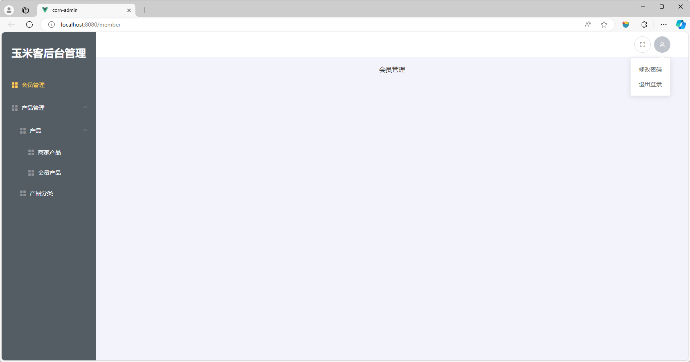
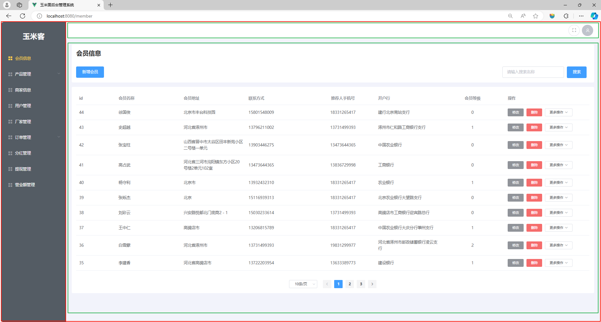
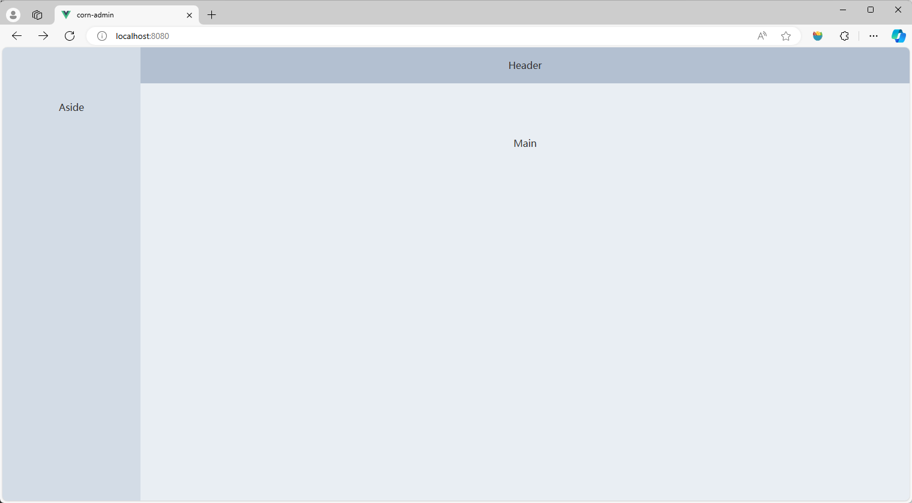
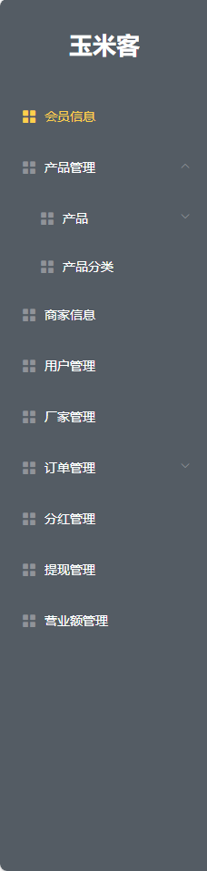
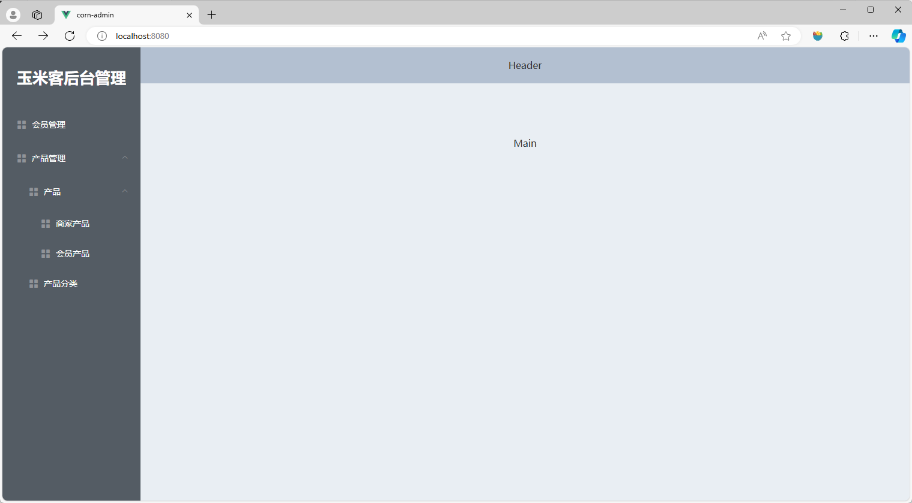
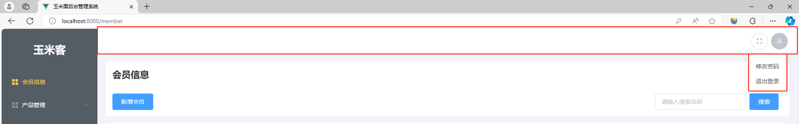
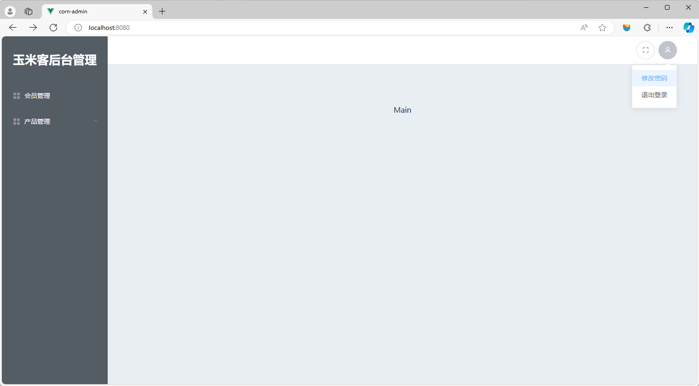
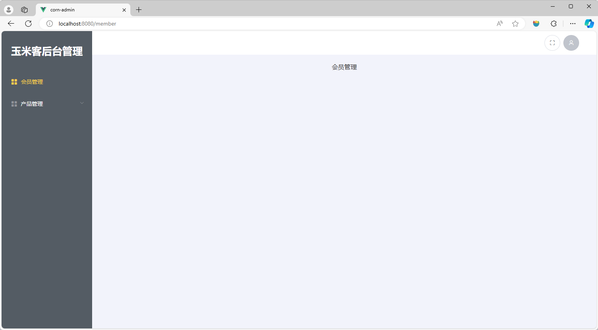
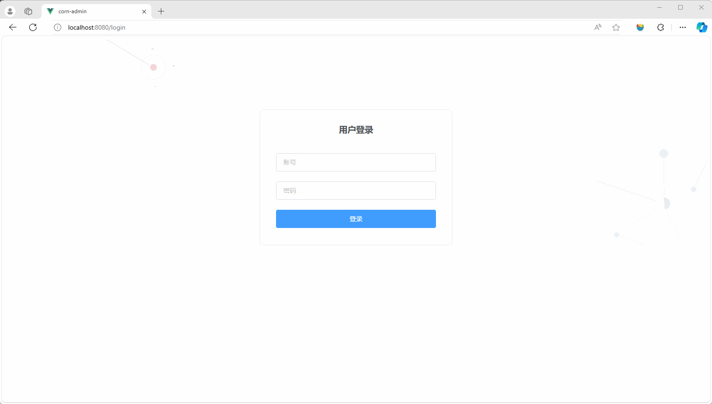

# 任务3 实现后台首页相关功能

## 3.1 任务描述

　　后台首页作为系统的中枢，承载着核心导航与页面展示的重要职责。在本项目的后台首页中包含导航栏、修改密码、退出操作和切换全屏显示功能。本任务将详细讲解如何构建“玉米客”项目的后台首页，并解析其各项功能的实现细节，旨在助力用户高效、安全地进行后台管理。

## 3.2 任务效果



## 3.3 学习目标

### 3.3.1 知识目标

- [ ] 了解后台管理系统中常见的页面布局方式
- [ ] 了解 VueRouter 中导航守卫的概念
- [ ] 了解 ElementUI 中布局容器组件的作用
- [ ] 了解 ElementUI 中导航菜单组件的作用
- [ ] 掌握 vue-fullscreen 全屏插件的使用方法
- [ ] 掌握 VueRouter 全局前置守卫的使用方法
- [ ] 掌握 VueRouter 中嵌套路由的配置方法

### 3.3.2 能力目标

- [ ] 能够使用布局组件快速搭建后台布局结构
- [ ] 能够使用全局前置守卫实现登录鉴权
- [ ] 能够使用 vue-fullscreen 插件实现网页全屏
- [ ] 能够使用嵌套路由实现子页面的展示

## 3.4 知识储备

### 1. ElementUI 布局容器

　　ElementUI布局容器是用于布局的容器组件，它基于flex布局，旨在帮助开发者快速搭建页面的基本结构。这种容器组件的设计使得开发者可以更加专注于功能的实现，而不需要花费过多的时间在布局上。

ElementUI的布局容器主要有以下几种：

- `<el-container>`：外层容器。
- `<el-header>`：顶栏容器。
- `<el-aside>`：侧边栏容器。
- `<el-main>`：主要区域容器。
- `<el-footer>`：底栏容器。

　　当子元素中包含 `<el-header>` 或 `<el-footer>` 时，全部子元素会垂直上下排列，否则会水平左右排列。同时，`<el-container>` 的子元素只能是后四者（`<el-header>`、`<el-aside>`、`<el-main>`、`<el-footer>`），而后四者的父元素也只能是 `<el-container>`。

**使用步骤**

使用ElementUI布局容器，可以按照以下步骤进行：

1. 首先，需要在项目中引入ElementUI库。
2. 然后，可以在Vue组件中使用这些布局容器。例如，可以在模板部分使用 `<el-container>`、`<el-header>`、`<el-aside>`、`<el-main>` 和 `<el-footer>` 这些标签来定义页面布局。
3. 还可以通过设置这些标签的属性来进一步控制它们的布局和行为。例如，开发者可以通过设置 `<el-col>` 组件的 `span` 属性来控制它在父容器中的宽度。
4. 最后，可以在 `<style>` 标签中设置CSS样式来进一步美化页面。

**常见后台首页布局示例**

```vue
<template>
	<div>
        <!-- 上下结构 -->
        <el-container>
          <el-header>Header</el-header>
          <el-main>Main</el-main>
        </el-container>
        
		<!-- 上中下结构 -->
        <el-container>
          <el-header>Header</el-header>
          <el-main>Main</el-main>
          <el-footer>Footer</el-footer>
        </el-container>

        <!-- 左右结构 -->
        <el-container>
          <el-aside width="200px">Aside</el-aside>
          <el-main>Main</el-main>
        </el-container>
        
		<!-- 上下结构，下面部分包含侧边栏和主体两部分 -->
        <el-container>
          <el-header>Header</el-header>
          <el-container>
            <el-aside width="200px">Aside</el-aside>
            <el-main>Main</el-main>
          </el-container>
        </el-container>

        <!-- 上下结构，下面部分包含侧边栏和主体区域，主体包含主体和底部 -->
        <el-container>
          <el-header>Header</el-header>
          <el-container>
            <el-aside width="200px">Aside</el-aside>
            <el-container>
              <el-main>Main</el-main>
              <el-footer>Footer</el-footer>
            </el-container>
          </el-container>
        </el-container>
		
        <!-- 左右结构，左侧为侧边栏，右侧为顶部和主体 -->
        <el-container>
          <el-aside width="200px">Aside</el-aside>
          <el-container>
            <el-header>Header</el-header>
            <el-main>Main</el-main>
          </el-container>
        </el-container>
		
        <!-- 左右结构，左侧为侧边栏，右侧为上中下结构 -->
        <el-container>
          <el-aside width="200px">Aside</el-aside>
          <el-container>
            <el-header>Header</el-header>
            <el-main>Main</el-main>
            <el-footer>Footer</el-footer>
          </el-container>
        </el-container>
    </div>
</template>
<style>
  .el-header, .el-footer {
    background-color: #B3C0D1;
    color: #333;
    text-align: center;
    line-height: 60px;
  }
  
  .el-aside {
    background-color: #D3DCE6;
    color: #333;
    text-align: center;
    line-height: 200px;
  }
  
  .el-main {
    background-color: #E9EEF3;
    color: #333;
    text-align: center;
    line-height: 160px;
  }
  
  body > .el-container {
    margin-bottom: 40px;
  }
  
  .el-container:nth-child(5) .el-aside,
  .el-container:nth-child(6) .el-aside {
    line-height: 260px;
  }
  
  .el-container:nth-child(7) .el-aside {
    line-height: 320px;
  }
</style>
```

### 2. NavMenu 导航菜单

　　NavMenu 是 ElementUI 中的 一个导航菜单组件，它提供了一组预定义的样式和交互行为，用于构建网站或应用的导航结构。使用 NavMenu 导航菜单可以帮助开发者快速构建清晰、用户友好的导航界面。

**NavMenu 导航菜单的优势**

1. **用户体验**：NavMenu 提供了统一的导航样式和交互行为，使用户能够轻松浏览网站或应用的不同页面和功能。
2. **快速开发**：ElementUI 已经为 NavMenu 设计了丰富的样式和交互效果，开发者只需要关注业务逻辑的实现，而不需要花费大量时间设计和编写导航菜单的样式和交互。
3. **可定制性**：NavMenu 支持丰富的属性和插槽（slot），可以根据具体需求进行定制，如修改菜单项的颜色、字体、图标等。

**导航菜单使用示例**

　　在已经安装好 ElementUI 的 Vue 项目的组件中，可以直接使用 ElementUI 提供的 `<el-menu>` 组件来创建导航菜单。以下是一个简单的示例：

```vue
<template>  
  <el-menu  
    background-color="#545c64"  
    text-color="#fff"  
    active-text-color="#ffd04b"  
    mode="horizontal"  
    @select="handleSelect"  
  >  
    <el-menu-item index="1">处理中心</el-menu-item>  
    <el-menu-item index="2">我的工作台</el-menu-item>  
    <el-submenu index="3">  
      <template slot="title">  
        导航三  
        <i class="el-icon-location"></i>  
      </template>  
      <el-menu-item index="3-1">选项1</el-menu-item>  
      <el-menu-item index="3-2">选项2</el-menu-item>  
    </el-submenu>  
    <el-menu-item index="4">导航四</el-menu-item>  
  </el-menu>  
</template>  
  
<script>  
export default {  
  methods: {  
    handleSelect(key, keyPath) {  
      console.log(key, keyPath);  
      // 在这里可以处理菜单项的点击事件，比如跳转到对应的路由  
    },  
  },  
};  
</script>  
  
<style scoped>  
/* 在这里可以添加一些样式来覆盖或扩展 ElementUI 的默认样式 */  
</style>
```

　　在上面的示例中，创建了一个水平模式的导航菜单，包含了几个菜单项和一个子菜单。还使用了一个名为 `handleSelect` 的方法来处理菜单项的点击事件。在这个方法中，可以执行任何需要的操作，比如跳转到对应的路由。

**`<el-menu>`组件常用属性如下**

|       属性名        |     类型     |                             说明                             |
| :-----------------: | :----------: | :----------------------------------------------------------: |
|       `mode`        |    String    |      导航菜单的模式，可选值为 'horizontal'、'vertical'       |
| `background-color`  |    String    |                       导航菜单的背景色                       |
|    `text-color`     |    String    |                      导航菜单的文本颜色                      |
| `active-text-color` |    String    |                   当前激活菜单项的文本颜色                   |
|  `default-active`   | String/Array |                   默认激活的菜单项的 index                   |
|      `router`       |   Boolean    | 是否使用 vue-router 的模式，启用后，需要在 `<el-menu-item>` 的 `index` 属性中指定路由地址 |

### 3. 嵌套路由

　　嵌套路由（Nested Routing）是 Vue Router 中的一个重要概念，它允许在一个组件内部渲染另一个路由组件，实现页面组件的嵌套渲染。这种功能在构建复杂的单页面应用（SPA）时非常有用，可以更好地组织和管理路由。

**嵌套路由的优势**

1. 清晰的页面结构和组织
   - 嵌套路由允许开发者将页面结构分解为更小、更易于管理的部分。开发者可以根据功能模块、页面功能等将路由进行分组和嵌套，使得整个后台管理系统的页面结构更加清晰和有条理。
2. 提高代码复用性
   - 在后台管理系统中，很多页面可能具有相似的布局或组件。通过使用嵌套路由，开发者可以在不同的父路由下复用相同的子路由组件，从而提高代码的复用性，减少重复代码。
3. 更好的用户体验
   - 嵌套路由可以帮助开发者创建更复杂的页面结构，为用户提供更加丰富的交互体验。例如，可以在左侧导航栏中点击一个菜单项，然后在右侧的内容区域展示与该菜单项相关的子页面或组件。这种布局方式在后台管理系统中非常常见，并且可以提高用户的工作效率。

**嵌套路由使用示例**

　　当访问 `/parent/child1` 时，将看到 `ParentComponent`页面 和嵌套的 `Child1Component`页面。访问 `/parent/child2` 时将看到 `ParentComponent`页面 和嵌套的 `Child2Component`页面。

**1. 定义组件**

　　在 Vue 应用程序中，首先定义一些 Vue 组件，这些组件将作为路由的视图来展示内容。在这个例子中，有三个主要的组件：`ParentComponent` 和它的两个子组件 `Child1Component`、`Child2Component`。代码如下。

> ParentComponent.vue

```vue
<template>  
  <div>  
    <h1>Parent Component</h1>  
    <router-link to="/parent/child1">Go to Child 1</router-link>  
    <router-link to="/parent/child2">Go to Child 2</router-link>  
    <router-view></router-view> <!-- 这里将渲染嵌套的子路由组件 -->  
  </div>  
</template>  
  
<script>  
export default {  
  name: 'ParentComponent'  
}  
</script>
```

>Child1Component.vue

```vue
<template>  
  <div>  
    <h2>Child 1 Component</h2>  
    <!-- 子组件内容 -->  
  </div>  
</template>  
  
<script>  
export default {  
  name: 'Child1Component'  
}  
</script>
```

> Child2Component.vue

（与 Child1Component 类似，但内容不同）

**2. 配置路由**

在路由配置中，定义了父路由和它的子路由。

- 父路由（`/parent`）：该路由映射到 `ParentComponent`。它还包含了一个 `children` 数组，用于定义嵌套的子路由。
- 子路由（`/parent/child1` 和 `/parent/child2`）：这些路由分别映射到 `Child1Component` 和 `Child2Component`。它们被定义在父路由的 `children` 数组中。

子路由的路径是相对于其父路由的路径的。因此，`/parent/child1` 实际上是指向 `/parent` 路径下的 `child1` 子路径。代码如下。

> router/index.js

```js
import Vue from 'vue'  
import VueRouter from 'vue-router'  
import ParentComponent from './components/ParentComponent.vue'  
import Child1Component from './components/Child1Component.vue'  
import Child2Component from './components/Child2Component.vue'  
  
Vue.use(VueRouter)  
  
const routes = [  
  {  
    path: '/parent',  
    component: ParentComponent,  
    children: [  
      {  
        path: 'child1',  
        component: Child1Component  
      },  
      {  
        path: 'child2',  
        component: Child2Component  
      },  
      // 如果希望 /parent/ 默认展示某个子路由，可以添加一个不带 path 的路由  
      // {  
      //   component: Child1Component  
      // }  
    ]  
  },  
  // 其他路由...  
]  
  
const router = new VueRouter({  
  routes // 等价于 routes: routes  
})  
  
export default router
```

**3. 使用路由**

　　在 `App.vue` 文件中，使用了 `<router-view>` 标签来渲染路由视图。由于 `ParentComponent` 是父路由的组件，因此 `<router-view>` 将渲染 `ParentComponent`。在 `ParentComponent` 内部，又有另一个 `<router-view>` 标签用于渲染嵌套的子路由组件（即 `Child1Component` 或 `Child2Component`）。

```vue
<template>  
  <div id="app">  
    <router-view></router-view> <!-- 这里将渲染 ParentComponent -->  
  </div>  
</template>  
  
<script>  
export default {  
  name: 'App'  
}  
</script>
```

　　上述步骤完成之后在浏览器中访问 `/parent/child1` 时，Vue Router 将渲染 `ParentComponent`，并在其内部的 `<router-view>` 中渲染 `Child1Component`。同样地，访问 `/parent/child2` 将渲染 `ParentComponent` 和 `Child2Component`。

### 4. 导航守卫

　　在 Vue.js 中，`vue-router` 的导航守卫主要用来在路由发生变化时执行一些操作，如检查用户是否登录、加载数据等。这些守卫提供了机会在导航确认前或后运行异步代码。

**导航守卫的优势**

1. 实现路由鉴权：导航守卫可以在路由切换之前进行一些操作，如验证用户的登录状态、权限控制等。例如，前置守卫（beforeEach）可以在跳转某个需要特定权限的路由时，检查用户是否具有足够的权限，如果没有则阻止路由跳转或重定向到登录页面。
2. 数据预取：在访问某个路由之前，开发者可能希望加载一些数据以确保页面渲染时具备所需的数据。前置守卫可以用来在路由切换之前触发数据加载的逻辑，从而提高用户体验和页面加载速度。
3. 路由跳转拦截：导航守卫还可以用于捕获导航行为并进行相应的操作。例如，在某些特定情况下，开发者可能希望阻止路由的切换或者进行一些额外的处理。通过使用导航守卫，开发者可以在路由切换之前进行一些必要的操作，以实现更好的用户体验和控制。
4. 异步解析执行：导航守卫是异步解析执行的，这意味着在导航完成之前，所有的守卫都会按照创建顺序依次调用并等待其解析完成。这种机制使得开发者可以更加灵活地控制路由的切换过程，尤其是在需要执行异步操作（如网络请求）的情况下。
5. 全局与局部的灵活性：Vue Router 提供了全局守卫（如全局前置守卫和全局后置守卫）和路由独享的守卫（beforeEnter）。全局守卫对所有路由都有效，而路由独享的守卫则只对特定路由有效。这种灵活性使得开发者可以根据实际需求来选择使用哪种类型的守卫。
6. 组件内的守卫：除了全局和路由独享的守卫外，Vue Router 还提供了组件内的守卫（如 beforeRouteEnter、beforeRouteUpdate 和 beforeRouteLeave）。这些守卫允许开发者在组件内部控制路由的切换过程，从而实现更加精细化的控制。

**常见守卫方式**

1. 全局前置守卫：`router.beforeEach`

   - 当一个导航触发时，全局前置守卫按照创建顺序调用。守卫是异步解析执行，此时导航在所有守卫 resolve 完之前一直处于 **等待中** 状态。

   - 使用方式：在 `router/index.js` 文件中使用 `router.beforeEach((to, from, next) => {})` 注册一个全局前置守卫。代码如下。
   
   ```js
   router.beforeEach((to, from, next) => {  
     // 假设有一个全局变量 isLoggedIn 表示用户是否登录  
     if (to.path !== '/login' && !isLoggedIn) {  
       // 如果用户未登录且访问的不是登录页面，则重定向到登录页面  
       next('/login');  
     } else {  
       // 否则继续导航  
       next();  
     }  
   });
   ```

2. 全局解析守卫：`router.beforeResolve`

   - 在导航被确认之前，同时在所有组件内守卫和异步路由组件被解析之后，解析守卫就被调用。
   - 使用方式与 `beforeEach` 类似，但它在组件解析之后调用。

   ```js
   router.beforeResolve((to, from, next) => {  
     // 这里可以在组件解析后执行一些操作  
     next();  
   });
   ```

3. 路由独享的守卫：在路由配置中直接定义 `beforeEnter` 守卫

   ```js
   const router = new VueRouter({  
     routes: [  
       {  
         path: '/foo',  
         component: Foo,  
         beforeEnter: (to, from, next) => {  
           // ...  
         }  
       }  
     ]  
   })
   ```

4. 组件内的守卫：

   - `beforeRouteEnter`
   - `beforeRouteUpdate`
   - `beforeRouteLeave`

   ```js
   export default {  
     beforeRouteEnter (to, from, next) {  
       // 在渲染该组件的对应路由被 confirm 前调用  
       // 不！能！获取组件实例 `this`  
       // 因为当守卫执行前，组件实例还没被创建  
     },  
     beforeRouteUpdate (to, from, next) {  
       // 在当前路由改变，但是该组件被复用时调用  
       // 举例来说，对于一个带有动态参数的路径 /foo/:id，在 /foo/1 和 /foo/2 之间跳转的时候，  
       // 由于会渲染同样的 Foo 组件，因此组件实例会被复用。而这个钩子就会在这个情况下被调用。  
       // 可以访问组件实例 `this`  
     },  
     beforeRouteLeave (to, from, next) {  
       // 导航离开该组件的对应路由时调用  
       // 可以访问组件实例 `this`  
     }  
   }
   ```

## 3.5 任务实施

### 子任务 3-1 搭建后台首页

　　后台首页整体分为三块内容分别是导航栏区域、头部区域、内容展示区域，每个区域的功能各不相同。本任务将会把首页以区域进行划分并以组件化的方式实现一个功能完备的后台首页。

#### 步骤一 搭建页面结构

**1. 设计图分析**

　　根据设计图可知后台整体布局为左右结构，在左侧结构中包含导航栏，在右侧结构中包含头部区域和页面展示区域。可以通过ElementUI组件库提供的 Container 容器布局快速实现整体布局。



**2. 代码实现**

- 使用 `el-container`标签作为整体容器
- 使用`el-aside`标签作为侧边栏
- 使用`el-container`标签包裹头部和内容展示区
- 使用`el-header`标签作为头部区域容器
- 使用`el-main`标签作为内容展示区域容器

> 文件路径：/src/layout/index.vue

```vue
<template>
  <el-container>
    <!-- 左侧导航栏区域 -->
  <el-aside width="230px">Aside</el-aside>
  <!-- 右侧展示区域 -->
  <el-container>
    <!-- 头部区域 -->
    <el-header>Header</el-header>
    <!-- 页面展示区域 -->
    <el-main>Main</el-main>
  </el-container>
</el-container>
</template>

<style lang="scss" scoped>
  .el-header {
    background-color: #B3C0D1;
    color: #333;
    text-align: center;
    line-height: 60px;
  }
  
  .el-aside {
    background-color: #D3DCE6;
    color: #333;
    text-align: center;
    line-height: 200px;
  }
  
  .el-main {
    background-color: #E9EEF3;
    color: #333;
    text-align: center;
    line-height: 160px;
  }
  .el-container {
  height: 100vh;
}
</style>
```

**3. 效果预览**



#### 步骤二 制作导航栏

　　左侧区域主要包含了导航栏，可以通过点击导航实现页面切换。为了提高代码的可维护性，后续各个区域的代码将以组件化的形式编写，使代码结构更加清晰。

**1.设计图分析**

　　通过设计图可知，左侧导航栏区域包含后台标题和页面导航栏。后台标题可使用 div 标签实现。导航栏要展示当前导航的文字和图标并且二级导航可展开和收起。可以通过ElementUI组件库中的 NavMenu 导航菜单组件快速实现。



**2.代码实现**

　　在 src/layout 目录下新建 Aside 目录用于存放左侧导航区域组件。在 Aside 目录下新建 `index.vue`左侧布局组件和 `menu.vue` 导航组件，`index.vue`用于存放标题和导航，可在`src/layout/index.vue`组件中引入此组件，实现展示效果。在`src/layout/Aside/index.vue`左侧布局组件则需要引用 `menu.vue`导航组件，如果有二级导航则在`menu.vue`组件中继续调用`menu.vue`组件实现循环嵌套。导航栏数据可以根据设计图编写，将导航数据定义到`index.vue`中保存，实现动态渲染导航。部分代码如下：

　　在`src/layout/index.vue`中引入 `Aside` 侧边栏组件进行占位。

> 文件路径：src/layout/index.vue
>
> Template 部分

```vue
    <!-- 左侧导航栏区域 -->
  <el-aside width="230px">
    <Aside></Aside>
  </el-aside>
```

> JavaScript 部分

```html
<script>
// 引入 Aside 布局组件
import Aside from "./Aside/index.vue";
export default {
components: { Aside },
}
</script>
```

> CSS 部分

```scss
  .el-aside {
    background-color: #D3DCE6;
    color: #333;
    line-height: 200px;
  }
```

在`src/layout/Aside/index.vue`侧边栏组件中编写标题区域和导航占位组件。

> 文件路径：src/layout/Aside/index.vue
>
> Template 部分

```vue
<template>
  <div class="content">
    <div class="chart">玉米客后台管理</div>
    <el-menu :default-active="$route.path" background-color="#545c64" text-color="#fff"
      router active-text-color="#ffd04b">
      <MenuItem v-for="item in menuList" :key="item.path" :data="item">
      </MenuItem>
    </el-menu>
  </div>
</template>
```

> JavaScript 部分

```vue
<script>
import MenuItem from "./menu.vue";

export default {
  name: "AdminIndex",
  components: { MenuItem },
  data() {
    return {
      // TODO 数据的方式去驱动
      menuList: [
        
        // 会员管理
        {
          path: "/member",
          title: "会员管理",
          icon: "el-icon-menu",
        },
        // 产品管理
        {
          path: "/authorityMan",
          icon: "el-icon-menu",
          title: "产品管理",
          children: [
            // 商家管理
            {
              path: "/productsMans/business",
              title: "产品",
              icon: "el-icon-menu",
              children: [
                // 商家产品
                {
                  path: "/productsMans/business/businessProduct",
                  title: "商家产品",
                  icon: "el-icon-menu",
                },
                // 会员产品
                {
                  path: "/productsMans/business/memberListProduct",
                  title: "会员产品",
                  icon: "el-icon-menu",
                },
              ],
            },
            // 产品分类
            {
              path: "/productsMans/productclassify",
              title: "产品分类",
              icon: "el-icon-menu",
            },
          ],
        },
      ],
    };
  },
};
</script>
```

　　在上述代码中的导航数据仅为一部分用来测试，在后面的课程中会陆续添加导航数据。

> CSS 部分

```scss
<style lang="scss" scoped>
.content {
  width: 100%;
  height: 100%;

  .chart {
    width: 100%;
    height: 100px;
    display: flex;
    align-items: center;
    justify-content: center;
    color: #fff;
    background: #545c64;
    font-weight: bold;
    font-size: 26px;
  }
}

.el-menu {
  height: calc(100% - 100px);
  border: 0 !important;
}
</style>
```

　　在导航组件中使用 `v-if` 指令来判断是否应该渲染一个子菜单（`el-submenu`）还是一个普通的菜单项（`el-menu-item`）。如果 `data` 存在、`data.children` 也存在并且 `data.children` 的长度大于 0，则渲染 `el-submenu`子菜单。如果不满足上述条件（即 `data` 不存在、`data.children` 不存在或 `data.children` 为空数组），则渲染 `el-menu-item`普通菜单项。


> 文件路径：src/layout/Aside/menu.vue
>
> Template 部分

```vue
<template>
    <div>
        <el-submenu :index="data.path" v-if="data && data.children && data.children.length > 0">
            <template slot="title">
                <i :class="data.icon"></i>
                <span slot="title">{{ data.title }}</span>
            </template>
            <MenuItem v-for="item in data.children" :key="item.path" :data="item">
            </MenuItem>
        </el-submenu>
        <el-menu-item :index="data.path" v-else>
            <i :class="data.icon"></i>
            <span slot="title">{{ data.title }}</span>
        </el-menu-item>
    </div>
</template>
```

> JavaScript 部分

```vue
<script>
import MenuItem from "./menu.vue"
export default {
    name: "MenuItem",
    components: { MenuItem },
    props: {
        data: {
            default: () => null,
            type: Object
        }
    }
};
</script>
```

**3.效果预览**



#### 步骤三 制作头部区域

　　头部区域包含用户头像、全屏切换、退出登录等功能。在步骤一中已将整体页面结构搭建完毕，现在只需将头部区域代码封装为单独的组件并导入到`src/layout/index.vue`组件中即可。

**1. 设计图分析**

　　根据设计图可知头部区域包含一个全屏切换按钮和下拉菜单，可以使用ElementUI组件库提供的`button`组件和`dropdown`组件实现。



**2. 代码实现**

　　在`src/layout`目录下新建`Header`目录，用来存放头部组件。当组件编写完毕再引入到`src/layout/index.vue`首页组件中即可。

　　头部部分可使用两个`span`标签作为容器，通过`flex`布局的方式设置元素两端对齐，第一个`span`标签仅为占位，第二个`span`标签内放置ElementUI组件库中的`button`按钮组件和下拉菜单组件即可实现页面效果。代码如下。

> 文件路径：/src/layout/Header/index.vue
>
> Template 部分

```vue
<template>
  <div class="header-container">
    <!-- 区域占位符 -->
    <span> </span>
    <!-- 右侧内容区 -->
    <span>
      <!-- 全屏按钮 -->
      <el-button
        class="icon-item"
        icon="el-icon-full-screen"
        circle
       
      ></el-button>
      <!-- 下拉菜单 -->
      <el-dropdown class="icon-item" @command="handleCommand">
        <el-avatar><i class="el-icon-user"></i></el-avatar>
        <el-dropdown-menu slot="dropdown">
          <el-dropdown-item command="changePassword">修改密码</el-dropdown-item>
          <el-dropdown-item command="loginOut">退出登录</el-dropdown-item>
        </el-dropdown-menu>
      </el-dropdown>
    </span>
  </div>
</template>
```

　　上述代码中为下拉菜单绑定了`command`事件，当点击修改密码时会触发`handleCommand`函数并且把`changePassword`作为参数传递。点击退出登录时也会触发`handleCommand`函数并且把`loginOut`作为参数传递。可以在`handleCommand`函数中判断点击的是哪个按钮，从而做对应的操作。JavaScript代码如下。

>JavaScript 部分

```html
<script>
export default {
  name: "AdminLayoutHeader",
  methods: {
    handleCommand(e) {
      switch (e) {
        case "changePassword":
          console.log('点击了修改密码')
          break;
        case "loginOut":
          console.log('点击了退出登录')
          break;

        default:
          break;
      }
    }
  }

};
</script>
```

> CSS 部分

```vue
<style lang="scss" scoped>
.header-container {
  box-sizing: border-box;
  width: 100%;
  height: 100%;
  display: flex;
  align-items: center;
  justify-content: space-between;
  padding: 0 24px;

  > span {
    display: flex;
    align-items: center;
  }

  .icon-item {
    margin-left: 8px;
    height: 40px;
  }
}
</style>
```

　　Header组件制作完毕要引入到后台首页组件中并且修改`.el-header`的背景色为白色。代码如下。

> 文件路径：src/layout/index.vue
>
> Template 部分

```vue
<!-- 省略其它代码 -->
	<el-header>
      <Header></Header>
    </el-header>
<!-- 省略其它代码 -->
```

> JavaScript 部分

```vue
<script>
// 引入 Aside 布局组件
import Aside from "./Aside/index.vue";
// 引入 Header 组件
import Header from "./Header/index.vue";
export default {
	components: { Aside,Header },
}
</script>
```

> CSS 部分

```css
  .el-header {
    background-color: #fff;
    color: #333;
    text-align: center;
    line-height: 60px;
  }
```

**3. 效果预览**



#### 步骤四 制作页面展示区域

　　内容展示区域的功能是展示导航对应的组件，将来点击左侧导航时，会将对应的页面展示到内容展示区域。此步骤将以点击`会员管理`导航为例，将会员管理的页面显示到此处。

**1. 创建页面文件**

　　新建会员管理页面文件，在`src/views`目录下新建`BmMan`目录，在`BmMan`目录中新建`member`目录，在`member`目录中新建`index.vue`，完整路径为`src/views/BmMan/member/index.vue`。代码如下。

注意：路径较长的原因是后续会有不同的组件按功能划分到不同的目录。

> 文件路径：src/views/BmMan/member/index.vue

```vue
<template>
  <div>
    会员管理
  </div>
</template>
```

**2. 配置路由规则**

　　在`src/router/index.js`路由文件中添加路由规则。因为当前的后台首页的URL为`/`同`localhost:8080/`，现在要将页面在`/`对应的页面中显示，此时就形成了嵌套路由。所以在添加规则时要将会员管理的路由添加为`/`的子路由。代码如下。

> 文件路径：src/router/index.js

```js
{
    // 当访问地址为 http://localhost:8080/ 时，对应的页面为 layout/index.vue
    path: '/',
    name: 'layout',
    component: ()=>import('@/layout/index'),
    children:[
      // 会员管理            
      {
        path: "member",
        name: "member",
        component: () => import("@/views/BmMan/member/index.vue"),
      }
    ]
  },
```

**3. 设置路由出口**

　　路由设置完毕之后，还需要对应的路由出口才可以显示出对应的页面。在`src/layout`目录下新建`Main`目录，用于存放路由出口组件文件，在`Main`目录中新建`index.vue`组件编写路由出口即Vue内置组件`<router-view>`。编写完毕之后引入到`src/layout/index.vue`后台首页组件即可。代码如下。

> 文件路径：src/layout/Main/index.vue

```vue
<template>
      <!-- 内容区域 -->
    <router-view></router-view>
</template>
```

> 文件路径：src/layout/index.vue
>
> Template 部分

```vue
<!-- 页面展示区域 -->
<el-scrollbar class="main-scrollbar">
    <el-main>
      <Main></Main>
    </el-main>
</el-scrollbar>
```

　　在上述代码中加入了`el-scrollbar`滚动组件，加入滚动组件的目的是因为开发到后面功能时，有的内容会比较多，因此会产生滚动。为视图区域加上滚动组件代表着将来只有此区域可以滚动。

> JavaScript 部分

```vue
<script>
// 引入 Aside 布局组件
import Aside from './Aside/index.vue'
import Header from './Header/index.vue'
import Main from './Main/index.vue'
export default {
  components: { Aside, Header, Main }
}
</script>
```

> CSS 部分

```scss
.el-main {
  background-color: #F2F3FB;
  color: #333;
  text-align: center;
}

.main-scrollbar {
  width: calc(100vw - 230px);
  height: calc(100vh - 60px);
  box-sizing: border-box;
  background-color: #f2f3fb;
}

```

　　因为上述代码中加入了滚动条组件，所以在页面底部有默认的横向滚动条样式，需要将其隐藏。在`src/App.vue`根组件中修改CSS，加入清除默认边距样式和隐藏滚动条样式。代码如下。

> 文件路径：src/App.vue

```vue
<style lang="scss">
/*清除默认样式*/
* {
  margin: 0;
  padding: 0;
}
/* 为根元素加入默认样式 */
#app {
  min-height: 100vh;
  margin: 0;
  padding: 0;
  box-sizing: border-box;
}
/* 滚动条样式设置 */
.el-scrollbar {
  .el-scrollbar__wrap {
    overflow-x: hidden;

    .el-scrollbar__view {
      height: 100%;
    }
  }
}

</style>
```

**4. 页面预览**

　　在后台首页中点击会员管理查看效果。



### 子任务 3-2 实现后台首页相关功能

　　用户未登录的情况下不能访问后台首页，需要配置路由的导航守卫进行鉴权。已登录的情况下用户点击全屏按钮可以将网站设置为全屏，当鼠标移动到头像时可以修改密码和退出登录，本任务会通过四个步骤为读者详细介绍。

#### 步骤一 配置导航守卫

　　在用户未登录的情况下不能访问后台首页及其内容，所以需要使用导航守卫进行权限验证。

**1. 逻辑分析**

　　用户登录成功之后会将登录凭证保存到本地存储，当用户访问非登录页时，需要对其进行登录凭证的验证。如果已登录正常访问页面，如未登录跳转至登录页让用户登录。

**2. 代码实现**

　　在实际中路由会对每个路由都进行验证，因此可以使用全局前置守卫处理登录验证逻辑。代码如下。

> 文件路径：/src/router/index.js

```js
// 省略其它代码
router.beforeEach((to, from, next) => {
    let token = localStorage.getItem("token");
    if (!token && to.path !== "/login") {
        next({ path: "/login" });
    }
    return next(true);
});

export default router;
```

　　编写完毕之后可清空本地存储中的token信息进行测试，测试时可发现登录成功之后后台首页`Main`内容显示的部分并没有显示内容，可以对`/`路由规则中添加`redirect`属性，使其登录成功之后显示默认页面。代码如下。

> 文件路径：/src/router/index.js

```js
// 省略其它代码
{
    // 当访问地址为 http://localhost:8080/ 时，对应的页面为 layout/index.vue
    path: '/',
    name: 'layout',
    component: ()=>import('@/layout/index'),
    redirect:'member',  // 登录首页时默认显示 member 会员管理页面
    children:[
      // 会员管理            
      {
        path: "member",
        name: "member",
        component: () => import("@/views/BmMan/member/index.vue"),
      }
    ]
  },
// 省略其它代码    
```

**3. 效果预览**



#### 步骤二 实现修改密码功能

　　用户已登录的情况下，可以点击修改密码可对当前密码进行修改。

**1. 逻辑分析**

　　用户点击修改密码弹出修改密码的对话框，用户要重新输入新密码并对其进行规则验证，验证通过点击确定即可完成密码的修改。

**2. 接口分析**

　　想要实现修改功能需要使用后端提供的修改密码接口，接口详情如下。

- API地址：{{API_HOST}}/admin/auth/updatePassword
- API请求方式：POST
- API请求参数：见下表

| 参数字段名 | 数据类型 |  说明  |
| :--------: | :------: | :----: |
|     id     |  Number  | 用户id |
|  password  |  String  | 新密码 |

　　API 返回的响应数据示例如下。

```json
{
    "success":true,
    "code":200,
    "message":"请求成功"
}
```

**3. 代码实现**

　　在`src/api/user/index.js`处理用户相关接口的文件中封装修改密码接口。代码如下。

```js
// 省略其它代码
// 修改密码
export function updatePassword(data) {
    return request({
        url: '/admin/auth/updatePassword',
        method: 'POST',
        data
    })
}

```

　　在`Header`组件中引入修改密码方法，在`methods`节点中编写`handlechangePassword`方法，当点击修改密码时会调用`handlechangePassword`方法，在方法中使用`ElementUI`组件库中的`MessageBox`提交内容框，点击确认按钮时，调用修改密码接口修改密码。代码如下。

> 文件路径：src/layout/Header/index.vue
>
> JavaScript 部分

```js
// 引入 修改密码接口方法
import { updatePassword } from '@/api/user/index'
export default {
  name: 'AdminLayoutHeader',
  methods: {
    handleCommand(e) {
      switch (e) {
        case 'changePassword':
          // 调用 handlechangePassword 修改密码方法
          this.handlechangePassword()
          break
        case 'loginOut':
          console.log('点击了退出登录')
          break

        default:
          break
      }
    },
      // 修改密码
    handlechangePassword() {
      // ElementUI中 MessageBox 框
      this.$prompt('请输入密码', '修改密码', {
        confirmButtonText: '确定',
        cancelButtonText: '取消',
        inputPattern: /^[^\s]{6,}$/, // 正则表达式，密码至少6位，且不能包含空格
        inputErrorMessage: '密码不能少于6位且不能包含空格',
        inputType: 'password' // 将输入框设置为密码框
      })

        .then(async ({ value }) => {
          // 获取本地存储中的用户信息，用于发送请求
          let user = localStorage.getItem('user')
          user = JSON.parse(user)
          let id = user.id
          // 调用修改密码接口
          let res = await updatePassword({
            id: id,
            password: value
          })
          // 如果请求成功，弹出密码修改成功
          if (res.success) {
            this.$message({
              type: 'success',
              message: '密码修改成功'
            })
          }
        })
        // 点击叉号代表取消密码修改
        .catch(() => {
          this.$message({
            type: 'info',
            message: '取消密码修改'
          })
        })
    }
  }
}
```

代码编写完毕可点击修改密码进行测试。

#### 步骤三 实现全屏显示功能

　　用户点击全屏按钮可将网页设置为全屏，全屏可提升用户体验，使用户充分利用屏幕空间将内容充分展示在用户的眼前。

　　实现网页全屏可使用`vue-fullscreen`插件实现。

**1. 安装vue-fullscreen**

在项目根目录中打开终端命令行输入以下命令进行安装。

```shell
npm install vue-fullscreen
```

**2. 引入vue-fullscreen**

在`main.js`中引入并注册为插件。代码如下。

> 文件路径：src/main.js

```js
import VueFullscreen from 'vue-fullscreen'
Vue.use(VueFullscreen) // 将全屏插件注册为vue插件
```

**3. 在组件中使用**

在`src/layout/Header/index.vue`中为全屏按钮添加点击事件并在事件处理函数中调用全屏插件实现全屏。代码如下。

> 文件路径：src/layout/Header/index.vue
>
> Template 部分

```vue
      <el-button
        class="icon-item"
        icon="el-icon-full-screen"
        circle
        @click="handleFullScreen"
      ></el-button>
```

> JavaScript 部分

```js
// 省略其它代码
methods:{
    //省略其它代码
    handleFullScreen(){
      this.$fullscreen.toggle()
    }
}
//省略其它代码
```

代码编写完毕可点击全屏按钮进行测试。

#### 步骤四 实现退出登录功能

　　用户点击下拉菜单中的退出登录按钮可退出网站。

**1. 逻辑分析**

　　当用户点击退出登录按钮时，清空本地存储中的用户信息并跳转至登录页面。

**2. 代码实现**

　　使用`localstroage.remove`方法清空本地存储中的 token 数据，使用`$router.push`跳转至登录页面。代码如下。

> 文件路径：src/layout/Header/index.vue
>
> JavaScript 部分

```js
methods:{
    handleCommand(e) {
      switch (e) {
        case 'changePassword':
          this.handlechangePassword()
          break
        case 'loginOut':
          // 点击退出登录按钮时触发 handleLoginOut 函数
          this.handleLoginOut()
          break

        default:
          break
      }
    },
    // 退出登录方法
    handleLoginOut(){
        // 清除本地存储中的token数据
      localStorage.removeItem('token')
        // 跳转至登录页
      this.$router.push('/login')
    },
}
```

代码编写完毕可点击退出登录按钮进行测试。