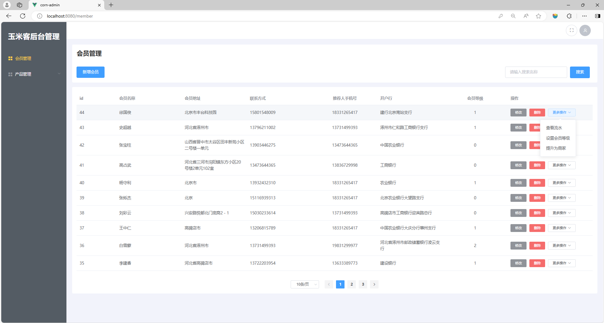
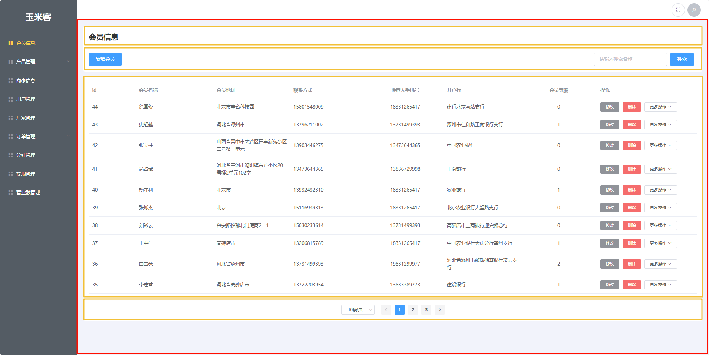
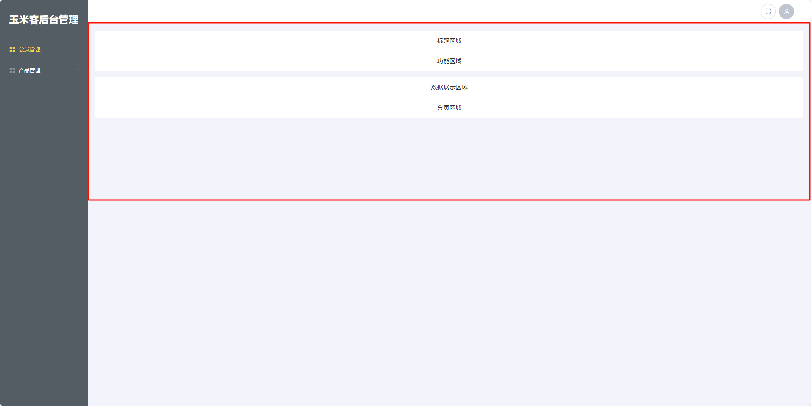
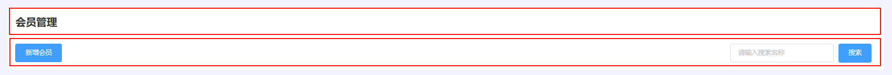
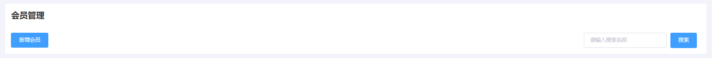
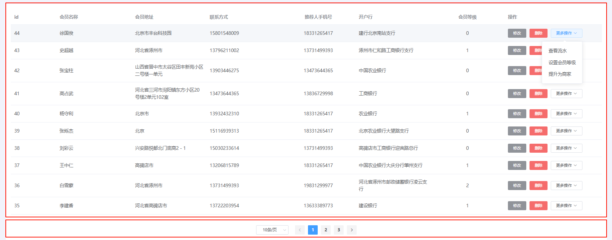
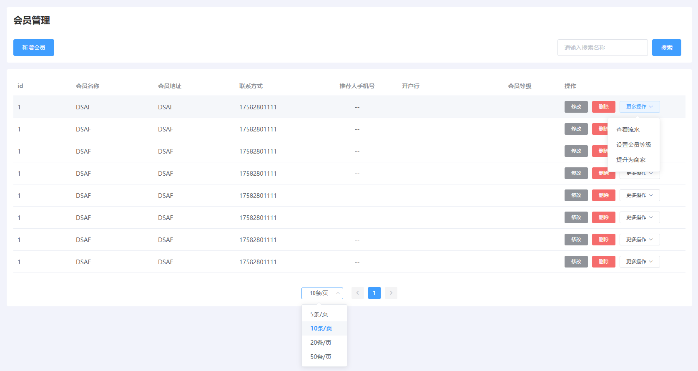
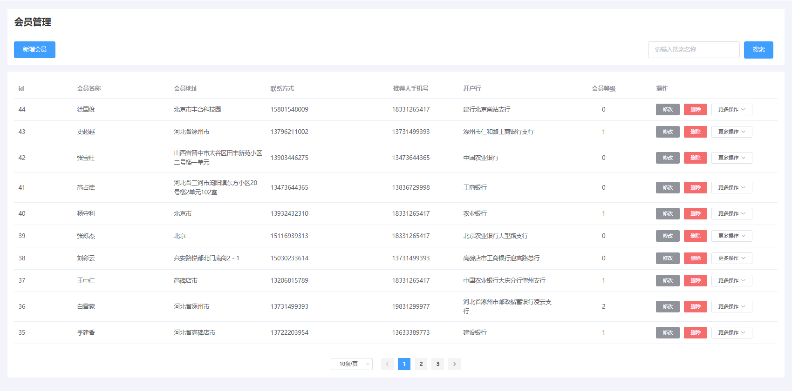

# 任务4 实现会员管理功能

## 4.1 任务描述

　　本任务将实现“玉米客”后台管理项目中的会员管理功能。管理员点击左侧会员管理导航时可以展示出对应的会员管理页面。会员管理模块需要实现的功能包括制作页面、展示会员列表、增删查改会员数据、查看会员流水、设置会员等级以及设置会员为商家功能。

## 4.2 任务效果



## 4.3 学习目标

### 4.3.1 知识目标

- [ ] 了解 Mixins 的应用场景
- [ ] 了解 Lodash工具库的作用
- [ ] 掌握 Dialog 组件的使用方法
- [ ] 掌握 Pagination 组件的使用方法

### 4.3.2 能力目标

- [ ] 能够使用 Dialog 组件实现弹出窗口
- [ ] 能够使用 Pagination 组件实现数据分页
- [ ] 能够使用 clone 方法实现对象浅拷贝
- [ ] 能够使用 Mixins 封装通用型代码

## 4.4 知识储备

### 1. Lodash

　　Lodash 是一个功能丰富的 JavaScript 实用工具库，它提供了很多实用的编程函数，能够简化日常开发中的常见任务，如数组操作、对象处理、字符串处理等。Lodash 的设计哲学是提高代码的可读性和性能，同时减少错误。

中文文档：https://www.lodashjs.com/

**1. 使用 Lodash 的好处**

- 简化代码：Lodash 提供了大量现成的函数，可以减少编写重复代码的需求。
- 提高代码可读性：使用 Lodash 的函数可以使代码更加简洁和易于理解。
- 跨浏览器兼容性：Lodash 抽象了许多浏览器之间的差异，使得代码在不同浏览器中运行更加一致。
- 性能优化：Lodash 的一些函数是经过优化的，可以提供更好的性能。
- 丰富的功能：Lodash 提供了从简单的数组操作到复杂的函数编程技术等多种功能。

**2. 使用示例** 

首先，需要在项目中安装 Lodash。可以通过 npm 或 yarn 来安装。

```shell
npm install lodash --save
# 或者
yarn add lodash
```

创建一个 `value` 的浅拷贝。

```js
import _ from 'lodash'
let objects = [{ 'a': 1 }, { 'b': 2 }];
 
let shallow = _.clone(objects);
console.log(shallow[0] === objects[0]);
// => true
```

创建一个 `value` 的深拷贝。

```js
import _ from 'lodash'
let objects = [{ 'a': 1 }, { 'b': 2 }];
 
let deep = _.cloneDeep(objects);
console.log(deep[0] === objects[0]);
// => false
```

### 2. Mixins

　　Mixins 是一种面向对象编程中的概念，允许对象从多个其他对象中继承属性和方法。在 JavaScript 框架中，尤其是在 Vue.js 中，Mixins 被用作一种代码复用的技术。通过 Mixins，你可以将一组组件中通用的逻辑提取到一个独立的模块，然后在不同的组件中重复使用这个模块。

**1. Mixins 的用途**

- 代码复用：在多个组件中共享相同的逻辑。
- 逻辑分离：将组件的核心逻辑与辅助功能分开，使代码更易于维护和阅读。
- 增强功能：为组件添加额外的功能而不需要修改组件本身。

**2. 在Vue项目中使用 Mixins**

　　在 Vue 2 中，Mixins 是一个对象，包含了和组件相同的选项（如 `data`、`methods`、`created` 等）。当组件使用 Mixins 时，Mixin 中的选项将被“混合”到组件自身的选项中。

使用步骤如下：

（1）定义一个 Mixin

```js
// myMixin.js
export const myMixin = {
  data() {
    return {
      mixinData: 'This is mixin data'
    };
  },
  created() {
    console.log('Mixin hook called');
  },
  methods: {
    mixinMethod() {
      console.log('Mixin method called');
    }
  }
};

```

（2）在组件中引入和使用 Mixin

  　　使用 `mixins` 选项将 Mixin 引入组件。

```vue
// MyComponent.vue
<template>
  <div>
    <p>{{ mixinData }}</p>
    <button @click="mixinMethod">Call Mixin Method</button>
  </div>
</template>

<script>
import { myMixin } from './myMixin.js';

export default {
  mixins: [myMixin],
  data() {
    return {
      componentData: 'This is component data'
    };
  },
  created() {
    console.log('Component hook called');
  },
  methods: {
    componentMethod() {
      console.log('Component method called');
    }
  }
};
</script>

```

在上述示例中：

- `myMixin` 定义了一些 `data` 属性和 `methods`，并在 `created` 钩子中添加了一些逻辑。
- `MyComponent` 引入了 `myMixin`，因此可以访问 `mixinData` 和 `mixinMethod`。
- 当组件创建时，`created` 钩子中的逻辑会首先执行 `myMixin` 的，然后执行组件自己的逻辑。这表明钩子函数的执行顺序是先 Mixin 后组件。

### 3. 弹出窗口组件

　　弹出窗口组件指的是 Element UI 组件库中的弹出框 `el-dialog` 组件，它用于创建模态对话框（Modal）。

**1. Element UI 弹出框组件的好处：**

- 组件化：弹出框作为一个独立的组件，可以方便地在任何需要的地方插入和使用。

- 可配置性：提供了丰富的属性和事件，可以根据需要定制弹出框的标题、内容、尺寸、位置等。

- 易用性：Element UI 的 API 设计简洁直观，易于理解和使用。

- 样式一致性：Element UI 提供了统一的样式和主题，保证了弹出框与应用其他部分的一致性。

- 交互性：支持多种交互操作，如点击遮罩层关闭、键盘操作、动画效果等。

- 可访问性：符合无障碍访问标准，提升了应用的可访问性。

**2. 使用 Element UI 的弹出框组件**

确保你的项目中已经安装并引入了 Element UI。

```shell
npm install element-ui --save
# 或者
yarn add element-ui
```

在项目的入口文件（如 main.js）中全局引入 Element UI。

```js
import Vue from 'vue';
import ElementUI from 'element-ui';
import 'element-ui/lib/theme-chalk/index.css';

Vue.use(ElementUI);
```

在 Vue 组件的模板中使用 `<el-dialog>` 标签来创建弹出框。

```vue
<template>
  <div>
    <el-button @click="dialogVisible = true">打开弹出框</el-button>
    <el-dialog
      title="提示"
      :visible.sync="dialogVisible"
      width="30%"
      :before-close="handleClose">
      <span>这是一段信息</span>
      <span slot="footer" class="dialog-footer">
        <el-button @click="dialogVisible = false">取 消</el-button>
        <el-button type="primary" @click="dialogVisible = false">确 定</el-button>
      </span>
    </el-dialog>
  </div>
</template>

<script>
export default {
  data() {
    return {
      dialogVisible: false
    };
  },
  methods: {
    handleClose(done) {
      this.$confirm('确认关闭？')
        .then(_ => {
          done();
        })
        .catch(_ => {});
    }
  }
};
</script>
```

**常用参数示例**

| 参数    | 说明                               | 类型    | 可选值 | 默认值 |
| :------ | :--------------------------------- | :------ | :----- | :----- |
| visible | 是否显示 Dialog，支持 .sync 修饰符 | boolean | —      | false  |
| title   | Dialog 的标题                      | string  | —      | —      |
| width   | Dialog 的宽度                      | string  | —      | 50%    |
| modal   | 是否需要遮罩层                     | boolean | —      | true   |

### 4. 生命周期

　　Vue 的生命周期指的是 Vue 实例从创建到销毁的整个过程。在这个过程中，Vue 会经历一系列的状态变化，并且会在特定的时刻触发一些钩子函数，这些钩子函数被称为生命周期钩子（Lifecycle Hooks）。开发者可以在这些钩子函数中执行特定的代码，以实现对 Vue 实例状态变化的响应和控制。

Vue  的生命周期钩子主要包括以下几种：

1. beforeCreate：在实例初始化之后，数据观测（data observer）和 event/watcher 事件配置之前被调用。此时，`data` 属性和 `methods` 都还不可访问。
2. created：在实例创建完成后被立即调用，此时 Vue 实例的挂载元素 `$el` 还没有被创建。在这个阶段，Vue 实例的数据观测和事件/侦听器的配置已经完成，`data` 属性和 `methods` 可以被访问。
3. beforeMount：在挂载开始之前被调用。相关的 `render` 函数首次被调用，`$el` 属性还没有初始化。
4. mounted：Vue 实例被挂载到 DOM 上后调用。此时，可以访问到 DOM 元素。
5. beforeUpdate：在数据更新之前调用，发生在虚拟 DOM 重新渲染和打补丁之前。这个钩子是依赖于 Vue 的响应系统和 `dirty` 检测机制。
6. updated：在由于数据更改导致的虚拟 DOM 重新渲染和打补丁后调用。
7. beforeDestroy：在 Vue 实例销毁之前调用。在这一步，实例仍然完全可用。
8. destroyed：Vue 实例销毁后调用。在这一步，Vue 实例的 `$el` 已经被销毁。

**使用示例**

1. 使用 `created` 钩子进行数据请求。

```js
export default {
  created() {
    this.fetchData();
  },
  methods: {
    fetchData() {
      // 执行异步数据请求
      axios.get('/api/data')
        .then(response => {
          this.items = response.data;
        })
        .catch(error => {
          console.error('请求数据失败:', error);
        });
    }
  }
};
```

2. 使用 `mounted` 钩子操作 DOM。

```js
export default {
  mounted() {
    // 直接使用 this.$el 访问 DOM 元素
    this.$el.addEventListener('click', this.handleClick);
  },
  methods: {
    handleClick(event) {
      // 处理点击事件
      console.log('Element clicked:', event.target);
    }
  },
  beforeDestroy() {
    // 清理事件监听器
    this.$el.removeEventListener('click', this.handleClick);
  }
};
```

3. 使用 `beforeDestroy` 和 `destroyed` 钩子进行资源清理。

```js
export default {
  data() {
    return {
      timerId: null
    };
  },
  created() {
    this.timerId = setInterval(this.tick, 1000);
  },
  beforeDestroy() {
    // 在组件销毁前清除定时器
    if (this.timerId) {
      clearInterval(this.timerId);
    }
  },
  destroyed() {
    console.log('Component destroyed');
  },
  methods: {
    tick() {
      // 更新时间或其他数据
    }
  }
};
```

## 4.5 任务实施

### 子任务 4-1 制作会员管理页面

　　本任务将制作会员管理页面，会员管理页面主要展示了会员相关的数据。用户可以在会员管理页面对会员数据进行管理如添加会员、搜索会员、删除会员、编辑会员。在数据表格中的更多操作下拉菜单中包含查看流水、设置会员等级和提升为商家的功能。本任务将通过三个步骤详细讲解制作会员管理页面。

#### 步骤一 页面结构分析与搭建

**1. 设计图分析**

　　根据设计图可知页面可以按页面内容划分为四个区域、分别是标题区域、功能区域、数据展示区域和分页区域。



**2. 代码实现**

　　使用div标签作为四个区域的包裹容器，代码如下。

> 文件路径：src/views/BmMan/member/index.vue
>
> Template 部分

```vue
<template>
  <div>
    <div class="pageMixin-container">
      <!-- 标题区域 -->
      <div class="head-container">
        标题区域
      </div>
      <!-- 功能区域 -->
      <div class="search-container">
        功能区域
      </div>
      <!-- 数据展示区域 -->
      <div class="table-container">
          数据展示区域
      </div>
      <!-- 分页区域 -->
      <div class="pagination-container">
          分页区域
      </div>
    </div>
  </div>
</template>
```

　　在本项目的后台管理系统中，鉴于所有页面拥有统一的页面结构，为了降低代码冗余、提升代码复用性和可读性，将采取把公共样式代码集中编写到单独的公共样式文件中的策略。在`src`目录下新建`mixins`目录，在目录中创建`pageMixin.scss`文件，用于编写页面公共的CSS代码，如页面布局等样式。代码如下。

> 文件路径：src/mixins/pageMixin.scss
>
> CSS 部分

```scss
.pageMixin-container {
  /* 标题区域 */
    .head-container {
        background-color: #fff;
        padding: 16px;
        box-sizing: border-box;
        border-radius: 4px 4px 0 0;
    }
  /* 功能区域 */
    .search-container {
        background-color: #fff;
        padding: 16px;
        box-sizing: border-box;
        border-radius: 0 0 4px 4px;
    }
  /* 数据展示区域 */
    .table-container {
        background-color: #fff;
        padding: 16px;
        box-sizing: border-box;
        margin-top: 16px;
        border-radius: 4px 4px 0 0;
    }
  /* 分页区域 */
    .pagination-container {
        display: flex;
        justify-content: center;
        background-color: #fff;
        border-radius: 0 0 4px 4px;
        padding: 16px;

    }
    
}
```

　　编写完成以后，在App.vue根组件中引入`src/mixins/pageMixin.scss`样式文件使全局生效。代码如下。

> 文件路径：src/App.vue
>
> CSS 部分

```vue
<style lang="scss">
@import url("@/mixins/pageMixin.scss");
// 省略其它代码
```

**3. 预览效果**



#### 步骤二 制作标题及功能区域

**1. 设计图分析**

　　根据设计图可知标题区域包含页面的标题，功能区域包含新增会员按钮及查询会员名称表单。



**2. 代码实现**

　　制作标题可以使用`h1`标题标签实现，功能区按钮和表单可使用`ElementUI`提供的`el-button`组件`el-form`组件实现。代码如下。

> 文件路径：src/views/BmMan/member/index.vue
>
> Template 部分

```vue
      <!-- 标题区域 -->
      <div class="head-container">
        <h1>会员管理</h1>
      </div>
      <!-- 功能区域 -->
      <div class="search-container">
         <el-button type="primary" @click="handleOpenModal(null)">
          新增会员
        </el-button>
        <el-form :inline="true" :model="pageSearch">
          <el-form-item label="">
            <el-input v-model="pageSearch.name" placeholder="请输入搜索名称" clearable />
          </el-form-item>
          <el-form-item>
            <el-button type="primary" @click="handlePageInit">搜索</el-button>
          </el-form-item>
        </el-form>
      </div>
```

　　在实际开发中，开发者经常会遇到一些代码片段，它们具有高度的复用性，可以在多个页面或组件中共享。为了提高代码的模块化和可维护性，可以将这些通用代码封装起来。为此，在项目的`src/mixin`目录下创建一个名为`pageMixin.js`的新文件，专门用于存放这些公共的JavaScript代码。在`pageMixin.js`文件中的 `data`节点中预先定义好搜索框数据对象，在`methods`中预先定义好新增会员按钮和搜索按钮的事件处理函数。代码如下。


> 文件路径：src/mixins/pageMixin.js

```js
export const pageMixin = {
  data() {
    return {
      // 搜索表单内容占位
      pageSearch: {

      },
    }
  },
  methods: {
    // 打开添加的弹窗
    handleOpenModal() { },
    // 搜索数据处理函数
    handlePageInit() { }
  }
}
```

　　将编写完成的 JavaScript 代码引入到 `src/views/BmMan/member/index.vue`会员管理组件中并通过`mixins`绑定到当前组件实例。代码如下。

> 文件路径：src/views/BmMan/member/index.vue
>
> JavaScript 部分

```vue
<script>
// 引入公共js代码
import { pageMixin } from '@/mixins/pageMixin.js'
export default {
  // 绑定到当前实例
  mixins:[ pageMixin ],
  data() {
    return {
      pageSearch: {
        name: '' // 搜索名称数据
      },
    }
  }
}
</script>
```

　　在 CSS 中定义`h1`标题的字号大小及加粗效果。功能区设置`Flex`布局使两端元素对齐并为`el-form-item`设置下边距为0。代码如下。

> 文件路径：src/mixins/pageMixin.scss
>
> CSS 部分

```scss
/* 标题区域 */
.head-container {
        background-color: #fff;
        padding: 16px;
        box-sizing: border-box;
        text-align: left;
        border-radius: 4px 4px 0 0;

        h1 {
            font-weight: 600;
            font-size: 22px;
        }
    }
/* 功能区域 */
    .search-container {
        background-color: #fff;
        display: flex;
        justify-content: space-between;
        align-items: center;
        padding: 16px;
        box-sizing: border-box;
        border-radius: 0 0 4px 4px;

        .el-form-item {
            margin-bottom: 0 !important;
        }
    }
```

**3. 效果预览**



#### 步骤三 制作内容及分页区域

**1. 设计图分析**

　　根据设计图可知内容展示区域以表格的形式将数据展示，表格最后一列为操作，包含修改数据和删除数据，更多操作中包含查看流水、设置会员等级和提升为商家。分页区域可调整每页显示条数、上一页、下一页、当前页及页码。



**2. 代码实现**

　　表格数据展示可以使用ElementUI中提供的`el-table`表格组件实现，“更多操作”可以使用`el-dropdown`组件实现，分页可以用`el-pagination`组件实现。代码如下：

> 文件路径：/src/views/BmMan/member/index.vue
>
> Template 部分

```vue
      <!-- 数据展示区域 -->
      <div class="table-container">
        <el-table :data="pageData" v-loading="pageInfo.loading">
          <el-table-column prop="id" label="id" width="140"></el-table-column>
          <el-table-column prop="realName" label="会员名称"></el-table-column>
          <el-table-column prop="address" label="会员地址"></el-table-column>
          <el-table-column prop="phone" label="联系方式"></el-table-column>
          <el-table-column prop="referencePhone" label="推荐人手机号" align="center">
            <template slot-scope="scope">
              <div>
                {{ scope.row.referencePhone ? scope.row.referencePhone : "--" }}
              </div>
            </template>
          </el-table-column>
          <el-table-column prop="bankDeposit" label="开户行"></el-table-column>
          <el-table-column align="center" prop="memberLevel" label="会员等级"></el-table-column>

          <el-table-column label="操作" width="300px">
            <template slot-scope="scope">
              <div>
                <el-button type="info" size="mini" @click="handleOpenModal(scope.row)">
                  修改
                </el-button>
                <el-button type="danger" size="mini" @click="handleRemove(scope.row)">
                  删除
                </el-button>
                <el-dropdown @command="
                    (command) => {
                      handleCommand(command, scope.row);
                    }
                  ">
                  <el-button style="margin-left: 10px" size="mini">
                    更多操作<i class="el-icon-arrow-down el-icon--right"></i>
                  </el-button>
                  <el-dropdown-menu slot="dropdown">
                    <el-dropdown-item command="runningWater">查看流水</el-dropdown-item>
                    <el-dropdown-item command="level">设置会员等级</el-dropdown-item>
                    <el-dropdown-item command="business">提升为商家</el-dropdown-item>
                  </el-dropdown-menu>
                </el-dropdown>
              </div>
            </template>
          </el-table-column>
        </el-table>
      </div>
      <!-- 分页区域 -->
      <div class="pagination-container">
        <el-pagination 
          @size-change="handlePageSizeChange" 
          @current-change="handleCurrentChange" 
          :current-page.sync="pageInfo.currentPage" 
          :page-sizes="[5, 10, 20, 50]" 
          :page-size="pageInfo.pageSize" 
          layout="sizes, prev, pager, next" 
          :total="pageInfo.total" background
        >
        </el-pagination>
      </div>
```

　　在`src/mixins/pageMixin.js`公共代码文件中的`data`节点中声明表格及分页信息用于占位，在`methods`节点中声明分页相关方法。代码如下。

> 文件路径：src/mixins/pageMixin.js
>
> JavaScript 部分

```js
export const pageMixin = {
  data() {
    return {
      // 搜索表单内容占位
      pageSearch: {

      },
      // 表格数据
      pageData: [],
      // 分页数据
      pageInfo: {
        currentPage: 1, // 当前页码
        pageSize: 10, // 每页显示的数量
        pageSizeArr: [5, 10, 20, 50], // 数组元素为展示的选择每页显示个数的选项
        total: 0, // 总数据条数
        loading: false // 在表格等容器中加载数据时显示加载中
      }
    }
  },
  methods: {
    // 打开添加会员弹窗
    handleOpenModal() { },
    // 搜索数据处理函数
    handlePageInit() { },
    // 处理分页方法，每页数量改变时会触发
    handlePageSizeChange() { },
    // 处理分页方法，当前页改变时会触发
    handleCurrentChange() { }
  }
}
```

　　在`/src/views/BmMan/member/index.vue`会员管理组件中的`data`节点编写渲染表格需要的假数据。此位置的数据在子任务4-2中会删除，这里只是用来模拟数据。代码如下。

注意：在当前文件中引入的公共JavaScript代码中的`data`节点包含`pageData`属性，在当前文件的`data`节点中也包含`pageData`属性，如果当前组件中的命名与公共代码的命名有冲突则以当前组件的为准。

> 文件路径：/src/views/BmMan/member/index.vue

```vue
<script>
import { pageMixin } from '@/mixins/pageMixin.js'
export default {
  mixins:[ pageMixin ],
  data() {
    return {
      pageSearch: {
        name: '' // 搜索名称数据
      },
      // 表格数据
      pageData:[
        {
          id: 1,
          realName: 'DSAF',
          address: 'DSAF',
          phone: '17582801111',
          referencePhone: null,
          bankDeposit:'农业银行',
          memberLevel:0,
        },
        // 省略其它重复假数据
      ]
    }
  }
}
</script>
```

　　在分页的下拉菜单中，最后一个数据有遮盖的问题，可以设置CSS将其进行完善。为了避免在后续开发中也遇到此类问题，可将CSS代码写到`App.vue`根组件中。代码如下。

> 文件路径：/App.vue
>
> CSS 部分

```scss
// 省略其它代码
// el-selec下拉框底部遮盖问题
.el-select-dropdown .el-scrollbar {
  padding-bottom: 17px;
}

// el-selec暂无数据的底部遮盖问题
.el-select-dropdown .el-scrollbar.is-empty {
  padding-bottom: 0;
}

// el-cascader下拉框底部遮盖问题
.el-cascader__suggestion-panel.el-scrollbar {
  padding-bottom: 17px;
}

// el-cascader暂无数据的底部遮盖问题
.el-cascader__dropdown .el-cascader-panel .el-scrollbar {
  padding-bottom: 17px;
}
```

**3. 效果预览**



### 子任务 4-2 实现会员管理相关功能

　　在点击后台主页左侧会员管理导航时，会显示会员管理模块，会员管理模块包含数据展示、新增会员、修改会员、查看会员流水、设置会员等级和提升会员为商家功能，本任务将分为六个步骤逐一实现会员管理模块功能。

#### 步骤一 实现会员数据展示功能

**1. 逻辑分析**

　　当管理员进入到会员管理页面时，需要展示会员数据，会员数据展示有两种方式，一种是展示所有会员数据，另外一种是展示搜索会员数据。实现这两种展示数据的方式都是使用Ajax技术向后端同一个接口发起网络请求，根据请求参数决定获取哪种会员列表数据，然后将会员列表数据保存到Vue相应的数据对象中从而渲染到页面会员列表表格中进行呈现。

**2. 接口分析**

　　实现会员数据展示功能需要使用后端提供的获取会员列表接口，获取默认展示的会员列表数据时，name参数设置为空，获取搜索的会员数据时，将会员名称通过name参数传递给后端。接口详情如下。

- API地址：{{API_HOST}}/admin/business/findMemberPage?currentPage=1&pageSize=5
- API请求方式：GET
- API请求参数：见下表

| 参数字段名  |  参数值  | 数据类型 |   说明   |
| :---------: | :------: | :------: | :------: |
|    name     | 会员名字 |  String  | 会员名字 |
| currentPage |    1     |  String  | 当前页数 |
|  pageSize   |    5     |  String  | 每页条数 |

**3. 代码实现**

　　在`src/api`目录下新建`business`目录，在`business`目录中新建`index.js`文件，用于存放封装会员管理相关接口方法。在`index.js`文件中封装查询会员列表方法。代码如下。

> 文件路径：src/api/business/index.js

```js
import request from '@/utils/request'
/**
 * 获取会员列表
 * @param {*} data 
 * @returns 
 */
export function findMemberPage(params) {
  return request({
      url: '/admin/business/findMemberPage',
      method: 'GET',
      params
  })
}
```

　　在`src/views/BmMan/member/index.vue`会员管理组件中引入封装好的查询会员列表方法并将方法绑定到`data`节点中`pageApi`对象中。因为在后面的其它任务中也有类似的查询列表功能，所以这么做的目的是交给共享的js代码处理，减少后续的冗余代码。代码如下。

> 文件路径：src/views/BmMan/member/index.vue
>
> JavaScript 部分

```vue
<script>
// 引入查询会员列表数据接口
import { findMemberPage } from '@/api/business/index'
import { pageMixin } from '@/mixins/pageMixin.js'
export default {
  mixins:[ pageMixin ],
  data() {
    return {
      pageSearch: {
        name: '' // 搜索名称数据
      },
      // 表格数据
      pageData:[
        {
          id: 1,
          realName: 'DSAF',
          address: 'DSAF',
          phone: '17582801111',
          referencePhone: null,
          bankDeposit:'农业银行',
          memberLevel:0,
        }
      ],
      pageApi:{
        // 将查询数据的方法绑定到list
        list: findMemberPage
      }
    }
  }
}
</script>
```

　　在`src/mixins/pageMixin.js`中的data节点中声明`pageApi`属性进行占位。当页面加载时调用获取数据方法，即`pageApi`中的`list`，数据获取成功后将数据赋值到`data`节点中的`pageData`属性，即可将数据渲染到页面。代码如下。

注意：当前操作完成时，需要将`src/views/BmMan/member/index.vue`组件`data`节点中的`pageData`属性删除。`pageData`属性是用来存储模拟数据的属性，此时真实数据已经获取，故将此属性删除。

> 文件路径：src/mixins/pageMixin.js

```js
data(){
    return {
      // 省略其它代码
      // 接口占位
      pageApi: {
        list: null,
      },
    }
}
// created 生命周期函数，当组件实例被创建就发送数据请求
created(){
   this.handlePageInit() 
},
methods:{
    /**
      * 初始化
      */
    handlePageInit() {
      // 设置当前的页码为1
      this.pageInfo.currentPage = 1;
      // 设置当前数据总条数为 0 
      this.pageInfo.total = 0;
      // 调用获取数据方法
      this.handlePageLoad();
    },

    /**
     * 获取列表
     */
    async handlePageLoad() {
      // 判断data节点中的pageApi中的list接口是否配置
      if (!this.pageApi.list) {
        console.error("未配置 pageApi.list")
        return
      }
      // 开启加载loading
      this.pageInfo.loading = true;
        // 发起网络请求
      let res = await this.pageApi.list({
        currentPage: this.pageInfo.currentPage,
        pageSize: this.pageInfo.pageSize,
        ...this.pageSearch  //将搜索框数据展开到此处一并发送到后端，如果没有搜索框数据则查询所有数据
      })
      // 请求成功将数据保存到data节点中的pageData属性中，并设置总条数
      if (res.success) {
        this.pageData = res.pageInfo.list;
        this.pageInfo.total = res.pageInfo.total;
      }
	// 关闭加载loading
      this.pageInfo.loading = false;
    },
}
```

　　下面编写处理分页方法，保证切换页码时可以加载到数据。在`src/mixins/pageMixin.js`的`methods`节点编写分页方法，当点击页码时动态修改页码数、每页显示的数量和总数量属性再调用`handlePageLoad`方法重新获取页面数据。代码如下。

> 文件路径：src/mixins/pageMixin.js

```js
    // 处理分页方法，每页数量改变时会触发
    handlePageSizeChange(size) {
      this.pageInfo.currentPage = 1;
      this.pageInfo.pageSize = size;
      this.pageInfo.total = 0;
      this.handlePageLoad();
    },
    // 处理分页方法，当前页改变时会触发
    handleCurrentChange(page) {
      this.pageInfo.currentPage = page;
      this.handlePageLoad();
    }
```

**4. 效果预览**



#### 步骤二 实现新增和修改会员功能

**1. 逻辑分析**

　　在会员管理页面点击新增按钮或修改按钮时会弹出对应的弹窗，弹窗中可以添加或编辑会员数据。在具体实现中，当弹窗内的数据编写完毕点击确定按钮时需要使用Ajax技术将弹窗内数据发送到后端接口，从而实现添加或编辑功能。

**2. 接口分析**

　　实现新增和修改会员功能需要两个接口，分别是添加会员接口和修改会员接口。详情如下。

（1）添加会员接口

- API地址：{{API_HOST}}/admin/business/addMember
- API请求方式：POST
- API请求参数：见下表

|   参数字段名   | 数据类型 |     说明     |
| :------------: | :------: | :----------: |
|    userName    |  String  |    用户名    |
|    password    |  String  |     密码     |
|    nikeName    |  String  |   会员昵称   |
|    realName    |  String  |   真实姓名   |
|    address     |  String  |   店铺地址   |
|     phone      |  String  |    手机号    |
|  bankDeposit   |  String  |    开户行    |
|   bankNumber   |  String  |   银行卡号   |
| referencePhone |  String  | 推荐人手机号 |
|   authority    |  String  |   商户权限   |

（2）修改会员接口

- API地址：{{API_HOST}}/admin/business/updateBusiness
- API请求方式：POST
- API请求参数：见下表

| 参数字段名 | 数据类型 |                     说明                     |
| :--------: | :------: | :------------------------------------------: |
|     id     |  string  |                    用户id                    |
|   level    |   int    |                   会员等级                   |
| authority  |  string  |                  会员的权限                  |
|  password  |  string  |                   账号密码                   |
|  nikeName  |  string  |                   商家昵称                   |
|  realName  |  string  |                   真实姓名                   |
|  address   |  string  |                   店铺地址                   |
|   phone    |  string  |                    手机号                    |
|   idCard   |  string  |                   身份证号                   |
|    bank    |  string  |                   开户银行                   |
| bankNumber |  string  |                   银行卡号                   |
|   state    |  string  | 状态 (1待审核 2审核通过 3审核拒绝 4禁用状态) |

**3. 代码实现**

　　在`src/api/business/index.js`接口文件中封装添加会员和修改会员接口。代码如下。

> 文件路径：src/api/business/index.js

```js
// 省略其它代码
/**
 * 添加会员
 * @param {*} data 
 * @returns 
 */
export function addMember(data) {
  return request({
      url: '/admin/business/addMember',
      method: 'POST',
      data
  })
}

/**
 * 修改会员/商家
 * @param {*} data 
 * @returns 
 */
export function updateBusiness(data) {
  return request({
      url: '/admin/business/updateBusiness',
      method: 'POST',
      data
  })
}
```

　　将封装好的接口在`src/views/BmMan/member/index.vue`会员管理组件中引入并绑定到`data`节点中的`pageApi`对象中，其中`add`属性绑定添加会员接口方法，`update`属性绑定修改会员接口方法。代码如下。

> 文件路径：src/views/BmMan/member/index.vue
>
> JavaScript

```js
import { findMemberPage,addMember,updateBusiness } from '@/api/business/index'
// 省略部分代码
data(){
    pageApi: {
        list: findMemberPage,
        add: addMember,
        update: updateBusiness,
      }
}
```

　　在`src/mixins/pageMixin.js`文件中的`data`对象中定义一个`pageApi`属性，用于预留空间。`pageMixin.js`作为一个共享代码文件，它将包含所有未来组件中可能需要的增删查改方法。因此，我们将同时定义以下四个方法的占位符：

- `del`：用于删除操作的方法占位符。
- `add`：用于添加操作的方法占位符。
- `update`：用于更新操作的方法占位符。
- `find`：用于查找特定记录的方法占位符。

这些方法的实现将在后续开发中根据具体需求填充，而组件中的`pageApi`对象将替换此处定义的占位符，以实现具体的业务逻辑。代码如下。

> 文件路径：src/mixins/pageMixin.js

```js
// 省略其它代码
data(){
    // 省略其它代码
    pageApi:{
        list: null,// 获取列表方法
        del: null, // 删除方法
        add: null,  // 添加方法
        update: null, // 修改方法
        find: null  // 查询某一个方法
    }
}
// 省略其它代码
```

　　在`src/views/BmMan/member/index.vue`会员组件中编写弹出框，弹出框可以采用ElementUI组件库中的`Dialog` 对话框组件并且在组件内编写所需的表单信息。代码如下。

> 文件路径：src/views/BmMan/member/index.vue
>
> Template 部分

```vue
 <el-dialog :title="formData.id ? '修改会员' : '添加会员'" :visible.sync="editModalShow" width="560px">
      <el-form class="edit-modal-form" :model="formData" :rules="rules" ref="aForm" label-width="100px">
        <el-form-item label="会员名称" prop="realName">
          <el-input v-model="formData.realName" placeholder="请输入会员名称"></el-input>
        </el-form-item>
        <el-form-item label="会员地址" prop="address">
          <el-input v-model="formData.address" placeholder="请输入会员地址"></el-input>
        </el-form-item>
        <el-form-item label="商铺归属人" prop="realName">
          <el-input v-model="formData.realName" placeholder="请输入商铺归属人"></el-input>
        </el-form-item>
        <el-form-item label="联系方式" prop="phone">
          <el-input v-model="formData.phone" placeholder="请输入联系方式"></el-input>
        </el-form-item>
        <el-form-item label="银行开户行" prop="bankDeposit">
          <el-input v-model="formData.bankDeposit" placeholder="请输入银行开户行"></el-input>
        </el-form-item>
        <el-form-item label="银行卡号" prop="bankNumber">
          <el-input v-model="formData.bankNumber" placeholder="请输入银行卡号"></el-input>
        </el-form-item>
        <el-form-item label="推荐人手机号" prop="referencePhone">
          <el-input v-model="formData.referencePhone" placeholder="请输入推荐人手机号"></el-input>
        </el-form-item>
        <el-form-item label="密码" prop="referencePhone">
          <el-input v-model="formData.password" placeholder="为空则不修改密码"></el-input>
        </el-form-item>
        <el-form-item label="" style="margin: 0">
          <el-button type="primary" @click="handleSubmitForm('aForm')">保存</el-button>
          <el-button @click="handleResetForm('aForm')">重置</el-button>
        </el-form-item>
      </el-form>
    </el-dialog>
```

　　在当前组件的JavaScript部分的data节点中添加`initFormData`属性，此属性用于存放初始化表单的数据。代码如下。

> JavaScript 部分

```js
// 省略其它代码
data(){
    return {
        // 省略其它代码
        initFormData: {
        authority: 'member', //商户权限会员 member 商家 business
        userName: '', //账号
        nikeName: '', //会员昵称
        realName: '', //真实姓名
        address: '', //店铺地址
        phone: '', //手机号
        bankDeposit: '', //开户行
        bankNumber: '', //银行卡号
        referencePhone: '', //推荐人手机号
        password: ''
      },
    }
}
```

　　在当前弹窗的表单中可以看到并没有使用上述js中的表单数据，是因为表单数据还需要在`pageMixin.js`文件中进一步处理，使共享代码更具有通用性，方便后续的开发。接下来需要在`pageMixin.js`文件中编写弹窗所需要的数据包括表单数据、弹窗开关、初始化表单容器、表单验证、表单ref等。代码如下。

> 文件路径：src/mixins/pageMixin.js

```js
// 省略其它部分
data(){
    // 省略其它部分
    return {
        editModalShow: false, // 弹窗开关
        initFormData: {},  // 初始化数据占位
        formData: { // 真正使用的表单数据，此数据需要根据组件中的 initFormData 动态生成

        },
        rules: {}, // 表单验证规则
        aForm: null  // 弹窗 ref
    }
}
```

　　在`pageMixin.js`共享代码文件的`methods`中编写处理表单数据方法`handleOpenModal`。在点击按钮打开弹窗时，根据组件中提供的 `initFormData`属性动态生成`formData`。如果打开弹窗时传递数据为空则是添加会员，如果有数据则是修改会员。如果是添加会员数据表单则为空，如果修改会员则组合`formData`表单数据展示到表单。代码如下。

> 文件路径：src/mixins/pageMixin.js

```js
// 引用 lodash 工具中的 浅拷贝 函数
import {  clone } from "lodash"
// 省略其它代码
methods:{
    // 省略其它代码
    async handleOpenModal(_row = null) {
            // 如果 _row 被传入（即不为 null），表示用户希望编辑现有的数据。
            if (_row) {
                // 查找现有数据
                let row = _row;
                if (this.pageApi.find) {
                    let res = await this.pageApi.find({ id: row.id })
                    if (res.success) {
                        row = res.entity;
                    }
                }
                // 准备表单数据
                let obj = {};
                for (let key in this.initFormData) {
                    if (row[key] != undefined) {
                        obj[key] = clone(row[key]);
                    }
                }
                if (row['id']) {
                    obj['id'] = clone(row['id']);
                }
                this.formData = obj

            } else {
                // 如果没有传入 _row，表示创建新的数据，此时将 this.initFormData 克隆后赋值给 this.formData。
                this.formData = clone(this.initFormData);
            }
            this.editModalShow = true;
        },
    
}
```

　　在上述代码中使用了 `Lodash`工具中的`clone`浅拷贝函数，因此需要在当前项目根目录的终端命令行中安装`Lodash`，命令如下。

```cmd
npm i lodash --save
```

　　在`src/mixins/pageMixin.js`文件中的`methods`节点中编写重置表单数据与表单数据验证方法。代码如下。

> 文件路径：src/mixins/pageMixin.js

```js
//省略其它代码
// 重置表单数据
 handleResetForm(formName) {
    this.$refs[formName].resetFields();
},
// 进行表单验证，如果验证成功
handleSubmitForm(formName) {
    this.$refs[formName].validate((valid) => {
        if (valid) {
            this.handleSave(this.formData)
        } else {
            return false;
        }
    });
},
```

　　在`src/mixins/pageMixin.js`文件中的`methods`节点中编写提交数据方法，通过判断`formData`表单数据中的`id`来决定添加会员还是编辑会员。当添加会员或修改会员完成再从后端获取最新数据并将弹窗关闭。代码如下。

> 文件路径：src/mixins/pageMixin.js

```js
//省略其它代码
// 添加或编辑数据方法
async handleSave(row) {
    let apifunc = this.pageApi.add;
    if (row.id) {
        apifunc = this.pageApi.update
    }
    if (!apifunc) {
        console.error("pageApi add update 未正确配置")
        return;
    }
    let res = await apifunc(row);
    if (res.success) {
        this.handlePageInit();
        this.editModalShow = false;
    }

},
```

#### 步骤三 实现删除会员功能

1.逻辑分析

　　在会员管理页面点击删除按钮时会弹出确认删除的对话框，点击确定按钮可以删除数据。在具体实现中，点击确认删除按钮时需要使用Ajax技术请求后端接口，从而实现删除会员功能。

2.接口分析

　　实现删除会员功能需要使用后端提供的删除会员接口。详情如下。

- API地址：{{API_HOST}}/admin/business/deleteBusiness
- API请求方式：POST
- API请求参数：见下表

| 参数字段名 | 数据类型 |  说明  |
| :--------: | :------: | :----: |
|     id     |  String  | 会员ID |

3.代码实现

　　在`src/api/business/index.js`会员管理接口文件中封装删除会员方法。代码如下。

> 文件路径：src/api/business/index.js

```js
// 省略其它代码
/**
 * 删除会员
 * @param {*} data 
 * @returns 
 */
export function deleteBusiness(params) {
    return request({
        url: '/admin/business/deleteBusiness',
        method: 'POST',
        params
    })
}
```

　　在`src/views/BmMan/member/index.vue`会员管理组件中引入封装的删除会员方法，删除功能是本项目中通用的功能，所以需要将删除会员接口方法绑定到`JavaScript`部分`data`节点的`pageApi`对象中，以供`pageMixin.js`公共代码文件处理。代码如下。

> 文件路径：src/views/BmMan/member/index.vue
>
> JavaScript 部分

```js
import { findMemberPage,addMember,updateBusiness,deleteBusiness } from '@/api/business/index'
// 省略其它代码
data(){
    return {
        // 省略其它代码
        pageApi: {
        list: findMemberPage,
        add: addMember,
        update: updateBusiness,
        del: deleteBusiness
      }
    }
}
```

　　在`pageMixin.js`文件中的`methods`节点中编写`handleRemove`删除方法。点击按钮调用`handleRemove`方法弹出确认删除对话框，用户确认后调用 API 删除指定行的数据，并在删除成功后显示成功消息并刷新页面初始化数据。代码如下。

> 文件路径：src/mixins/pageMixin.js

```js
// 省略其它代码
methods:{
     // 删除方法
    handleRemove(row) {
      // 显示二次确认提示框
      this.$confirm('此操作删除该信息, 是否继续?', '提示', {
        confirmButtonText: '确定',
        cancelButtonText: '取消',
        type: 'warning'
      }).then(async () => {
        // 点确定会进入到此方法
        // 判断是否传入删除数据的接口
        if (!this.pageApi.del) {
          console.error("pageApi del 未正确配置")
          return;
        }
        // 根据id删除数据
        let res = await this.pageApi.del({ id: row.id })
        if (res.success) {
          this.$message({
            message: res.message,
            type: 'success',
          })
          this.handlePageInit();
        }
      }).catch(()=>{
        // 点取消进入到此方法
        Message({
          message: '取消删除',
          type: 'info',
        })
      })
    }
}
```

#### 步骤四 实现查看流水功能

1.逻辑分析

　　在会员列表表格数据中点击查看流水按钮时会显示出弹窗，在弹窗中以表格的形式展示当前会员的流水记录。在具体实现中，首先点击查看流水时需要使用Ajax技术请求后端接口，然后将流水数据保存到Vue相应的数据对象中从而渲染到弹窗中的流水列表表格进行呈现。

2.接口分析

　　实现查看流水功能需要使用后端提供的查看流水接口。详情如下。

- API地址：{{API_HOST}}/admin/business/viewWalletFlow
- API请求方式：GET
- API请求参数：见下表

| 参数字段名  | 数据类型 |   说明   |
| :---------: | :------: | :------: |
|  memberId   |  String  |  会员ID  |
| currentPage |  String  | 当前页码 |
|  pageSize   |  String  | 每页条数 |

3.代码实现

　　在`src/api/business/index.js`文件中封装查看流水接口方法。代码如下。

> 文件路径：src/api/business/index.js

```js
// 省略其它代码
/**
 * 我的流水 -- 会员
 * @param {*} data 
 * @returns 
 */
export function GetViewWalletFlow(params) {
    return request({
        url: '/admin/business/viewWalletFlow',
        method: 'GET',
        params
    })
}
```

　　在`src/views/BmMan/member/index.vue`会员管理组件内引入封装的查看流水接口方法备用并在`methods`节点中编写`handleCommand`方法，此方法是用来处理下拉菜单选项，无论点击的是哪个下拉菜单都会通过`handleCommand`方法接收。代码如下。

> 文件路径：src/views/BmMan/member/index.vue
>
> Javascript 部分

```js
import { findMemberPage,addMember,updateBusiness,deleteBusiness,GetViewWalletFlow } from '@/api/business/index'
// 省略其它代码
methods:{
    //省略其它代码
    handleCommand(command, row) {
      switch (command) {
        case 'runningWater':
          // 点击查看流水 TODO
          break
        case 'level':
          // 点击修改会员等级 TODO
          break
        case 'business':
          // 点击提升为商家 TODO
          break
        default:
          break
      }
	}
}
```

　　查看流水和设置会员等级都是通过弹出框进行显示，为了较少代码冗余可以将查看流水和设置会员等级写到一个弹出窗中，通过参数显示对应的内容。在`src/views/BmMan/member/index.vue`会员管理组件内编写弹出框部分。代码如下。

> 文件路径：src/views/BmMan/member/index.vue
>
> Template 部分

```vue
<el-dialog :title="title" :visible.sync="LevelModalShow" :width="!isShow ? '360px' : '50%'">
  <div v-if="!isShow">
    <div style="
        display: flex;
        justify-content: space-between;
        align-items: center;
      ">
      <div>会员等级</div>
      <el-select v-model="memberLevel" placeholder="请选择会员等级">
        <el-option v-for="item in selectItem" :key="item" :label="item" :value="item">
        </el-option>
      </el-select>
    </div>
    <div style="margin-top: 24px">
      <el-button type="primary" style="width: 100%" @click="updateMemberLevel">确认</el-button>
    </div>
  </div>

  <div v-else>
    <el-table :data="gridData">
      <el-table-column property="time" label="日期" width="200"></el-table-column>
      <el-table-column property="memberName" label="姓名" width="180"></el-table-column>
      <el-table-column property="type" label="流水类型" align="center">
        <template slot-scope="scope">
          <div>
            {{ handleTypeInfo(scope.row.type) }}
          </div>
        </template>
      </el-table-column>
      <el-table-column property="type" label="流水" align="center">
        <template slot-scope="scope">
          <div v-if="scope.row.type == 1 || scope.row.type == 2">
            <span type="danger" style="color: #d43030">
              - {{ scope.row.amount }}
            </span>
          </div>
          <div v-else>
            <span type="success" style="color: #ffc300">
              + {{ scope.row.amount }}
            </span>
          </div>
        </template>
      </el-table-column>
    </el-table>

    <el-pagination @size-change="handleSizeChangeSmall" @current-change="handleCurrentChangeSmall" :current-page.sync="pageInfoSmall.currentPage" :page-sizes="[10, 20, 30, 40]" :page-size="pageInfoSmall.pageSize" layout="sizes, prev, pager, next" :total="pageInfoSmall.total">
    </el-pagination>
  </div>
</el-dialog>
```

　　在JavaScript部分的`data`节点中编写上述模板中所需要的属性：`selectItem`为会员等级列表，用于在页面中选择。`memberId`为会员ID，用于发送后端接口、`memberLevel`为会员等级，用于页面中等级列表的双向绑定，将来发送到后端接口。`LevelModalShow`为控制弹出框显示和隐藏的开关。`gridData`为流水数据，用于展示到表格。`isShow`为控制显示流水/设置会员等级的开关。`title`用于动态显示弹出框标题。`pageInfoSmall`为流水数据的分页信息，包含当前页码、每页条数及总条数。

> 文件路径：src/views/BmMan/member/index.vue
>
> JavaScript 部分

```js
data(){
  selectItem: [0, 1, 2, 3, 4, 5],// 会员等级列表
  memberId: '',//会员ID
  memberLevel: '', //会员等级
  LevelModalShow: false,//弹窗开关
  gridData: [],// 流水表格数据
  isShow: false, // 流水/会员等级开关
  title: '', // 动态设置弹窗标题
  pageInfoSmall: {
        currentPage: 1,
        pageSize: 10,
        total: 0
  },
  // 省略其它代码
}
```

　　在JavaScript部分的`methos`节点中编写获取流水数据方法。代码如下。

> 文件路径：src/views/BmMan/member/index.vue
>
> JavaScript 部分

```js
// 获取我的流水
    async handleGetMyRunningWater() {
      let res = await GetViewWalletFlow({
        memberId: this.memberId,
        currentPage: this.pageInfoSmall.currentPage,
        pageSize: this.pageInfoSmall.pageSize
      })
      if (res.success) {
        this.pageInfoSmall.total = res.pageInfo.total
        this.gridData = res.pageInfo.list
      } else {
        this.$message({
          type: 'error',
          message: res.message
        })
      }
    },
```

　　修改`methos`节点中的`handleCommand`方法，调用获取流水数据方法。代码如下。

>文件路径：src/views/BmMan/member/index.vue
>
>JavaScript 部分

```js
//省略其它代码
case 'runningWater':
  this.isShow = true
  this.LevelModalShow = true
  this.title = '查看流水'
  this.memberId = row.id
  this.handleGetMyRunningWater()
  break
//省略其它代码
```

　　后端返回流水数据中的流水类型为数字，需要定义一个方法将其转换为汉字。在`methods`节点中编写处理流水类型方法`handleTypeInfo`。代码如下。

> 文件路径：src/views/BmMan/member/index.vue
>
> JavaScript 部分

```js
methods:{
    // 省略其它代码
    handleTypeInfo(type) {
      if (type === 1) {
        return '购买商品'
      } else if (type === 2) {
        return '提现'
      } else if (type === 3) {
        return '下级分红'
      } else if (type === 4) {
        return '单元分红'
      } else if (type === 5) {
        return '周月季年分红'
      }
	},
}
```

　　在`methods`节点中编写流水数据对应的处理分页方法。代码如下。

> 文件路径：src/views/BmMan/member/index.vue
>
> JavaScript 部分

```js
 //省略其它代码
methods:{
    //省略其它代码
     handleSizeChangeSmall(val) {
      this.pageInfoSmall.pageSize = val
      // 调用列表
      this.handleGetMyRunningWater()
    },
    handleCurrentChangeSmall(val) {
      this.pageInfoSmall.currentPage = val
      this.handleGetMyRunningWater()
    },
}
```

#### 步骤五 实现设置会员等级功能

1.逻辑分析

　　点击设置会员等级按钮时会弹出修改等级窗口，在窗口中可以选择相应等级，点击确定按钮可以修改等级。在具体实现中，首先点击设置会员等级按钮时将显示出弹窗，弹窗中包含选择等级下拉列表和确定按钮，点击确定按钮时需要使用Ajax技术请求后端接口，从而实现修改等级功能。

2.接口分析

　　实现设置会员等级功能需要使用后端提供的设置会员等级接口。详情如下。

- API地址：{{API_HOST}}/admin/business/updateMemberLevel
- API请求方式：POST
- API请求参数：见下表

| 参数字段名 | 数据类型 |   说明   |
| :--------: | :------: | :------: |
|  memberId  |  String  |  会员ID  |
|   level    |  String  | 会员等级 |

3.代码实现

　　在`src/api/business/index.js`文件中封装设置会员等级接口方法。代码如下。

> 文件路径：src/api/business/index.js

```js
// 省略其它代码
/**
 * 修改会员等级
 * @param {*} data 
 * @returns 
 */
export function updateMemberLevel(data) {
    return request({
        url: '/admin/business/updateMemberLevel',
        method: 'POST',
        data
    })
}
```

　　在`src/views/BmMan/member/index.vue`组件中引入封装好的设置会员等级方法，修改`methods`节点中的`handleCommand`方法用于打开设置会员等级的弹出框并且设置会员ID和会员等级保存到`data`节点。代码如下。

> 文件路径：src/views/BmMan/member/index.vue
>
> JavaScript 部分

```js
import { findMemberPage,addMember,updateBusiness,deleteBusiness,GetViewWalletFlow,updateMemberLevel } from '@/api/business/index'
// 省略其它代码
methods:{
    handleCommand(command, row) {
      switch (command) {
        // 省略其它代码
        case 'level':
          this.isShow = false
          this.memberId = row.id
          this.memberLevel = row.memberLevel
          this.LevelModalShow = true
          this.title = '修改会员等级'
          break
       // 省略其它代码
      }
    }
}
```

　　在`methods`节点中封装设置会员等级方法，当点击弹出框中确认按钮时，调用`updateMemberLevel`方法，在方法中调用封装的设置会员等级接口，当响应到后端接口数据进行判断是否操作成功。代码如下。

> 文件路径：src/views/BmMan/member/index.vue
>
> JavaScript 部分

```js
methods:{
    // 省略其它代码
    async updateMemberLevel() {
      let res = await updateMemberLevel({
        memberId: this.memberId,
        level: this.memberLevel
      })
      if (res.success) {
        this.LevelModalShow = false
        // 重新获取新数据
        this.handlePageLoad()
        this.$message({
          type: 'success',
          message: '操作成功!'
        })
      }
    },
}
```

#### 步骤六 实现提升为商家功能

1.逻辑分析

　　在会员管理页面点击提升为商家按钮时会弹出二次确认的对话框，点击确定按钮可以将会员提升为商家。在具体实现中，点击确认按钮时需要使用Ajax技术请求后端接口，从而实现会员提升为商家功能。

2.接口分析

　　实现升级为商家功能需要使用后端提供的升级为商家接口。详情如下。

- API地址：{{API_HOST}}/admin/business/promotionMember
- API请求方式：GET
- API请求参数：见下表

| 参数字段名 | 数据类型 |  说明  |
| :--------: | :------: | :----: |
|     id     |  String  | 会员ID |

3.代码实现

　　在`src/api/business/index.js`文件中封装升级为商家接口方法。代码如下。

> 文件路径：src/api/business/index.js

```js
// 省略其它代码
/**
 * 晋升 会员成为商户
 * @param {*} data 
 * @returns 
 */
export function promotionMember(params) {
    return request({
        url: '/admin/business/promotionMember',
        method: 'GET',
        params
    })
}
```

　　将封装好的升级为商家接口方法在`src/views/BmMan/member/index.vue`组件中引入并编写点击升级为商家按钮时弹出的对话框，修改`methods`节点中的`handleCommand`方法，在方法中引用ElementUI组件库中的对话框组件。代码如下。

> 文件路径：src/views/BmMan/member/index.vue
>
> JavaScript 部分

```js
import {
  findMemberPage,
  addMember,
  updateBusiness,
  deleteBusiness,
  GetViewWalletFlow,
  updateMemberLevel,
  promotionMember
} from '@/api/business/index'
//省略其它代码
methods:{
    handleCommand(command, row) {
      switch (command) {
        case 'runningWater':
			// 省略其它代码
          break
        case 'level':
          // 省略其它代码
          break
        case 'business':
          this.$confirm('是否晋升该会员成为商家?', '提示', {
            confirmButtonText: '确定',
            cancelButtonText: '取消',
            type: 'info',
            center: true
          })
            .then(() => {
              this.promotionMember(row.id) // 发送网络请求方法
            })
            .catch(() => {
              this.$message({
                   type: 'info',
                   message: '已取消'
               });
            })
          break
        default:
          break
      }
    }
}
```

　　在`methods`节点中编写`promotionMember`发送网络请求方法，当点击对话框中的确定按钮时，调用封装好的设置为商家方法。代码如下。

> 文件路径：src/views/BmMan/member/index.vue
>
> JavaScript 部分

```js
methods:{
    // 省略其它代码
    async promotionMember(id) {
        let res = await promotionMember({ id: id })
            if (res.success) {
            this.$message({
              type: 'success',
              message: '操作成功!'
            })
        }
    },
}
```

