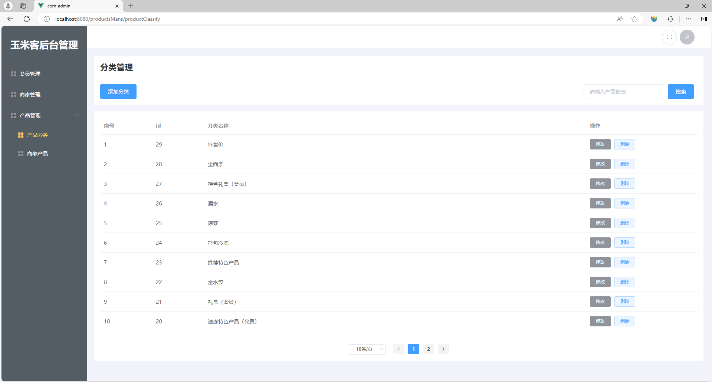
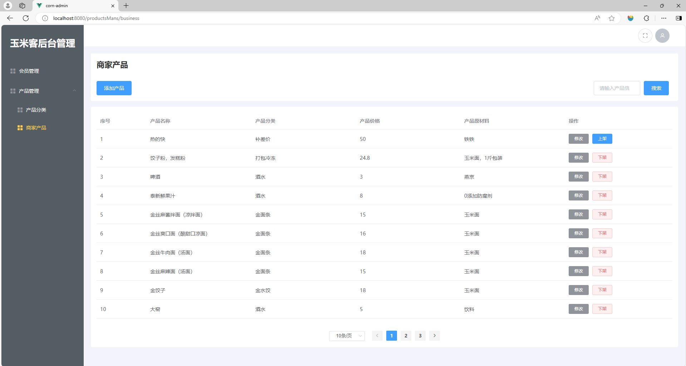

# 任务5 实现产品管理相关功能

## 5.1 任务描述

　　本任务将实现后台管理项目中的产品管理相关功能。管理员点击左侧产品管理导航时会展开二级导航，包括产品分类和商家产品。点击产品分类导航时可以展示出产品的分类管理模块页面，产品分类模块需要实现的功能有分类的展示、添加、修改、删除和搜索。点击商家产品导航时可以展示出商家产品的管理模块页面，商家产品模块需要实现的功能有产品的展示、添加、修改、搜索、上架和下架。

## 5.2 任务效果





## 5.3 学习目标

### 5.3.1 知识目标

- [ ] 了解前后端分离开发模式下的接口调用和参数传递
- [ ] 掌握elementui组件动态添加元素的方法
- [ ] 掌握 upload 文件上传组件的使用方法

### 5.3.2 能力目标

- [ ] 能够使用upload组件实现图片上传功能
- [ ] 能够独立开发和维护Vue组件实现页面的动态展示
- [ ] 能够根据后端提供的接口文档调用接口并处理返回的数据

## 5.4 知识储备

### 1. Upload 上传组件

　　Element UI的`Upload`组件是一个功能强大的工具，它允许开发者在Vue.js应用程序中轻松实现文件上传功能。这个组件不仅提供了基本的文件上传能力，还包含了许多高级特性，使得文件管理更加高效和用户友好。

官网文档：https://element.eleme.cn/#/zh-CN/component/upload

**使用上传组件的优势：**

1. **简化开发**：开发者不需要从头开始编写上传逻辑，Element UI的`Upload`组件提供了一套完整的解决方案。
2. **提升用户体验**：提供文件预览、文件列表管理等功能，增强了用户的交互体验。
3. **易于定制**：支持多种属性和插槽，可以灵活定制上传组件的样式和功能。
4. **跨浏览器兼容性**：Element UI的组件通常具有良好的浏览器兼容性，减少了跨浏览器问题。

**使用示例：**

```vue
<template>
  <el-upload
    :action="uploadUrl"
    list-type="picture-card"
    :file-list="fileList"
    :before-upload="handleBeforeUpload"
    :on-success="handleSuccess"
    :on-remove="handleRemove">
    <i class="el-icon-plus"></i>
    <div class="el-upload__tip" slot="tip">只能上传jpg/png文件，且不超过500kb</div>
  </el-upload>
</template>

<script>
export default {
  data() {
    return {
      uploadUrl: '你的上传接口地址',
      fileList: []
    };
  },
  methods: {
    handleBeforeUpload(file) {
      const isImage = file.type.match('image/jpeg|image/png');
      const isLt500k = file.size / 1024 < 500;
      if (!isImage) {
        this.$message.error('只能上传 JPG/PNG 格式的图片文件!');
      }
      if (!isLt500k) {
        this.$message.error('上传图片大小不能超过 500KB!');
      }
      return isImage && isLt500k;
    },
    handleSuccess(response, file, fileList) {
      // 处理上传成功逻辑
      this.$message.success('上传成功');
    },
    handleRemove(file, fileList) {
      // 处理文件移除逻辑
      this.$message.info('文件已移除');
    }
  }
};
</script>
```

**upload 组件常用属性：**

| 属性名        | 类型     | 描述                                                         | 示例值                                   |
| ------------- | -------- | ------------------------------------------------------------ | ---------------------------------------- |
| action        | string   | 必填，上传的文件所提交到的服务器地址。                       | '/upload'                                |
| list-type     | string   | 定义文件列表的类型。                                         | 'picture-card'                           |
| file-list     | array    | 附件列表，元素为文件对象。                                   | [File, File]                             |
| before-upload | function | 文件上传之前的钩子，参数为上传的文件，若返回 false，则停止上传。 | function(file) {...}                     |
| on-success    | function | 文件上传成功时触发的钩子，参数包括服务端返回的数据、上传的文件和文件列表。 | function(response, file, fileList) {...} |
| on-remove     | function | 文件列表移除文件时触发的钩子，参数包括移除的文件和当前的文件列表。 | function(file, fileList) {...}           |

## 5.5 任务实施

### 子任务 5-1 实现产品分类管理功能

　　在点击后台主页左侧分类管理时，会显示分类管理模块，分类管理模块包含数据展示、新增分类、删除分类和编辑分类功能。本任务将分为三个步骤逐一实现分类管理模块功能。

#### 步骤一 实现产品分类展示功能

**1. 逻辑分析**

　　当管理员进入到分类管理页面时，需要展示分类数据，分类数据展示有两种方式，一种是展示所有分类列表数据，另外一种是展示搜索分类列表数据。实现这两种展示数据的方式都是使用Ajax技术向后端同一个接口发起网络请求，根据请求参数决定获取哪种分类列表数据，然后将分类列表数据保存到Vue相应的数据对象中从而渲染到页面分类列表表格中进行呈现。

**2. 配置产品管理路由出口文件**

　　在`src/views`目录下新建`productMans`目录，此目录为产品管理相关页面的存放位置。在`productMans`目录下新建`index.vue`文件，在此文件中编写子路由的出口占位标签`router-view`。完整路径为`src/views/productMans/index.vue`。代码如下。

> 文件路径：src/views/productsMans/index.vue

```vue
<template>
        <router-view></router-view>
</template>
```

**3. 创建产品分类管理页面文件**

　　在`src/views/productMans`目录下新建`productClassify`目录，在此目录中新建`index.vue`，此文件为分类管理页面组件，在组件中使用`div`标签进行占位。代码如下。

> 文件路径：/src/views/productsMans/productClassify/index.vue

```vue
<template>
  <div>
    产品管理
  </div>
</template>
```

**4. 配置产品分类管理页面路由及导航**

　　将产品管理路由配置到`src/router/index.js`路由配置文件中与会员管理路由平级的位置。代码如下。

> 文件路径：src/router/index.js

```js
// 省略其它代码
{
    path: "/productsMans",
            name: "productsMans",
            component: () =>
                import("@/views/productsMans/index.vue"),
            children: [
                //产品分类
                {
                    path: "/productsMans/productclassify",
                    name: "productclassify",
                    component: () =>
                        import("@/views/productsMans/productClassify/index.vue"),
                },
            ]
  },
// 省略其它代码
```

　　在`src/layout/Aside/index.vue`中编辑产品分类管理导航数据，代码如下。

> 文件路径：src/layout/Aside/index.vue
>
> JavaScript 部分

```js
// 省略其它代码
// 产品管理
{
  path: "/authorityMan",
  icon: "el-icon-menu",
  title: "产品管理",
  children: [
    // 产品分类
    {
      path: "/productsMans/productClassify",
      title: "产品分类",
      icon: "el-icon-menu",
    },
  ],
},
// 省略其它代码
```

**5. 制作产品分类管理页面**

　　产品分类管理页面与会员管理页面类似，在编写会员管理时，已将通用的CSS代码编写到`src/mixins/pageMixins.scss`文件中，在此部分只需将`HTML`结构代码套入即可完成。在产品分类页面中使用 ElementUI 中的`el-table`表格组件呈现分类数据。代码如下。

> 文件路径：/src/views/productsMans/productClassify/index.vue

```vue
    <div class="pageMixin-container">
      <div class="head-container">
        <h1>产品分类</h1>
      </div>
      <div class="search-container">
        <el-button type="primary">
          添加分类
        </el-button>
        <el-form :inline="true" :model="pageSearch">
          <el-form-item label="">
            <el-input v-model="pageSearch.name" placeholder="请输入分类名称" clearable />
          </el-form-item>
          <el-form-item>
            <el-button type="primary" @click="handlePageInit">搜索</el-button>
          </el-form-item>
        </el-form>
      </div>
      <div class="table-container">
        <el-table :data="pageData" v-loading="pageInfo.loading">
          <el-table-column label="序号" width="140">
            <template slot-scope="scope">
              {{(pageInfo.currentPage - 1) * pageInfo.pageSize + scope.$index + 1}}
            </template>
          </el-table-column>

          <el-table-column prop="id" label="id" width="140"></el-table-column>
          <el-table-column prop="goodsType" label="分类名称"></el-table-column>
          <el-table-column label="操作" width="300px">
            <template slot-scope="scope">
              <el-button type="info" size="mini">
                修改
              </el-button>

              <el-button type="primary" size="mini" plain slot="reference" >
                删除
              </el-button>

            </template>
          </el-table-column>
        </el-table>
      </div>
      <div class="pagination-container">
        <el-pagination @size-change="handlePageSizeChange" @current-change="handleCurrentChange" :current-page.sync="pageInfo.currentPage" :page-sizes="[5, 10, 20, 50]" :page-size="pageInfo.pageSize" layout="sizes, prev, pager, next" :total="pageInfo.total" background>
        </el-pagination>
      </div>
    </div>
```

**6. 接口分析**

　　实现分类数据展示功能需要使用后端提供的获取分类列表接口，获取默认展示的分类列表数据时，name参数设置为空，获取搜索的分类数据时，将分类名称通过name参数传递给后端。接口接口详情如下。

- API地址：{{API_HOST}}/admin/goodsType/findGoodsTypePage?name=&currentPage=1&pageSize=10
- API请求方式：GET
- API请求参数：见下表

| 参数字段名  | 参数值 | 数据类型 |   说明   |
| :---------: | :----: | :------: | :------: |
|    name     | 分类名 |  String  |  分类名  |
| currentPage |   1    |  String  | 当前页数 |
|  pageSize   |   5    |  String  | 每页条数 |

**7. 代码实现**

　　在`src/api`目录下新建`businessInfo`目录，在`businessInfo`目录中新建`index.js`文件，用于存放封装产品管理相关接口方法。在`index.js`文件中封装查询产品分类列表方法。代码如下。

> 文件路径：src/api/businessInfo/index.js

```js
import request from '@/utils/request'
// 商品类型列表
export function findGoodsTypePage(params) {
    return request({
        url: '/admin/goodsType/findGoodsTypePage',
        method: 'get',
        params
    })
}
```

　　在`src/views/productsMans/productClassify/index.vue`产品分类组件中引入封装好的查询产品分类列表方法并将方法绑定到`data`节点中`pageApi`对象中。`pageApi`对象为 任务4 中封装好的`mixins`方法，`mixins`也要引入到组件中才能使用。将`name`也定义到`pageSearch`对象中，用于搜索。代码如下。

> 文件路径：src/views/productsMans/productClassify/index.vue
>
> JavaScript 部分

```js
// 引入查询产品分类列表数据接口
import { findGoodsTypePage } from '@/api/businessInfo/index'
import { pageMixin } from '@/mixins/pageMixin.js'
export default {
  mixins:[pageMixin],
  data(){
    return {
      pageApi: {
        list: findGoodsTypePage
      },
      pageSearch:{
        name:''
      }
    }
  }
}
```

#### 步骤二 实现产品分类添加及编辑功能

**1. 逻辑分析**

　　在分类管理页面点击新增按钮或修改按钮时会弹出对应的弹窗，弹窗中可以添加或编辑分类数据。在具体实现中，当弹窗内的数据编写完毕点击确定按钮时需要使用Ajax技术将弹窗内数据发送到后端接口，从而实现添加或编辑功能。

**2. 接口分析**

　　实现分类的添加和编辑功能需要使用后端提供的添加分类和编辑分类的接口。接口详情如下。

（1）添加分类

- API地址：{{API_HOST}}/admin/goodsType/addGoodsType
- API请求方式：POST
- API请求参数：见下表

| 参数字段名 | 参数值 | 数据类型 |     说明     |
| :--------: | :----: | :------: | :----------: |
| goodsType  |  凉菜  |  String  | 产品分类名称 |

（2）编辑分类

- API地址：{{API_HOST}}/admin/goodsType/updateGoodsType
- API请求方式：POST
- API请求参数：见下表

| 参数字段名 | 参数值 | 数据类型 |     说明     |
| :--------: | :----: | :------: | :----------: |
|     id     |   1    |  Number  |  产品分类ID  |
|    sort    |   1    |  Number  | 产品分类排序 |
| goodsType  |  酒水  |  String  | 产品分类名称 |

**3. 代码实现**

　　在`src/api/businessInfo/index.js`接口文件中封装添加分类和修改分类接口方法。代码如下。

> 文件路径：src/api/businessInfo/index.js

```js
// 省略其它代码
// 添加商品类型
export function addGoodsType(data) {
    return request({
        url: '/admin/goodsType/addGoodsType',
        method: 'post',
        data
    })
}

// 修改商品类型
export function updateGoodsType(data) {
    return request({
        url: '/admin/goodsType/updateGoodsType',
        method: 'post',
        data
    })
}
```

　　将编写好的添加和编辑接口方法在`src/views/productsMans/productClassify/index.vue`分类组件中引入并绑定到`data`节点中的`pageApi`对象中。代码如下。

> 文件路径：src/views/productsMans/productClassify/index.vue
>
> JavaScript 部分

```js
import { findGoodsTypePage,addGoodsType,updateGoodsType } from '@/api/businessInfo/index'
import { pageMixin } from '@/mixins/pageMixin.js'
export default {
  mixins:[pageMixin],
  data(){
    return {
      pageApi: {
        list: findGoodsTypePage,
        add: addGoodsType,
        update: updateGoodsType
      }
    }
  }
}
```

　　为模板中的添加按钮和编辑按钮添加点击事件，点击按钮时弹出对应的弹出窗。打开弹出窗的方法已在任务4中涉及的`mixins`文件中编写完毕，在此步骤只需绑定事件即可。代码如下。

> 文件路径：src/views/productsMans/productClassify/index.vue
>
> Template 部分

```vue
<!-- 省略部分代码 -->
<el-button type="primary" @click="handleOpenModal(null)">
    添加产品
</el-button>
<!-- 省略部分代码 -->
<el-button type="info" size="mini" @click="handleOpenModal(scope.row)">
    修改
</el-button>
<!-- 省略部分代码 -->
```

　　在`src/views/productsMans/productClassify/index.vue`分类组件中编写弹窗代码并为确认按钮绑定点击事件。事件处理函数已在任务4中涉及的`mixins`文件中编写完毕，在此步骤只需绑定事件即可。代码如下。

> 文件路径：src/views/productsMans/productClassify/index.vue
>
> Template 部分

```vue
<el-dialog :title="formData.id ?  '修改产品分类' : '添加产品分类'" :visible.sync="editModalShow" width="30%" style="line-height: 60px">

    <el-form class="dit-modal-form" :model="formData" :rules="rules" ref="aForm">
      <el-form-item label="分类排序：" prop="sort">
        <el-input v-model="formData.sort" placeholder="请输入分类排序"></el-input>
      </el-form-item>

      <el-form-item label="分类名称：" prop="goodsType">
        <el-input v-model="formData.goodsType" placeholder="请输入分类名称"></el-input>
      </el-form-item>
    </el-form>

  <span slot="footer" class="dialog-footer">
    <el-button type="primary" @click="handleSubmitForm('aForm')">
      <div>确定</div>
    </el-button>
  </span>
</el-dialog>
```

　　编写表单数据到`src/views/productsMans/productClassify/index.vue`组件中的`data`节点中，代码如下。

> 文件路径：src/views/productsMans/productClassify/index.vue
>
> JavaScript 部分

```js
// 省略其它代码
data(){
    return {
        // 省略其它代码
        initFormData: {
            goodsType: '',
            sort: null
      },
    }
}
// 省略其它代码
```

#### 步骤三 实现删除产品分类功能

**1. 逻辑分析**

　　在分类管理页面点击删除按钮时会弹出确认删除的对话框，点击确定按钮可以删除数据。在具体实现中，点击确认删除按钮时需要使用Ajax技术请求后端接口，从而实现删除分类功能。

**2. 接口分析**

　　实现分类的删除功能需要使用后端提供的删除分类接口。接口详情如下。

- API地址：{{API_HOST}}/admin/goodsType/deleteGoodsType
- API请求方式：POST
- API请求参数：见下表

| 参数字段名 | 参数值 | 数据类型 |    说明    |
| :--------: | :----: | :------: | :--------: |
|     id     |   1    |  String  | 产品分类ID |

**3. 代码实现**

　　在`src/api/businessInfo/index.js`接口文件中封装删除分类接口方法。代码如下。

> 文件路径：src/api/businessInfo/index.js

```js
// 省略其它代码
// 删除商品类型
export function deleteGoodsType(params) {
    return request({
        url: '/admin/goodsType/deleteGoodsType',
        method: 'post',
        params
    })
}
```

　　将编写好的删除分类接口方法在`src/views/productsMans/productClassify/index.vue`分类组件中引入并绑定到`data`节点中的`pageApi`对象中。代码如下。

> 文件路径：src/views/productsMans/productClassify/index.vue
>
> JavaScript 部分

```js
import {
  findGoodsTypePage,
  addGoodsType,
  updateGoodsType,
  deleteGoodsType
} from '@/api/businessInfo/index'
import { pageMixin } from '@/mixins/pageMixin.js'
export default {
  mixins: [pageMixin],
  data() {
    return {
      pageSearch:{
        name:''
      },
      pageApi: {
        list: findGoodsTypePage,
        add: addGoodsType,
        update: updateGoodsType,
        del:deleteGoodsType
      },
      initFormData: {
        goodsType: '',
        sort: null
      }
    }
  }
}
```

　　为模板中的删除按钮绑定点击事件，事件处理函数已在任务4中编写，此步骤直接绑定即可。代码如下。

> 文件路径：src/views/productsMans/productClassify/index.vue
>
> Template 部分

```vue
<!-- 省略其它代码 -->
<el-button type="primary" size="mini" plain slot="reference" @click="handleRemove(scope.row)">
    删除
</el-button>
<!-- 省略其它代码 -->
```

### 子任务 5-2 实现产品管理功能

　　在点击后台主页左侧产品管理时，会显示产品管理模块，产品管理模块包含产品数据展示、新增产品、编辑产品、上架和下架功能。本任务将分为三个步骤逐一实现产品管理模块功能。

#### 步骤一 实现产品展示功能

**1. 逻辑分析**

　　当管理员进入到产品管理页面时，需要展示产品数据，产品数据展示有两种方式，一种是展示所有数据，另外一种是展示搜索产品数据。实现这两种展示数据的方式都是使用Ajax技术向后端同一个接口发起网络请求，根据请求参数决定获取哪种产品列表数据，然后将产品列表数据保存到Vue相应的数据对象中从而渲染到页面产品列表表格中进行呈现。

**2. 创建产品管理页面文件**

　　在`src/views/productsMans`目录下新建`business`目录，在此目录下新建`index.vue`组件，使用`div`标签进行占位。此组件为产品管理页面。后续产品相关操作都会在`src/views/productsMans/business/index.vue`页面中完成。代码如下。

> 文件路径：src/views/productsMans/business/index.vue
>
> Template 部分

```vue
<template>
  <div>
    商家产品
  </div>
</template>
```

**3. 配置产品管理页面路由及导航**

　　将产品管理路由配置到`src/router/index.js`路由配置文件中与产品分类管理路由平级的位置。代码如下。

> 文件路径：src/router/index.js

```js
// 省略其它代码
children: [
          //产品分类
          {
            path: "/productsMans/productclassify",
            name: "productclassify",
            component: () =>
              import("@/views/productsMans/productClassify/index.vue"),
          },
          //产品管理
          {
            path: "/productsMans/business",
            name: "business",
            component: () =>
              import("@/views/productsMans/business/index.vue"),
          }
        ]
// 省略其它代码
```

　　在`src/layout/Aside/index.vue`文件中配置侧边栏，导航使其显示到导航栏中，将路由信息配置到与产品分类管理平级的位置。配置完毕即可在页面导航中显示，点击产品管理可以显示产品管理页面。代码如下。

> 文件路径：src/layout/Aside/index.vue
>
> JavaScript 部分

```js
// 省略其它代码
children: [
            // 产品分类
            {
              path: "/productsMans/productClassify",
              title: "产品分类",
              icon: "el-icon-menu",
            },
            // 产品管理
            {
              path: "/productsMans/business",
              title: "商家产品",
              icon: "el-icon-menu",
            },
          ],
// 省略其它代码
```

**4. 制作产品管理页面**

　　产品管理页面与会员管理页面类似，在编写会员管理时，已将通用的CSS代码编写到`src/mixins/pageMixins.scss`文件中，在此部分只需将`HTML`结构代码套入即可完成（后续页面不在赘述）。在产品分类页面中使用 ElementUI 中的`el-table`表格组件呈现分类数据。代码如下。

> 文件路径：src/views/productsMans/business/index.vue
>
> Template 部分

```vue
<div>
        <div class="pageMixin-container">
      <div class="head-container">
        <h1>商家产品</h1>
      </div>
      <div class="search-container">
        <el-button type="primary"> 添加产品 </el-button>
        <el-form :inline="true" :model="pageSearch">
          <el-form-item label="">
            <el-input v-model="pageSearch.name" placeholder="请输入产品信息" clearable />
          </el-form-item>
          <el-form-item>
            <el-button type="primary" @click="handlePageInit">搜索</el-button>
          </el-form-item>
        </el-form>
      </div>
      <div class="table-container">
        <el-table :data="pageData" v-loading="pageInfo.loading">
          <el-table-column label="序号" width="140">
            <template slot-scope="scope">
              {{
                (pageInfo.currentPage - 1) * pageInfo.pageSize +
                scope.$index +
                1
              }}
            </template>
          </el-table-column>
          <el-table-column prop="name" label="产品名称"></el-table-column>
          <el-table-column prop="goodsType" label="产品分类"></el-table-column>
          <el-table-column prop="price" label="产品价格"></el-table-column>
          <el-table-column prop="material" label="产品原材料"></el-table-column>
          <el-table-column label="操作" width="300px">
            <template slot-scope="scope">
              <div>
                <el-button type="info" size="mini">
                  修改
                </el-button>
                <el-button type="primary" size="mini"  v-if="scope.row.state != 1">
                  上架
                </el-button>
                <el-button type="danger" size="mini" plain v-else>
                  下架
                </el-button>
              </div>
            </template>
          </el-table-column>
        </el-table>
      </div>
      <div class="pagination-container">
        <el-pagination @size-change="handlePageSizeChange" @current-change="handleCurrentChange" :current-page.sync="pageInfo.currentPage" :page-sizes="[5, 10, 20, 50]" :page-size="pageInfo.pageSize" layout="sizes, prev, pager, next" :total="pageInfo.total" background>
        </el-pagination>
      </div>
    </div>
</div>
```

　　在上述代码渲染表格数据时动态绑定了`pageData`属性，通过商品的状态来判断显示上架按钮和下架按钮。接下来要从后端接口获取数据将数据渲染。

**5. 接口分析**

　　实现产品数据展示功能需要使用后端提供的获取产品列表接口，获取默认展示的产品列表数据时，name参数设置为空，获取搜索的产品数据时，将产品名称通过name参数传递给后端。接口详情如下。

- API地址：{{API_HOST}/admin/goods/findBusinessGoodsPage
- API请求方式：GET
- API请求参数：见下表

| 参数字段名  | 参数值 | 数据类型 |   说明   |
| :---------: | :----: | :------: | :------: |
|    name     | 产品名 |  String  |  产品名  |
| currentPage |   1    |  String  | 当前页数 |
|  pageSize   |   5    |  String  | 每页条数 |

**6. 代码实现**

　　在`src/api/businessInfo/index.js`产品管理接口文件中封装查询商家产品方法。代码如下。

> 文件路径：src/api/businessInfo/index.js

```js
// 省略其它代码
// 查询商家产品
export function findBusinessGoodsPage(params) {
    return request({
        url: '/admin/goods/findBusinessGoodsPage',
        method: 'get',
        params
    })
}
```

　　在`src/views/productsMans/business/index.vue`产品组件中引入封装好的查询商家产品方法并将方法绑定到`data`节点中`pageApi`对象中。代码如下。

> 文件路径：src/views/productsMans/business/index.vue
>
> JavaScript 部分

```js
import { findBusinessGoodsPage } from '@/api/businessInfo'  // 导入接口方法
import { pageMixin } from '@/mixins/pageMixin'  // 导入Mixins
export default {
  mixins: [pageMixin],
  data(){
    return {
      pageApi:{
        list:findBusinessGoodsPage
      },
      pageSearch:{
        name:''
      }
    }
  }
}
```

#### 步骤二 实现产品添加及编辑功能

**1.逻辑分析**

　　在产品管理页面点击新增按钮或修改按钮时会弹出对应的弹窗，弹窗中可以添加或编辑产品数据。在具体实现中，当弹窗内的数据编写完毕点击确定按钮时需要使用Ajax技术将弹窗内数据发送到后端接口，从而实现添加或编辑功能。

**2.接口分析**

　　实现产品的添加和编辑功能需要使用后端提供的添加产品、编辑产品、获取产品分类和文件上传接口。接口详情如下。

（1）添加产品接口

- API地址：{{API_HOST}}/admin/goods/addGoods
- API请求方式：POST
- API请求参数：见下表

|   字段    |     值     | 数据类型 |        说明        |
| :-------: | :--------: | :------: | :----------------: |
|  typeId   |     19     |  Number  |     产品的类型     |
|   name    | 牛爷爷炒面 |  String  |     产品的名称     |
|   price   | 1008611.00 |  String  |        价格        |
| material  |  没有牛肉  |  String  |     产品的材料     |
| inventory |     10     |  Number  |       规格id       |
|   specs   | [规格详情] |  String  |     产品的规格     |
|   state   |     1      |  String  |        状态        |
| isDefault |     1      |  String  | 是否为默认展示商品 |
|   image   | /res/a.jpg |  String  |      产品图片      |

规格详情:
| 规格名称 | 规格列表             |
| -------- | -------------------- |
| 规格     | 小份: 3元, 大份: 4元 |
| 颜色     | 红: 3元, 蓝: 4元     |

（2）修改产品接口

- API地址：{{API_HOST}}/admin/goods/updateGoods
- API请求方式：POST
- API请求参数：见下表

|   字段    |     值     | 数据类型 |        说明        |
| :-------: | :--------: | :------: | :----------------: |
|    id     |     64     |  Number  |       产品id       |
|  typeId   |     19     |  Number  |     产品的类型     |
|   name    | 牛爷爷炒面 |  String  |     产品的名称     |
|   price   | 1008611.00 |  String  |        价格        |
| material  |  没有牛肉  |  String  |     产品的材料     |
|   specs   | [规格详情] |  String  |     产品的规格     |
|   state   |     1      |  String  |        状态        |
| isDefault |     1      |  String  | 是否为默认展示商品 |
|   image   | /res/a.jpg |  String  |      产品图片      |

规格详情:

| 规格名称 | 规格列表             |
| -------- | -------------------- |
| 规格     | 小份: 3元, 大份: 4元 |
| 颜色     | 红: 3元, 蓝: 4元     |

（3）获取产品分类接口

- API地址：{{API_HOST}}/admin/goodsType/findGoodsTypePage?name=&currentPage=1&pageSize=10
- API请求方式：GET
- API请求参数：见下表

| 参数字段名  |  参数值  | 数据类型 |   说明   |
| :---------: | :------: | :------: | :------: |
|    name     | 会员名字 |  String  | 分类名字 |
| currentPage |    1     |  String  | 当前页数 |
|  pageSize   |    5     |  String  | 每页条数 |

（4）文件上传接口

- API地址：{{API_HOST}}/file/fileUpload
- API请求方式：POST
- API请求参数：见下表

|  参数字段名   |   参数值   | 数据类型 |   说明   |
| :-----------: | :--------: | :------: | :------: |
| multipartFile | [文件路径] | 文件类型 | 文件路径 |

**3.代码实现**

　　在`src/api/businessInfo/index.js`接口文件中封装添加产品和修改接口方法。代码如下。

注意：获取产品分类接口已在 子任务5-1 中封装，此处不用再次封装。

> 文件路径：src/api/businessInfo/index.js

```js
// 添加产品
export function AddGoods(data) {
    return request({
        url: '/admin/goods/addGoods',
        method: 'post',
        data
    })
}
// 修改产品
export function updateGoods(data) {
    return request({
        url: '/admin/goods/updateGoods',
        method: 'post',
        data
    })
}
```

　　在`src/api`目录下创建`system`目录，在`system`目录中创建`index.js`用于存放公共接口，如文件上传接口。在本项目中还有其它模块使用文件上传，所以将其封装到公共接口文件。代码如下。

> 文件路径：src/api/system/index.js

```js
import request from '@/utils/request'
// 文件上传方法
export function fileUpload (data) {
    return request({
        url: '/file/fileUpload',
        method: 'POST',
        data
    })
} 

```

　　在`src/views/productsMans/business/index.vue`产品管理组件中引入添加产品、修改产品、查询分类、文件上传接口方法并在`data`节点中编写弹窗开关属性`isAddProduct`、表单数据属性`formInfo`、分类数据容器属性`responseTypeList`、产品ID属性`productId`、规格ID属性`specificationId`。代码如下

> 文件路径：/src/views/productsMans/business/index.vue
>
> JavaScript

```js
import { findBusinessGoodsPage,findGoodsTypePage,AddGoods,updateGoods } from '@/api/businessInfo'
import { fileUpload } from '@/api/system/index' // 导入文件上传方法
// 省略其它代码
data() {
    return {
      pageApi: {
        list: findBusinessGoodsPage
      },
      pageSearch: {
        name: ''
      },
      isAddProduct: false, // 添加/修改弹窗开关
      formInfo: { // 表单数据，可参考接口分析
        typeId: '',
        name: '',
        price: '',
        material: '',
        inventory: '',
        specs: '',
        state: '1',
        isDefault: '1',
        image: '',
        // 规格图片
        specsImg: ''
      },
      radio:'1',// 单选按钮状态
      // 产品分类
      responseTypeList:[],
      productId: null, // 产品id
      specificationId: null // 规格id
    }
  },
```

　　为添加和编辑按钮绑定点击事件，点击对应按钮时打开对应的事件处理函数。代码如下。

> 文件路径：src/views/productsMans/business/index.vue
>
> Template 部分

```vue
<el-button type="primary" @click="addpr"> 
    添加产品 
</el-button>
<el-button type="info" size="mini"  @click="Aedit(scope.row)">
    修改
</el-button>
```

　　在js部分的`methos`节点中编写打开弹窗方法`addpr`和获取产品分类方法。当打开弹窗时调用获取产品分类方法并将后端返回的数据保存到data节点中的`responseTypeList`属性中，用于渲染到弹窗中的分类下拉列表。代码如下。

> JavaScript 部分

```js
// 省略其它代码
methods:{
    // 添加按钮事件处理
    addpr() {
      // 调用查询分类方法
      this.findGoodsTypePage()
      // 打开弹窗
      this.isAddProduct = true
    },
    // 查询分类方法
    async findGoodsTypePage() {
      let res = await findGoodsTypePage({
        currentPage: 1,
        pageSize: 999,
        name: ''
      })
      if (res.code == 200) {
        this.responseTypeList = res.pageInfo.list
      }
    },
}
```

　　在`src/views/productsMans/business/index.vue`产品组件中编写弹窗代码并在弹窗中编写表单结构，将`data`节点中的表单数据使用`v-model`动态绑定并渲染分类下拉列表。代码如下。

> 文件路径：src/views/productsMans/business/index.vue
>
> Template 部分

```vue
    <el-dialog :title="formInfo.id ? '修改产品' : '添加产品'" :visible.sync="isAddProduct" width="30%" style="line-height: 60px">
      <template>
        <div class="addForm">
          <div>
            <span>产品名称：</span>
            <el-input style="width: 200px" clearable placeholder="请输入名称" v-model="formInfo.name">
            </el-input>
          </div>
          <div>
            <span>产品价格：</span>
            <el-input style="width: 200px" clearable placeholder="请输入" v-model="formInfo.price">
            </el-input>
          </div>
          <div>
            <span>产品原材料：</span>
            <el-input style="width: 200px" clearable placeholder="请输入" v-model="formInfo.material">
            </el-input>
          </div>
          <div style="display: flex">
            <span>产品封面：</span>
            <div>
              <el-upload class="avatar-uploader" action="" :show-file-list="false" :http-request="handleAvatarUpload">
                
                <i v-else class="el-icon-plus avatar-uploader-icon"></i>
              </el-upload>
            </div>
          </div>
          <div>
            <span>产品类型：</span>
            <el-select v-model="formInfo.typeId" placeholder="请选择">
              <el-option v-for="item in responseTypeList" :key="item.id" :label="item.goodsType" :value="item.id">
              </el-option>
            </el-select>
          </div>
          <div style="display: flex">
            <span>产品规格：</span>
            <div>
              <!-- width:550px; -->
              <div v-for="(item, index) in specs" :key="index" style="
                  background-color: #f2f3fb;
                  border-radius: 16px;
                  text-align: left;
                  padding: 16px;
                  margin: 4px 0;
                ">
                <div>
                  组名：<el-input v-model="item.name" placeholder="请输入内容"></el-input>
                </div>
                <div style="display: flex; flex-direction: column" v-for="(items, indexs) in item.list" :key="indexs">
                  <div style="display: flex; justify-content: space-between">
                    <div>
                      规格名 ：<el-input v-model="items.content" placeholder="请输入内容"></el-input>
                    </div>
                    <div>
                      附加金额 ：<el-input-number v-model="items.price" label="描述文字"></el-input-number>
                    </div>
                  </div>
                  <div @click="handleClickImg(item.id, item.list[indexs].id)">
                    <el-upload class="avatar-uploader upload-img" action="" :show-file-list="false" :http-request="handleSpecImgUpload">
                      
                      <i v-else class="el-icon-plus avatar-uploader-icon"></i>
                    </el-upload>
                  </div>
                </div>

                <el-button type="text" @click="
                    () => {
                      item.list.push({
                        id: item.list.length + 1,
                        price: 0,
                      });
                    }
                  ">添加规格</el-button>
                <el-button @click="handleOpenBtn(item)" class="delect-btn" type="text">
                  删除规格
                </el-button>
              </div>
              <el-button type="primary" round @click="
                  () => {
                    specs.push({
                      id: this.specs.length + 1,
                      list: [],
                    });
                  }
                ">创建规格组</el-button>
              <!-- 添加组  添加类目  设置价格 -->
            </div>
          </div>
          <div>
            <span>库存：</span>
            <el-input style="width: 200px" clearable placeholder="请输入" v-model="formInfo.inventory">
            </el-input>
          </div>
          <div>
            <span>状态：</span>
            <el-radio v-model="radio" label="1" @input="ChangeRadio">上架</el-radio>
            <el-radio v-model="radio" label="2" @input="ChangeRadio">下架</el-radio>
          </div>
        </div>
      </template>
      <span slot="footer" class="dialog-footer">
        <el-button type="primary" @click="FormAddEdit"> 确定 </el-button>
      </span>
    </el-dialog>
```

　　在`src/views/productsMans/business/index.vue`组件中的`style`部分编写表单和上传图片组件的CSS样式。代码如下。

> 文件路径：src/views/productsMans/business/index.vue
>
> CSS 部分

```scss
<style scoped lang='scss'>
// 表单容器
.addForm {
  display: flex;
  padding: 0px 10px 10px 10px;
  line-height: 60px;
  flex-direction: column;
  align-items: flex-start;

  div span {
    width: 100px;
    text-align: left;
    display: inline-block;
  }
}
// 文本框样式
.el-input {
  width: 130px;
  line-height: 0 !important;
}

// 上传图片容器
.avatar-uploader .el-upload {
  border: 1px dashed #d9d9d9;
  border-radius: 6px;
  cursor: pointer;
  position: relative;
  overflow: hidden;
}

.avatar-uploader .el-upload:hover {
  border-color: #409eff;
}

// 上传图片图标
.avatar-uploader-icon {
  font-size: 28px;
  color: #8c939d;
  width: 178px;
  height: 178px;
  line-height: 178px;
  text-align: center;
}

// 上传之后图片样式
.avatar {
  width: 178px;
  height: 178px;
  display: block;
}
// 上传图片区域边框
.avatar-uploader {
  border: 1px dashed #d9d9d9;
  border-radius: 6px;
}
// 规格图片样式
.upload-img {
  width: 100px;
  height: 100px;
  display: flex;
  align-items: center;
  justify-content: center;
  border-radius: 6px;
  border: 1px dashed #d9d9d9;
}
// 删除规格按钮
.delect-btn {
  cursor: pointer;
  color: #f56c6c;
}

</style>
```

　　编写在`methods`节点中编写弹窗里删除规格方法。代码如下。

> JavaScript 部分

```js
// 省略其它代码
methods:{
    // 省略其它代码
        // 删除规格
    handleOpenBtn(item) {
      let activeId = item.id
      let _specs = []
      // 使用filter直接过滤出id不等于activeId的元素
      _specs = this.specs.filter((spec) => spec.id !== activeId)

      this.specs = _specs
    },
}
```

　　在`methods`节点中编写弹窗里上传产品封面和上传规格图片方法，用于获取后端相应的图片地址。代码如下。

> JavaScript 部分

```js
// 省略其它代码
methods:{
// 省略其它代码
        // 上传产品封面
    async handleAvatarUpload(file) {
      const formData = new FormData()
      formData.append('multipartFile', file.file)
      let res = await fileUpload(formData)
      if (res.code == 200) {
        this.formInfo.image = res.entity
      }
    },
        // 规格图片上传
    async handleSpecImgUpload(file) {
      const formData = new FormData()
      formData.append('multipartFile', file.file)
      let res = await fileUpload(formData)
      if (res.success) {
        // 遍历specs数组并找到需要更新的项
        this.specs.forEach((item) => {
          if (this.specificationId == item.id) {
            item.list.forEach((item2) => {
              // 根据特定的条件来更新specsImg
              // 检查commitId和item2.id是否相等
              if (this.productId === item2.id) {
                // 使用Vue.set来更新响应式数据
                this.$set(item2, 'specsImg', res.entity)
              }
            })
          }
        })
      }
    },
}
```

　　在`mehods`节点中编写修改按钮事件处理方法用于打开弹窗以及在表单数据中添加产品`id`。代码如下。

> JavaScript 部分

```js
//省略其它代码
methods:{
    // 省略其它代码
    // 修改按钮事件处理
    Aedit(e) {
      this.isAddProduct = true
      this.formInfo = e
      this.formInfo.id = e.goodsId
      this.specs =
        e.specs == null || e.specs == '' || e.specs == 'null'
          ? []
          : JSON.parse(e.specs)
    },
   
}
```

　　在`methods`节点中编写添加/修改数据方法，在方法中判断表单中是否有产品`id`，如果有就调用修改产品接口，如果没有就调用添加数据接口。代码如下。

> JavaScript 部分

```js
// 省略其它代码
methods:{
    // 省略其它代码
    // 处理添加/编辑方法
    async FormAddEdit() {
      this.formInfo.specs = JSON.stringify(this.specs)
      if (this.formInfo.name == '') {
        this.$message.error('产品名称不能为空')
      } else {
        let res
        if (this.formInfo.id) {
          this.formInfo.isDefault = 1
          res = await updateGoods(this.formInfo)
        } else {
          res = await AddGoods(this.formInfo)
        }

        if (res.code == 200) {
          this.loading = true
          this.isAddProduct = false
          this.findBusinessGoodsPage()
          this.$message.success(res.message)
          this.formInfo.id = ''
        }
      }
    },
}
```

　　由于文件上传接口的地址为`/file`开头在本项目中没有配置代理，所以在上传文件时会报错。在根目录下`vue.config.js`文件中的`proxy`节点中添加`file`的代理。代码如下。

> 文件路径：/vue.config.js

```js
proxy: {
      '/admin': {
        target: process.env.VITE_API_HOST,
        changeOrigin: true,
        secure: false,
        pathRewrite: {
          '^/admin': '/admin'
        }
      },
      '/file': {
        target: process.env.VITE_API_HOST,
        changeOrigin: true,
        pathRewrite: {
          '^/file': '/file'
        }
      }
    }
```

　　在`methods`节点中编写改变弹窗中上架/下架状态方法和处理规格`id`方法。代码如下。

> JavaScript 部分

```js
    // 省略其它代码
methods:{
    // 省略其它代码
    // 改变弹窗中上架/下架状态
    ChangeRadio() {
      this.formInfo.state = this.radio
    },
   // 处理产品id和规格id，用于保存产品id和规格id
   handleClickImg(specificationId, id) {
      this.productId = id
      this.specificationId = specificationId
    },
}
```

#### 步骤三 实现产品上架下架功能

**1. 逻辑分析**

　　在产品信息展示表格中，设有上架/下架按钮以供操作。若产品当前为上架状态，则显示下架按钮；反之，若为下架状态，则显示上架按钮。在实现过程中，通过参数判断当前状态，点击相应按钮后，将弹出二次确认弹窗。用户确认后，系统将通过Ajax技术向服务器发起请求，从而实现上架或下架功能。

**2. 接口分析**

　　实现产品上架/下架功能需要使用后端提供的两个接口分别是产品上架接口和产品下架接口。接口详情如下。

（1）产品上架接口

- API地址：{{API_HOST}}/admin/goods/shelvesGoods?goodsId=64
- API请求方式：GET
- API请求参数：见下表

| 参数字段名 | 参数值 | 数据类型 |  说明  |
| :--------: | :----: | :------: | :----: |
|  goodsId   |   64   |  String  | 产品id |

（2）产品下架接口

- API地址：{{API_HOST}}/admin/goods/soldOutGoods?goodsId=64
- API请求方式：GET
- API请求参数：见下表

| 参数字段名 | 参数值 | 数据类型 |  说明  |
| :--------: | :----: | :------: | :----: |
|  goodsId   |   64   |  String  | 产品id |

**3. 代码实现**

　　在`src/api/businessInfo/index.js`产品管理接口文件中封装产品上架/下架方法。代码如下。

> 文件路径：src/api/businessInfo/index.js

```js
// 省略其它代码
// 上架产品
export function upGoods(params) {
    return request({
        url: '/admin/goods/shelvesGoods',
        method: 'get',
        params
    })
}
// 下架产品
export function downGoods(params) {
    return request({
        url: '/admin/goods/soldOutGoods',
        method: 'get',
        params
    })
}
```

　　将上架/下架方法引入到`src/views/productsMans/business/index.vue`产品管理组件中的js部分。代码如下。

> 文件路径：src/views/productsMans/business/index.vue
>
> JavaScript 部分

```js
import { findGoodsTypePage, findBusinessGoodsPage, AddGoods, updateGoods, upGoods, downGoods } from '@/api/businessInfo'
```

　　在js部分的`data`节点中编写上架/下架弹窗标题属性`goodstitle`、上架/下架弹窗开关属性`isOpenProduct`和判断上架/下架提示文字开关`isProduct`。代码如下。

> 文件路径：src/views/productsMans/business/index.vue
>
> JavaScript 部分

```js
data(){
    // 省略其它代码
     goodstitle: '上架产品',
      isOpenProduct: false, // 打开或关闭弹窗
      isProduct: false, // 显示上架还是下架文字
}
```

　　在模板中编写弹窗部分，在弹窗中分别使用上一步中定义的属性，通过`v-if`控制文字显示，通过`v-bind:title`动态显示标题，通过`:visible.sync`控制弹窗开启/关闭。代码如下。

>文件路径：src/views/productsMans/business/index.vue
>
>Template 部分

```vue
<el-dialog :title="goodstitle" :visible.sync="isOpenProduct" width="24%" style="line-height: 40px">
      <div v-if="isProduct">确定上架该产品吗？</div>
      <div v-else>确定下架该产品吗？</div>
      <span slot="footer" class="dialog-footer">
        <el-button @click="isProduct = false">取 消</el-button>
        <el-button type="primary" @click="ConfirmProduct">确 定</el-button>
      </span>
</el-dialog>
```

　　为模板中的上架/下架按钮绑定点击事件及事件处理函数，调用事件处理函数时传入对应的参数来判断想要做的是上架还是下架的操作。代码如下。

> 文件路径：src/views/productsMans/business/index.vue
>
> Template 部分

```vue
// 省略其它代码
<el-button type="primary" size="mini" @click="EditProductState(1, scope.row)" v-if="scope.row.state != 1">
  上架
</el-button>
<el-button type="danger" size="mini" plain @click="EditProductState(2, scope.row)" v-else>
  下架
</el-button>
// 省略其它代码
```

　　在js部分的`methods`节点中编写打开弹窗的事件处理函数，在事件处理函数中根据参数动态修改弹窗中的文字描述并打开弹窗。代码如下。

> JavaScript 部分

```js
methods:{
        // 省略其它代码
        // 上架下架 弹窗
    EditProductState(state, row) {
      if (state == 2) {
        this.goodstitle = '下架产品'
        this.goodsId = row.goodsId
        this.isProduct = false
      } else {
        this.goodstitle = '上架产品'
        this.goodsId = row.goodsId
        this.isProduct = true
      }
      this.isOpenProduct = true
    },
}
```

　　在js部分的`methods`节点中编写上架/下架的后端请求方法，当点击弹窗中的确定按钮时按需调用上架/下架方法。代码如下。

> JavaScript

```js
methods:{
        // 省略其它代码
        // 上架产品
    async upState() {
      let res = await upGoods({
        goodsId: this.goodsId
      })
      if (res.code == 200) {
        this.handlePageInit()
        this.$message.success(res.message)
      }
      this.isOpenProduct = false
    },
    // 下架产品
    async downState() {
      let res = await downGoods({
        goodsId: this.goodsId
      })
      if (res.code == 200) {
        this.handlePageInit()
        this.$message.success(res.message)
      }
      this.isOpenProduct = false
    },
}
```

　　在js部分的`methods`节点中编写按需调用上架/下架方法。如果`isProduct`为`true`调用上架方法，如果`isProduct`为`false`调用下架方法。代码如下。

> JavaScript 部分

```js
methods:{
    // 省略其它代码
    // 确认上架下架
    ConfirmProduct() {
      if (this.isProduct) {
        this.upState()
      } else {
        this.downState()
      }
    },
}
```

