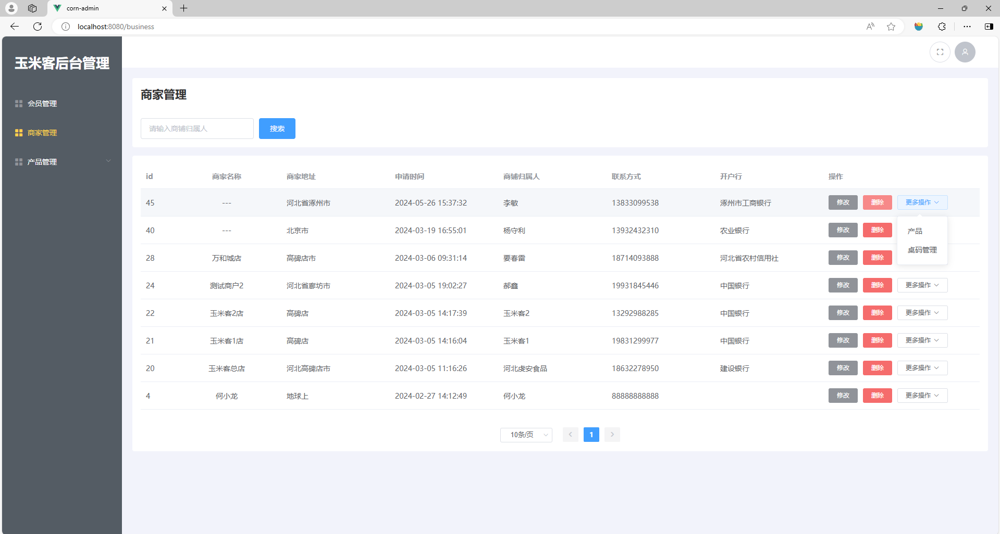
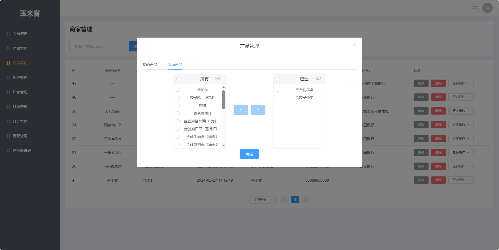
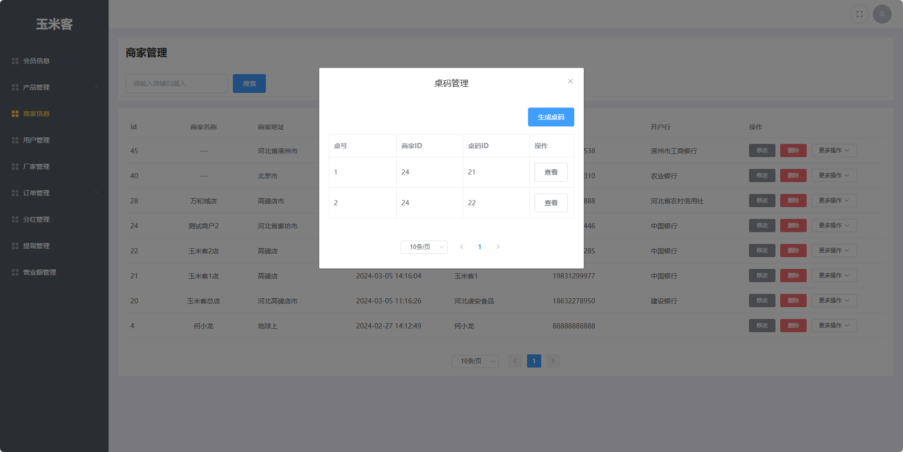

# 任务6 实现商家管理功能

## 6.1 任务描述

　　本任务将实现“玉米客”后台管理项目中的商家管理相关功能。管理员点击左侧商家管理导航时可以展示出对应的商家管理页面。商家管理模块需要实现的功能包括制作页面、展示商家列表、修改商家信息、删除商家、查看当前商家已有产品、为商家添加产品以及生成桌码等功能。本任务将分为三个子任务详细讲解商家管理相关功能的实现过程。

## 6.2 任务效果

**1.商家管理**



**2.商家产品管理**



**3.桌码管理**



## 6.3 学习目标

### 6.3.1 知识目标

- [ ] 了解封装组件的作用
- [ ] 掌握 ref 属性的使用方法
- [ ] 掌握 Transfer 穿梭框组件的使用方法

### 6.3.2 能力目标

- [ ] 能够编写可重用的代码提高代码的可维护性
- [ ] 能够通过 ref 属性调用子组件中的方法
- [ ] 能够使用 Transfer 穿梭框组件实现多选数据转移

## 6.4 知识储备

### 1. Transfer 穿梭框

Transfer（穿梭框）是Element UI 中的一个双栏列表组件，允许用户在两个列表之间移动项目。它通常用于需要在两个数据集合之间进行数据传输的场景，例如：

1. 多选转移：用户需要从一个候选列表中选择多个选项，并将它们转移到已选择列表中。
2. 权限分配：在权限管理系统中，将角色与权限进行关联。
3. 数据分组：将数据项从一个分组移动到另一个分组。

官方文档：https://element.eleme.cn/#/zh-CN/component/transfer

**Popconfirm 使用示例**

```vue
<template>
  <el-transfer
    v-model="value1"
    :data="data1"
    :titles="['源列表', '目标列表']"
    @change="handleChange"
  />
</template>

<script>
export default {
  data() {
    return {
      value1: [1, 4],
      data1: [
        { key: 1, label: '选项1' },
        { key: 2, label: '选项2' },
        { key: 3, label: '选项3' },
        { key: 4, label: '选项4' },
        // 更多数据项...
      ]
    };
  },
  methods: {
    handleChange(value, direction, movedKeys) {
      console.log(value, direction, movedKeys);
    }
  }
};
</script>
```

### 2. ref 属性

　　在 Vue.js 中，`ref` 属性是一个特殊的属性，用于给元素或子组件注册引用信息。引用信息将会在组件的 `$refs` 对象上注册。你可以使用 `ref` 属性给元素或子组件注册一个引用ID，并在组件内使用 `this.$refs` 访问它们。

官方文档：https://v2.cn.vuejs.org/v2/guide/components-edge-cases.html#%E8%AE%BF%E9%97%AE%E5%AD%90%E7%BB%84%E4%BB%B6%E5%AE%9E%E4%BE%8B%E6%88%96%E5%AD%90%E5%85%83%E7%B4%A0

**ref 属性的作用：**

1. **访问DOM元素**：当你需要直接操作DOM元素时，可以通过 `ref` 属性获取元素的引用。
2. **访问子组件实例**：当你需要访问子组件的实例时，可以使用 `ref` 属性。
3. **获取表单输入**：在表单中，你可以使用 `ref` 来访问输入元素，以便获取输入值或进行其他操作。

**如何使用 ref 属性：**

1. 在模板中给需要引用的元素或组件添加 `ref` 属性。
2. 在组件的 `methods` 中或在组件的 `mounted` 钩子中通过 `this.$refs` 获取引用。

**使用示例**

（1）访问DOM元素

```vue
<template>
  <div>
    <input ref="inputField" type="text">
    <button @click="focusInput">Focus Input</button>
  </div>
</template>

<script>
export default {
  methods: {
    focusInput() {
      this.$refs.inputField.focus();
    }
  }
}
</script>
```

（2）访问子组件实例

```vue
<template>
  <div>
    <child-component ref="child"></child-component>
    <button @click="callChildMethod">Call Child Method</button>
  </div>
</template>

<script>
import ChildComponent from './ChildComponent.vue';

export default {
  components: {
    ChildComponent
  },
  methods: {
    callChildMethod() {
      this.$refs.child.childMethod(); // 假设 ChildComponent 有一个 childMethod 方法
    }
  }
}
</script>
```

## 6.5 任务实施

### 子任务6-1 实现商家管理功能

　　管理员点击左侧商家管理导航时可以展示出对应的商家管理页面。商家管理模块需要实现的功能包括制作页面、展示商家列表、修改商家信息和删除商家功能。本任务将分为三个步骤逐一实现商家管理模块功能。

#### 步骤一 实现展示商家功能

**1. 逻辑分析**

　　当管理员进入到商家管理页面时，需要展示商家数据，商家数据展示有两种方式，一种是展示所有商家数据，另外一种是展示搜索商家数据。实现这两种展示数据的方式都是使用Ajax技术向后端同一个接口发起网络请求，根据请求参数决定获取哪种商家列表数据，然后将商家列表数据保存到Vue相应的数据对象中从而渲染到页面商家列表表格中进行呈现。

**2.  接口分析**

　　实现商家数据展示功能需要使用后端提供的获取商家列表接口，获取默认展示的商家列表数据时，name参数设置为空，获取搜索的商家数据时，将商家归属人名称通过name参数传递给后端。接口详情如下。

- API地址：{{API_HOST}}/admin/business/findBusinessPage?currentPage=1&pageSize=5
- API请求方式：GET
- API请求参数：见下表

| 参数字段名  |     参数值     | 数据类型 |      说明      |
| :---------: | :------------: | :------: | :------------: |
|    name     | 商家归属人名字 |  String  | 商家归属人名字 |
| currentPage |       1        |  String  |    当前页数    |
|  pageSize   |       5        |  String  |    每页条数    |

**3. 代码实现**

　　在`src/views/BmMan`目录中新建`business`目录，此目录为商家管理模块目录，在`business`目录中新建`index.vue`商家管理页面组件。在`index.vue`页面组件中初始化结构，使用div标签作为模板根标签。代码如下。

> 文件路径：src/views/BmMan/business/index.vue

```vue
<template>
  <div>
    商家管理
  </div>
</template>
```

　　在`src/router/index.js`路由文件中配置商家管理导航路由，在会员管理平级的位置添加商家管理路由。代码如下。

> 文件路径：src/router/index.js

```js
 // 会员管理            
      {
        path: "member",
        name: "member",
        component: () => import("@/views/BmMan/member/index.vue"),
      },
      // 商家信息
      {
        path: "business",
        name: "business",
        component: () =>
            import("@/views/BmMan/business/index.vue"),
      },
```

　　修改`src/layout/Aside/index.vue`导航组件文件，在会员管理平级的位置添加商家管理节点，使其在左侧导航栏中显示商家管理导航。代码如下。

> 文件路径：src/layout/Aside/index.vue
>
> JavaScript 部分

```js
// 会员管理
{
  path: "/member",
  title: "会员管理",
  icon: "el-icon-menu",
},
// 商家管理
{
  path: "/business",
  title: "商家管理",
  icon: "el-icon-menu",
},
```

　　在`src/api/business/index.js`接口文件中封装获取商家数据接口。代码如下。

> 文件路径：src/api/business/index.js

```js
// 省略其它代码
/**
 * 获取商家列表
 * @param {*} data 
 * /admin/business/findBusinessPage?currentPage=1&pageSize=5
 * @returns 
 */
export function findBusinessPage(params) {
    return request({
        url: '/admin/business/findBusinessPage',
        method: 'GET',
        params
    })
}
```

　　在`src/views/BmMan/business/index.vue`商家管理组件中引入获取商家数据接口方法和`pageMixin.js`共享代码文件。将`pageMixin`绑定到`mixins`节点并在`data`节点中编写`pageApi`对象，在`pageApi`对象中将获取商家数据接口方法绑定到`list`节点中。代码如下。

> 文件路径：src/views/BmMan/business/index.vue
>
> JavaScript 部分

```vue
<script>
import { findBusinessPage } from '@/api/business/index'
import { pageMixin } from '@/mixins/pageMixin.js'
export default {
  name: 'business',
  mixins: [pageMixin],
  data() {
    return {
      pageApi: {
        list: findBusinessPage
      }
    }
  }
}
</script>
```

　　在`src/views/BmMan/business/index.vue`商家管理组件中编写商家数据列表表格结构并将从后端获取到的数据渲染到表格中。代码如下。

> 文件路径：src/views/BmMan/business/index.vue
>
> Template 部分

```vue
<template>
  <div>
    <div class="pageMixin-container">
      <div class="head-container">
        <h1>商家管理</h1>
      </div>
      <div class="search-container">
        <el-form :inline="true" :model="pageSearch">
          <el-form-item label="">
            <el-input v-model="pageSearch.name" placeholder="请输入商铺归属人" clearable />
          </el-form-item>
          <el-form-item>
            <el-button type="primary" @click="handlePageInit">搜索</el-button>
          </el-form-item>
        </el-form>
      </div>
      <div class="table-container">
        <el-table :data="pageData" v-loading="pageInfo.loading">
          <el-table-column prop="id" label="id" width="60"></el-table-column>
          <el-table-column prop="nikeName" label="商家名称" align="center">
            <template slot-scope="scope">
              <div>
                {{ scope.row.nikeName ? scope.row.nikeName : "---" }}
              </div>
            </template>
          </el-table-column>
          <el-table-column prop="address" label="商家地址"></el-table-column>
          <el-table-column prop="createTime" label="申请时间"></el-table-column>
          <el-table-column prop="realName" label="商铺归属人"></el-table-column>
          <el-table-column prop="phone" label="联系方式"></el-table-column>
          <el-table-column prop="bankDeposit" label="开户行"></el-table-column>
          <el-table-column label="操作" width="300px">
            <template slot-scope="scope">
              <div>
                <el-button type="info" size="mini" @click="handleOpenModal(scope.row)">
                  修改
                </el-button>
                <el-button type="danger" size="mini" @click="handleRemove(scope.row)">
                  删除
                </el-button>
                <el-dropdown @command="
                    (command) => {
                      handleCommand(command, scope.row);
                    }
                  ">
                  <el-button style="margin-left: 10px" size="mini">
                    更多操作<i class="el-icon-arrow-down el-icon--right"></i>
                  </el-button>
                  <el-dropdown-menu slot="dropdown">
                    <el-dropdown-item command="product">产品</el-dropdown-item>
                    <el-dropdown-item command="table">桌码管理</el-dropdown-item>
                  </el-dropdown-menu>
                </el-dropdown>
              </div>
            </template>
          </el-table-column>
        </el-table>
      </div>
      <div class="pagination-container">
        <el-pagination @size-change="handlePageSizeChange" @current-change="handleCurrentChange" :current-page.sync="pageInfo.currentPage" :page-sizes="[5, 10, 20, 50]" :page-size="pageInfo.pageSize" layout="sizes, prev, pager, next" :total="pageInfo.total" background>
        </el-pagination>
      </div>
    </div>
  </div>
</template>
```

　　在js部分中的`data`节点编写`pageSearch`对象并设置`name`属性，设置完毕可实现搜索功能。代码如下。

> JavaScript 部分

```js
// 省略其它代码
data(){
    return {
        // 省略其它代码
      pageSearch: {
        name: ''
      }
    }
}
```


#### 步骤二 实现修改商家功能
**1. 逻辑分析**

　　在商家管理页面的数据展示表格中点击修改按钮时会显示出弹窗，弹窗内包含要修改数据的表单内容，用户再次点击确认时即可修改数据。在具体实现中需要使用Ajax技术请求后端接口从而实现修改功能。

**2. 接口分析**

　　实现修改商家功能需要使用后端提供的修改商家接口，此接口与修改会员的接口为同一个，所以在当前任务中不再封装。在使用时，直接引入修改会员接口方法即可。接口详情如下。

- API地址：{{API_HOST}}/admin/business/updateBusiness
- API请求方式：POST
- API请求参数：见下表

|   参数字段名   |      参数值      | 数据类型 |      说明       |
| :------------: | :--------------: | :------: | :-------------: |
|    address     |     店铺地址     |  String  |    店铺地址     |
|  bankDeposit   |     中国银行     |  String  |     开户行      |
|   bankNumber   | 1234567891234523 |  String  |    银行卡号     |
|       id       |        24        |  String  |     商家id      |
|    nikeName    |    测试商户1     |  String  |    店铺名称     |
|     phone      |   19931845446    |  String  |     手机号      |
|    realName    |       郝鑫       |  String  | 真实姓名/归属人 |
| referencePhone |   88888888888    |  String  |  推荐人手机号   |

**3. 代码实现**

　　在`src/views/BmMan/business/index.vue`商家组件文件中的js部分引入修改商家接口方法并绑定到`pageApi`对象中的`update`属性。代码如下。

> 文件路径：src/views/BmMan/business/index.vue
>
> JavaScript 部分

```js
import { findBusinessPage,updateBusiness } from '@/api/business/index'
// 省略其它代码
data(){
    return {
        pageApi: {
        list: findBusinessPage,
        update:updateBusiness
      },
    }
}
```

　　在模板部分编写修改商家弹窗结构，弹窗中包含要修改信息的表单元素及重置/确定按钮。表单元素包含：商家名称、商家地址、商铺归属人、联系方式、银行开户行、银行卡号、推荐人手机号。

> Template 部分

```vue
<el-dialog :title="formData.id ? '修改商家' : '添加商家'" :visible.sync="editModalShow" width="560px">
      <el-form class="edit-modal-form" :model="formData" :rules="rules" ref="aForm" label-width="100px">
        <el-form-item label="商家名称" prop="nikeName">
          <el-input v-model="formData.nikeName" placeholder="请输入商家名称"></el-input>
        </el-form-item>
        <el-form-item label="商家地址" prop="address">
          <el-input v-model="formData.address" placeholder="请输入商家地址"></el-input>
        </el-form-item>
        <el-form-item label="商铺归属人" prop="realName">
          <el-input v-model="formData.realName" placeholder="请输入商铺归属人"></el-input>
        </el-form-item>

        <el-form-item label="联系方式" prop="phone">
          <el-input v-model="formData.phone" placeholder="请输入联系方式"></el-input>
        </el-form-item>
        <el-form-item label="银行开户行" prop="bankDeposit">
          <el-input v-model="formData.bankDeposit" placeholder="请输入银行开户行"></el-input>
        </el-form-item>
        <el-form-item label="银行卡号" prop="bankNumber">
          <el-input v-model="formData.bankNumber" placeholder="请输入银行卡号"></el-input>
        </el-form-item>
        <el-form-item label="推荐人手机号" prop="referencePhone">
          <el-input v-model="formData.referencePhone" placeholder="请输入推荐人手机号"></el-input>
        </el-form-item>
        <el-form-item label="" style="margin: 0">
          <el-button type="primary" @click="handleSave(formData)">保存</el-button>
          <el-button @click="handleResetForm('aForm')">重置</el-button>
        </el-form-item>
      </el-form>
    </el-dialog>
```

　　在js部分的`data`节点中编写初始表单数据，数据字段参考步骤二接口分析。代码如下。

> JavaScript 部分

```js
// 省略其它代码
data(){
    return {
      initFormData: {
        authority: 'business', //商户权限会员 member 商家 business
        userName: '', //账号
        nikeName: '', //商家昵称
        realName: '', //真实姓名
        address: '', //店铺地址
        phone: '', //手机号
        bankDeposit: '', // 开户行
        bankNumber: '', //银行卡号
        referencePhone: '' //推荐人手机号
      },
    }
}
```

　　代码编写完毕即可实现修改商家功能。


#### 步骤三 实现删除商家功能
**1. 逻辑分析**

　　在商家管理页面的数据展示表格中点击删除按钮时给用户进行二次提示，再次点击确认按钮时即可删除数据。在具体实现中点击按钮时调用`pageMixins`中的删除方法即可实现商家删除功能。

**2. 接口分析**

　　实现删除商家功能需要使用后端提供的删除商家接口，此接口与删除会员的接口为同一个，所以在当前任务中不再封装。在使用时，直接引入删除会员接口方法即可。

- API地址：{{API_HOST}}/admin/business/deleteBusiness
- API请求方式：POST
- API请求参数：见下表

| 参数字段名 | 数据类型 |  说明  |
| :--------: | :------: | :----: |
|     id     |  String  | 会员ID |

**3. 代码实现**

　　在`src/views/BmMan/business/index.vue`商家管理组件中引入封装的删除商家方法，并绑定到`pageApi`对象中的`del`属性。代码如下。

> 文件路径：src/views/BmMan/business/index.vue
>
> JavaScript 部分

```js
import {
  findBusinessPage,
  updateBusiness,
  deleteBusiness,
} from '@/api/business/index'
// 省略其它代码
data(){
    return {
        pageApi:{
            list: findBusinessPage,
            update: updateBusiness,
            del: deleteBusiness,            
        }
    }
}
```

　　代码编写完毕即可实现删除功能。

### 子任务6-2 实现商家产品管理功能

　　商家产品模块是附属在商家中的一个功能，包括为当前商家添加产品、修改产品库存和价格、删除产品功能。当商家的产品发生变化，在小程序端扫码点餐时的商品也会随之发生变化。本任务将分为三个步骤逐一实现商家产品功能。

#### 步骤一 逻辑分析

　　在商家管理数据表格里的下拉菜单中点击产品以弹窗的形式显示当前商家的商品管理界面。商品管理界面中包含一个两个选项的tab选项卡，分别是“我的产品”和“添加产品”。在具体实现中，“我的产品”界面中可以修改/删除当前商家的产品。“添加产品”界面中可以选择产品点击确认按钮，将可选产品添加到“我的产品”。实现以上功能需要使用Ajax技术将对应数据发送到后端接口，从而实现相应的功能。

#### 步骤二 接口分析

　　实现商家产品管理功能需要使用后端提供的四个接口，分别是根据商家id获取商家产品接口、为商家添加产品接口、更新商家产品信息接口和删除商家产品接口。接口详情如下。

（1）根据商家id获取商家产品

- API地址：{{API_HOST}}/admin/business/addBusinessGoods
- API请求方式：GET
- API请求参数：见下表

| 参数字段名  |  参数值  | 数据类型 |   说明   |
| :---------: | :------: | :------: | :------: |
|    name     | 产品名称 |  String  | 产品名称 |
|     id      |    24    |  String  |  商家id  |
| currentPage |    1     |  String  | 当前页数 |
|  pageSize   |    5     |  String  | 每页条数 |

（2）为商家添加产品

- API地址：{{API_HOST}}/admin/business/updateGoodsInfo
- API请求方式：POST
- API请求参数：见下表

| 参数字段名 | 参数值 | 数据类型 |  说明  |
| :--------: | :----: | :------: | :----: |
|  goodsId   | 产品id |  String  | 产品id |
| businessId | 商家id |  String  | 商家id |
|   price    |  1.1   |  String  |  价格  |
| inventory  |   1    |  String  |  库存  |

（3）更新商家产品信息

- API地址：{{API_HOST}}/admin/business/updateGoodsInfo
- API请求方式：POST
- API请求参数：见下表

| 参数字段名 | 参数值 | 数据类型 |  说明  |
| :--------: | :----: | :------: | :----: |
|     id     | 产品id |  String  | 产品id |
|   price    |   1    |  String  |  价格  |
| inventory  |   5    |  String  |  库存  |

（4）删除商家商品

- API地址：{{API_HOST}}/admin/business/unbindGoods
- API请求方式：POST
- API请求参数：见下表

| 参数字段名 | 参数值 | 数据类型 |  说明  |
| :--------: | :----: | :------: | :----: |
|  goodsId   | 产品id |  String  | 产品id |
| businessId |   1    |  String  | 商家id |

#### 步骤三 代码实现

**1. 实现商家产品展示**

　　在`src/views/BmMan/business`目录下新建`modal`目录，此目录为存放商家管理页面中所需的组件目录。在此目录中新建商家产品管理组件`product.vue`组件，并用`div`标签作为根容器，容器中放置弹窗组件进行占位。代码如下。

> 文件路径：src/views/BmMan/business/modal/product.vue

```vue
<template>
 <div class="product-dialog">
    <el-dialog title="产品管理" :visible.sync="show" width="860px">
     </el-dialog>
 </div>
</template>
```

　　在`src/views/BmMan/business/modal/product.vue`组件js部分中的`data`节点编写`show`属性，用来控制弹窗的显示或关闭。代码如下。

> 文件路径：src/views/BmMan/business/modal/product.vue
>
> JavaScript 部分

```js
export default {
  data(){
    return {
      show:false,// 弹窗开关
    }
  }
}
```

　　在`src/views/BmMan/business/index.vue`商家管理组件中引入产品管理组件，在`components`节点中注册并在模板中使用。代码如下。

> 文件路径：src/views/BmMan/business/index.vue
>
> Template 部分

```vue
// 在根标签的闭合标签之前使用
<ProductModal ref="ProductModalRef" />
```

> JavaScript 部分

```js
import ProductModal from './modal/product.vue' // 引入产品管理弹窗
//省略其它代码
components:{
    ProductModal
}
```

　　在`src/views/BmMan/business/index.vue`商家管理组件的`methods`节点中编写处理下拉菜单选项方法，当点击下拉菜单中的产品时，通过`ref`找到产品管理组件，并调用组件中的`handleOpen`方法触发产品管理组件的显示。代码如下。

> 文件路径：src/views/BmMan/business/index.vue
>
> JavaScript 部分

```js
methods:{
     handleCommand(command, row) {
      switch (command) {
        case 'product':
          this.$refs.ProductModalRef.handleOpen({ id: row.id })
          break
        default:
          break
      }
    }
}
```

　　在`src/views/BmMan/business/modal/product.vue`产品管理组件中的`methods`节点中编写打开窗口方法，在打开窗口时将父组件传递的`id`保存到`data`节点中的`_d`属性中，调用`getBusinessGoods`方法用于获取当前商家已有的产品信息。代码如下。

> 文件路径：src/views/BmMan/business/modal/product.vue
>
> JavaScript 部分

```js
data(){
    return {
        show:false,
        _d:null //商家id
    }
},
methods:{
    // 打开弹窗方法，打开弹窗时调用获取产品列表方法。
    async handleOpen(data) {
      this.$set(this, "show", true);
      this._d = data;
      this.getBusinessGoods();
    },
  }
```

　　在`src/api/business/index.js`接口文件中封装根据商家id获取商家产品接口方法。代码如下。

> 文件路径：src/api/business/index.js

```js
// 省略其它代码
/**
 * 根据id 分页查询商家 产品
 * @param {*} data 
 * @returns 
 */
export function getBusinessGoods(params) {
    return request({
        url: '/admin/business/getBusinessGoods',
        method: 'GET',
        params
    })
}
```

　　在`src/views/BmMan/business/modal/product.vue`产品组件中引入根据商家id获取商家产品接口方法并在`methods`节点中编写根据商家id获取商家产品方法，产品数据获完毕将所有产品id保存到data节点中的`value`数组中，将所有的产品保存到`BusinessProductlist`产品列表数组中用于模板渲染。代码如下。

> 文件路径：src/views/BmMan/business/modal/product.vue
>
> JavaScript 部分

```js
data(){
    return {
        // 省略其它代码
      value:[], // 保存所有产品id
      BusinessProductlist:[] // 商家产品列表
    }
},
methods:{
    async getBusinessGoods() {
      let res = await getBusinessGoods({
        id: this._d.id,
        currentPage: 1,
        pageSize: 999,
      });
      if (res.code == 200) {
        this.value = res.pageInfo.list.map((item) => item.goodsId).flat();
        this.BusinessProductlist = res.pageInfo.list;
      }
    },
}
```

　　在`src/views/BmMan/business/modal/product.vue`产品组件中引入获取所有产品接口方法，在`methods`节点中编写获取所有产品方法，并在页面加载时调用。将获取到的产品数据保存到`data`节点中的`responseBusinesslist`数组中用于模板使用。代码如下。

> 文件路径：src/views/BmMan/business/modal/product.vue
>
> JavaScript 部分

```js
import { findBusinessGoodsPage } from "@/api/businessInfo";
// 省略其它代码
data(){
    return {
        // 省略其它代码
        responseBusinesslist:[] // 所有产品列表
    }
},
methods:{
    // 省略其它代码
    // 获取所有产品数据
    async findBusinessGoodsPage() {
      let res = await findBusinessGoodsPage({
        name: "",
        currentPage: 1,
        pageSize: 999,
      });
      if (res.code == 200) {
        this.responseBusinesslist = res.pageInfo.list.map((item) => {
          return {
            key: item.goodsId,
            label: item.name,
          };
        });
      }
      
    },
},
mounted(){
    // 页面加载调用获取所有产品数据方法
    this.findBusinessGoodsPage()
}
```

　　在模板中编写弹窗结构，弹窗中为一个tab选项卡，一项是我的产品，一项是添加产品。添加产品中可以将当前商家没有的产品添加到商家中。当添加产品成功在我的产品中以表格的形式展示商家已有的产品并且可以修改产品的数量和删除产品。实现弹窗结构可以使用ElementUI组件中的`el-tabs`选项卡组件和`el-transfer`穿梭框组件。代码如下。

> 文件路径：src/views/BmMan/business/modal/product.vue
>
> Template 部分

```vue
<el-tabs>
        <el-tab-pane label="我的产品" name="first">
          <el-table :data="BusinessProductlist" v-if="BusinessProductlist" style="width: 100%">
            <el-table-column prop="name" label="产品"> </el-table-column>
            <el-table-column prop="price" label="价格">
              <template slot-scope="scope">
                <el-input v-model="scope.row.price" placeholder="请输入价格"></el-input>
              </template>
            </el-table-column>
            <el-table-column prop="inventory" label="库存">
              <template slot-scope="scope">
                <el-input v-model="scope.row.inventory" placeholder="请输入库存"></el-input>
              </template>
            </el-table-column>
            <el-table-column label="操作" width="300px">
              <template slot-scope="scope">
                <div>
                  <el-button type="info" size="mini">
                    修改
                  </el-button>
                  <el-button type="danger" size="mini">
                    删除
                  </el-button>
                </div>
              </template>
            </el-table-column>
          </el-table>
        </el-tab-pane>
        <el-tab-pane label="添加产品" name="second">
          <div>
            <el-transfer v-model="value" :data="responseBusinesslist" :titles="['所有', '已选']"></el-transfer>
            <el-button type="primary">确定</el-button>
          </div>
        </el-tab-pane>
</el-tabs>
```

　　打开弹窗时默认显示第二个选项卡“添加产品”，在`src/views/BmMan/business/modal/product.vue`产品组件中的`data`节点编写`activeName`属性，值为`second`。编写完毕将`activeName`通过`v-model`绑定到`el-tabs`开始标签即可。代码如下。

> 文件路径：src/views/BmMan/business/modal/product.vue
>
> JavaScript 部分

```js
data(){
    // 省略其它代码
    activeName: "second"
}
```

> Template 部分

```vue
 <el-tabs v-model="activeName">
```

　　在`methods`节点编写点击tab选项卡方法`handleClick`并绑定到选项卡组件。如果点击的是第一个选项“我的产品”时，调用根据id获取产品并展示到表格。代码如下。

> 文件路径：src/views/BmMan/business/modal/product.vue
>
> JavaScript 部分

```js
methods:{
     handleClick(tab, event) {
      if (tab.paneName == "first") {
        this.getBusinessGoods();
      }
    }
}
```

> Template 部分

```vue
 <el-tabs v-model="activeName" @tab-click="handleClick" >
```

　　在style节点中编写css样式，用于修改穿梭框中复选框的样式。代码如下。

```html
<style lang="scss" scoped>
.product-dialog {
  ::v-deep .el-checkbox {
    margin-right: 0;
  }

  ::v-deep .el-transfer-panel__header {
    .el-checkbox {
      left: 0;

      .el-checkbox__input {
        left: -70px;
      }
    }
  }

  ::v-deep .el-checkbox__input {
    left: 8px;
  }
}
</style>
```

　　代码编写完毕可实现打开弹窗时展示tab选项卡并且默认显示“添加产品”项。

**2. 实现添加产品**

　　在`src/business/index.js`接口方法文件中封装添加产品接口方法，用于实现添加产品。代码如下。

> 文件路径：src/business/index.vue

```js
// 省略其它代码
/**
 * 添加商家产品
 * @param {*} data 
 * @returns 
 */
export function addBusinessGoods(data) {
    return request({
        url: '/admin/business/addBusinessGoods',
        method: 'POST',
        data
    })
}
```

　　将添加产品接口方法在`src/views/BmMan/business/modal/product.vue`产品组件中引入并在`methods`节点中编写`addBusinessGoods`方法用于添加产品到商家。代码如下。

> 文件路径：src/views/BmMan/business/modal/product.vue
>
> JavaScript 部分

```js
import {
  addBusinessGoods,
  getBusinessGoods,
} from "@/api/business/index";
// 省略其它代码
methods:{
     async addBusinessGoods() {
      let res = await addBusinessGoods({
        businessId: this._d.id, // 商家id
        goodsIds: this.value, // 所有产品id
        price: 1.1, // 默认价格
        inventory: 1, // 默认库存
      });
      if (res.code == 200) {
        this.$message({
          type: "success",
          message: "操作成功!",
        });
      }
    },
}
```

　　为“添加产品”选项卡中的确认按钮绑定`addBusinessGoods`点击事件。当商家选择完产品点击确定按钮时可将所选产品添加到“我的产品”中。代码如下。

> Template 部分

```vue
 <el-button type="primary" @click="addBusinessGoods">确定</el-button>
```

**3. 实现修改产品**

　　在`src/api/business/index.js`接口文件中封装修改商家产品接口方法，用于修改当前商家中产品的库存和价格。代码如下。

> 文件路径：src/api/business/index.js

```js
// 省略其它代码
/**
 * 更新商户产品
 * @param {*} data 
 * @returns 
 */
export function updateGoodsInfo(data) {
    return request({
        url: '/admin/business/updateGoodsInfo',
        method: 'POST',
        data
    })
}
```

　　在`src/views/BmMan/business/modal/product.vue`产品组件中引入更新商家产品接口方法并在`methods`节点中编写`updateGoodsInfo`方法用于更新商家产品信息。代码如下。

> 文件路径：src/views/BmMan/business/modal/product.vue
>
> JavaScript 部分

```js
import {
  updateGoodsInfo,
  addBusinessGoods,
  getBusinessGoods,
} from "@/api/business/index";
methods:{
    // 省略其它代码
    async updateGoodsInfo(e) {
      let res = await updateGoodsInfo({
        id: e.id, // 产品id
        price: e.price, // 产品价格
        inventory: e.inventory, // 库存
      });
      if (res.code == 200) {
        this.$message({
          type: "success",
          message: "操作成功!",
        });
        this.getBusinessGoods();
      }
    },
}
```

　　为“我的产品”选项卡中的修改按钮绑定`updateGoodsInfo`点击事件。当用户输入完新的产品信息，点击修改按钮时即可完成数据修改。代码如下。

> 文件路径：src/views/BmMan/business/modal/product.vue
>
> Template 部分

```vue
<el-button type="info" size="mini" @click="updateGoodsInfo(scope.row)">
修改
</el-button>
```

**4. 实现删除商品**

　　在`src/api/business/index.js`接口文件中封装删除商家产品接口方法，用于删除当前商家中产品。代码如下。

> 文件路径：src/api/business/index.js

```js
/**
 * 删除商户产品
 * @param {*} data 
 * @returns 
 */
export function unbindGoods(data) {
    return request({
        url: '/admin/business/unbindGoods',
        method: 'POST',
        data
    })
}
```

　　在`src/views/BmMan/business/modal/product.vue`产品组件中引入删除商家产品接口方法并在`methods`节点中编写`unbindGoods`方法用于删除商家产品信息。代码如下。

> 文件路径：src/views/BmMan/business/modal/product.vue
>
> JavaScript 部分

```js
import {
  updateGoodsInfo,
  unbindGoods,
  addBusinessGoods,
  getBusinessGoods,
} from "@/api/business/index";
// 省略其它代码
methods:{
    async unbindGoods(e) {
      let res = await unbindGoods({
        businessId: this._d.id,// 商家id
        goodsId: e.goodsId, // 产品id
      });
      if (res.code == 200) {
        this.$message({
          type: "success",
          message: "操作成功!",
        });
        this.getBusinessGoods();
      }
    },
}
```

　　为“我的产品”选项卡中的修改按钮绑定`unbindGoods`点击事件。当点击删除按钮时即可完成删除功能。代码如下。

> Template 部分

```vue
<el-button type="danger" size="mini" @click="unbindGoods(scope.row)">
   删除
</el-button>
```

### 子任务 6-3 实现商家桌码管理功能

　　桌码，作为实体店铺餐桌上的数字化名片，通过微信扫码即可迅速呈现商家信息，并引导用户进入点餐流程。本任务将分为三个步骤详细介绍开发桌码管理功能流程，旨在商家后台管理界面中，为每个选定的商家生成桌码。

#### 步骤一 逻辑分析

　　在商家管理数据表格里的下拉菜单中点击桌码管理时以弹窗的形式显示当前商家的桌码管理界面。在桌面管理页面默认以表格的形式展示商家已有的桌码信息，在具体实现中页面布局可以使用ElementUI中的表格组件实现，表格中的数据需要使用Ajax技术请求后端接口，从而实现桌码信息展示功能。

　　在表格的右上角有一个生成桌码的按钮，点击按钮时弹出二次确认框进行确认，再次点击确认时可生成桌码。在具体实现中需要使用Ajax技术请求后端接口，从而实现生成桌码功能。

#### 步骤二 接口分析

　　实现桌码管理需要使用后端提供的获取桌码数据接口和生成桌码接口。接口详情如下。

（1）获取桌码数据

- API地址：{{API_HOST}}/admin/business/getQrCodePageByBusinessId?id=20&currentPage=1&pageSize=3
- API请求方式：GET
- API请求参数：见下表

| 参数字段名  | 参数值 | 数据类型 |   说明   |
| :---------: | :----: | :------: | :------: |
|     id      | 商家id |  String  |  商家id  |
| currentPage |   1    |  String  | 当前页数 |
|  pageSize   |   10   |  String  | 每页数量 |

（2）生成桌码

- API地址：{{API_HOST}}/admin/business/generateQrCode
- API请求方式：POST
- API请求参数：见下表

| 参数字段名 |     参数值      | 数据类型 |                             说明                             |
| :--------: | :-------------: | :------: | :----------------------------------------------------------: |
|    path    | pages/List/List |  String  |                        小程序跳转路径                        |
|   width    |       430       |  String  |   默认430，二维码的宽度，单位 px，最小 280px，最大 1280px    |
| checkPath  |      false      |  String  | 检查page 是否存在，为 true 时 page 必须是已经发布的小程序存在的页面 |
| businessId |       24        |  String  |                            商家id                            |
|    row     |        1        |  String  |      生成几张图片 对应插入商户对应表内 几个桌码 最大10       |

#### 步骤三 代码实现

**1. 实现展示桌码功能**

　　在`src/views/BmMan/business/modal`目录中新建`table.vue`桌码管理组件并用`div`标签作为根容器，容器中放置弹窗组件进行占位。此组件为专门处理桌码组件。代码如下。

> 文件路径：src/views/BmMan/business/modal/table.vue

```vue
<div>
    <el-dialog title="桌码管理" :visible.sync="show" width="560px">
    </el-dialog>
</div>
```

　　在`src/views/BmMan/business/modal/table.vue`组件js部分中的`data`节点编写`show`属性，用来控制弹窗的显示或关闭。代码如下。

> JavaScript 部分

```js
export default {
  data(){
    return {
      show:false,// 弹窗开关
    }
  }
}
```

　　在`src/views/BmMan/business/index.vue`商家管理组件中引入桌码管理组件，在`components`节点中注册并在模板中使用。代码如下。

> 文件路径：src/views/BmMan/business/index.vue
>
> Template 部分

```js
// 在根标签的闭合标签之前使用
<TableModal ref="TableModalRef" />
```

> JavaScript 部分

```js
import TableModal from './modal/table.vue' // 引入桌码管理弹窗
//省略其它代码
components:{
    ProductModal,// 产品管理组件
    TableModal // 桌码管理组件
}
```

　　在`src/views/BmMan/business/index.vue`商家管理组件的`methods`节点中编写处理下拉菜单选项方法，当点击下拉菜单中的桌码管理时，通过`ref`找到桌码管理组件，并调用组件中的`handleOpen`方法触发桌码管理组件的显示。代码如下。

> 文件路径：src/views/BmMan/business/index.vue

```js
// 省略其它代码
methods:{
    handleCommand(command, row) {
      switch (command) {
        case 'table':
          this.$refs.TableModalRef.handleOpen({ id: row.id })
          break
        case 'product':
          this.$refs.ProductModalRef.handleOpen({ id: row.id })
          break
        default:
          break
      }
    }
}
```

　　在`src/views/BmMan/business/modal/table.vue`桌码管理组件中的`methods`节点中编写打开窗口方法，在打开窗口时将父组件传递的`id`保存到`data`节点中的`_d`属性中，调用`getQrCodePageByBusinessId`方法用于获取当前商家已有的桌码数据信息。代码如下。

> 文件路径：src/views/BmMan/business/modal/table.vue
>
> JavaScript 部分

```js
data(){
    return {
        show:false,
        _d:null //商家id
    }
},
methods:{
    // 打开桌码弹窗方法，接收参数为商家id并赋值到_d属性中。
    async handleOpen(data) {
      this.$set(this, 'show', true)
      this._d = data
      this.getQrCodePageByBusinessId()
    },
}
```

　　在`src/api/business/index.js`接口文件中封装根据商家id获取商家桌码接口方法。代码如下。

> 文件路径：src/api/business/index.js

```js
/**
 * 根据商户id 查看商户下 生成的桌码
 * @param {*} data 
 * @returns 
 */
export function getQrCodePageByBusinessId(params) {
    return request({
        url: '/admin/business/getQrCodePageByBusinessId',
        method: 'GET',
        params
    })
}
```

　　在`src/views/BmMan/business/modal/table.vue`桌码组件中引入根据商家id获取商家桌码接口方法并在`methods`节点中编写根据商家id获取商家桌码方法`getQrCodePageByBusinessId`。方法触发时显示loading加载效果，桌码数据获完毕将后端返回桌码信息保存到`responseuserlist`桌码列表数组中用于模板渲染，将总数据条数保存到`pageInfo`属性中。最后隐藏loading加载效果。代码如下。

> 文件路径：src/views/BmMan/business/modal/table.vue
>
> JavaScript 部分

```js
import { getQrCodePageByBusinessId } from '@/api/business'
// 省略其它代码
data(){
    return {
        // 省略其它代码
        // 分页信息
        pageInfo: {
            currentPage: 1,
            pageSize: 10,
            total: 0
      	},
        responseuserlist:[], //保存桌码信息
        loading:false // 加载效果
    }
},
methods:{
    // 根据id获取商家桌码方法
    async getQrCodePageByBusinessId() {
      this.loading = true
      let res = await getQrCodePageByBusinessId({
        id: this._d.id,
        currentPage: this.pageInfo.currentPage,
        pageSize: this.pageInfo.pageSize
      })
      if (res.success) {
        this.responseuserlist = res.pageInfo.list // 保存桌码数据
        this.pageInfo.total = res.pageInfo.total  // 保存总数据条数
      }
      this.loading = false
    },
}
```

　　在`src/views/BmMan/business/modal/table.vue`桌码组件中的`methods`节点编写分页方法。代码如下。

> 文件路径：src/views/BmMan/business/modal/table.vue
>
> JavaScript 部分

```js
    handleSizeChange(val) {
      this.pageInfo.pageSize = val
      this.getQrCodePageByBusinessId()
    },
    // 当前 是 哪页
    handleCurrentChange(val) {
      this.pageInfo.currentPage = val
      this.getQrCodePageByBusinessId()
    },
```

　　在`src/views/BmMan/business/modal/table.vue`桌码组件中编写弹窗内结构，弹窗中以表格的形式展示已有桌码数据，在表格左上方有生成桌码按钮。将获取到的桌码数据渲染到表格中。代码如下。

> 文件路径：src/views/BmMan/business/modal/table.vue
>
> Template 部分

```vue
     <div>
        <div style="text-align: right; margin-bottom: 16px">
          <el-popconfirm style="margin-left: 8px" title="确定要生成桌码吗？">
            <el-button type="primary" slot="reference">生成桌码</el-button>
          </el-popconfirm>
        </div>

        <el-table v-loading="loading" :data="responseuserlist" border style="width: 100%" class="el-input tablebox">
          <el-table-column prop="tableNumber" label="桌号"></el-table-column>
          <el-table-column prop="businessId" label="商家ID"></el-table-column>
          <el-table-column label="操作" width="94px">
            <template slot-scope="scope">
              <el-popover v-if="scope.row.shareImg" placement="bottom" title="桌码" width="300" trigger="click">
                <el-image style="width: 300px; height: 300px" :src="'http://10.2.34.13:10006' + scope.row.shareImg" fit="cover"></el-image>
                <el-button slot="reference">查看</el-button>
              </el-popover>
            </template>
          </el-table-column>
        </el-table>
        <el-pagination @size-change="handleSizeChange" @current-change="handleCurrentChange" :current-page.sync="pageInfo.currentPage" :page-sizes="[5, 10, 20, 50]" :page-size="pageInfo.pageSize" layout="sizes, prev, pager, next" :total="pageInfo.total" style="margin-top: 40px">
        </el-pagination>
      </div>
```

　　代码编写完毕即可查看桌码列表信息。

注意：由于是校内项目，服务没有上线所以点击查看时不能显示桌码图片，所以小程序端不能进行扫码操作。在桌码图片中包含的信息为商家ID和桌号，这两个信息已在桌码展示表格中体现。在写小程序端时，可以直接查看并使用商家ID和桌号进行开发。

**2. 生成桌码**

　　在`src/api/business/index.js`接口文件中封装生成桌码接口方法。代码如下。

> 文件路径：src/api/business/index.js

```js
/**
 * 为指定商户生成微信小程序分享二维码
 * @param {*} data 
 * @returns 
 */
export function generateQrCode(data) {
    return request({
        url: '/admin/business/generateQrCode',
        method: 'POST',
        data
    })
}
```

　　在`src/views/BmMan/business/modal/table.vue`桌码组件中引入生成桌码接口方法并在`methods`节点中编写生成桌码方法。在生成桌码方法中为按钮添加loading加载效果并调用生成桌码接口方法，桌码生成完毕会重新加载数据并将loading加载效果关闭。代码如下。

> 文件路径：src/views/BmMan/business/modal/table.vue
>
> JavaScript 部分

```js
import { getQrCodePageByBusinessId, generateQrCode } from '@/api/business'
data(){
    return {
        // 省略其它代码
        // 按钮加载中效果开关
        btnLoding: false,
    }
},
methods:{
    //省略其它代码
    // 生成桌码方法
    async generateQrCode() {
      this.btnLoding = true
      let data = {
        path: 'pages/List/List',
        width: '430',
        checkPath: 'false',
        businessId: this._d.id,
        row: 1
      }
      let res = await generateQrCode(data)
      if (res.success) {
        this.$message({
          type: 'success',
          message: '操作成功!'
        })
        this.getQrCodePageByBusinessId()
        this.btnLoding = false
      }
    }
}
```

　　在模板部分为生成桌码确认框绑定生成桌码方法并为按钮绑定loading属性。代码如下。

> Template 部分

```vue
  <el-popconfirm style="margin-left: 8px" title="确定要生成桌码吗？" @confirm="generateQrCode">
    <el-button type="primary" slot="reference" :loading="btnLoding">生成桌码</el-button>
  </el-popconfirm>
```

　　代码编写完毕即可实现添加桌码功能。

注意：由于服务没有上线因在此步骤中生成的桌码（小程序码）不能正常显示，小程序码中实际包含的信息是商家ID和桌号。在开发小程序端时可以到桌码管理查看商家ID和桌号进行后续开发。
