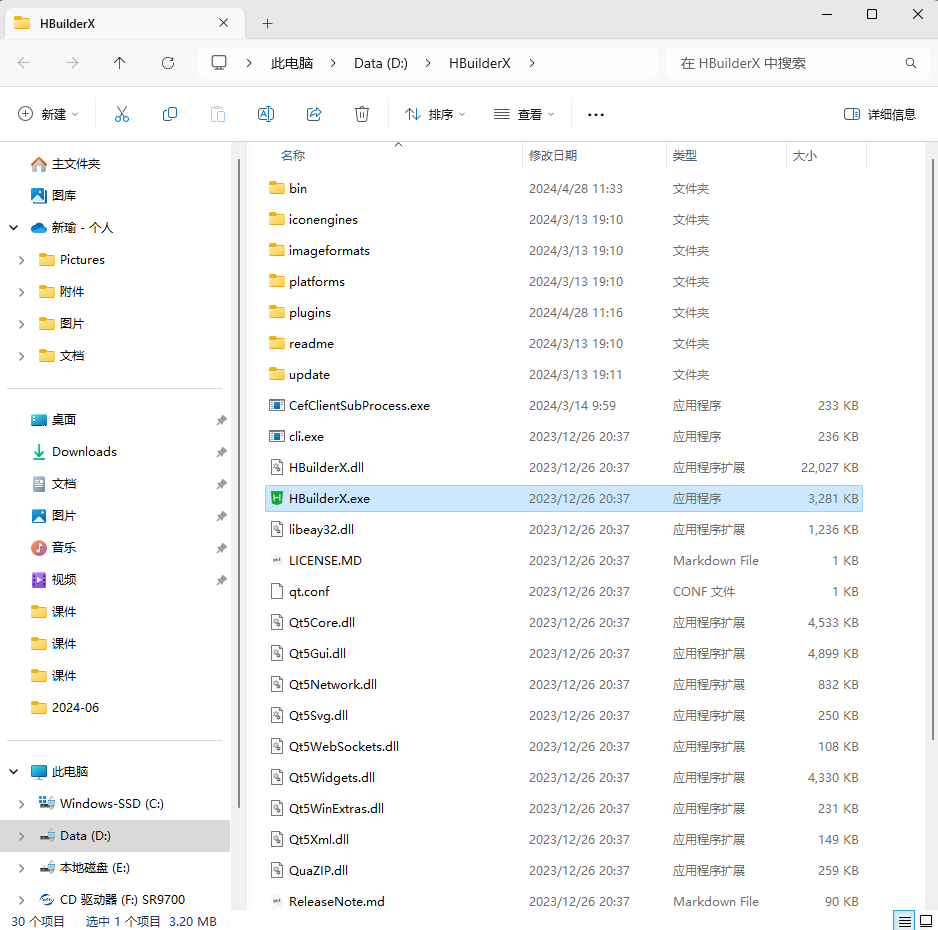

# 任务7 项目开发准备

## 7.1 任务描述

​		本任务将完成“玉米客”项目开始前的开发准备工作，主要包括了解开发中使用的项目资源和项目资源使用方法，以及创建项目开发目录。尽可能详细地为读者讲解如何使用HBuilderX创建uni-app项目和项目文件，引导读者以全局视野了解uni-app项目，形成以系统思维方式解决问题的习惯。

## 7.2 任务效果

> 如下图所示：


## 7.3 任务目标

### 7.3.1 知识目标

- [ ] 了解项目创建的流程
- [ ] 了解项目中环境变量的作用
- [ ] 了解前端跨域概念
- [ ] 掌握搭建前端开发环境的方法

### 7.3.2 能力目标

- [ ] 能够在Windows操作系统中安装HBuilderX
- [ ] 能够在Windows操作系统中安装微信开发者工具
- [ ] 能够使用HBuilderX创建uni-app项目
- [ ] 能够使用HBuilderX运行项目预览效果
- [ ] 能够使用网络代理解决前端跨域问题
- [ ] 能够使用环境变量实现配置统一管理

## 7.4 知识储备

### 7.4.1 HBuilderX

HBuilderX是一款功能强大的集成开发环境（IDE），专为前端开发者设计。

#### （1） 基础概述

- **开发商**：HBuilderX由DCloud公司开发，是HBuilder的下一代产品。
- **平台支持**：支持跨平台运行，可以在Windows、macOS和Linux等操作系统上使用。
- **用户基数**：目前已有500万开发者使用HBuilderX。

#### （2）主要功能

- **集成化工具**：HBuilderX不仅是一个编辑器，还集成了代码编辑器、项目管理器、调试器等工具，为开发者提供完整的开发环境。
- **多语言支持**：支持多种编程语言，如HTML、CSS、JavaScript、Vue.js、React等，满足全栈开发需求。
- **智能编辑**：提供智能代码补全、代码折叠、语法高亮等功能，提高编码效率。
- **实时预览和调试**：内置浏览器，支持实时预览和调试网页效果，无需频繁切换窗口。
- **插件扩展**：支持多种插件扩展，包括Git、SVN等版本控制工具，以及各类语言支持和代码格式化插件。
- **项目管理**：提供强大的项目管理功能，支持多项目同时管理，方便创建、打开、关闭和删除项目。

#### （3）特色和优势

- **性能优化**：HBuilderX对性能进行了优化，启动速度快，响应速度快，提高了开发效率。
- **云端同步**：支持云端同步，用户可以在多个设备之间同步自己的项目和文件。
- **代码版本控制**：集成了Git等版本控制工具，方便用户进行代码版本管理和协作开发。
- **内置终端**：内置终端，用户可以直接在IDE内部进行命令行操作，方便快捷。
- **社区支持**：拥有庞大的开发者社区，用户可以快速找到解决问题的方法和资源。
- **自动化构建**：支持自动化构建，可以快速构建项目。

#### （4）应用场景

​		HBuilderX在实际开发中应用广泛，无论是前端开发、后端开发还是全栈开发，都能提供强大的支持。特别是对于前端开发者来说，HBuilderX内置了多种前端框架和库的支持，如Vue.js、React、Angular等，可以大大提高开发效率。

### 7.4.2 uni-app

​		uni-app是一个使用Vue.js开发所有前端应用的框架，其核心理念是“编写一套代码，发布到多个平台”。具体来说，开发者通过uni-app编写一套代码后，可以将其发布到iOS、Android、Web（响应式）、以及各种小程序（如微信、支付宝、百度等）和快应用等多个平台。

#### （1）产生背景与发展历程

- DCloud公司自2012年开始研发小程序技术，并推出了HBuilder开发工具。
- 2015年，DCloud正式商用了自己的小程序产品“流应用”，这是一个接近原生功能和性能的App，并且即点即用，首次使用时可以边下载边使用。
- 为了进一步推广这一技术，DCloud开发了uni-app，旨在帮助开发者用一套代码构建多个平台的应用。

#### （2）主要功能

- **跨平台开发**：uni-app的核心功能之一，支持一次编写，多端运行。
- **丰富的组件库**：提供了包括基础组件、表单组件、交互组件等在内的丰富组件库，方便开发者快速构建页面。
- **页面设计**：支持创建多个页面，每个页面可以有不同的模板、组件和样式，同时支持响应式布局。
- **状态管理**：提供了Vuex状态管理方案，方便开发者统一管理和控制应用中的状态。
- **代码编辑**：内置Code Snippet代码块，帮助开发者快速完成代码片段，提高开发效率。
- **预览和调试**：支持在IDE中直接进行预览和调试，同时提供了多平台真机预览模拟器。
- **打包和发布**：支持不同平台的打包和发布，内置应用签名和打包环境检测功能。

#### （3）使用场景

uni-app的使用场景非常广泛，包括但不限于以下领域：

- **电商应用**：帮助电商企业快速搭建多平台电商店铺。
- **社交&媒体应用**：开发跨平台的社交、新闻应用。
- **企业应用**：构建内部管理系统、客户服务平台等。
- **教育应用**：开发在线课程、作业管理、师生互动等教育应用。
- **生活服务应用**：如旅游、餐饮、医疗等领域。
- **金融应用**：开发跨平台的金融应用，支持转账、支付、投资等功能。
- **游戏应用**：开发轻量级的小游戏应用。

​		uni-app以其跨平台、高效率、低成本的特性，成为前端开发者的重要工具之一。无论是个人开发者还是大型企业，都可以通过uni-app快速构建和发布多平台应用。

### 7.4.3 Promise 

​		Promise 是 JavaScript 中的一个对象，用于处理异步操作。Promise 对象表示一个最终可能完成（也可能被拒绝）的异步操作及其结果值。这使得异步代码可以更加容易地组合和错误处理。

#### （1）状态

`Promise` 是一个代表异步操作最终完成或失败的对象。有三种状态：

- **Pending（待定）**：初始状态，既不是成功，也不是失败状态。
- **Fulfilled（已实现）**：意味着操作成功完成。
- **Rejected（已拒绝）**：意味着操作失败。

一旦 Promise 的状态从 Pending 变为 Fulfilled 或 Rejected，将保持不变。

#### （2）作用

Promise 主要用于以下场景：

- **解决回调地狱（Callback Hell）**：传统的异步编程使用回调函数，当多个异步操作需要依次执行时，会导致回调函数嵌套过深，难以理解和维护。Promise 通过链式调用的方式解决了这个问题。
- **提高代码的可读性和可维护性**：使用 Promise 可以使异步代码更加结构化和清晰，易于理解和维护。
- **错误处理**：Promise 提供了 `.catch()` 方法来统一处理异步操作中的错误，使得错误处理更加集中和方便。

#### （3）使用方法

使用 Promise 通常包括以下步骤：

- **创建 Promise**：使用 `new Promise()` 构造函数创建一个 Promise 对象，并在其执行器（executor）中执行异步操作。执行器接收两个参数：`resolve` 和 `reject`，分别用于在异步操作成功时调用和失败时调用。

```javascript
const promise = new Promise((resolve, reject) => {  
  // 异步操作  
  setTimeout(() => {  
    if (/* 异步操作成功 */) {  
      resolve('操作成功');  
    } else {  
      reject('操作失败');  
    }  
  }, 1000);  
});
```

- **处理 Promise**：使用 `.then()` 方法处理 Promise 的成功状态，使用 `.catch()` 方法处理 Promise 的失败状态。

```javascript
promise  
  .then(result => {  
    console.log(result); // 输出 '操作成功'  
  })  
  .catch(error => {  
    console.error(error); // 输出 '操作失败'  
  });
```

- **链式调用**：`.then()` 方法可以返回一个新的 Promise，因此可以进行链式调用。这允许将多个异步操作串联起来，形成一个清晰的执行流程。

```javascript
promise  
  .then(result1 => {  
    // 处理 result1  
    return new Promise(/* 另一个异步操作 */);  
  })  
  .then(result2 => {  
    // 处理 result2  
  })  
  .catch(error => {  
    // 处理错误  
  });
```

- **Promise.all**：当需要等待多个 Promise 都完成时，可以使用 `Promise.all()` 方法。接受一个 Promise 数组作为参数，并返回一个新的 Promise，该 Promise 在所有给定的 Promise 都成功时解析，或者在任何一个 Promise 失败时拒绝。

```javascript
Promise.all([promise1, promise2, promise3])  
  .then(results => {  
    // 所有 Promise 都已完成，results 是一个包含所有结果的数组  
  })  
  .catch(error => {  
    // 至少有一个 Promise 被拒绝  
  });
```

- **Promise.race**：`Promise.race()` 方法返回一个新的 Promise，该 Promise 在给定的 Promise 数组中的任何一个 Promise 变为 fulfilled 或 rejected 时，以相同的值解析或拒绝。

​		Promise通过封装异步操作并提供链式调用的方式，使得异步编程变得更加清晰和易于管理。在实际开发中，Promise已经被广泛应用于网络请求、文件操作等场景。

### 7.4.4 公共样式

​		在 uni-app 中，全局样式（通常定义在 `App.vue` 文件的 `<style>` 标签中，并且没有使用 `scoped` 属性）对整个应用的所有页面和组件都有效。全局样式在 uni-app 开发中扮演着重要的角色。

**作用：**

- **统一应用风格**：全局样式可以用来定义应用的整体风格，如字体、颜色、边距、背景等。通过设置全局样式，可以确保整个应用在视觉上保持一致性，增强用户体验。
- **减少重复代码**：在多个页面或组件中，可能需要使用相同的样式规则。通过定义全局样式，可以避免在每个页面或组件中重复编写相同的样式代码，减少代码冗余，提高开发效率。
- **快速修改样式**：当需要修改应用的整体风格时，只需要修改全局样式即可。这样，所有引用该全局样式的页面和组件都会自动更新样式，无需手动修改每个页面或组件的样式代码。
- **实现全局布局**：全局样式可以用来定义整个应用的布局结构，如页眉、页脚、导航栏等。这些布局元素在多个页面或组件中可能都需要使用，通过全局样式可以方便地实现这些元素的统一布局。
- **覆盖组件默认样式**：有些组件可能具有默认的样式，但在某些情况下，可能需要修改这些默认样式。通过全局样式，可以覆盖组件的默认样式，实现自定义的外观。
- **优化性能**：虽然全局样式本身并不直接优化性能，但通过合理地使用全局样式来减少代码冗余和重复，可以降低浏览器解析和渲染页面的负担，从而提高应用的性能。

​		需要注意的是，虽然全局样式具有很多优点，但过度使用也可能导致一些问题。例如，全局样式可能会影响到不期望被影响的页面或组件，导致样式冲突。因此，在使用全局样式时，需要谨慎考虑其作用范围，并尽量避免使用过于通用的选择器。同时，也可以结合组件样式（使用 `scoped` 属性）来实现更精细的样式控制。

## 7.5 任务实施

### 子任务7-1 搭建前端开发环境

​		本任务将搭建“玉米客”项目所需的前端开发环境，将使用HBuilderX作为集成开发环境（IDE）进行代码编写和语法检查，并利用其内置功能或安装相关插件（如ESLint）来确保代码质量。同时，为了在微信小程序中预览和调试项目，将配置并使用微信开发者工具。这两个工具的组合将为提供一个高效、全面的前端开发环境，支持项目的开发、测试及部署。

#### 步骤一 安装HBuilderX

​		“工欲善其事，必先利其器”，选择一个合适的开发工具可以大大提高开发效率和软件质量。“玉米客”项目使用uni-app官方推荐的HBuilderX作为开发工具。HBuilderX是uni-app官方团队推荐使用的开发工具，内置相关环境，安装即可使用，无需配置NodeJS。

（1）下载安装包

​		使用浏览器打开官方下载地址https://www.dcloud.io/hbuilderx.html，单击“Download for Windows”下载按钮，会默认下载适配当前系统的最新版本HBuilderX。如下图所示。


（2）解压安装包

​		将下载的HBuilderX压缩包解压到系统本地磁盘中，注意存放路径不能包含中文。如下图所示。



（3）创建快捷方式

​		在解压后的文件夹中找到HBuilderX.exe，右键创建桌面快捷方式，方便后期快速打开开发工具。如下图所示。


（4）打开HBuilderX

​		双击桌面HBuilderX快捷方式，打开如下图所示页面，说明HBuilderX安装完成。


若解压完成后无法打开HBuilderX，可参考官方启动问题排查指南：https://book.change.tm/u/a10。

#### 步骤二 安装微信开发者工具

​		微信开发者工具是微信官方推出的一款开发工具，能够帮助开发者简单和高效地开发和调试微信小程序，集成了公众号网页调试和小程序调试两种开发模式。使用HBuilderX开发和调试微信小程序项目，需要依赖于微信开发者工具完成。

（1）下载安装包

使用浏览器打开官方下载地址，选择稳定版根据系统配置下载相应安装包，如下图所示。下载地址：https://developers.weixin.qq.com/miniprogram/dev/devtools/stable.html。


（2）安装微信开发者工具

​		双击下载的exe安装包，根据提示进行安装即可。

​		已经完成了HBuilderX和微信开发者工具的安装，在后面实施过程中将对两个开发工具进行配置，使HBuilderX能够调用微信开发者工具进行项目调试。

### 子任务7-2 创建项目开发目录

​		本任务将创建“玉米客”项目开发目录。这个目录将作为项目文件的存放地，并用于组织和管理与项目相关的所有文件和资源。在创建项目开发目录时，可以选择一个易于访问和管理的位置，比如个人工作空间或项目专用文件夹，并使用一个具有描述性的名称来命名该目录，以便日后能够清晰地识别。通过创建这样一个专门的目录，可以为项目的顺利进行奠定一个良好的基础。

#### 步骤一 新建项目

​		单击HBuilderX顶部工具栏【文件】->【新建】->【项目】打开新建项目界面，选择“uni-app”项目，输入项目名称选择存放路径（项目名称与存放路径应避免出现中文及特殊字符）进行创建。如下图所示。


#### 步骤二 认识项目目录

​		在项目创建完成后，系统会自动生成一些目录和文件，即项目的初始目录和文件，比如静态资源目录、页面文件目录、入口页面文件、项目配置文件等等，后面会在这些目录和文件基础上完成“玉米客”项目的开发。

​		创建项目时，选择不同的模板生成的项目目录和文件是不同的，在本项目中选择的是uni-app的默认模板。下面来了解一下使用默认模板创建的项目目录和文件的作用，如下图所示。

​		项目初始目录和文件在开发中各自都有明确的用途，在开发时务必注意以下几点：

- 编译到任意平台时，static目录下文件会被完整打包进去且不会编译，非static目录下的文件（如，Vue文件、 JavaScript文件、CSS文件等）只有被引用时才会被打包编译进去。

- static目录下的JavaScript文件不会被编译，如果里面有ES6的代码，不经过转换直接运行，在手机设备上会报错。

- CSS、Less、Sass等资源不要放在static目录下，建议将这些公用的资源放在自建的common目录下。

- HBuilderX 1.9.0+支持在根目录创建ext.json、sitemap.json等小程序需要的文件。


- `pages`：存放所有页面。每个页面由`.vue`文件、配置文件（如`main.js`）和`App.vue`组成。
- `static`：存放应用引用静态资源，如图片、字体等。
- `App.vue`：应用入口文件，配置全局样式和导航栏。
- `main.js`：应用的主进程，主要作用是初始化Vue实例并使用需要的插件。
- `manifest.json`：配置应用名称、应用描述、平台目标、版本号等打包信息。
- `pages.json`：配置页面路径、窗口表现、导航条、选项卡等页面类信息。

#### 步骤三 运行项目

​		使用HBuilderX开发uni-app项目时可以实时运行项目预览效果，如运行项目到微信小程序、百度小程序、APP和H5应用等。“玉米客”项目将发布到微信小程序，因此本任务在讲解时将项目运行到微信小程序来查看任务实现效果（在实际开发中运行到最终预发布的平台即可）。

​		通过HBuilderX的“运行到小程序模拟器”功能可以运行项目预览效果，但实际上HBuilderX本身并不能真正的运行小程序，而是需要借助小程序运营商提供的开发者工具来实现。运行项目到微信小程序则需要借助微信开发者工具，请确认是否安装了微信开发者工具。

​		完成微信开发者工具的安装后，需要在HBuilderX中配置开发者工具的安装路径，单击HBuilderX顶部菜单栏【运行】->【运行到小程序模拟器】->【运行设置】打开配置界面，然后单击“浏览”，选择微信开发者工具安装路径。

​		使用HBuilderX“运行到小程序模拟器”功能还需要开启微信开发者工具的服务端口选项，否则HBuilderX会因无法获取微信开发者工具的服务权限而提示“工具的服务端口已关闭”。单击微信开发者工具顶部菜单栏【设置】->【安全设置】，开启“服务端口”。如下图所示。

​		完成上面的配置之后，便可以通过单击HBuilderX顶部菜单中【运行】->【运行到小程序模拟器】->【微信开发者工具】调起微信开发者工具预览项目效果。需要注意的是在项目中创建了新的目录或文件后，需要重新运行项目才能使这些新建的目录或文件生效。项目预览效果如下图所示。

|  |  |
| ------------------------------------------------------------ | ------------------------------------------------------------ |
| 开启服务端口                                                 | 项目预览效果                                                 |

------

### 子任务7-3 封装网络请求

　　本任务中将会实现对网络请求进行封装，在封装方法配置接口的请求地址和公共请求参数，添加接口响应状态的公共处理方法等等，以便实现对请求和响应的管理和后期的维护、拓展。下面将网络请求封装到一个单独的文件中。

#### 步骤一  创建方法文件导入基础URL

　　在程序根目录下创建名为`api`的目录，用于存放项目开发中所需的工具代码文件，例如网络请求封装方法文件。在`/api`目录下新建`js`文件，文件命名为`request.js`，文件最终路径为`api/request.js`。定义线上环境的基础URL，用于后续HTTP请求的地址拼接。使得在修改服务器地址时，只需要修改这一处，而不需要在代码中到处查找和替换。代码如下。

>文件路径：api/request.js

```js
// 线上环境的基础URL  
export const BASEURL = 'http://10.2.34.13:10006';
```

#### 步骤二 HTTP请求工具函数

​		封装HTTP请求的逻辑，包括请求前处理、发送请求、响应处理等。提供统一的接口供外部调用，使得在项目中发起HTTP请求变得简单和一致。

```js
// HTTP请求工具函数  
const http = {  
    baseUrl: BASEURL,  
    // ... 省略了其他部分  
};  
  
// 导出http工具函数  
export default http;
```

#### 步骤三 请求方法（request）

​		负责发送实际的HTTP请求。在发送请求前，可以进行一些预处理，如添加请求头、显示加载状态等。在收到响应后，可以进行一些响应处理，如隐藏加载状态、处理错误等。

```js
// 请求方法  
request(config) {
		config = beforeRequest(config);
		// 显示加载中状态
		uni.showLoading({
			title: '加载中...',
			mask: true
		});

		// 请求地址拼接
		config.url = this.baseUrl + config.url;
		const token = uni.getStorageSync('token');
		const businesstoken = uni.getStorageSync('businesstoken');
		if (token || businesstoken) {
			config.header = {
				...config.header,
				businesstoken,
				token
			};
		}
		// 异步请求
		return new Promise((resolve, reject) => {
			uni.request(config).then(res => { // 成功
				let {
					data
				} = res;
				// 响应拦截
				const response = beforeResponse(data);

				// 隐藏加载状态
				uni.hideLoading();

				resolve(response);
			}).catch(err => { // 失败
				errorHandle(err)
				// 隐藏加载状态
				uni.hideLoading();

				reject(err);
			})
		})

	},
```

#### 步骤四 封装后的HTTP请求（http）

​		提供一个更简洁、更易于使用的接口来发起HTTP请求。隐藏底层HTTP请求的细节，使得调用者只需要关注请求的URL、数据、方法等参数。

```js
// 封装后的HTTP请求  
	// url：HTTP请求的目标URL。
	// data：包含要随请求发送的数据的对象。这可能包括POST请求的参数或服务器所需的其他数据。
	// auth：一个布尔值，指示是否需要身份验证（true）。
	// method：用于请求的HTTP方法（默认为'GET'）。
	// path：一个可选的路径参数。
	http(url, data = {}, auth = false, method = 'GET', path = '') {
		const token = uni.getStorageSync('token');
		if (path) {
			url = url + '/' + path
		}
		return this.request({
			url: url,
			data: data,
			auth: auth,
			timeout: 10000,
			method: method
		})
	},
```

#### 步骤五 请求前处理（beforeRequest）

​		在发送HTTP请求前，对请求进行预处理。可以用于添加公共的请求头、处理请求数据等。使得在多个请求中共享相同的预处理逻辑变得简单。

```js
// 请求前处理函数（这里只是一个示例，实际可能包含更多逻辑）  
const beforeRequest = (config) => {
	return config
}
```

#### 步骤六 响应处理（beforeResponse）

​		在收到HTTP响应后，对响应进行响应处理。可以用于处理响应数据、检查响应状态码等。在某些情况下，可以根据响应数据做出不同的操作，如跳转到登录页面、显示错误信息等。

```js
// 响应处理函数  
const beforeResponse = (response) => {
	if (response.code == -401) {
		uni.reLaunch({
			url: '/pages/Login/Login',
		});
		uni.clearStorageSync();
	}

	return response
}
```

#### 步骤七 错误处理（errorHandle）

​		负责处理HTTP请求过程中出现的错误。可以记录错误信息、显示错误提示等。使得在请求失败时，能够有一个统一的错误处理流程。

```js
// 错误处理函数  
const errorHandle = ((err) => {
	console.log('请求异常', err)
})
```

### 子任务7-4 定义公共样式

​		本任务将在“玉米客”项目中，定义公共样式来确保页面元素的一致性和可复用性。这些公共样式将包含项目中通用的CSS样式规则，如字体、颜色、间距、边框等，将被应用于多个页面或组件中。通过定义公共样式，可以减少代码的冗余，提高代码的可维护性，并确保整个项目在视觉上的一致性和和谐性。在编写公共样式时，将遵循CSS的最佳实践和编码规范，确保样式的清晰、简洁和易于理解。

##### 代码实现

​		在`App.vue`文件中编写公共样式，可以在`<script>`标签中使用生命周期钩子来处理应用启动时的各种操作。`onLaunch`（应用启动时），`onShow`（应用启动后首次显示或从后台进入前台时），用户在应用中操作，可能会多次触发 `onShow` 和 `onHide`，取决于用户如何与应用交互。

​	注意：这些钩子通常定义在 `App.vue` 文件中，而不是普通的页面组件中。代码如下。

>文件路径：/App.vue
>
>Javascript部分

```js
<script>
	// 导出默认应用程序对象
    export default {
      // 应用程序启动时的生命周期钩子
      onLaunch: function() {
        console.log('App Launch'); // 当应用程序启动时，在控制台打印消息
      },
      // 应用程序显示时的生命周期钩子
      onShow: function() {
        console.log('App Show'); // 当应用程序显示时，在控制台打印消息
      },
      // 应用程序隐藏时的生命周期钩子
      onHide: function() {
        console.log('App Hide'); // 当应用程序隐藏时，在控制台打印消息
      }
    }

</script>
```

​		在 uni-app 中，`<style>` 标签用于定义组件的样式。这些样式在组件被加载和渲染时会被应用到组件的 DOM 元素上。但是，样式本身并没有一个明确的“执行顺序”，因为是不能执行的代码。相反，浏览器可以解析并应用到页面上的元素上。然而，有一些与样式相关的概念可能会影响样式的应用：如果多个样式规则适用于同一个元素，那么特异性更高的规则将优先应用。在相同的特异性下，后出现的规则会覆盖先出现的规则（除非被 `!important` 标记覆盖）。在 uni-app 中，组件的样式默认只作用于该组件本身，但也可以使用 `scoped` 属性或特定的 CSS 规则来改变这一点。代码如下。

>文件路径：/App.vue
>
>css部分

```css
<style>
	/*每个页面公共css */
	.content {
		background: rgba(245, 245, 245, 1);
		min-height: 100vh;
		padding: 32rpx 32rpx 0 32rpx;
	}
	
	.btn {
		z-index: 99;
		position: fixed;
		bottom: calc(var(--status-bar-height) + 16px);
		left: 50%;
		transform: translateX(-50%);
		width: calc(100% - 36*2rpx);
		box-sizing: border-box;
		height: 96rpx;
		border-radius: 8rpx;
		background: rgba(255, 195, 0, 1);
		font-size: 36rpx;
		color: #FFFFFF;
		display: flex;
		align-items: center;
		justify-content: center;
	}
</style>	
```
