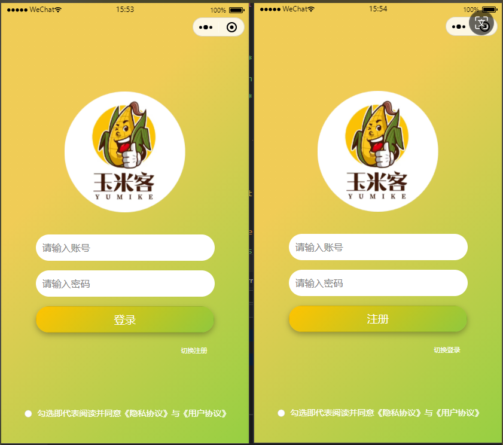
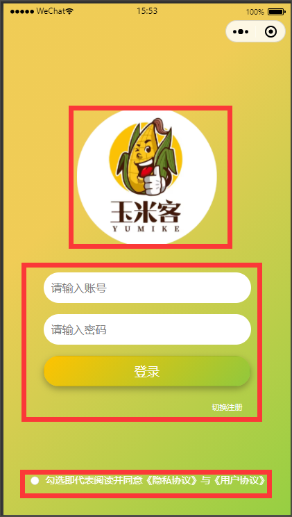
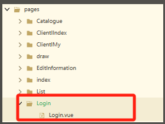
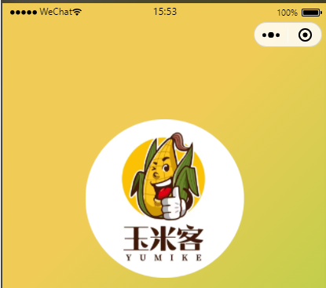
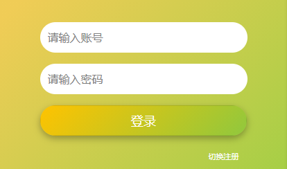

# 任务8 实现登录与注册相关功能

## 8.1 任务描述

​		本任务将实现玉米客应用的用户登录功能。在多种用户登录方式中，例如通过账号密码、手机号或邮箱、第三方平台账号（例如QQ、微信、微博等）以及小程序授权，考虑到玉米客应用是基于我国自主开发的跨平台应用框架uni-app构建的，最终决定采用传统的账号密码登录方式。

## 8.2任务效果

>如下图所示



## 8.3 学习目标

### 8.3.1 知识目标

- [ ] 了解常用登录方式。
- [ ] 了解请求封装及其优点。
- [ ] 掌握页面路由的配置
- [ ] 掌握如何使用Vue实现后端数据绑定。
- [ ] 掌握本地缓存技术的使用。
- [ ] 掌握uni-app中条件编译的使用。
- [ ] 掌握Sass基础语法

### 8.3.2 能力目标

- [ ] 能够使用uni-app调用后端接口。
- [ ] 能够独立配置页面的路由和导航，包括设置路由参数、页面跳转规则等。
- [ ] 能够使用本地缓存技术实现维护用户登录状态的功能。
- [ ] 能够熟练掌握Vue框架，实现前端与后端数据的双向绑定。
- [ ] 能够理解和编写Sass基础代码，如变量、嵌套规则、混合（mixin）和函数等，利用这些特性提升CSS代码的可读性和可维护性。 

## 8.4 知识储备

### 8.4.1 HTTP请求

​		HTTP(HyperText Transfer Protocol,超文本传输协议 )是一套计算机通过网络进行通信的规则。通过HTTP，可以使客户端（如Web浏览器）从服务端（如Web服务器）请求信息和服务。HTTP遵循请求（Request）/应答（Response）模型，即客户端向服务端发送请求，服务端处理请求并返回应答，所有HTTP连接都被构造成一套请求和应答。

#### 1.请求方法

​		根据HTTP标准，HTTP请求可以使用多种方法。HTTP 10定义了三种诸求方:GET、HEAD 和POST。HTTP1.1新增了五种请求方法:PUT、DELETE、CONNBCT、OPIIONS、TRACE。其中常用的请求方法有GET和POST

| 请求方法 | 描述                                                         |
| -------- | ------------------------------------------------------------ |
| GET      | 请求指定的页面信息，并返回实体主体                           |
| HEAD     | 类似于GET请求，只不过返回的响应中没有具体的内容，用于获取报头 |
| POST     | 向指定资源提交数据进行处理的请求(如提交表单或者上传文件)。数据被包含在请求体中。POST请求可能会导致新的资源的建立和/或已有资源的修改 |
| PUT      | 从客户端向服务器传送的数据取代指定文档的内容                 |
| DELETE   | 请求服务器删除指定的页面                                     |
| CONNECT  | HTTP1.1协议预留的能够将连接改为管道方式的代理服务器          |
| OPTIONS  | 允许客户端查看服务器的性能                                   |
| TRACE    | 回显服务器收到的请求，主要用于测试或诊断                     |

#### 2. 常见响应状态码

​		当用户访问一个网络资源时，客户端会向服务器发出请求。当服务器响应请求时，首先会返回一个包含HTTP 状态码(HTTP Status Code ) 的信息头(Server Header)给客户端。

​		HTTP状态码由3个十进制数字组成，第一个十进制数字定义了状态码的类型，分为玉数信息响应(100~199)、成功响应(200~299)、重定向(300~399)、客户端错误(400~49)和服务器错误(500~599)。

| 状态码 | 描述                                                         |
| ------ | ------------------------------------------------------------ |
| 100    | Continue 继续。客户端应继续请求                              |
| 200    | OK，请求成功                                                 |
| 201    | Created 已创建。成功请求并创建了新的资源                     |
| 202    | 已接受。已经接受请求，但并未处理完成                         |
| 204    | No Content 无内容。服务器成功处理，但并未返回内容            |
| 206    | 部分内容。服务器成功处理了部分Get请求                        |
| 301    | 永久移动。请求的资源已被永久移动到新的URL，返回信息会包括新的URL，浏览器会自动定向到新URL，今后任何新的请求都应使用新的URL代替 |
| 302    | 临时移动。与301类似，但资源只是临时移动，客户端应继续使用原有的URL |
| 304    | 未修改。所请求的资源未修改，服务器返回此状态码时，不会返回任何资源，客户端通常会缓存访问过的资源，通过提供一个头信息指出客户端希望只返回在指定日期之后修改的资源 |
| 305    | 使用代理。所请求的资源必须通过使用代理访问。                 |
| 400    | 客户端请求的语法错误，服务器无法理解                         |
| 401    | 请求要求用户的身份认证                                       |
| 403    | 服务器理解请求客户端的请求，但是拒绝执行此请求               |
| 404    | 服务器无法根据客户端的请求找到资源，通过此状态码设计人员可以设置无法找到资源的个性页面 |
| 405    | 客户端中的请求方法被禁止                                     |
| 408    | 服务器等待客户端发送的请求时间过长，超时                     |
| 414    | 请求的URL过长，服务器无法处理                                |
| 500    | 服务器内部错误，无法完成请求                                 |
| 505    | 服务器不支持请求的HTTP协议的版本，无法完成处理               |

### 8.4.2 路由

​		在uni-app中，路由是指确定应用程序中不同页面之间的导航规则和路径的机制。它允许用户在应用中进行页面之间的切换和导航。

#### 1. 路由的主要功能

- **页面导航**：路由允许开发者定义应用程序中不同页面之间的跳转路径，使用户能够在不同的页面之间自由切换。
- **页面管理**：通过路由，开发者可以清晰地管理应用程序中的页面结构，包括页面的创建、配置和跳转等。
- **参数传递**：路由还支持页面之间的参数传递，使得页面之间的数据交互更加便捷。

#### 2. 路由的使用步骤

在uni-app中，路由的使用主要涉及以下几个方面：

1. ##### 路由配置：

   - 在`pages.json`文件中配置每个路由页面的路径及页面样式。类似小程序在`app.json`中配置页面路由。
   - 每个路由页面配置为一个对象，包括`path`（页面路径）、`style`（页面窗口表现）等属性。
   - 如果需要传递参数，可以在页面路径中添加查询参数，如`/pages/detail/detail?id=1`。

2. ##### 路由跳转：

   - uni-app提供了多种API用于页面跳转，包括`uni.navigateTo`、`uni.redirectTo`、`uni.reLaunch`、`uni.switchTab`等。
   - 这些API的使用场景略有不同，具体取决于项目需求。例如，`uni.navigateTo`用于打开新页面并保留当前页面，`uni.redirectTo`用于关闭当前页面并打开新页面等。

3. ##### 路由参数传递：

   - 在页面跳转时，可以通过URL参数的方式传递数据。在页面A跳转到页面B时，可以在URL中拼接参数，然后在页面B的`onLoad`函数中通过`this.$route.query`获取参数值。

4. ##### 路由封装：

   - 对于复杂的项目，可以通过封装路由来简化代码和提高可维护性。例如，在`pages.json`中为页面配置`routeName`字段，并在路由管理文件中根据这个字段创建路由映射表。
   - 然后，在需要跳转的地方使用路由名称而不是具体的路径进行跳转，这样可以减少错误和提高代码的可读性。

5. ##### 路由守卫：

   - uni-app没有直接提供路由守卫的功能，但开发者可以通过在页面的`onLoad`、`onShow`等生命周期函数中添加逻辑来实现类似的效果。例如，在页面的`onLoad`函数中检查用户是否登录，如果没有登录则跳转到登录页面。

6. ##### 自定义导航栏：

   - 在uni-app中，开发者还可以自定义页面的导航栏样式和行为。这可以通过在页面的`json`配置文件中设置`navigationBarTitleText`、`navigationBarBackgroundColor`等属性来实现。

通过以上步骤，开发者可以在uni-app中有效地使用路由来实现页面的跳转、管理和参数传递等功能。

## 8.5 任务实施

### 子任务8-1 制作登陆与注册页面

#### 步骤一 页面结构分析与搭建

​		前端工程师的一项重要工作是将项目的设计图1:1还原成网页，此过程在开发中俗称为“切图”。前端工程师在切图前首先要明确项目的设计规范（如主题颜色、尺寸单位、基础间距等），从而做好切图前的准备工作（如抽离公共样式变量、方法等），然后再分析设计图中页面结构和动态交互效果，通过代码将设计图制作成网页。

​		分析设计图时可以按照页面内容和交互效果的关联度将页面划分为整体和局部区域，关联程度大的局部区域共同组成一个整体区域，这样划分页面不仅方便布局，同时能够精简代码，使代码结构更加清晰。由于设计图中无法展示动态的交互效果，因此“玉米客”项目中涉及的动态交互效果会在分析设计图时通过文字进行描述。

（1）设计图分析

​		设计图分析可以帮助开发人员在开发早期理解和预测可能出现的问题，从而优化设计，减少后期的修改和调试工作，提高软件开发的效率。


​		根据登录与注册页面的布局和内容相关性，可以将页面划分为三个主要区域：品牌标识区域，用户输入区域和隐私与用户协议区域。如下图所示。



（2）代码实现

​		在 pages文件下，新建一个Login文件夹并在该文件下创建Login.vue文件。 如图所示：



​		uni-app提供了一个类似于HTML中div的视图容器组件view，在本任务及后面其他任务中会经常使用view组件进行页面搭建。关键代码如下。

> 文件路径：/pages/Login/Login.vue    
>
> template部分

```html
    <template>
        <view class="contents">
            <view class="login-img">
                <!-- 品牌区域 -->
            </view>
            <view class="input-group">
                <!-- 用户输入区域 -->
            </view>
            <view class="login-radio">
                <!--隐私与用户协议区域-->
            </view>
        </view>
    </template>
```

​		为了确保登录与注册页面能够正确地显示，需要在路由配置文件中设置正确的路径和关联的组件。在`pages.json`文件中，定义一个路由规则，将`/pages/Login/Login`路径映射到登录页面的组件。这样，当用户访问这个路径时，应用程序会渲染对应的登录注册页面组件。		

> 文件路径：pages.json
>
> 代码如下：

```javascript
{"pages": [ //pages数组中第一项表示应用启动页
    {
			"path": "pages/index/index",
			"style": {
				"navigationBarTitleText": "",
				"enablePullDownRefresh": false
			}
		},
	{
			"path": "pages/Login/Login",
			"style": {
				"navigationBarTitleText": "登录",
				"enablePullDownRefresh": false,
				"navigationStyle": "custom"
			}
		},
]
"globalStyle": {
		"navigationBarTextStyle": "black",
		"navigationBarTitleText": "uni-app",
		"navigationBarBackgroundColor": "#F8F8F8",
		"backgroundColor": "#F8F8F8"
	},
	"uniIdRouter": {},
	}

```

#### 步骤三 制作商业品牌区域

（1）设计图分析

​		根据设计图可知商业品牌区域包含商家品牌logo。如图所示。



（2）代码实现

​		配套照片在相关课件素材目录下 ，为了确保图片能够正确地显示在微信小程序中，请将配套的照片放置在小程序的`static`目录下，并在此目录下新建一个名为`login`的文件夹。然后将相关课件中的图片移动到这个新建的`login`文件夹中。后续将不再赘述。

> 文件路径：pages/Login/Login.vue        
>
> template部分	

```html
<template>
    <!-- 登录页面内容容器 -->
    <view class="contents">
      <!-- 登录图像容器 -->
      <view class="login-img">
        <!-- 登录图像，使用本地静态资源 -->
        <image src="/static/login/logos.png" mode="aspectFill" class="img"></image>
      </view>
    </view>
</template>
```

>css部分

```css
<style scoped lang="scss">
.contents {
		min-height: 100vh;
		display: flex;
		flex-direction: column;
		align-items: center;
		justify-content: center;
		background: linear-gradient(135deg, rgba(240, 204, 86, 1) 33.33%, rgba(150, 207, 66, 1) 100%);

		.login-img {
			width: 367rpx;
			height: 367rpx;
			opacity: 1;
			margin-bottom: 68rpx;


			.img {
				width: 100%;
				height: 100%;
			}
		}
    }
</style>
```

#### 步骤四  制作用户输入区域

（1）设计图分析

​		根据设计图可知用户输入区域宝库账号密码输入框，登录按钮和切换注册选择。如图所示。



​	

（2）代码实现

​		用户输入区域采用了`<input>`元素来构建表单，为了实现在同一页面中切换注册和登录功能，我们使用了`v-if`指令来条件渲染不同的按钮。这样，用户可以根据需要选择注册或登录，而无需导航到不同的页面。当用户点击切换按钮时，`v-if`指令会根据当前模式（注册或登录）来显示相应的按钮和表单元素，从而提供了灵活的用户体验。

> 文件路径：pages/Login/Login.vue       
>
> template部分

```html
    <template>
        <!-- 登录页面内容容器 -->
        <view class="contents">
          <!-- 登录图像容器 -->
          <view class="login-img">
            <!-- 登录图像，使用本地静态资源 -->
            <image src="/static/login/logos.png" mode="aspectFill" class="img"></image>
          </view>

          <!-- 输入框组 -->
          <view class="input-group">
            <!-- 账号输入框，使用v-model绑定phone数据 -->
            <input type="text" placeholder="请输入账号" v-model="phone" class="input" />
            <!-- 密码输入框，使用v-model绑定password数据 -->
            <input type="password" placeholder="请输入密码" v-model="password" class="input" />
          </view>

          <!-- 登录和注册按钮容器 -->
          <view class="" style="display: flex;">
            <!-- 注册按钮，仅在isRegisterMode为true时显示 -->
            <button v-if="isRegisterMode" class="login-btn" type="default">注册</button>
            <!-- 登录按钮，仅在isRegisterMode为false时显示 -->
            <button v-else class="login-btn" type="default">登录</button>
          </view>

          <!-- 切换登录和注册模式按钮 -->
          <view v-if="isRegisterMode" class="toggle-mode-btn">切换登录</view>
          <view v-else class="toggle-mode-btn">切换注册</view>
        </view>
    </template>
```

​		在data节点中定义`isChecked`: 一个布尔值，初始为 `false`。这个变量可能在组件的模板中用于表示某个复选框或类似元素的选中状态。`phone`: 一个空字符串，可能用于存储用户的电话号码。`password`: 一个空字符串，用于存储用户的密码。`isRegisterMode`: 一个空字符串，但通常这种变量会用于表示组件的某种模式（如注册或登录）。`toggleMode()`: 这是一个切换 `isRegisterMode` 变量值的方法。但是，由于 `isRegisterMode` 初始为空字符串，这个切换可能不会按照预期工作。如果 `isRegisterMode` 是用来表示注册或登录模式的，那么应该考虑使用布尔值或特定的字符串值。代码如下。

> 文件路径：pages/Login/Login.vue       
>
> JacaScript部分

```js
<script>
    	export default {
            data() {
                return {
                    isChecked: false,
                    phone: '',
                    password: '',
                    isRegisterMode: "",
                };
            },
            methods: {
                 // toggleMode方法用于切换注册/登录模式
                toggleMode() {
                    this.isRegisterMode = !this.isRegisterMode;
                },

            }
	};
</script>
```

> 文件路径：pages/Login/Login.vue       
>
> css部分

```css
<style scoped lang="scss">
.contents {
		min-height: 100vh;
		display: flex;
		flex-direction: column;
		align-items: center;
		justify-content: center;
		background: linear-gradient(135deg, rgba(240, 204, 86, 1) 33.33%, rgba(150, 207, 66, 1) 100%);

		.login-img {
			width: 367rpx;
			height: 367rpx;
			opacity: 1;
			margin-bottom: 68rpx;


			.img {
				width: 100%;
				height: 100%;
			}
		}
    	.input-group {
			width: 100%;
			display: flex;
			flex-direction: column;
			align-items: center;
		}

		.input {
			width: 502rpx;
			height: 80rpx;
			margin-bottom: 30rpx;
			border-radius: 388px;
			background: #fff;
			padding: 0 20rpx;
			// font-size: 36rpx;
		}

		.login-btn {
			display: flex;
			justify-content: center;
			align-items: center;
			width: 540rpx;
			height: 80rpx;
			border-radius: 388px;
			background: linear-gradient(135deg, #FFC300 0%, #90C83D 100%);
			// background-color: #009BF4;
			color: #fff;
			box-shadow: 0px 4px 10px 0px rgba(0, 0, 0, 0.3);

			image {
				width: 48rpx;
				height: 48rpx;
				margin-right: 22rpx;
			}

			text {
				font-size: 40rpx;
				line-height: 40rpx;
				color: #fff;
			}
		}

		.toggle-mode-btn {
			display: flex;
			color: #fff;
			background: transparent;
			font-size: 20rpx;
			margin-left: 420rpx;
			margin-top: 40rpx;
			border: 0; // 清除边框

		}

    }
</style>
```

#### 步骤五 **隐私与用户协议区域**

（1）设计图分析

​		根据设计图可以在页面的底部设置了一个用户权限的提示，用户通过勾选后进行下一步操作。如图所示。


（2）代码实现

​		在隐私与用户协议区域的代码实现中，添加了一个单选按钮组，允许用户在同意隐私协议和用户协议之前进行勾选。这个区域的设计确保用户在注册或登录之前充分理解并同意相关的条款。通过将隐私协议和用户协议的链接集成到单选按钮的文本中，用户可以轻松访问这些文档，以便更好地了解权利和责任。此外，这个区域的样式设计也与整体页面风格保持一致，以确保统一的用户体验。

> 文件路径：pages/Login/Login.vue       
>
> template部分

```html
<template>
	<view class="contents">
		<!--省略其他代码省略-->
		<!-- 登录页面的单选按钮容器 -->
                !
	</view>
</template>
```

​		通过`handleRadioChange`事件来获取单选框的状态，每一次点击都进行一次`isChecked`值的取反，默认是不选中。代码如下。

>文件路径：pages/Login/Login.vue    
>
>JavaScript部分

```js
<script>
    	export default {
            data() {
                return {
                    isChecked: false,
                    //省略其他代码
                };
            },
            methods: {
                //选按钮状态变化的事件
                handleRadioChange() {
                    this.isChecked = !this.isChecked;
                },
                //省略其他代码
            }
	};
</script>
```

>文件路径：pages/Login/Login.vue    
>
>css部分

```css
<style scoped lang="scss">
.contents {
		.login-radio {
			position: fixed;
			bottom: 68rpx;
			left: 0;
			width: 100%;
			display: flex;
			justify-content: center;

			text {
				font-size: 26rpx;
				color: rgba(255, 255, 255, 1);
			}

			// .bottom-text-color {
			// 	color: #
			// }
		}
	}


	.popups {
		background-color: #fff;
		padding: 32rpx;
		border-radius: 15rpx 15rpx 0rpx 0rpx;
		font-size: 28rpx;

		.btn {
			margin-top: 32rpx;
			background-color: rgba(74, 191, 170, 1);
			text-align: center;
			padding: 16rpx 0;
			border: 8rpx;
			border-radius: 8rpx;
			color: #fff;
		}
	}
</style>
```

### 子任务8-2 实现登录与注册相关功能

#### 步骤一 实现登录功能

**1. 逻辑分析**

　　用户通过页面中的输入框输入账号密码点击进行登录.

**2. 接口分析**

　　想要实现账号登录功能需要使用后端提供的用户登录账号密码接口。详情如下。

- API地址：{{API_HOST}}/front/auth/loginByUserName
- API请求方式：GET
- API请求参数：见下表

| 参数字段名 | 参数值 | 数据类型 | 说明 |
| :--------: | :----: | :------: | :--: |
|   phone    |  123   |  String  | 账号 |
|  password  |  123   |  String  | 密码 |

　　API 返回的响应数据示例如下。

```json
{
"success": true,
"code": 200,
"message": "操作成功",
"entity": {
"id": 1, //id值
"createTime": "2024-01-16 15:35:17", //创建时间
"updateTime": "2024-01-16 15:35:22", //更新时间
"nickName": "adx", //用户昵称
"avatar": "https://thirdwx.qlogo.cn/mmopen/vi_32/sqicFCgiaheqB6YsFfpUpNdoftyLsTIicwSSDQsP9YLvBxx7icMWPg415VeAPdVLv4whib1M9Y8CGiav21aoibDBNA9iaQ3s2Wkhg7t375ibts4zZaHM/132", //用户头像
"phone": "554919464", //用户手机号
"state": 1, //状态 1 正常(默认)  2 已禁用
"code": null
}
}
```

（3）代码实现

​		　在任务一中，我们已经封装了网络请求在api/request.js中，所以我们可以直接引用request.js 文件，编写登录接口的方法，代码如下：

> 文件路径：api/user.js

```shell
import http from '@/api/request.js'

// 登录
export function userLogin(params) {
	return http.http('/front/auth/loginByUserName', params, false, 'POST')
}
//注册
export function userRegister (params) {
	return http.http('/front/auth/registerByUserName', params, false, 'POST')
}
```

​		在模板中为登录按钮添加点击事件用于触发登录回调函数。代码如下。

>文件路径：/pages/Login/Login.vue
>
>template部分

```html
<template>
	<view class="contents">
		<!-- 省略其他代码 -->
        
        <!-- 登录按钮容器 -->
		<view class="" style="display: flex;">
			<button v-else class="login-btn" type="default" @click="handleLogin">登录</button>
		</view>
		<!-- 省略其他代码 -->
	</view>
</template>
```

​		在组件中的 `methods` 部分， `handleLogin` 方法定义了用户登录的逻辑。检查 `isChecked` 是否为 `false`，这通常表示用户没有勾选隐私协议和用户协议。如果没有勾选，则使用 `uni.showToast` 方法显示一个提示信息，告诉用户需要先勾选协议，然后方法结束并返回，不再执行后续操作。检查 `phone` 和 `password` 是否为空（即用户是否已输入账号和密码）。如果任一为空，则使用 `uni.showToast` 方法显示一个提示信息，要求用户输入账号和密码，然后方法结束并返回。调用 `userLogin` 方法（该方法可能是从 `@/api/user.js` 或其他文件中导入的），并传入手机号和密码作为参数。使用 `await` 关键字等待登录操作的响应。如果响应中的`success`属性为`true`，表示登录成功。从响应中获取 `token`（可能是用户的认证令牌）和 `userInfo`（可能是用户的个人信息）。使用 `uni.setStorageSync` 方法将 `token` 和 `userInfo` 存储到本地缓存中。使用 `uni.reLaunch` 方法重新加载应用并跳转到主页（假设是 `/pages/index/index`）。如果登录失败（即 `success` 为 `false` 或不存在），则使用 `uni.showToast` 方法显示响应中的 `message` 属性作为错误提示信息。代码如下。

>文件路径：/pages/Login/Login.vue
>
>JavaScript部分

```js
<script>
    // 导入用户登录API
	import {
		userLogin
	} from '@/api/user.js';
	export default {
		data() {
			return {
				isChecked: false,
				phone: '',
				password: '',
				isRegisterMode: "",
			};
		},
		methods: {
            //登录逻辑
			async handleLogin() {
				if (!this.isChecked) {
					uni.showToast({
						title: '请先勾选隐私协议和用户协议!',
						duration: 2000,
						icon: "none"
					});
					return;
				}
				if (!this.phone || !this.password) {
					uni.showToast({
						title: '请输入账号和密码!',
						duration: 2000,
						icon: "none"
					});
					return;
				}
				let res = await userLogin({
					phone: this.phone,
					password: this.password,
				});
				if (res.success) {
					let token = res.entity;
					uni.setStorageSync('token', token);
					uni.setStorageSync('userInfo', res.entity);
					uni.reLaunch({
						url: "/pages/index/index"
					});
				} else {
					uni.showToast({
						title: res.message,
						duration: 2000,
						icon: "none"
					});
				}
			}
		}
	};
</script>
```

#### 步骤二 实现注册功能

**1. 逻辑分析**

　　用户在进行登录时，返回的数据中没有找到对应的账号就需要进行注册。

**2. 接口分析**

　　想要实现账号注册功能需要使用后端提供的用户注册账号密码接口。详情如下。

- API地址：{{API_HOST}}/front/auth/registerByUserName
- API请求方式：GET
- API请求参数：见下表

| 参数字段名 | 参数值 | 数据类型 | 说明 |
| :--------: | :----: | :------: | :--: |
|   phone    |  1234  |  String  | 账号 |
|  password  |  1234  |  String  | 密码 |

　　API 返回的响应数据示例如下。

```json
{
"success": true,
"code": 200,
"message": "操作成功",
"entity": {
"id": 1, //id值
"createTime": "2024-01-16 15:35:17", //创建时间
"updateTime": "2024-01-16 15:35:22", //更新时间
"nickName": "adx", //用户昵称
"avatar": "https://thirdwx.qlogo.cn/mmopen/vi_32/sqicFCgiaheqB6YsFfpUpNdoftyLsTIicwSSDQsP9YLvBxx7icMWPg415VeAPdVLv4whib1M9Y8CGiav21aoibDBNA9iaQ3s2Wkhg7t375ibts4zZaHM/132", //用户头像
"phone": "554919464", //用户手机号
"state": 1, //状态 1 正常(默认)  2 已禁用
"code": null
}
}
```

**3. 代码实现**

　编写注册接口的方法，代码如下：

> 文件路径：api/user.js
>
> JavaScript部分

```js
import http from '@/api/request.js'
//注册接口
export function userRegister (params) {
	return http.http('/front/auth/registerByUserName', params, false, 'POST')
}
```

​		在组件中的 `methods` 部分，`handleRegister` 方法定义了注册的执行逻辑。首先，该方法检查 `isChecked` 变量是否为 `false`。如果为 `false`，则表示用户没有勾选隐私协议和用户协议。如果未勾选，则使用 `uni.showToast` 方法显示一个提示信息，告知用户需要先勾选协议。然后方法会立即返回，不再执行后续操作。接下来，方法会检查 `phone` 和 `password` 变量是否都已输入（即它们不是空字符串或未定义）。如果任一变量为空或未定义，则使用 `uni.showToast` 方法显示一个提示信息，要求用户输入账号和密码。然后方法会立即返回。如果上述两个验证都通过，方法会调用 `userRegister` 函数（这个函数应该是从其他地方导入的，用于处理注册逻辑）。调用 `userRegister` 时，传入用户输入的手机号和密码作为参数。使用 `await` 关键字等待 `userRegister` 函数返回的 Promise 解析，并将结果存储在 `res` 变量中。接下来，方法会检查 `res` 对象中的 `success` 属性。如果`success`为`true`，则表示注册成功。使用 `uni.showToast` 方法显示一个提示信息，告知用户注册成功。将 `isRegisterMode` 设置为 `false`（尽管这个变量的具体用途在提供的代码片段中并不明确，但可能是用于控制某些 UI 元素的显示或隐藏）。注释中提到，可以选择性地导航到登录页面或执行其他操作，但具体的操作并未在代码中实现。如果`success`不为`true`（或不存在），则表示注册失败。使用 `uni.showToast` 方法显示一个包含 `res.message` 的提示信息，告知用户注册失败的具体原因（`res.message` 应该是后端返回的失败信息）。代码如下:

> 文件路径：pages/Login/Login.vue    
>
> JavaScript部分

```vue
<script>
	import {
        userLogin,
		userRegister
	} from '@/api/user.js';
	export default {
		data() {
			return {
				isChecked: false,
				phone: '',
				password: '',
				isRegisterMode: "",
			};
		},
		methods: {
            //省略其他代码
			async handleRegister() {
				if (!this.isChecked) {
					uni.showToast({
						title: '请先勾选隐私协议和用户协议!',
						duration: 2000,
						icon: "none"
					});
					return;
				}
				if (!this.phone || !this.password) {
					uni.showToast({
						title: '请输入账号和密码!',
						duration: 2000,
						icon: "none"
					});
					return;
				}
                //注册
				let res = await userRegister({
					phone: this.phone,
					password: this.password,
				});
				if (res.success) {
					uni.showToast({
						title: '注册成功，请登录!',
						duration: 2000,
						icon: "none"
					});
					 this.isRegisterMode = false;
					// Optionally, you can navigate to the login screen or perform other actions.
				} else {
					uni.showToast({
						title: res.message,
						duration: 2000,
						icon: "none"
					});
				}
			},
		}
	};
</script>
```
