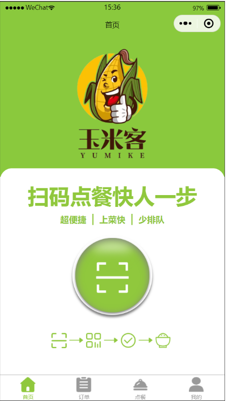
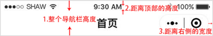
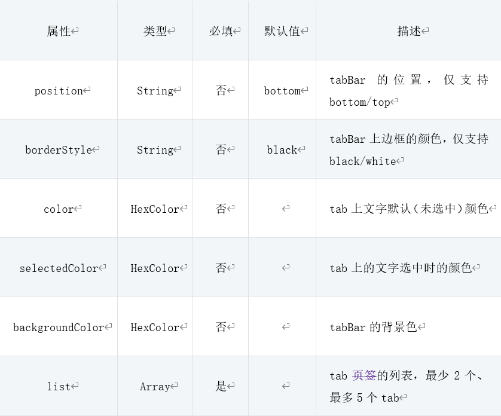
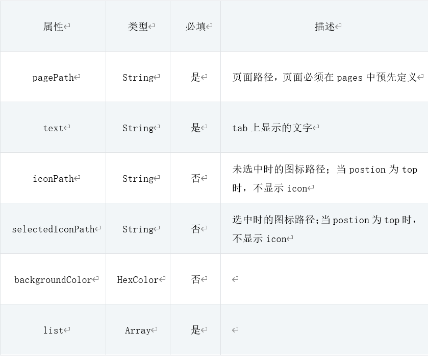
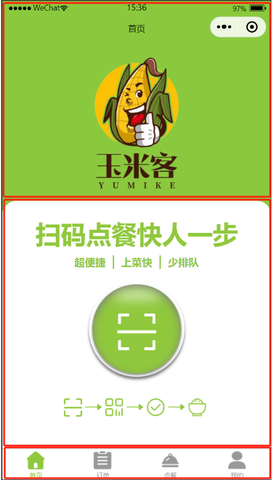
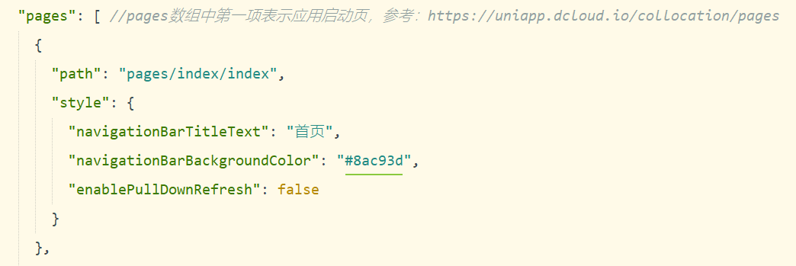
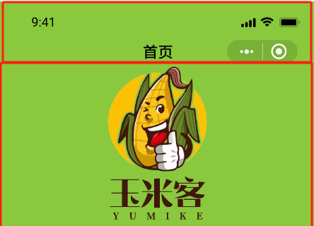
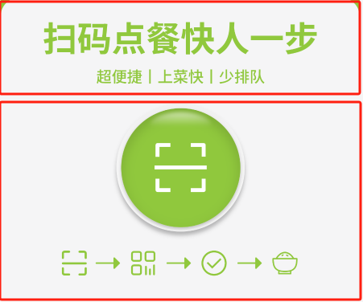
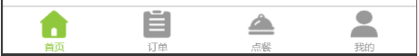
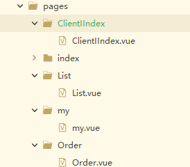

# 任务9 实现首页相关功能

## 9.1 任务描述

​		首页是“玉米客”项目的核心入口，其作用是为用户提供一个直观、便捷的美食点餐体验。首页的页面设计遵循简洁明了的原则，使用户能够迅速了解到项目的核心功能和服务，从而快速进行点餐操作。

​		本任务将制作“玉米客”项目首页相关功能，具体包括数据动态展示和扫码快速跳转功能，共分为两个子任务来实现。确保用户享受直观、便捷的点餐体验。

## 9.2 任务效果

> 如下图所示：




## 9.3 任务目标

### 9.3.1 知识目标

- [ ] 了解uni-app组件化
- [ ] 了解移动端尺寸单位
- [ ] 掌握uni-app view视图容器组件的使用
- [ ] 掌握uni.scanCode二维码扫描方法的使用
- [ ] 掌握uni.switchTab切换tabBar页面方法的使用

### 9.3.2 能力目标

- [ ] 能够熟练地在uni-app项目中应用组件化思想，实现组件的复用和扩展。
- [ ] 能够根据不同的移动设备屏幕尺寸和分辨率，合理选择和使用合适的尺寸单位，以确保页面在不同设备上的适配性和可读性。
- [ ] 能够根据需求选择并使用合适的组件来构建页面布局。
- [ ] 能够使用uni.scanCode方法，实现二维码扫描功能。
- [ ] 能够使用uni.switchTab方法，实现tabBar页面之间的切换。

## 9.4 知识储备

### 9.4.1 导航栏

​		uni-app支持使用原生导航栏和自定义导航栏两种方式来展示页面导航信息，下面分别介绍这两种方式。

#### （1）原生导航栏

​		在uni-app中，原生导航栏是指操作系统提供的默认导航栏，具有设备操作系统的特点和风格，通常包括标题、返回按钮、右侧按钮等元素。开发者可以通过uni-app提供的API来实现原生导航栏的设置和控制。

​		pages.json文件是uni-app中的配置文件，用于设置应用的全局属性和样式。可以在该文件中设置导航栏的样式、背景色、标题、左右按钮等属性，参考下面的示例代码：

```js
 {
 "globalStyle": {
 "backgroundTextStyle": "light",
 "navigationBarBackgroundColor": "#fff",
 "navigationBarTitleText": "uni-app原生导航栏",
 "navigationBarTextStyle": "black"
   }
 }
```

​		以上代码展示了全局定义的配置，如果需要在APP平台定义特有的样式可以通过如下代码实现：

```js
 {
 "globalStyle": {
 "app-plus": {
 "backgroundTextStyle": "light",
 "navigationBarBackgroundColor": "#fff",
 "navigationBarTitleText": "uni-app原生导航栏",
 "navigationBarTextStyle": "black"
    }
   }
 }
```

​		原生导航栏相关参数配置好后，在需要使用原生导航栏的页面中可以使用uni-app提供的Page组件来实现导航栏的呈现，同时也可以使用uni-app提供的API来控制导航栏的样式和行为，参见下面的示例代码：

```js
 <template>
 <view>
 <text>这是一个使用原生导航栏的页面</text>
 </view>
 </template>
 
 <script>
 export default {
   onNavigationBarButtonTap() {
     uni.showToast({
       title: '单击了导航栏按钮',
       icon: 'none'
     })
   }
 }
 </script>

```

​		在该示例中，onNavigationBarButtonTap是一个页面级别的事件处理函数，当用户单击导航栏按钮时被调用。在该函数中，可以调用uni-app提供的API来实现页面跳转、显示提示等操作。

​		总之，原生导航栏可以使应用界面更加美观和统一，但功能相对简单，如果需要实现更多的自定义功能和样式，建议使用下面的自定义导航栏。

#### （2） 自定义导航栏

​		大部分情况下可以使用微信官方自带的navigationBar配置导航栏的显示内容和样式，但有时候需要在导航栏中集成搜索框、自定义背景图、返回首页按钮等，就需要使用自定义导航栏来实现。

​		导航栏可以全局配置，也可以单独页面配置，具体根据业务需求决定。navigationStyle属性可以控制导航栏样式，包括default和custom两种取值。custom表示取消默认的原生导航栏，使用自定义导航栏，参见下面的示例代码：

```js
 {
 "path" : "pages/public/login",
 "style": {
 "navigationBarTitleText": "",
 "navigationStyle": "custom",
 "app-plus": {
 "titleNView": false
         }
     }
 }
```

​		在不同的手机型号头部导航栏高度可能不一致，所以为了适配更多型号，需要计算整个导航栏的高度、胶囊按钮与顶部的距离、胶囊按钮与右侧的距离。如下图所示。



```js
 <template>
 	<view>
 		<button @click="getMenuButtonBoundingClientRect">获取胶囊体信息</button>
 		<button @click="getSystemInfo">获取设备信息</button>
 	</view>
 </template>
 <script>
 export default {
    methods:{
       getMenuButtonBoundingClientRect(){
         console.log('胶囊体信息',uni.getMenuButtonBoundingClientRect())
       },
 getSystemInfo(){
         console.log('设备信息',uni.getSystemInfo())
       }
    }
 }
 </script>

```

注：胶囊按钮只在小程序平台存在。

```html
 <i class="iconfont">&#x33;</i>
```

### 9.4.2 底部tabbar

​		tabBar是移动端应用常见的底部标签栏，用于实现页面之间的快速切换，小程序中通常将其分为底部tabBar和顶部tabBar。uni-app中的tabBar可以配置的标签数量最少为2个，最多为5个，其节点配置项如下图所示：



每个tab项的配置选项如下图所示：



## 9.5 任务实施

### 子任务9-1 制作首页页面

​		本任务将制作“玉米客”项目的首页页面，在具体实现中，将遵循设计图的布局和视觉元素，使用uni-app的组件和样式系统来精确还原设计。将关注页面的结构搭建，确保各个模块的位置和尺寸与设计图一致。同时，将使用uni-app支持的样式和动画效果，来呈现设计图中的视觉效果，如颜色、字体和图片等。在开发过程中，将注重代码的规范性和可维护性，确保页面的性能和用户体验。

#### 步骤一 页面结构分析与搭建

（1）设计图分析

​		通过首页设计图可知首页由头部商家logo信息区域，扫码点餐展示区域和底部tabBar区域组成。如下图所示。



​		除此之外，设计图中还存在设备状态栏和Home Indicator（底部黑色横条），以及小程序胶囊按钮三个未划分的区域，分别是手机设备和小程序自带的功能，不需要通过代码实现，在不同设备和不同小程序平台中的样式也不尽相同，这里在设计图中展示是为了方便开发时能够将设计图与实际运行效果做对比。

（2）代码实现

​		在 `pages`文件下，新建一个`ClientIIndex`文件夹并在该文件下创建`ClientIIndex.vue`文件。使用uni-app提供视图容器组件view进行页面搭建。关键代码如下。

> 文件路径：/pages/ClientIIndex/ClientIIndex.vue
>
> templat部分

```html
<template>
	<view class="all">
        <!-- logo头部区域 -->
		<view class="Log">
		</view>
        <!-- 扫码点餐展示区域 -->
		<view class="content-index">
		</view>
	</view>
</template>
```

​		搭建完成后， 在`pages/index/index.vue`文件中，使用子组件。代码如下。

>文件路径：/pages/index/index.vue
>
>templat部分

```html
<template>
	<view>
		<Client></Client>
	</view>
</template>
```

​		之后完成头部区域标题设置，如图所示。

>文件路径：/pages.json



#### 步骤二 制作头部区域

（1）设计图分析

​		根据设计图可知头部区域包含页面的标题和商家logo展示区域，两个区域为上下布局结构。如图所示。



（2）代码实现

​		使用uni-app提供的视图容器组件view作为包裹容器，进行页面搭建。代码如下。

>文件路径：/pages/ClientIIndex/ClientIIndex.vue
>
>template部分

```html
<template>
	<view class="all">
		<view class="Log">
		</view>
	</view>
</template>
```

>文件路径：/pages/ClientIIndex/ClientIIndex.vue
>
>css部分

```css
<style lang="scss" scoped>
	.all {
		height: 100%;

		.Log {
			width: 750rpx;
			height: 590rpx;
			mode: scaleToFill;
			margin-top: -120rpx;
			background: url("https://img.js.design/assets/img/655c413a3f4cedb9d2a6ef6c.png#ba8ffb73e1d3d94f790331baf37f63ce");
			background-size: cover;
			/* 背景图覆盖整个容器 */
			background-position: center;
		}
	}
</style>
```

#### 步骤三 制作扫码点餐区域

（1）设计图分析

​		根据设计图可知扫码点餐区域包含标题和扫码图片展示区域，两个区域为上下布局结构。如图所示。



（2）代码实现

​		使用uni-app提供的视图容器组件view作为标题和图片展示区域的包裹容器、image组件展示点餐流程等图片、text组件展示点餐提示等文本信息。代码如下。

>文件路径：/pages/ClientIIndex/ClientIIndex.vue
>
>template部分

```html
<template>
    <!-- 整体容器 -->
	<view class="all">
		<view class="Log">
		</view>
         <!-- 内容索引容器 -->
		<view class="content-index">
			<view class="h1">
				扫码点餐快人一步
			</view>
			<view class="h2">
				<view class="h3">
					
				</view>
			</view>
            <!-- 描述扫码点餐的步骤 -->
			<view class="h4">
				<view class="h5">
					<view class="h5-1">
					</view>
					<image src="/static/index/扫码.png" mode=""></image>
				</view>
			</view>
            <!-- 引导信息 -->
			<view class="h6">
				<view class="h7">
					<image src="" class="h9"></image>
					<image src="/static/index/箭头 1.png" class="h8"></image>
				</view>
			</view>
		</viexw>
	</view>
</template>
```

>文件路径：/pages/ClientIIndex/ClientIIndex.vue
>
>css部分

```css
<style lang="scss" scoped>
	.all {
		//省略代码..

		.content-index {
			margin-top: -30rpx;
			background-color: white;
			width: 750rpx;
			border-radius: 40rpx 40rpx 0rpx 0rpx;
			display: flex;
			flex-direction: column;
			align-items: center;

			.h1 {
				font-size: 72rpx;
				font-weight: 700;
				color: rgba(144, 200, 61, 1);
				margin: 46rpx 0 16rpx 0;
			}

			.h2 {
				display: flex;
				font-weight: 600;
				font-size: 30rpx;

				.h3 {
					color: rgba(144, 200, 61, 1);
					padding: 0rpx 20rpx;
					border-right: 2px solid rgba(144, 200, 61, 1);
				}

				.h3:last-child {
					border: 0
				}
			}

			.h4 {
				width: 268rpx;
				height: 268rpx;
				background: #FFFFFF;
				box-shadow: 0px 8rpx 8rpx gray;
				border-radius: 50%;
				display: flex;
				align-items: center;
				justify-content: center;
				margin: 36rpx 0 40rpx 0;

				.h5 {
					width: 248.86rpx;
					height: 248.86rpx;
					background: #90C83D;
					box-shadow: 0px 4rpx 8rpx gray, inset 0px 8rpx 24rpx gray;
					border-radius: 50%;
					display: flex;
					align-items: center;
					flex-direction: column;

					image {
						z-index: 10;
						width: 120rpx;
						height: 120rpx;
					}

					.h5-1 {
						width: 130.17rpx;
						height: 58.39rpx;
						opacity: 0.6;
						background: linear-gradient(180deg, #FFFFFF 44%, #90C83D 56.01%);
						filter: blur(8px);
						border-radius: 90%;
						margin-top: 15rpx;
					}
				}

			}

			.h6 {
				display: flex;
				align-items: center;
				justify-content: center;

				.h7 {
					padding: 20rpx 10rpx 10rpx 0;
					display: flex;
					align-items: center;
					justify-content: center;

					.h9 {
						width: 52rpx;
						height: 52rpx;
					}

					.h8 {
						padding-left: 10rpx;
						width: 48rpx;
						height: 10px;
					}
				}


			}
		}
	}
</style>
```

#### 步骤四 制作底部标签栏区域

（1）页面分析

​		底部标签栏（tabBar）包含“首页”、“订单”、"点餐"和“我的”四个tab（如下图所示）。tab由图标与文字组成，选中状态下图标和文字会高亮显示，且同时只能选中一个tab。



（2）代码实现

​		实现tabBar有uni-app原生tabBar和自定义tabBar两种方式，前者的运行性能更高、开发效率更高（仅需通过简单的配置便可实现，无需大量样式或逻辑代码），因此在能够满足产品tabBar需求的前提下，建议使用前者。

​		为确保tabBar能正常跳转并在应用中提供完整的导航功能，需要在项目的`pages`目录下新建三个Vue文件：`My.vue`、`Order.vue`和`List.vue`。这些文件将分别对应底部导航栏中的“我的”、“订单”和“列表”等页面。通过在这些文件中定义页面的结构和内容，用户可以点击tabBar中的相应标签，快速跳转至对应的页面，从而享受流畅且直观的应用体验。这些页面的创建和完善是确保tabBar正常工作的关键步骤之一。如图所示。



​		为了确保页面能够正确地显示，需要在路由配置文件中设置正确的路径和关联的组件。在`pages.json`文件中，定义路由规则，将路径映射到页面。这样，当用户访问这个路径时，应用程序会渲染对应的页面组件。代码如下。

>文件路径：/pages.json

```json
{
	"pages": [ //pages数组中第一项表示应用启动页，参考：https://uniapp.dcloud.io/collocation/pages
		{
			"path": "pages/index/index",
			"style": {
				"navigationBarTitleText": "首页",
				"navigationBarBackgroundColor": "#8ac93d",
				"enablePullDownRefresh": false
			}
		},
	{
		"path": "pages/Login/Login",
		"style": {
			"navigationBarTitleText": "登录",
			"enablePullDownRefresh": false,
			"navigationStyle": "custom"
		}
	},
	{
		"path" : "pages/ClientIIndex/ClientIIndex",
		"style" : 
		{
			"navigationBarTitleText" : "",
			"enablePullDownRefresh" : false
		}
	},
	{
		"path": "pages/My/My",
		"style": {
			"navigationBarTitleText": "我的",
			"enablePullDownRefresh": false,
			"navigationBarBackgroundColor": "#8ac93d"
	
	
		}
	},
	{
		"path": "pages/Order/Order",
		"style": {
			"navigationBarTitleText": "订单",
			"enablePullDownRefresh": true
		}
	
	},
	
	{
		"path": "pages/List/List",
		"style": {
			"navigationBarTitleText": "",
			"enablePullDownRefresh": false,
			"navigationStyle": "custom"
		}
	}
	],
	"globalStyle": {
		"navigationBarTextStyle": "black",
		"navigationBarTitleText": "uni-app",
		"navigationBarBackgroundColor": "#F8F8F8",
		"backgroundColor": "#F8F8F8"
	},
	"uniIdRouter": {},
}
 
```

​		“玉米客”项目的底部tabBar可直接使用uni-app原生tabBar通过pages.json配置实现。代码如下。

>文件路径：/pages.json

```json
"tabBar": {
			"color": "#999999",
			"selectedColor": "#90C83D",
			"borderStyle": "black",
			"backgroundColor": "#ffffff",
			"costom": true,
			"list": [{
					"pagePath": "pages/index/index",
					"text": "首页",
					"iconPath": "static/tabBar/home.png",
					"selectedIconPath": "static/tabBar/home_active.png"
				},
				{
					"pagePath": "pages/Order/Order",
					"text": "订单",
					"iconPath": "static/tabBar/order.png",
					"selectedIconPath": "static/tabBar/order_active.png"
				},
				{
					"pagePath": "pages/List/List",
					"text": "点餐",
					"iconPath": "static/tabBar/point-order.png",
					"selectedIconPath": "static/tabBar/point-order_active.png",
					"navigationBarBackgroundColor": "#8ac93d"
				},
				{
					"pagePath": "pages/My/My",
					"text": "我的",
					"iconPath": "static/tabBar/My.png",
					"selectedIconPath": "static/tabBar/My_active.png",
					"navigationBarBackgroundColor": "#8ac93d"
	
				}	
	
			]
		}
```

### 子任务9-2 实现首页相关功能

​		本任务将实现“玉米客”项目首页的动态数据获取功能，确保页面能够实时展示最新的信息。将通过动态渲染列表的方式加载到首页，确保用户每次访问时都能看到最新、最准确的信息。同时，为了提升用户体验，还将实现扫码点餐页面的快速跳转功能。用户只需在首页上点击扫描二维码，即可快速进入点餐页面，完成点餐操作。这一功能的实现将大大缩短用户的操作路径，提高用户的点餐效率。通过这两项功能的实现，将为“玉米客”项目的用户带来更加便捷、高效的体验。

#### 步骤一 实现扫码点餐区域获取数据

（1）逻辑分析

​		页面加载时，Vue.js从`data`中获取数据，然后使用`v-for`在页面中动态生成对应的HTML，实现数据的动态渲染。数据变化时，页面内容会自动更新。

（2）代码实现

​		在`/pages/ClientIIndex/ClientIIndex.vue`的`data`函数中编写，该函数返回一个对象，该响应式对象包含了组件的初始状态。代码如下。

>文件路径：/pages/ClientIIndex/ClientIIndex.vue
>
>JavaScript部分

```js
<script>
	export default {
		data() {
			return {
				indexArr: ["超便捷", "上菜快", "少排队"],
				imgArr: ["/static/index/扫一扫.png", "/static/index/二维码.png", "/static/index/对勾.png", "/static/index/吃饭.png"]
			}
		}
	}
</script>
```

​		定义好对象的初始状态后，接下来在Vue组件的模板部分使用`v-for`指令来动态渲染这些数据。`v-for`是Vue的一个核心指令，允许遍历数组或对象，并为每个元素生成一段模板。代码如下。

>文件路径：/pages/ClientIIndex/ClientIIndex.vue
>
>tmpelate部分

```html
<template>
	<view class="all">
		<view class="Log">
		</view>
		<view class="content-index">
             <!-- 标题 -->
			<view class="h1">
				扫码点餐快人一步
			</view>
			<view class="h2">
				<view class="h3" v-for="(item,index) in indexArr" :key="index">
					{{item}}
				</view>
			</view>
             <!-- 描述扫码点餐的步骤-->
			<view class="h4" @click="handlegoto">
				<view class="h5">
					<view class="h5-1">
					</view>
					<image src="/static/index/扫码.png" mode=""></image>
				</view>
			</view>
             <!-- 引导信息 -->
			<view class="h6">
				<view class="h7" v-for="(item,index) in imgArr" :key="index">
					<image :src="item" class="h9"></image>
					<image src="/static/index/箭头 1.png" class="h8" v-if="index!==3"></image>
				</view>
			</view>
		</viexw>
	</view>
</template>
```

#### 步骤二 实现点击扫码图片进行跳转

（1）逻辑分析

​		用户点击扫一扫图片后，系统将首先验证用户登录状态，若未登录则引导用户完成登录并获取`token`。随后，系统启用扫一扫功能，用户扫描成功后，系统将根据扫描结果自动跳转至点餐页面，方便用户快速点餐。

（2）代码实现

​		在Vue模板中，为图片元素添加一个`@click`事件监听器，当用户点击这个元素时，将触发一个定义在Vue实例`methods`中的处理函数。代码如下。

> 文件路径：/pages/ClientIIndex/ClientIIndex.vue
>
> tmpelate部分

```html
<template>
	<view class="all">
		<!-- 省略 -->
		<view class="content-index">
			<!-- 省略 -->
			<view class="h4" @click="handlegoto">
					<!-- 省略 -->
			</view>
			<!-- 省略 -->
		</viexw>
	</view>
</template>
```

​		在组件中的 `methods` 部分，定义两个方法：`handlegoto` 和 `handleScan`。这两个方法主要用于处理用户点击“扫一扫”按钮后的逻辑。首先，使用`uni.getStorageSync('token')`从本地存储中获取`token`来判断用户是否登录。如果`token`存在（即用户已登录），则执行`handleScan`方法，使用 `uni.switchTab` 方法导航到列表页面（`/pages/List/List`），并将 `businessId` 和 `tableNumber` 作为查询参数传递；如果不存在（即用户未登录），则导航到登录页面。商户id和桌码可以在后台管理中获取。代码如下。

> 文件路径：/pages/ClientIIndex/ClientIIndex.vue
>
> JavaScript部分

```js
<script>
	export default {
		data() {
			return {
				// 省略
			}
		},
		methods: {
			/**
			 * 扫一扫 扫桌码
			 */
			handlegoto() {
				// 判断有无登录 无登录跳转登录页 有登录跳转详情页
				const isLogin = uni.getStorageSync('token') ?? false;
				if (isLogin) {
					this.handleScan();
				} else {
					uni.navigateTo({
						url: "/pages/Login/Login"
					})
				}
			},
			/**
			 * 打开扫一扫
			 */
				handleScan() {
                    uni.setStorageSync('businessId', 4)
                    uni.setStorageSync('tableNumber', 1)
                    uni.switchTab({
                        url: `/pages/List/List`
                    });
			},
		},
	}
</script>
```


